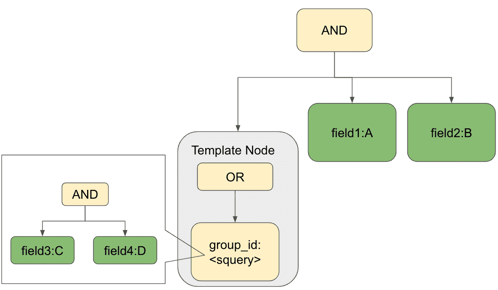

# Manas 两阶段检索——层次化文档的有效架构

> 原文：<https://medium.com/pinterest-engineering/manas-two-stage-retrieval-the-efficient-architecture-for-hierarchical-documents-dcaba6e78b0d?source=collection_archive---------2----------------------->

谢海滨|软件工程师，核心产品服务基础架构
Michael Mi |技术主管，核心产品服务基础架构

随着越来越多的用例出现在 [Manas](/pinterest-engineering/manas-a-high-performing-customized-search-system-cf189f6ca40f) 上，当提供具有层次结构的文档时，一个特殊的可伸缩性和效率挑战出现了。Manas 作为一个传统的搜索引擎，被设计和优化为支持扁平化文档。因此，我们必须将根文档的属性一路展平到叶子级别，而不管层次结构如何，这导致索引和服务管道效率低下。

让我们仔细看看一个具体的场景，以便更好地理解层次结构。[活动结构](https://help.pinterest.com/en-gb/business/article/campaign-structure)，如下图所示，分为三个层次:活动、广告组、促销 Pin。活动包含广告组，每个广告组由一组促销 pin 组成。

例如，为了提供这样的分层数据集，我们需要将活动和广告组的所有属性展平到 Pin 级别，即上图中的叶节点。总之，随着指数的扁平化，我们面临着两大挑战:

*   **高服务成本:**扁平索引结构在语料库大小和服务成本之间强加了线性比例因子。
*   **高索引更新量:**每当任何广告组属性发生更改时，我们都需要将更改扇出到 Pin 级别，这被证明是昂贵的。此外，索引管道中这种巨大的峰值更新量给系统的稳定性和维护成本带来了负担。

引入了两阶段查询执行来应对这些挑战。它支持需要多次往返的查询，并允许客户端查询一组匹配，然后使用这些匹配来构造和执行新的查询。从名称中可以看出，每个请求现在分两个阶段执行，每个阶段从不同的 Manas 集群中查询一个单独的索引，如下图所示。

1.  **目标匹配**:查询广告组索引进行目标匹配
2.  **项目选择**:从单独的管脚索引中取出属于匹配组的管脚

这一优化非常成功，大大降低了服务成本。

但是，多次往返的额外开销也不容忽视。此外，客户端代码很复杂，因为客户端需要处理多个阶段的杂乱聚合和查询构造。我们正在挑战自己，通过在服务堆栈的底层执行昂贵的操作，并将两阶段查询执行一直推到 Manas leaf，进一步提高漏斗效率并简化服务/索引堆栈。

在这篇博客中，我们将分享如何在 Manas 中构建通用的两阶段检索框架，以支持对分层文档的高效检索。

# 数据模型

让我们从 Manas 的数据模型开始，然后讨论我们如何裁剪它来支持分层文档。

## 平坦指数

文档是索引和服务的单位。文档包含一组字段，其中每个字段代表文档的一个属性。我们为每个字段建立一个倒排索引，并利用跳转列表来允许查询有效地跳过文档。当执行查询时，我们逐个扫描文档。虽然在跳过列表的帮助下——我们可以快速跳过一些不匹配的内容——总成本仍然与扫描文档的数量或语料库的大小有关。

数据集具有分层结构，每个文档属于一个组，如下图所示。对于这个具体的例子，字段 3 和字段 4 是组级别的属性，而字段 1 和字段 2 是文档级别的属性。

## 索引标准化

复制集团级属性是一种浪费。类似于关系数据库，我们通过将重复的字段移动到单独的索引中，使用数据规范化来减少数据冗余。

因此，我们能够减少索引大小并简化索引管道。然而，查询变得更加复杂，因为我们需要扫描两个表，而不是一个。为了实现相同的功能，我们需要两个查询，其中外部查询依赖于内部查询的结果，如下例所示。

直观上，内部查询变得轻量级，因为它需要扫描组索引中更少的文档。让我们仔细分析一下为什么外部查询也变得更便宜。您可能知道，发布列表是一组文档 id。为了能够有效地计算交集和并集，对发布列表中的文档 id 进行排序。跳转列表是一种常用的数据结构，它允许在一个发布列表中有 O(log n)的搜索复杂度。在跳转列表的帮助下，我们能够快速跳过那些不适合的文档。虽然跳转列表是有效的，但是频繁跳转调用的大型数据集的累积成本是不可忽略的。因为我们只需要检索匹配组中的文档，所以我们按组 id 对文档进行排序，以便将同一组中的文档放在一起。因此，我们能够直接跳到匹配的组，并且只扫描这些组中的文档。这样，实际的查询代价只与匹配的数量有关，而与语料大小无关。

## 指数反规格化

当涉及到分区时，数据模型非常适合:一种关系，其中每个文档属于一个组，我们只需将文档放入文档所属的组中。但是当一个文档属于多个组时，它就会崩溃。在这种情况下，我们需要决定这个文档应该属于哪个组。例如，如以下示例所示，文档 3 属于组 1 和组 2，将文档 3 仅放入组 1 或组 3 可能会导致问题，从而导致没有文档 3 的组中的文档丢失问题。虽然查询其他组的文档可能会解决丢失文档的问题，但这会带来复杂性和额外的开销。

解决方案是索引非规范化，为文档所属的那些组添加冗余副本。为了获得更好的服务时间性能，我们在索引时间上支付了额外的扇出成本。就目前而言，从观察来看，重复率仍然很低，并且对于我们的场景来说是可以承受的。此外，我们需要使用不同的主键来区分不同组的副本。

## 索引分区

这个数据模型是通用的，可以应用于任何具有层次文档的用例。我们可以按照模式为组索引和单据索引生成不同主键的索引:

*   集团索引主键:
*   Doc Index primary key:

只要两个索引都按组 id 划分，每个碎片都是独立的。在查询执行期间，我们不需要与所有碎片通信来获得完全匹配。

# 详细设计

既然我们已经共享了数据模型，让我们继续了解如何将它合并到 Manas 中。在这一部分，我们将讨论几个关键的技术细节。

## 命名空间

根据数据模型，每个 Manas 叶子需要服务于两个索引:组索引和 Doc 索引。名称空间被用来支持多租户的概念。

名称空间是一个逻辑概念，它使一个 Manas 叶能够以轻量级的方式逻辑地服务于多个索引。为每个索引分配一个唯一的名称空间 id。跨名称空间的索引在逻辑上是隔离的，可以独立地更新和搜索，而不会相互影响。我们用名称空间 id 作为索引中每个标记/术语的前缀，这允许我们有效地查询属于名称空间的倒排索引的子集。

## SQuery 模板

在 Manas 中，我们使用一个树状结构来表示请求。SQuery 可用于定义如何从索引中检索候选项并对其进行评分的行为。如果不进行索引分离，就可以直接用 SQuery 格式表示查询，如下例所示。

以两阶段检索为例，用 SQuery 表示内部查询是很简单的。但是很难表示外部查询，因为外部查询依赖于内部查询的结果，如下图所示。如果不对实际的索引执行内部查询，就不可能为外部查询编写实际的 SQuery，因为 SQuery 要求预先知道所有的术语。现有的 SQuery 功能无法支持新的需求。

为了应对这一挑战，引入了 SQuery 模板来支持动态结构。我们使用模板节点来定义 SQuery 结构和输入值。在查询解析期间，我们根据输入值扩展查询。此外，馈入值可以来自另一个 SQuery，该 SQuery 将被延迟执行。

回到两阶段检索的情况，外部查询是顶层查询，而内部查询成为一个模板节点，包含来自另一个查询(内部查询)的值，如下图所示。

有了实际的索引，上面的 SQuery 模板节点将扩展为下面的 SQuery 结构。

# 把它放在一起

总的来说，SQuery 模板让我们基于内部查询的输出构建外部查询。我们可以使用它来执行两阶段检索，第一阶段内部查询命中组索引，将搜索范围缩小到相关的匹配组，第二阶段外部查询利用这个缩小的搜索空间来获得巨大的效率收益。

当然，使用我们的名称空间概念，不同的阶段索引在逻辑上是分开的。通过索引反规范化和适当的分区，每个碎片都是独立的，可以并行处理查询，而无需与其他碎片进行任何交叉通信。

我们拼凑了许多不同的概念和活动部分来支持 Manas 中的两阶段检索，但是我们看到的效率提升使投资非常值得。

# 下一步是什么

对我们来说，推出针对广告和 Home feed 场景的两阶段检索框架是一段激动人心的旅程。但这仅仅是一个开始。我们将继续在以下领域开展工作:

## 实时服务

我们已经为静态集群建立了两阶段检索。说到实时支持，可变索引给我们增加了额外的困难。我们正在开发一个解决方案，以高效、可重用和可扩展的方式支持实时集群的两阶段检索。

## 效率

效率始终是我们系统的一个关键因素。我们将继续努力，探索更多的分区和规范化策略，以提高索引和服务效率。

*鸣谢:作者要感谢以下人员的贡献:Collins Chung、、、Jiacheng Hong、Dumitru Daniliuc、Chen、Tim Koh、、Sheng Cheng、、Roger Wang、Chengcheng Hu 和 Karen Chau。*