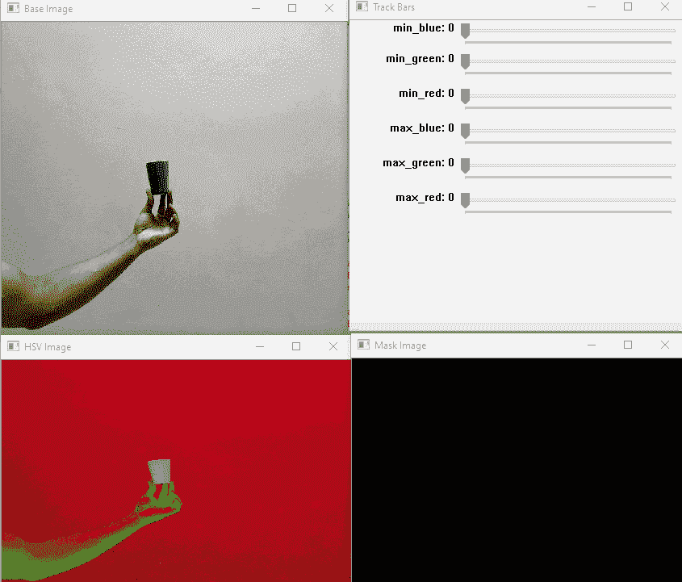
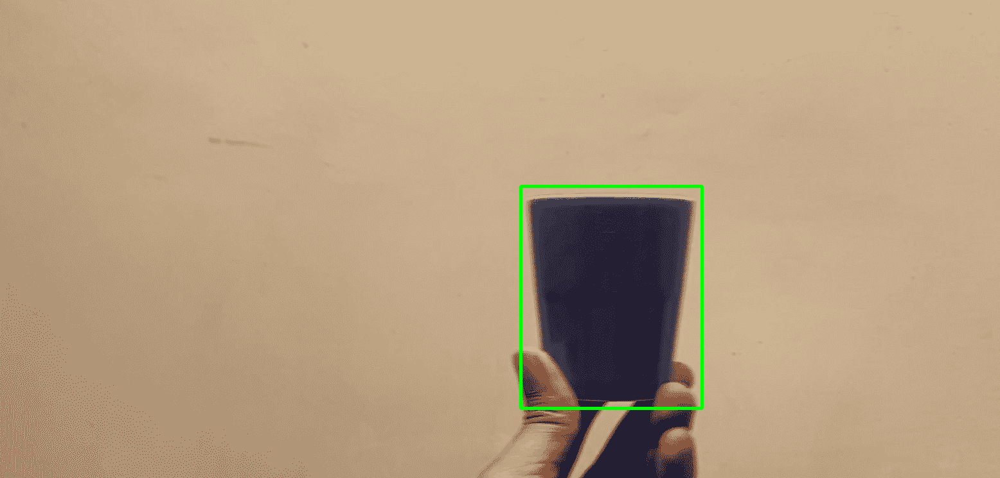

# 操纵彩色掩模进行目标检测

> 原文：<https://medium.com/globant/maneuvering-color-mask-into-object-detection-fce61bf891d1?source=collection_archive---------1----------------------->

我已经研究对象检测算法有一段时间了，在本文中，我将使用 Python 和 OpenCV 构建一个小型对象检测应用程序。

**想法**

我们将通过识别对象的颜色信息来为我们试图检测的对象生成遮罩，然后使用该遮罩来检测帧中的对象。我们还将围绕对象绘制一个边界框。

在我们动手之前，让我们先弄清楚一些我用来实现这一点的基本概念。

**HSV 颜色模型**

**HSV**

*   **色调**指定颜色在 RGB 色环上的角度。
*   **饱和度**控制使用的颜色数量。
*   **值**控制颜色的亮度。

为了准确地获取物体的颜色信息，我们将图像转换成 HSV 颜色模型。

**为什么是 HSV？**

任何颜色基本上都可以用各种颜色模型来描述([详情在此](https://en.wikibooks.org/wiki/Color_Models:_RGB,_HSV,_HSL))。HSV 模型相对于 RGB 或 BGR 模型的优势在于，它将*、或图像*强度*与 ***色度*** 或*颜色信息*分开。*

***这怎么帮你问？***

*假设我们有一个单色平面，上面有一个阴影。在 RGB 色彩空间中，阴影部分很可能与没有阴影的部分具有非常不同的特征。在 HSV 色彩空间中，两个色标的色调成分更可能是相似的:阴影将主要影响该值，或者可能影响饱和度成分，而指示主要“颜色”(没有其亮度和被白/黑稀释)的色调不应该变化太多。*

*要将我们的图像转换到 HSV 空间，我们可以使用 OpenCV cvtColor 函数并传递 cv2。COLOR_BGR2HSV 枚举作为第二个参数，而第一个参数是图像。像下面这样，*

**cv2.cvtColor(图片，cv2。COLOR_BGR2HSV)**

***算法***

**

*Photo by [Ross Sneddon](https://unsplash.com/@rosssneddon?utm_source=medium&utm_medium=referral) on [Unsplash](https://unsplash.com?utm_source=medium&utm_medium=referral)*

*   *加载图像*
*   *将图像转换成 HSV 颜色模型。*
*   *确定蓝色、绿色和红色通道的最小值和最大值(阈值)*
*   *读取我们想要检测对象的图像或帧*
*   *将图像/帧转换为 HSV 颜色模型*
*   *使用 BGR 通道的阈值提取遮罩。*
*   *找到蒙版上物体的轮廓。*
*   *选择最大的轮廓。*
*   *使用轮廓信息在图像上绘制边界框。*
*   *显示图像/帧。*

*现在让代码开始吧！*

*我将分两部分构建我们的应用程序-*

1.  *首先，我将构建一个应用程序来计算蓝色、绿色和红色通道的阈值。*
2.  *然后，我将在我们的第二个应用程序中使用这些阈值来创建一个遮罩，并尝试找到这些值在图像/帧中的确切位置。*

***应用识别阈值***

*我们从导入 OpenCV 并创建一个空函数开始，这个函数什么也不做(我们稍后将回到这个问题)*

*然后我们创建一个可调整大小的窗口，并给它一个名字——“跟踪条”。*

*现在，由于我们需要计算出对象的蓝色、绿色和红色通道的最小值和最大值，我们将创建 6 个跟踪条，我们可以调整这些跟踪条来计算出最佳匹配。*

*我们知道颜色值的范围是从 0 到 255，我们的 trackbar 也有相同的范围。*

*函数语法中的最后一个参数是 onChange function，trackbar 的每次改变都会调用它，但是因为我们不想对位置的改变做任何事情，所以我们传递了一个空函数。*

*注意:第二个参数是 OpenCV 显示跟踪栏的窗口名。*

*现在我们使用 cv2.imread 读取图像，然后我们可以选择调整图像的大小。*

*然后，我们将调整后的图像转换为 HSV 模型，默认情况下，OpenCV 在 BGR 模型中读取图像，然后显示两幅图像。*

*然后，我们开始一个无限循环，通过使用 *getTrackbarPos* 函数并向其传递我们想要从中读取当前值的跟踪条的名称和它所在的窗口名称，来获取 BGR 通道的最小-最大值。*

*一旦我们获得了对象的阈值，我们就使用 OpenCV 的[*in range*](https://docs.opencv.org/3.4/d2/de8/group__core__array.html#ga48af0ab51e36436c5d04340e036ce981)*函数创建一个遮罩，通过识别落在给定阈值范围内的像素范围来检测对象。**

**然后我们使用 *imshow* 功能显示掩模图像。**

**一旦我们找到了正确的阈值，我们可以通过按“q”键退出循环，打印值，并销毁所有窗口。**

****

****左上**:原始图像 T **op 右**:跟踪条**

****左下** : HSV 图像**右下**:遮罩图像**

****物体检测****

**现在，我们将创建另一个应用程序，其中我们将使用上述阈值来生成遮罩并检测视频中的对象。**

**我们从第 1 行导入 OpenCV 开始**

**然后，我们声明从前面的应用程序中生成的阈值(第 4–9 行)。**

**然后在第 4 行，我们使用 OpenCV *VideoCapture* 函数打开视频**

**然后，我们开始一个 while 循环来读取视频的每一帧，并将其与检测到的对象一起显示出来。**

**第 3 行我们使用*相机读取单帧(静止图像)。read* 功能。**

**第 5–6 行我们检查是否有帧没有返回，然后我们简单地退出 while 循环**

**我们把图像转换成 HSV 格式。**

**第 11 行我们使用我们确定的阈值生成掩码。**

**第 13 行我们找到使用蒙版找到的轮廓(你可以在这里阅读更多关于轮廓的内容**

**第 15 行一旦我们有了一个轮廓数组，我们就对该数组进行排序，并传递 reverse = True 来使它们以最大的优先方式排序。**

**Lin # 17–23 我们检查是否在该帧中发现任何轮廓。然后我们选择最大的轮廓，并使用 [boundingRect](https://docs.opencv.org/3.4/d3/dc0/group__imgproc__shape.html#ga103fcbda2f540f3ef1c042d6a9b35ac7) 函数得到该轮廓的包围盒。一旦我们得到边界框的尺寸，我们通过使用 OpenCV [rectangle](https://docs.opencv.org/3.4/d6/d6e/group__imgproc__draw.html#ga07d2f74cadcf8e305e810ce8eed13bc9) 函数在图像/帧中的坐标周围画一个矩形。**

**最后，我们使用 *imshow* 功能显示帧/图像。我们显示 if 条件之外的框架，因为即使没有找到轮廓，我们也希望显示该框架。**

**第 29–30 行我们读取任何按键，如果按下的键是“q ”,我们中断 while 循环**

**最后，当一切完成后，我们释放相机资源并销毁所有打开的窗口。**

****

****就这样。****

**现在，当我们运行这段代码时，你会看到一个视频，在对象周围画了一个边框，如下图所示。**

**感谢您阅读我的文章。**