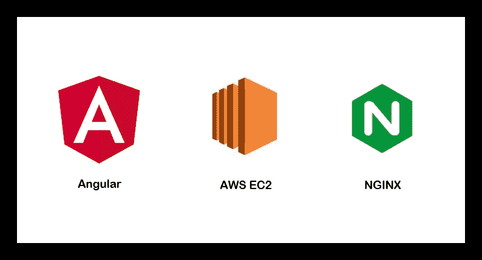
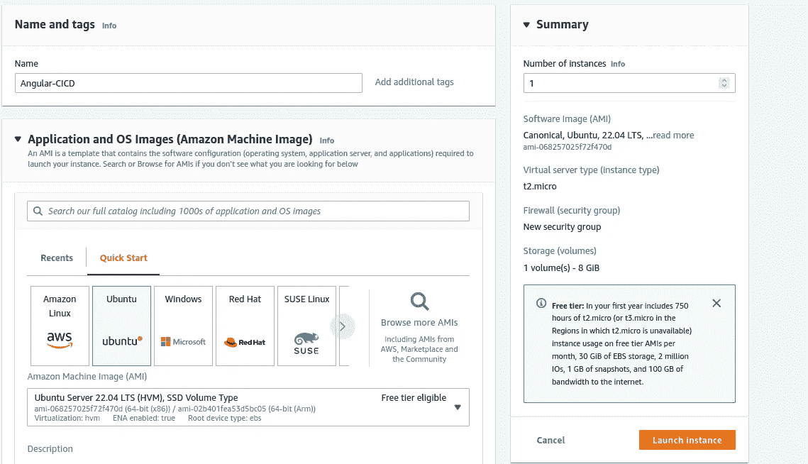
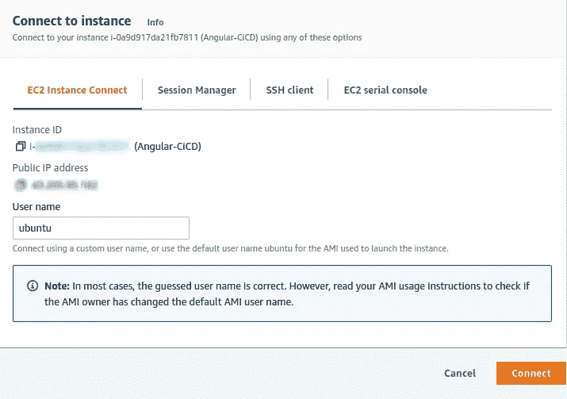
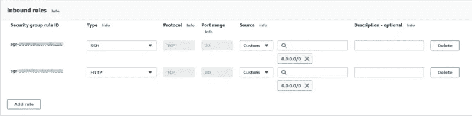
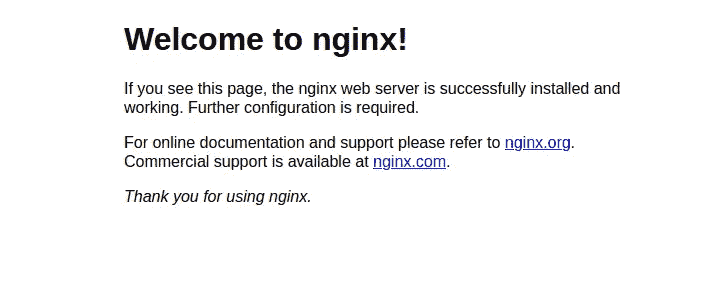
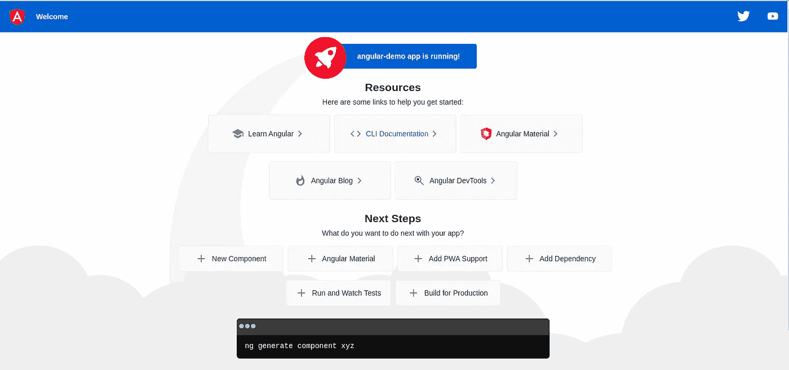

# 将 Angular 应用程序手动部署到 AWS EC2

> 原文：<https://medium.com/globant/manual-deployment-of-angular-app-to-aws-ec2-b5cb5466bbfc?source=collection_archive---------0----------------------->



在这篇博客中，我们将学习如何将 angular 应用程序部署到 AWS 实例中。我将这篇博客分为两个系列，在第一部分，我们将创建一个 AWS EC2 实例，通过手动方式将 angular 应用程序部署到 EC2 实例，并用 **NGINX** web 服务器对其进行配置。在第二部分中，我们将通过使用 GitHub 操作创建 CICD 管道来自动化部署过程。假设您熟悉基本的 AWS 术语，如 EC2 实例、安全组等。

**角度应用的创建:**

要创建基本的 angular 应用程序，必须安装 angular CLI，如果没有安装，请使用以下命令安装。

```
*npm install -g @angular/cli*
```

您可以使用现有的应用程序，也可以创建新的应用程序。如果您想要创建新的应用程序，请使用以下命令创建新的 angular 应用程序。

```
*ng new project-name*
```

**创建 EC2 实例:**

要创建 ec2 实例，您需要登录并创建 Ubuntu OS 的 ec2 实例。如果您需要创建 AWS 帐户，请参考以下 *URL。*

[](https://aws.amazon.com/free/) [## 免费云计算服务- AWS 免费层

### 获得免费的 AWS 平台、产品和服务实践经验。初创公司可能有资格获得 AWS 积分…

aws.amazon.com](https://aws.amazon.com/free/) 

如果您是第一次创建新帐户，那么您将有资格获得 AWS 免费等级。

登录后，通过在顶部的搜索栏中搜索来选择 EC2 实例。点击**启动实例**按钮。现在，在创建新的 EC2 实例时，从 Amazon 机器映像(AMI)中选择 **ubuntu** ，并保持默认配置，单击启动实例。请创建新的 **PEM** 文件或在方便时使用现有文件。现在，等待一段时间，以便创建 EC2 实例。请参考下图，以便更好地理解。



**连接到 EC2 实例:**

创建 EC2 实例后，您需要连接到创建的实例。现在有多种方法可以连接 EC2 实例。我们可以使用像 Putty 这样的工具，它是 windows 操作系统中最流行的 ssh 客户端之一。它用于连接远程 Linux 操作系统。油灰不仅限于窗户。你也可以在 Linux 和 macOS 上使用这个开源软件。关于如何使用**油灰**的更多细节，请参考[链接](https://docs.aws.amazon.com/AWSEC2/latest/UserGuide/putty.html)。

对于 Linux 操作系统，我们可以使用 **SSH 客户端**来连接 EC2 实例，从终端窗口，我们可以提供带有必要细节的命令来连接实例。要使用 ssh 命令，我们需要提供实例的 **PEM 密钥**、实例的**用户名**和**公共 DNS 名称**或 **IPv6 地址**。请参考以下命令结构以获得更多理解。

```
**// connect using instance public dns name** ssh -i /path/key-pair-name.pem instance-user-name@instance-public-dns-name **// connect using IPV6 address**
ssh -i /path/key-pair-name.pem instance-user-name@instance-IPv6-address
```

有关使用 SSH 客户端连接 EC2 实例的更多详细信息，请参考[链接](https://docs.aws.amazon.com/AWSEC2/latest/UserGuide/AccessingInstancesLinux.html)。

你可以根据你的想法选择任何方式，为了简单起见，我将使用 **EC2 实例连接**来通过浏览器连接实例。要使用该选项，点击 ec2 实例详情中的**连接**按钮。请参考下面的图片，以便更好地理解。


Instance connect options

现在点击连接按钮，请参考以下屏幕以供参考。



AWS instance connect

**NGINX web 服务器安装:**

一旦 EC2 实例连接完成，我们将在这里安装一个 web 服务器，我们可以根据您的喜好使用 **apache2** 或 **Nginx** web 服务器。对于这个博客，我们将使用 **NGINX** 网络服务器。现在运行以下命令来安装 **NGINX** 。

```
**sudo -s -** for super user **sudo apt update -** to update the existing packages **sudo apt install nginx -** to install the nginx web server
```

现在，我们可以使用安装的 web 服务器来呈现 web 文件。但在此之前，我们需要更新新创建的 EC2 实例的**安全组**并添加 TCP 的一个协议的 HTTP 端口 80。更新安全组后，它将如下所示。



AWS instance security group

一旦更新了安全组，如果我们转到 EC2 实例的**公共 IPv4 地址**，我们将看到下面的屏幕，这意味着 NGINX web 服务器已经成功安装并准备好使用。



NGINX web server home page

**分配弹性 IP 地址:**

这是一个可选部分，我们可以将弹性 IP 地址分配给 EC2 实例，AWS 使用它来管理其动态云计算服务。当我们停止实例时，公共 IP 地址可能会丢失，为了保留单个 IP 地址，我们可以为其分配弹性 IP 地址，这有多种好处。有关更多详细信息，请参考以下 URL。

[](https://docs.aws.amazon.com/AWSEC2/latest/UserGuide/elastic-ip-addresses-eip.html) [## 弹性 IP 地址

### 弹性 IP 地址是为动态云计算设计的静态 IPv4 地址。弹性 IP 地址是…

docs.aws.amazon.com](https://docs.aws.amazon.com/AWSEC2/latest/UserGuide/elastic-ip-addresses-eip.html) 

**将角度代码移动到 ec2 实例:**

现在我们可以继续移动 EC2 实例上的角度代码构建。使用以下命令在本地系统上创建构建。更新。gitignore file 并从那里删除 **/dist** 。对于构建的创建，我们既可以创建开发级别的构建，也可以创建生产级别的构建。要创建生产构建，我们需要在 package.json 文件的脚本部分添加生产构建创建命令。

```
"build:prod": "ng build --configuration production" *-> For angular version 12 and above* "build:prod": "ng build --prod" *-> For versions older than 11*
```

修改脚本部分后，我们可以使用以下命令来创建生产构建。

```
npm run build:prod
```

要创建一个开发构建，我们可以简单地使用下面的命令。

```
npm run build
```

创建了 angular 代码构建之后，提交代码并将其推送到 Github 存储库。一旦代码在 GitHub 库中可用，我们就可以在那里克隆代码。检查 git 是否安装在那里，如果没有安装，请使用以下命令安装 git。

```
sudo apt update
sudo apt install git
```

要验证是否安装了 git，我们可以使用以下命令进行验证。

```
git --version
```

一旦成功安装了 git，就移动到资源库***/var/www/html*** 并在那里获得资源库的克隆。这是我们将代码移动到 EC2 实例的一种方式，但还有其他方式，对于 ubuntu OS，我们可以遵循 **SCP** (安全复制)命令将 angular 构建复制到 EC2 实例。请参考以下命令，使用 **SCP** 命令复制构建。

```
*scp -r -i ./key-pair.pem ./path/to/files/ <username>@<public-ip-address>:/pathwhere/you/need/to/copy*
```

下面是提到的复制命令的细节。
**scp** : *它是一种网络协议，用于在网络上的 Linux 系统之间安全地复制文件/文件夹。* **-r** : *递归复制所有文件夹内容、子文件夹及其数据。*
**——我*。/key-pair.pem*
**用户名***:EC2 实例的用户名* **公共 ip 地址**:*EC2 实例的公共 IP 地址***

在 Windows OS 上，我们可以使用 **Filezilla** 或任何选项将构建文件夹转移到 EC2 实例。更多关于 Filezilla 的细节请参考[链接](https://filezilla-project.org/)。

**NGINX 配置更新:**

在项目构建在 EC2 实例上可用之后，我们必须修改 NGINX 配置文件，这样我们的 angular 项目就可以成功地在那里呈现了。使用以下命令打开配置文件。

```
vim /etc/nginx/sites-enabled/default
```

在这个文件中，我们需要对一些字段做一些修改。更新**根**字段，并提供角度代码构建的路径，角度代码构建的路径可能会根据用于将代码传输到 EC2 实例的方法类型而有所不同。如果使用上面指定的 **git** 移动代码，那么根路径将如下所示。

```
root /var/www/html/angular-demo/dist/angular-demo/;
```

在我的例子中，我使用了 SCP 命令来移动创建的构建，因此我的路径如下所示。

```
root /var/www/html/angular-demo/;
```

**服务器名**字段需要更新，如果你有域名，那么它可以在配置文件中更新。如果你的域名是 example.com，那么它将如下所示。

```
server_name example.com www.example.com;
```

在我们的例子中，我们没有任何域名，所以我们将保持原样。

```
server_name _;
```

**location** 块用于定义 NGINX 应该如何处理不同资源和 URIs 的请求。在 location 块中，我们可以使用 proxy-pass 将请求转发到运行在不同 IP 上的服务器，或者运行在相同 IP 但不同端口上的服务器。在我们的例子中，我们将把它配置成服务于相同的根位置，以服务于静态页面。

```
location / {
    try_files $uri $uri/ /index.html;
}
```

NGINX 配置文件将如下所示。

```
server {
        listen 80 default_server;
        listen [::]:80 default_server;      

        #provide the build path
        root /var/www/html/angular-demo/; index index.html index.htm index.nginx-debian.html; server_name _;
        location / {
             try_files $uri $uri/ /index.html;
        }
}
```

完成上述修改后，保存文件并返回到终端，重新启动 NGINX 服务器，这样修改应该会得到反映。请使用以下命令重启 NGINX 服务器。

```
sudo service nginx restart
```

NGINX 成功重启，然后我们可以使用下面的命令检查 NGINX 服务器的状态。

```
sudo service nginx status
```

现在我们可以转到下面的 URL 并检查部署的代码。

```
[http://](http://HTTP://11.001.133.905)public-ip-address-ec2-instace
```

将会看到以下屏幕，请参考下图。



Angular app page

**结论**:

通过简单的步骤，我们成功地创建了一个 EC2 实例，在其上部署了一个 angular 应用程序，并使用 NGINX web 服务器对其进行了配置，以服务于 angular 应用程序。如果有任何问题或建议，请在评论中告诉我。

在接下来的博客中，我们将通过使用 GitHub 操作创建 CICD 管道来自动化部署过程，请参考下一篇博客的[链接](/globant/angular-app-deployment-to-aws-ec2-instance-with-github-actions-48880931520f)。