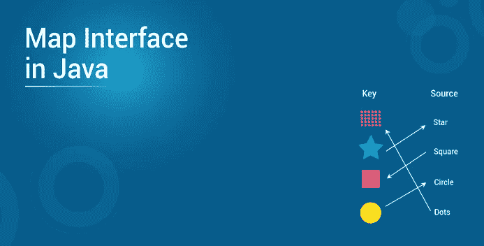
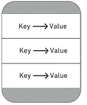
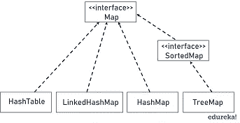
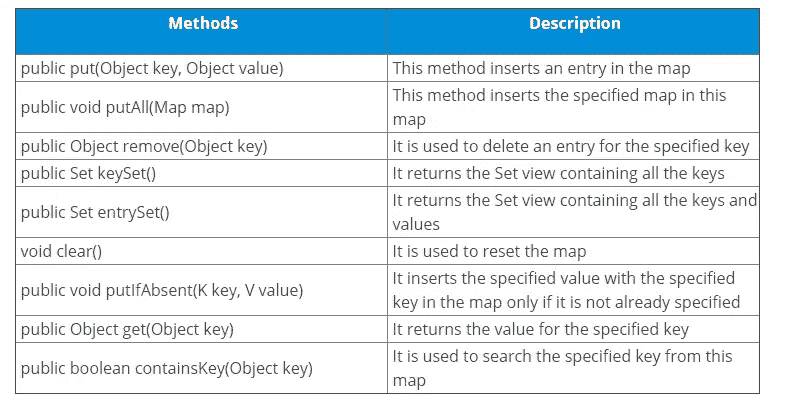

# 如何用 Java 实现 Map 接口？

> 原文：<https://medium.com/edureka/map-interface-in-java-ad09c477eb00?source=collection_archive---------0----------------------->



Java 中最有趣的话题之一是 Map 接口，它表示键和值之间的映射。经常被误解为 Java Map 接口的一个子类型本文将帮助你理解和掌握 Java 中一个 Map 是如何在集合接口中工作的。Java。

下面列出了本文涉及的主题:

*   Java 地图接口
*   地图界面的特征
*   Java 映射层次结构
*   Java 映射接口中的方法
*   地图接口的实现
*   HashMap 类
*   TreeMap 类
*   LinkedHashMap 类

# Java 地图接口

Java 中的映射是一种将键映射到值的对象，旨在加快查找速度。数据存储在键-值对中，每个键都是唯一的。每个键映射到一个值，因此命名为 map。这些键值对被称为映射条目。



在 JDK 中，java.util.Map 是一个包括方法签名的接口，用于根据键插入、移除和检索元素。有了这样的方法，它就是一个用于键值关联映射的完美工具，比如字典。

# 地图界面的特征

*   地图接口不是集合接口的真正子类型，因此，它的特征和行为不同于其余的集合类型。
*   它提供了三种集合视图——键集、键-值映射集和值集合。
*   一个映射不能包含重复的键，每个键最多只能映射到一个值。一些实现允许空键和空值 *HashMap 和 LinkedHashMap(* *TreeMap)。*
*   Map 接口不保证映射的顺序，但是，它取决于实现。例如， *HashMap* 不能保证映射的顺序，但是 *TreeMap* 可以。
*   AbstractMap 类提供了 Java Map 接口的框架实现，大多数 Map 具体类都扩展了 AbstractMap 类并实现了所需的方法。

现在您已经了解了 Java 中的 Map 接口，让我们来看看 Java Map 的层次结构。

# Java 映射层次结构

java 中有两个实现映射的接口:Map 和 SortedMap。而 Java 中流行的 Map 实现类有 *HashMap、TreeMap* 和 *LinkedHashMap。*Java 映射的层次结构如下所示:



在我们检查上面提到的 Java Map 接口的三个实现类之前，这里有一些您在使用 Map 时会遇到的常见方法。

# Java 映射接口中的方法



# 地图的实现

有几个让我们用实现 Java Map 的示例类来看看每个实现的特征和行为，但是三个主要的和通用的实现是 HashMap、TreeMap 和 LinkedHashMap。程序。

# HashMap 类

实现 Java Map 接口的最常见的类是 HashMap。它是基于散列表的 Map 接口实现。它实现了所有的映射操作，并允许空值和一个空键。此外，该类不维护其元素之间的任何顺序。下面是一个演示 HashMap 类的示例程序。

```
**package** MyPackage;
**import** java.util.*;
**class** HashMapExample {
      **public** **static** **void** main(String[] args) {
             Map< String, Integer> courses = **new** HashMap< String,Integer>(); // Add some courses.
             courses.put("Java Courses", **new** Integer(6));
             courses.put("Cloud Courses", **new** Integer(7));
             courses.put("Programming Courses", **new** Integer(5));
             courses.put("Data Science Courses", **new** Integer(2));
             System.out.println("Total courses: " + courses.size());
             Set< Map.Entry< String,Integer> > st = courses.entrySet();
             **for** (Map.Entry< String,Integer> me :st)
             {
               System.out.print(me.getKey()+":");
               System.out.println(me.getValue());
             }
             System.out.println();
             String searchKey = "Java Courses";
             **if** (courses.containsKey(searchKey))
             System.out.println("Found total " + courses.get(searchKey) + " " + searchKey);
             }
             }
```

**输出**

```
Total courses: 4
Cloud Courses:7
Programming Courses:5
Data Science Courses:2
Java Courses:6
Found total 6 Java Courses
```

在上面的程序中，我使用了很多表格中提到的方法。首先， *put()* 方法在 map 中插入 4 个条目，下一步中的 *size()* 方法显示 map 的大小(总键值对)。之后，在下一步中， *entrySet()* 方法返回所有的键值对。该程序还展示了如何利用 *get()* 方法使用相关的键来搜索一个值。

让我们转到实现 Java Map 接口的下一个类——TreeMap。

# TreeMap 类

这个实现使用红黑树作为底层数据结构。树形图根据其关键字的自然顺序进行排序，或者根据创建时提供的比较器进行排序。这个实现不允许空值，但是保持了元素的顺序。下面是一个演示 TreeMap 类的示例程序。

```
**package** MyPackage;**import** java.util.*;**class** TreeMapEx{ **public** **static** **void** main(String[] args) {
          Map< String, Integer> courses = **new** TreeMap< String,Integer>(); // Add some courses.
        courses.put("Java Courses", **new** Integer(3));
        courses.put("AWS Courses", **new** Integer(7));
        courses.put("Programming Courses", **new** Integer(8));
        courses.put("Data Science Courses", **new** Integer(2));
        System.out.println("Total courses: " + courses.size());
        Set< Map.Entry< String,Integer> > st = courses.entrySet();
        **for** (Map.Entry< String,Integer> me :st)
        {
        System.out.print(me.getKey()+":");
        System.out.println(me.getValue());
         }
       System.out.println();
         }
         }
```

**输出**

```
Total courses: 4
AWS Courses:7
Data Science Courses:2
Java Courses:3
Programming Courses:8
```

在输出中，map 的元素按照严格的词典顺序打印，这在前面的 HashMap 示例中没有出现。我们要讨论的下一个类是 *LinkedHashMap* 。

# LinkedHashMap 类

顾名思义，Java Map 接口的实现使用哈希表和链表作为底层数据结构。因此，LinkedHashMap 的顺序是可预测的，默认顺序是插入顺序。此外，还允许类似 HashMap 中的空值。下面是一个演示 TreeMap 类的示例程序。

```
package MyPackage;

import java.util.*; 

    public class LinkedHashMapExample 
    { 
        public static void main(String a[]) 
        { 
            LinkedHashMap<String, Integer> courses = 
                           new LinkedHashMap<String, Integer>(); 
            courses.put("Java Courses", new Integer(3));
            courses.put("Cloud Courses", new Integer(7));
            courses.put("Programming Courses", new Integer(8));
            courses.put("Data Science Courses", new Integer(2));

            // It prints the elements in same order  
            // as they were inserted     
            System.out.println(courses); 
            System.out.println("Total courses: " + courses.size());  
            System.out.println("Contains key 'Hadoop'? "+  courses.containsKey("Hadoop"));

            System.out.println("Getting value for key 'Programming Courses': " + courses.get("Programming Courses"));
            System.out.println("Is map empty? " + courses.isEmpty());

            System.out.println("delete element 'Cloud Courses': " +  courses.remove("Cloud Courses")); 

            System.out.println(courses); 
        } 
    }
```

**输出**

```
{Java Courses=3, Cloud Courses=7, Programming Courses=8, Data Science Courses=2}
Total courses: 4
Contains key 'Hadoop'? false
Getting value for key 'Programming Courses': 8
Is map empty? false
delete element 'Cloud Courses': 7
{Java Courses=3, Programming Courses=8, Data Science Courses=2}
```

这个示例程序非常容易理解。我已经用一些基本的方法演示了 Java 中 LinkeHashMap 的功能。就像我之前说的，除了这三个类，还有很多其他类实现了 Java Map 接口。

这就把我们带到了这篇“Java Map Interface”文章的结尾。我讲过 Java 的一个有趣的话题，就是 Java 中的 Map 接口。如果你想查看更多关于人工智能、DevOps、道德黑客等市场最热门技术的文章，那么你可以参考 [Edureka 的官方网站。](https://www.edureka.co/blog/?utm_source=medium&utm_medium=content-link&utm_campaign=java-map-interface)

请留意本系列中解释 Java 其他各方面的其他文章。

> *1。* [*面向对象编程*](/edureka/object-oriented-programming-b29cfd50eca0)
> 
> *2。* [*继承 Java 中的*](/edureka/inheritance-in-java-f638d3ed559e)
> 
> *3。*[*Java 中的多态性*](/edureka/polymorphism-in-java-9559e3641b9b)
> 
> *4。*[*Java 中的抽象*](/edureka/java-abstraction-d2d790c09037)
> 
> *5。* [*Java 字符串*](/edureka/java-string-68e5d0ca331f)
> 
> *6。* [*Java 数组*](/edureka/java-array-tutorial-50299ef85e5)
> 
> *7。* [*Java 集合*](/edureka/java-collections-6d50b013aef8)
> 
> *8。* [*Java 线程*](/edureka/java-thread-bfb08e4eb691)
> 
> *9。*[*Java servlet 简介*](/edureka/java-servlets-62f583d69c7e)
> 
> *10。* [*Servlet 和 JSP 教程*](/edureka/servlet-and-jsp-tutorial-ef2e2ab9ee2a)
> 
> *11。*[*Java 中的异常处理*](/edureka/java-exception-handling-7bd07435508c)
> 
> *12。* [*Java 教程*](/edureka/java-tutorial-bbdd28a2acd7)
> 
> *13。* [*Java 面试题*](/edureka/java-interview-questions-1d59b9c53973)
> 
> *14。* [*Java 程序*](/edureka/java-programs-1e3220df2e76)
> 
> *15。* [*科特林 vs Java*](/edureka/kotlin-vs-java-4f8653f38c04)
> 
> *16。* [*依赖注入使用 Spring Boot*](/edureka/what-is-dependency-injection-5006b53af782)
> 
> *17。* [*堪比 Java 中的*](/edureka/comparable-in-java-e9cfa7be7ff7)
> 
> *18。* [*十大 Java 框架*](/edureka/java-frameworks-5d52f3211f39)
> 
> *19。* [*Java 反射 API*](/edureka/java-reflection-api-d38f3f5513fc)
> 
> *20。*[*Java 中的前 30 个模式*](/edureka/pattern-programs-in-java-f33186c711c8)
> 
> *21。* [*核心 Java 备忘单*](/edureka/java-cheat-sheet-3ad4d174012c)
> 
> *22。*[*Java 中的套接字编程*](/edureka/socket-programming-in-java-f09b82facd0)
> 
> 23。 [*Java OOP 备忘单*](/edureka/java-oop-cheat-sheet-9c6ebb5e1175)
> 
> *24。*[*Java 中的注释*](/edureka/annotations-in-java-9847d531d2bb)
> 
> *25。*[*Java 库管理系统项目*](/edureka/library-management-system-project-in-java-b003acba7f17)
> 
> 26。 [*爪哇树木*](/edureka/java-binary-tree-caede8dfada5)
> 
> *27。*[*Java 中的机器学习*](/edureka/machine-learning-in-java-db872998f368)
> 
> 28。 [*顶级数据结构&Java 中的算法*](/edureka/data-structures-algorithms-in-java-d27e915db1c5)
> 
> *29。* [*Java 开发者技能*](/edureka/java-developer-skills-83983e3d3b92)
> 
> 30。 [*前 55 名 Servlet 面试问题*](/edureka/servlet-interview-questions-266b8fbb4b2d)
> 
> *31。*[](/edureka/java-exception-handling-7bd07435508c)*[*顶级 Java 项目*](/edureka/java-projects-db51097281e3)*
> 
> **32。* [*Java 字符串备忘单*](/edureka/java-string-cheat-sheet-9a91a6b46540)*
> 
> **33。*[*Java 中的嵌套类*](/edureka/nested-classes-java-f1987805e7e3)*
> 
> **34。* [*Java 集合面试问答*](/edureka/java-collections-interview-questions-162c5d7ef078)*
> 
> **35。*[*Java 中如何处理死锁？*](/edureka/deadlock-in-java-5d1e4f0338d5)*
> 
> **36。* [*你需要知道的 50 个 Java 合集面试问题*](/edureka/java-collections-interview-questions-6d20f552773e)*
> 
> **37。*[*Java 中的字符串池是什么概念？*](/edureka/java-string-pool-5b5b3b327bdf)*
> 
> **38。*[*C、C++和 Java 有什么区别？*](/edureka/difference-between-c-cpp-and-java-625c4e91fb95)*
> 
> *39。[*Java 中的回文——如何检查一个数字或字符串？*](/edureka/palindrome-in-java-5d116eb8755a)*
> 
> *40。 [*你需要知道的顶级 MVC 面试问答*](/edureka/mvc-interview-questions-cd568f6d7c2e)*
> 
> **41。*[*Java 编程语言十大应用*](/edureka/applications-of-java-11e64f9588b0)*
> 
> **42。* [*陷入僵局*](/edureka/deadlock-in-java-5d1e4f0338d5)*
> 
> *43。[*Java 中的平方和平方根*](/edureka/java-sqrt-method-59354a700571)*
> 
> *44。[*Java 中的类型转换*](/edureka/type-casting-in-java-ac4cd7e0bbe1)*
> 
> *45。[*Java 中的运算符及其类型*](/edureka/operators-in-java-fd05a7445c0a)*
> 
> **46。*[*Java 中的析构函数*](/edureka/destructor-in-java-21cc46ed48fc)*
> 
> **47。*[*Java 中的二分搜索法*](/edureka/binary-search-in-java-cf40e927a8d3)*
> 
> *48。[*Java 中的 MVC 架构*](/edureka/mvc-architecture-in-java-a85952ae2684)*
> 
> **49。* [*冬眠面试问答*](/edureka/hibernate-interview-questions-78b45ec5cce8)*

**原载于 2019 年 7 月 26 日*[*https://www.edureka.co*](https://www.edureka.co/blog/java-map-interface)*。**