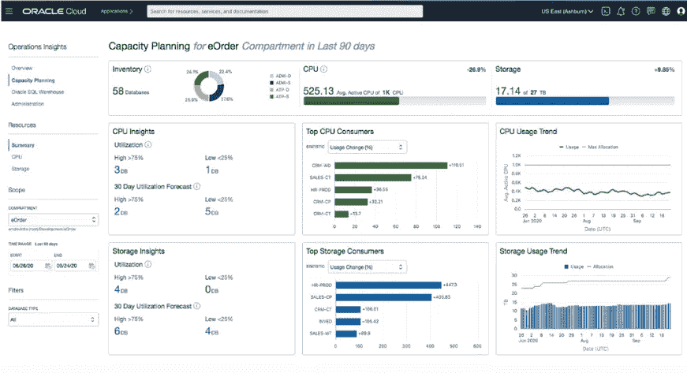

# 借助可观察性和管理平台，规划您从内部部署到云的旅程

> 原文：<https://medium.com/oracledevs/map-your-journey-from-on-premise-to-cloud-with-observability-and-management-platform-ed81d780fb00?source=collection_archive---------3----------------------->

随着在云中运行的工作负载的百分比接近 50%，根据这份 [*OMDIA 报告*](https://www.oracle.com/a/ocom/docs/corporate/analystrelations/oracle-simplifies-hybrid-and-multicloud-management.pdf) ，在将您的业务迁移到云之前有一个适当的战略计划将帮助您充分利用它。为了获得最佳结果，您需要在选择需要迁移的工作负载时做出正确的决策，以及正确的迁移方法。然而，要实现这些结果，您需要有意义的指标和对工作负载的可见性。

[https://unsplash.com/photos/1V5zGGTYXVc](https://unsplash.com/photos/1V5zGGTYXVc)

如今，可以收集日志和跟踪的监控和管理工具比以往任何时候都多。但是，在规划将您的工作负载迁移到云的策略时，我们需要两件东西:一个工具，它将为您提供业务整体的清晰图像，并在从内部部署到云的整个过程中继续展示它。这是 Oracle 云上的**可观察性和管理平台**提供的。它为用户提供了跨所有工作负载层的可见性和洞察力，可以部署在任何环境中。该平台提供一系列产品，例如:

*   应用性能监控*“图 1”*。
*   数据库管理
*   记录*“图 2”*。
*   记录分析*“图 3”*。
*   服务连接器集线器
*   运营洞察*“图 4”*。

以及其他几项服务，这些服务旨在通过减少监控和查看整个工作负载所需的工具数量来降低 it 复杂性，并通过与高度自动化、智能化和集成的功能相关联的单一位置来改善 IT 运营管理，从而简化故障排除。

Figure1\. Screenshot of Application Performance Monitoring

Figure 2\. Screenshot of Logging Service

Figure 3\. Screenshot of Logging Analytics

Figure 4\. Screenshot of Operations Insights

但不仅仅是日志和痕迹！使用**可观察性和管理平台**还将帮助您对业务绩效进行深入分析，并确定在您从内部环境转向云的过程中有所帮助的几个标准，例如:

# 测量你的基线

测量您的本地性能基准和资源使用情况将有助于您了解当前的工作负载状态，并确定您迁移的目的(性能提升、成本节约等)。此外，您将能够跟踪使用趋势，并识别利用率是否在任何特定时期有所增加，并基于此调整您的云资源以应对这种增加。

> Oracle Cloud 为多种资源提供自动扩展功能，这使其具有高度的弹性，您可以在此处找到更多详细信息。

# 我应该移动什么？

了解您的系统依赖关系将有助于您选择要迁移的工作负载，以及组织希望开发的功能，尤其是当您的工作负载与环境中的许多活动相集成时。

# 降低迁移风险

能够在从内部部署到云的整个过程中监控您的工作负载，同时存储每个阶段的指标和日志，这将允许您识别在任何点出现的任何问题，并确定整个体系中受影响的区域，使您能够比较不同阶段之间获得的数据。

# 验证您的成果

使用从内部存储到云的信息将有助于您通过可靠的指标证明迁移带来的好处，将结果与基准进行比较以衡量成功率。

# 总结

**Oracle Cloud 上的可观察性和管理平台**提供了一系列服务，帮助您做出明智的决策，最大限度地降低从内部环境迁移到云环境的影响，确保不会产生负面的业务影响或成本。

# 加入对话！

如果你对甲骨文开发人员在他们的自然栖息地发生的事情感到好奇，来加入我们的[公共休闲频道](https://oracledevrel.slack.com/join/shared_invite/zt-uffjmwh3-ksmv2ii9YxSkc6IpbokL1g#/shared-invite/email)！我们不介意成为你的鱼缸🐠

> 点击此[链接访问官方网站，了解更多关于 Oracle Cloud 上的**可观察性和管理**产品及其功能的信息！](https://www.oracle.com/manageability/)