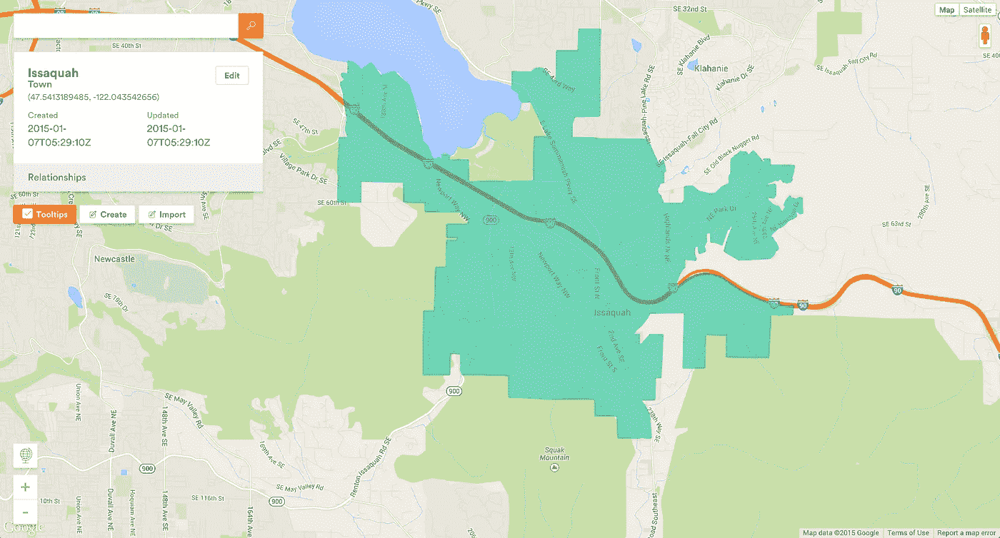
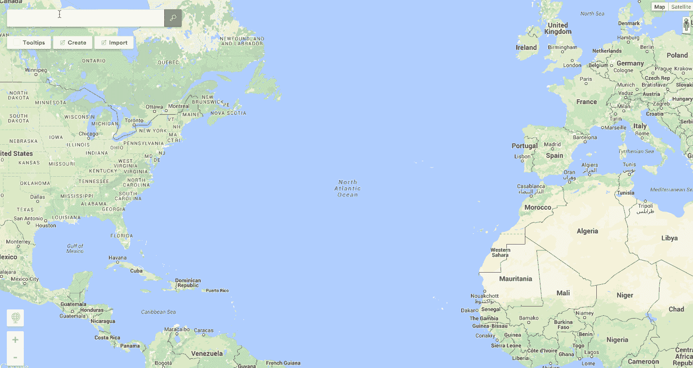
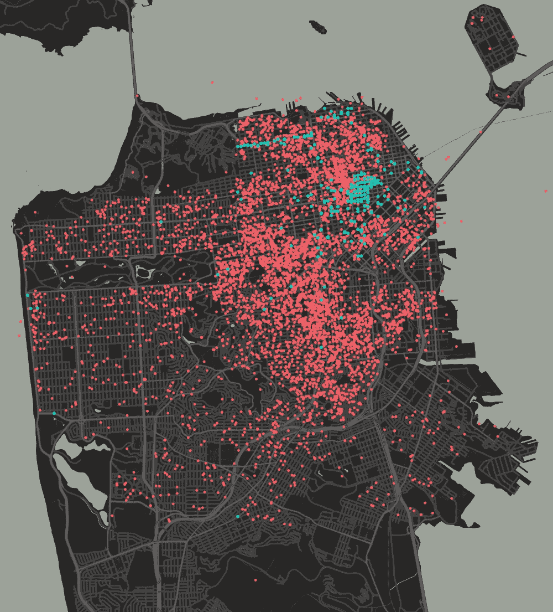
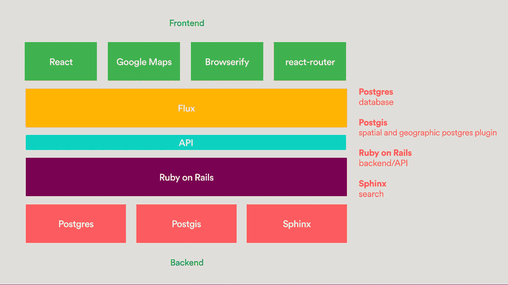
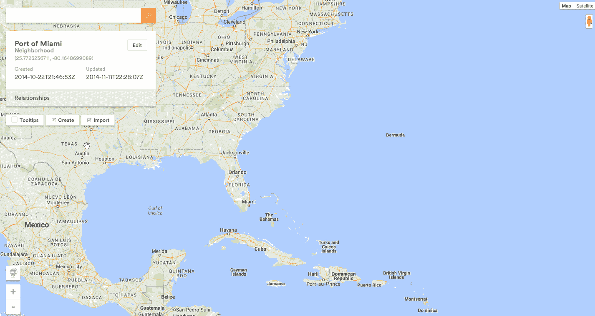
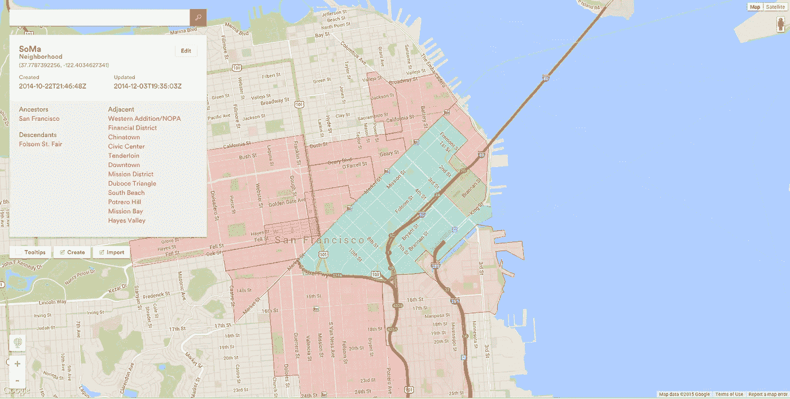
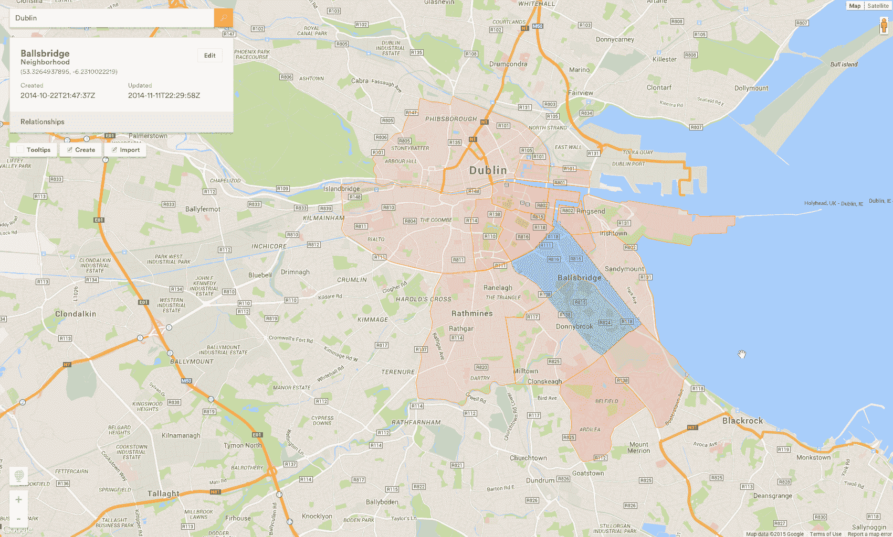
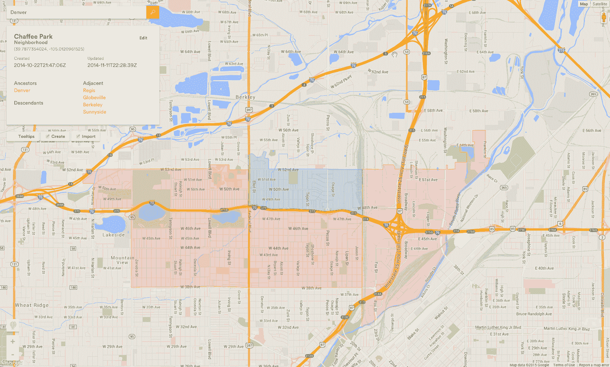

# 绘制世界地图

> 原文：<https://medium.com/airbnb-engineering/mapping-the-world-a631a96a3b3a?source=collection_archive---------0----------------------->

由[哈里森·肖夫](https://medium.com/u/e0b86d3f3f13?source=post_page-----a631a96a3b3a--------------------------------)

当我告诉人们扎克·沃克的事情时，他们总是很惊讶， [Airbnb 的内部制图员](http://www.theverge.com/2013/10/2/4790674/airbnbs-chief-cartographer-helps-sell-renters-on-lesser-know)，他致力于绘制世界地图。

他们说，“世界已经被绘制出来了！有谷歌地图、Foursquare、Yelp、Garmin、国家地理、郑和、伊莎贝拉·伯德、路易斯&克拉克&萨卡加维亚、莱夫·埃里克森、大卫·爱登堡讲述的行星地球系列……”

这是真的，那么这是怎么回事？

这都是关于“AT-AT”的，这是我们构建的一个新的内部工具，用于了解位置及其与其他位置的关系。看起来是这样的:

# 大问题和难题

在 Airbnb，我们想要回答的问题是，你如何在没有去过的情况下理解一个地方？

如何捕捉为什么你朋友说你不会喜欢渔人码头，但你还是要去那里从 In N Out 弄个 double double？

你怎么知道世界上哪里会是你完美旅行的地方？

# 当前解决方案

我们目前通过多种方式解决这个问题:

*   当你在寻找一个住宿的地方时，我们的[位置相关性模型](http://nerds.airbnb.com/location-relevance/)让 Airbnb 社区向未来的客人通知好的住宿地点。
*   当你在探索新的体验地方时， [Airbnb Neighborhoods](https://www.airbnb.com/locations) 将当地的编辑内容与方便、需要知道的信息以及专业照片结合起来，无需离开椅子就能探索一个地方。
*   我们的[探索团队](http://www.wired.com/2014/07/airbnb_recommendations/)正在用自然语言处理和机器学习算法构建大东西，以理解评论、列表描述和搜索模式，从我们的主页上推荐完美的住宿地点。
*   主机指南可以让你找到主机的推荐。

这些产品结合在一起，帮助 Airbnb 旅行者发现构成一个城市的所有精彩之处，而不仅仅是传统住宿通常存在的市中心地区。

*Airbnb accommodations (red) and traditional accommodations (blue) in San Francisco*

位置是我们许多工程工作的重要组成部分。我们的团队需要帮助 Airbnb 旅行者减轻他们在寻找住宿地点时的头号担忧:位置。另一方面，我们希望强调 Airbnb 主机在世界各地开放的 100 多万个独特的房源。

# 下一步是什么

当邻居试图给你找一个完美的住处时，他们只能带你走这么远。

有一些具有文化意义的地区没有在地图上画出来。他们大多生活在当地社区的思想中，把这些地方叫做家。这些区域可能是沿着一条道路穿过 3 个街区的城镇的独特部分。或者它们可能是一种描述多个社区之间共同点的方式。

扎克·沃克为寻找和绘制这些地方付出了巨大的努力。他研究历史和当前的数据，与社区的人们交谈，并回复主人的电子邮件，以建立当地人如何理解他们在世界上的位置的清晰图像。

因此，当你在北加州的“葡萄酒之乡”寻找住处时，我们应该向你展示纳帕和索诺马，并帮助你了解这两个县之间的差异和相似之处。

虽然我们对此感到非常兴奋，但在我们当前的架构和现有的内部工具下，这是不可能的。我们需要更大的东西。

# 在-处输入项目

一个由 Christopher Lin、Alex Blackstock、Daniel Loreto 和我组成的小团队开始开发工具来帮助 Zack Walker 绘制世界地图。

关于项目代号的说明:Zack 不让我们称它为“步行机系统”，所以 Christopher Lin 做了一件退而求其次的事情，使用了一个星球大战参考(帝国步行机或全地形装甲运输，通常称为“AT-AT”)。

AT-AT 的技术体系如下:

我们的第一步是推广现有系统，使其能够处理各种地理多边形(大陆、国家、市场区域、特殊区域、城镇)，而不仅仅是城市和社区。

# 关系

创建多边形时，后端会计算以下内容:

*   更高类型的祖先多边形，包含此多边形的多边形(San Francisco => SoMa)
*   相同类型的相邻多边形、重叠/有边界的多边形(SoMa = >市中心)
*   较低类型的后代多边形，此多边形包含的多边形(SoMa => Folsom Street Fair)
*   多边形质心的纬度/经度

# 航行

在多边形的工作空间中导航可能会很棘手。我们花了几次迭代才找到让 UI 消失在背景中的交互模式。

系统用户界面的基本原则:

1.  不要弄坏后退按钮
2.  只渲染必要的内容
3.  根据需要透露信息
4.  除去

我们决定采用以下交互方式:单击选择一个多边形并只呈现其相邻的多边形，

双击会捕捉到选定的多边形。

# 工具文化

构建旅行的未来需要许多特殊的工具在后台协同工作。

AT-AT 只是这些工具中的一个，它是为其他服务和工具获取位置数据的基础，是回答“我下一次最完美的旅行在哪里？”的第一步

当构建工具时，记住你永远无法预测未来的用例。

你将从航运中学到最多。

# 特别感谢

扎克·沃克，本·休斯，安迪·克拉莫利施，安·蒙哥马利。

## 在 [airbnb.io](http://airbnb.io) 查看我们所有的开源项目，并在 Twitter 上关注我们:[@ Airbnb eng](https://twitter.com/AirbnbEng)+[@ Airbnb data](https://twitter.com/AirbnbData)

*原载于 2015 年 1 月 7 日 nerds.airbnb.com**[*。*](http://nerds.airbnb.com/mapping-world/)*