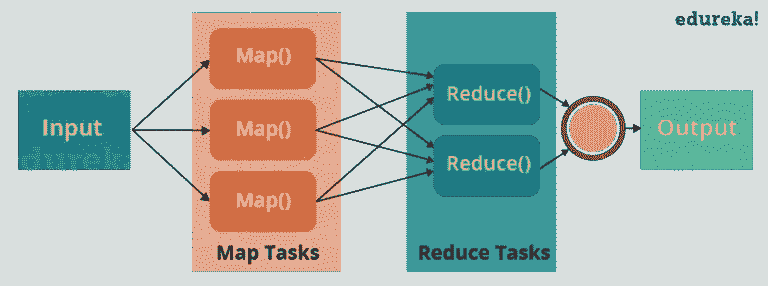

# MapReduce 基础与 MapReduce 示例

> 原文：<https://medium.com/edureka/mapreduce-tutorial-3d9535ddbe7c?source=collection_archive---------0----------------------->


MapReduce Tutorial - Edureka

在这篇 MapReduce 教程博客中，我将向您介绍 MapReduce，它是 ***Hadoop 框架*** 中处理的核心构建块之一。在继续之前，我建议你熟悉一下 HDFS 的概念，我在之前的 *HDFS 教程*博客中已经提到过。这将有助于您快速轻松地理解 MapReduce 概念。

Google 在 2004 年 12 月发布了一篇关于 MapReduce 技术的论文。这成为了 Hadoop 处理模型的起源。因此，MapReduce 是一种编程模型，它允许我们对巨大的数据集执行并行和分布式处理。我在这篇 MapReduce 教程博客中涉及的主题如下:

*   并行和分布式处理的传统方式
*   什么是 MapReduce？
*   MapReduce 示例
*   MapReduce 的优势
*   MapReduce 程序
*   MapReduce 程序解释

# 传统方式


Traditional Way - MapReduce Tutorial

让我们理解一下，当 MapReduce 框架还没有出现的时候，并行和分布式处理是如何以传统的方式发生的。让我们举一个例子，我有一个包含 2000 年到 2015 年每日平均温度的天气日志。在这里，我想计算每年温度最高的一天。

所以，就像传统的方式一样，我会将数据分割成更小的部分或块，并将它们存储在不同的机器中。然后，我会找到存储在相应机器中的每个零件的最高温度。最后，我将组合从每台机器收到的结果，得到最终输出。让我们看看与这种传统方法相关的挑战:

1.  **关键路径问题:**它是在不延误下一个里程碑或实际完工日期的情况下，完成工作所花费的时间量。因此，如果任何一台机器延误了工作，整个工作都会延误。
2.  **可靠性问题:**如果任何一台处理部分数据的机器出现故障怎么办？这种故障转移的管理成为一项挑战。
3.  **平均分割问题:**我如何将数据分割成更小的块，以便每台机器都可以处理一部分数据。换句话说，如何平均分配数据，使每台机器都不会过载或利用不足。
4.  **单次分割可能失败:**如果任何一台机器无法提供输出，我将无法计算结果。因此，应该有一种机制来确保系统的这种容错能力。
5.  **聚合结果:**应该有一个机制来聚合每台机器生成的结果，以产生最终输出。

这些都是我在使用传统方法执行大型数据集的并行处理时必须单独注意的问题。

为了克服这些问题，我们有了 MapReduce 框架，它允许我们执行这样的并行计算，而不必担心可靠性、容错等问题。因此，MapReduce 为您提供了编写代码逻辑的灵活性，而无需关心系统的设计问题。

# 什么是 MapReduce？



What is MapReduce - MapReduce Tutorial

MapReduce 是一个编程框架，它允许我们在分布式环境中对大型数据集执行分布式和并行处理。

*   MapReduce 由两个不同的任务组成—映射和缩减。
*   顾名思义，MapReduce 阶段发生在 mapper 阶段完成之后。
*   因此，第一个是映射作业，读取并处理数据块以产生键值对作为中间输出。
*   映射器或映射作业(键值对)的输出被输入到缩减器。
*   reducer 从多个地图作业接收键值对。
*   然后，reducer 将这些中间数据元组(中间键-值对)聚集成一个更小的元组或键-值对集，这是最终的输出。

# MapReduce 的一个字数统计例子

让我们通过一个例子来理解 MapReduce 是如何工作的，我有一个名为 example.txt 的文本文件，其内容如下:

亲爱的，熊，河，汽车，汽车，河，鹿，汽车和熊

现在，假设我们必须使用 MapReduce 对 sample.txt 进行字数统计。因此，我们将找到独特的词，以及这些独特的词出现的次数。


MapReduce Example - MapReduce Tutorial

*   首先，我们将输入分成三部分，如图所示。这将在所有地图节点之间分配工作。
*   然后，我们对每个映射器中的单词进行标记，并给每个标记或单词一个硬编码值(1)。硬编码值等于 1 的基本原理是，每个单词本身都会出现一次。
*   现在，将创建一个键-值对列表，其中键只是单个单词，值是 1。因此，对于第一行(亲爱的 Bear River ),我们有 3 个键值对——亲爱的，1；熊，1；河，1。所有节点上的映射过程保持不变。
*   在映射阶段之后，进行一个分区过程，在该过程中进行排序和改组，以便将具有相同关键字的所有元组发送到相应的缩减器。
*   因此，在排序和洗牌阶段之后，每个 reducer 将拥有一个惟一的键和一个与该键对应的值列表。比如熊，[1，1]；汽车，[1，1，1]..等。
*   现在，每个归约器对该值列表中的值进行计数。如图所示，reducer 得到一个值列表，对于 key Bear 是[1，1]。然后，它计算列表中 1 的数量，并给出最终输出——Bear，2。
*   最后，收集所有的输出键/值对，并写入输出文件。

# MapReduce 的优势

MapReduce 的两个最大优势是:

## 1.并行处理:

在 MapReduce 中，我们在多个节点之间划分作业，每个节点同时处理作业的一部分。因此，MapReduce 基于分而治之的范式，帮助我们使用不同的机器处理数据。由于数据是由多台机器而不是单台机器并行处理的，处理数据所需的时间大大减少，如下图(2)所示。


Traditional Way Vs. MapReduce Way - MapReduce Tutorial

## 2.数据位置:

我们不是将数据移动到处理单元，而是将处理单元移动到 MapReduce 框架中的数据。在传统系统中，我们通常将数据带到处理单元并对其进行处理。但是，随着数据的增长和变得非常庞大，将如此大量的数据带到处理单元会带来以下问题:

*   移动大量数据进行处理成本高昂，并且会降低网络性能。
*   处理需要时间，因为数据由单个单元处理，这成为了瓶颈。
*   主节点可能负担过重并可能出现故障。

现在，MapReduce 允许我们通过将处理单元引入数据来克服上述问题。因此，正如您在上图中看到的，数据分布在多个节点中，每个节点处理驻留在其上的部分数据。这使我们具有以下优势:

*   将处理单元移至数据非常划算。
*   由于所有节点都在并行处理它们的数据部分，因此处理时间减少了。
*   每个节点都有一部分数据要处理，因此不会出现节点过载的情况。

# MapReduce 示例程序

在进入细节之前，让我们看一下 MapReduce 示例程序，对 MapReduce 环境中的实际工作有一个基本的概念。我举了同一个单词计数的例子，我必须找出每个单词出现的次数。不要担心伙计们，如果你们第一次看的时候不理解代码，请耐心听我讲解 MapReduce 代码的每一部分。

## 源代码:

```
package co.edureka.mapreduce;
import java.io.IOException;
import java.util.StringTokenizer;
import org.apache.hadoop.io.IntWritable;
import org.apache.hadoop.io.LongWritable;
import org.apache.hadoop.io.Text;
import org.apache.hadoop.mapreduce.Mapper;
import org.apache.hadoop.mapreduce.Reducer;
import org.apache.hadoop.conf.Configuration;
import org.apache.hadoop.mapreduce.Job;
import org.apache.hadoop.mapreduce.lib.input.TextInputFormat;
import org.apache.hadoop.mapreduce.lib.output.TextOutputFormat;
import org.apache.hadoop.mapreduce.lib.input.FileInputFormat;
import org.apache.hadoop.mapreduce.lib.output.FileOutputFormat;
import org.apache.hadoop.fs.Path;

public class WordCount
{
public static class Map extends Mapper<LongWritable,Text,Text,IntWritable> {
public void map(LongWritable key, Text value,Context context) throws IOException,InterruptedException{
String line = value.toString();
StringTokenizer tokenizer = new StringTokenizer(line);
while (tokenizer.hasMoreTokens()) {
value.set(tokenizer.nextToken());
context.write(value, new IntWritable(1));
}
}
}

public static class Reduce extends Reducer<Text,IntWritable,Text,IntWritable> {
public void reduce(Text key, Iterable<IntWritable> values,Context context) throws IOException,InterruptedException {
int sum=0;
for(IntWritable x: values)
{
sum+=x.get();
}
context.write(key, new IntWritable(sum));
}
}

public static void main(String[] args) throws Exception {

Configuration conf= new Configuration();
Job job = new Job(conf,"My Word Count Program");
job.setJarByClass(WordCount.class);
job.setMapperClass(Map.class);
job.setReducerClass(Reduce.class);
job.setOutputKeyClass(Text.class);
job.setOutputValueClass(IntWritable.class);
job.setInputFormatClass(TextInputFormat.class);
job.setOutputFormatClass(TextOutputFormat.class);
Path outputPath = new Path(args[1]);
//Configuring the input/output path from the filesystem into the job
FileInputFormat.addInputPath(job, new Path(args[0]));
FileOutputFormat.setOutputPath(job, new Path(args[1]));
//deleting the output path automatically from hdfs so that we don't have to delete it explicitly
outputPath.getFileSystem(conf).delete(outputPath);
//exiting the job only if the flag value becomes false
System.exit(job.waitForCompletion(true) ? 0 : 1);
}
}
```

# MapReduce 程序的解释

整个 MapReduce 程序基本上可以分为三个部分:

*   映射器相位代码
*   减速器相位代码
*   驱动程序代码

我们将依次理解这三个部分的代码。

## 映射器代码:

```
public static class Map extends Mapper<LongWritable,Text,Text,IntWritable> {

public void map(LongWritable key, Text value, Context context) throws IOException,InterruptedException {

String line = value.toString();
StringTokenizer tokenizer = new StringTokenizer(line);
while (tokenizer.hasMoreTokens()) {
value.set(tokenizer.nextToken());
context.write(value, new IntWritable(1));
}
```

*   我们已经创建了一个类别映射，它扩展了 MapReduce 框架中已经定义的类别映射器。
*   我们使用尖括号在类声明之后定义输入和输出键/值对的数据类型。


*   映射器的输入和输出都是一个键/值对。
*   输入:

1.  *键*不过是文本文件中每一行的偏移量: *LongWritable*
2.  *值*是每一行(如右图所示):*文本*

*   输出:

1.  *键*是标记化的单词:*文本*
2.  在我们的例子中，硬编码的*值*是 1: *IntWritable*
3.  例子—亲爱的 1，熊 1，等等。

*   我们编写了一个 java 代码，其中我们对每个单词进行了标记化，并给它们分配了一个硬编码值，等于 *1* 。

## 减速器代码:

```
public static class Reduce extends Reducer<Text,IntWritable,Text,IntWritable> {

public void reduce(Text key, Iterable<IntWritable> values,Context context)
throws IOException,InterruptedException {

int sum=0;
for(IntWritable x: values)
{
sum+=x.get();
}
context.write(key, new IntWritable(sum));
}
}
```

*   我们创建了一个类 Reduce，它像 Mapper 一样扩展了类 Reduce。
*   我们在类声明之后使用尖括号定义输入和输出键/值对的数据类型，就像对 Mapper 所做的那样。
*   减速器的输入和输出都是一个键-值对。
*   输入:

1.  *键*除了在排序和洗牌阶段后生成的那些独特的单词之外什么都没有:*文本*
2.  *值*是每个键对应的整数列表: *IntWritable*
3.  例如——熊、[1，1]等。

*   输出:

1.  *键*是输入文本文件中出现的所有唯一单词:*文本*
2.  *值*是每个唯一字的出现次数: *IntWritable*
3.  例如——熊，2；车，3 等。

*   我们汇总了与每个键对应的每个列表中的值，并生成了最终答案。
*   通常，为每个唯一的单词创建一个缩减器，但是，您可以在 mapred-site.xml 中指定缩减器的数量。

## 驱动程序代码:

```
Configuration conf= new Configuration();
Job job = new Job(conf,"My Word Count Program");
job.setJarByClass(WordCount.class);
job.setMapperClass(Map.class);
job.setReducerClass(Reduce.class);
job.setOutputKeyClass(Text.class);

job.setOutputValueClass(IntWritable.class);
job.setInputFormatClass(TextInputFormat.class);
job.setOutputFormatClass(TextOutputFormat.class);
Path outputPath = new Path(args[1]);

//Configuring the input/output path from the filesystem into the job
FileInputFormat.addInputPath(job, new Path(args[0]));
FileOutputFormat.setOutputPath(job, new Path(args[1]));
```

*   在驱动程序类中，我们将 MapReduce 作业的配置设置为在 Hadoop 中运行。
*   我们指定作业的名称、映射器和缩减器的输入/输出的数据类型。
*   我们还指定了映射器和缩减器类的名称。
*   还指定了输入和输出文件夹的路径。
*   setInputFormatClass()方法用于指定映射器将如何读取输入数据或什么将是工作单元。这里，我们选择了 TextInputFormat，这样映射器就可以从输入文本文件中一次读取一行。
*   main()方法是驱动程序的入口点。在这个方法中，我们为作业实例化一个新的配置对象。

# 运行 MapReduce 代码:

运行 MapReduce 代码的命令是:

*Hadoop jar Hadoop-MapReduce-example . jar 字数/样本/输入/样本/输出*

现在，你们已经对 MapReduce 框架有了基本的了解。你应该已经意识到 MapReduce 框架是如何帮助我们编写代码来处理 HDFS 的海量数据的。

如果你想查看更多关于人工智能、Python、道德黑客等市场最热门技术的文章，你可以参考 Edureka 的官方网站。

请留意本系列中解释大数据其他各方面的其他文章。

> 1. [Hadoop 教程](/edureka/hadoop-tutorial-24c48fbf62f6)
> 
> 2.[蜂巢教程](/edureka/hive-tutorial-b980dfaae765)
> 
> 3.[养猪教程](/edureka/pig-tutorial-2baab2f0a5b0)
> 
> 4.[大数据教程](/edureka/big-data-tutorial-b664da0bb0c8)
> 
> 5. [HBase 教程](/edureka/hbase-tutorial-bdc36ab32dc0)
> 
> 6. [HDFS 教程](/edureka/hdfs-tutorial-f8c4af1c8fde)
> 
> 7. [Hadoop 3](/edureka/hadoop-3-35e7fec607a)
> 
> 8. [Sqoop 教程](/edureka/apache-sqoop-tutorial-431ed0af69ee)
> 
> 9.[水槽教程](/edureka/apache-flume-tutorial-6f7150210c76)
> 
> 10. [Oozie 教程](/edureka/apache-oozie-tutorial-d8f7bbbe1591)
> 
> 11. [Hadoop 生态系统](/edureka/hadoop-ecosystem-2a5fb6740177)
> 
> 12.[HQL 顶级配置单元命令及示例](/edureka/hive-commands-b70045a5693a)
> 
> 13. [Hadoop 集群搭配亚马逊 EMR？](/edureka/create-hadoop-cluster-with-amazon-emr-f4ce8de30fd)
> 
> 14.[大数据工程师简历](/edureka/big-data-engineer-resume-7bc165fc8d9d)
> 
> 15. [Hadoop 开发人员-工作趋势和薪水](/edureka/hadoop-developer-cc3afc54962c)
> 
> 16. [Hadoop 面试问题](/edureka/hadoop-interview-questions-55b8e547dd5c)

*原载于 2016 年 11 月 15 日*[*www.edureka.co*](https://www.edureka.co/blog/mapreduce-tutorial)*。*