# MapStruct —高级概念和依赖注入

> 原文：<https://medium.com/globant/mapstruct-advanced-concepts-and-dependency-injection-46f28af54e33?source=collection_archive---------0----------------------->

# 介绍

在我之前的博客中，我们讨论了如何使用基本的映射场景来设置 *MapStruct* 。如果你是第一次接触 *MapStruct* 并且还没有浏览过它，我强烈推荐你在继续这个之前浏览一下*…*

*欢迎回来，现在让我们看看一些高级映射配置，它们为我们提供了基于业务需求配置特殊行为的灵活性，并且还与 *Spring 依赖注入*相集成。*

*所以让我们开始吧-*

## *使用类型转换映射**:***

*Mapstruct 隐式提供了无缝的类型转换。一些支持的转换是-*

*   *在所有的 *Java 原语*数据类型和它们对应的*包装器*类型之间，例如在 *int* 和 *Integer* 之间。*
*   *在所有的 *Java 原语编号*类型和*包装器*类型中，例如在 *int* 和 *long* 之间。*
*   *在所有的 *Java 原语*类型(包括它们的*包装器*和*字符串*之间。*
*   *在*枚举*类型和*串*之间。*
*   *不同类型的*日期*对象和*字符串*之间。*

> ****注意:*** 从较大的数据类型转换为较小的数据类型(例如从`*long*`转换为`*int*`)会导致值或精度损失。**映射器**注释有一个方法`***typeConversionPolicy***` 来控制警告/错误。*

*让我们以日期和字符串之间的转换为例。为了实现这一点，我们的制图仪看起来像-*

*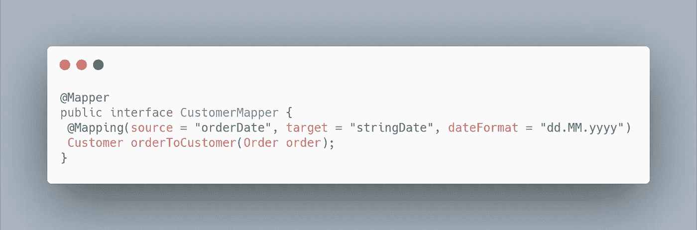*

## ***忽略来自目标 Bean 的字段**:*

*可能会出现某些属性不应该从源传播到目标的情况。忽略这些属性，我们要做的就是-*

*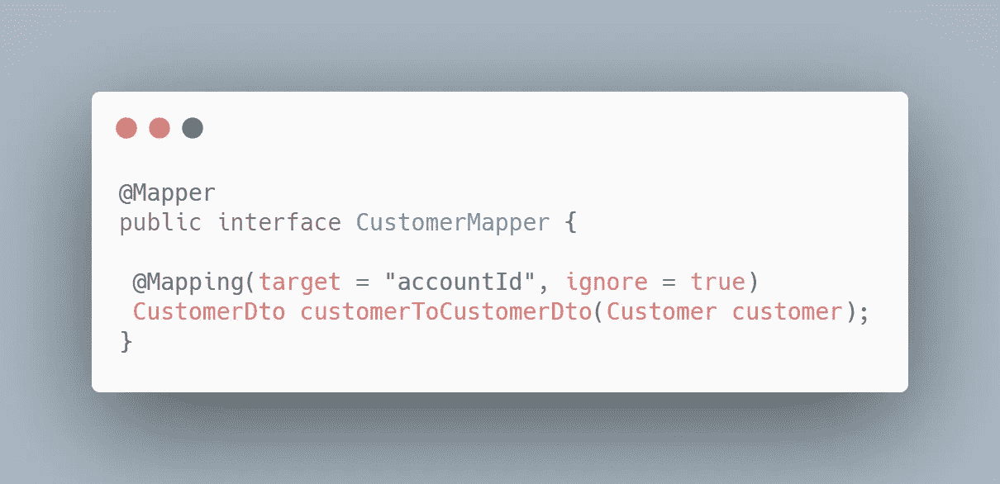*

## ***映射默认值和常量**:*

*有些情况下，如果源字段为空，或者如果我们希望始终为特定的目标字段输入一个常数值，我们会希望输入一些默认值。为了实现这一点，我们的制图仪看起来像-*

*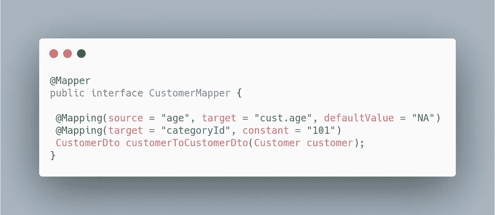*

## ***更新现有的 Bean 实例**:*

*在某些情况下，您需要的映射不会创建目标类型的新实例，而是更新该类型的现有实例。这种映射可以通过为目标对象添加一个参数并用 ***@MappingTarget*** 标记这个参数来实现。下面显示了一个示例-*

*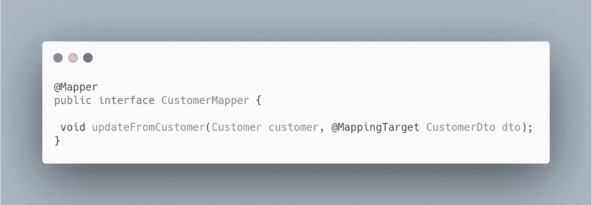*

> ***注意** —这次方法的返回类型是 void。*

## ***使用 Java 表达式进行映射:***

*MapStruct 为我们提供了包含 Java 代码构造的灵活性，同时提供了字段映射，因为整个源对象都可以在表达式中使用。*

*应该注意只插入有效的 Java 代码，因为 MapStruct 不会在生成时验证表达式，但是在编译过程中会在生成的类中显示错误。*

*考虑一个例子，我们为其中一个目标字段提供一个随机 id。*

*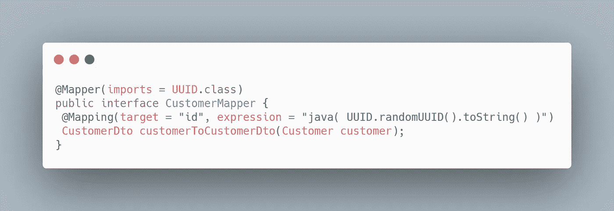*

> ***重要提示** —如果您的表达式引用了其他一些类，那么您需要在@Mapper 批注的 imports 方法中指定所有这些类，比如—*
> 
> *`@Mapper(imports = UUID.class)`*
> 
> *`or`*
> 
> *`@Mapper(imports = {UUID.class, Date.class})`*

## ***使用限定词选择映射方法:***

*有时，您必须执行一些复杂的步骤来映射两个字段。在这种情况下，我们可以使用 *@Mapping* 注释的`*qualifiedByName*` 方法来指定应该调用哪个方法来执行映射。*

*   *如果使用 Java 8 及以后的版本，可以在同一个接口内定义为*默认*或*静态*方法。*
*   *如果使用比 Java 8 更早的 Java 版本，可以在一个*抽象*类中定义所有映射，而不是在*接口*中定义。*

*包含逻辑的方法必须用注释`*@Named*` 进行注释，并且它必须包含与您提供给`*qualifiedByName*` 方法的字符串相同的名称。*

*让我们看一个简单的例子来更好地理解我们是如何把美元转换成美分的*

*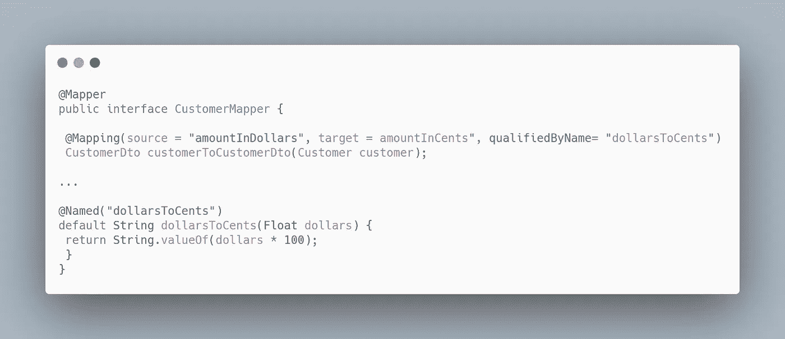*

## ***映射集合:***

*集合类型的映射(*列表，集合*等)。)是以与映射 bean 类型相同的方式完成的，即通过在映射器接口中用所需的源和目标类型定义映射方法。*

*生成的代码将包含一个循环，该循环遍历源集合，转换每个元素并将其放入目标集合。*

*让我们看看下面的映射器-*

*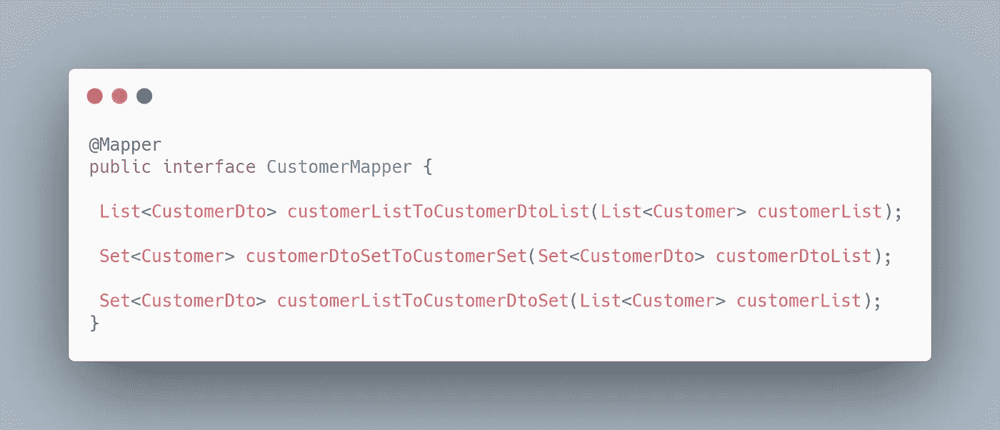*

*在上面的映射器中，我们已经声明了用于将列表转换为列表、将集合转换为集合以及将列表转换为集合的映射方法，MapStruct 支持来自 [Java 集合框架](http://docs.oracle.com/javase/tutorial/collections/intro/index.html)的多种可迭代类型。*

*以类似的方式，我们可以为 Map 定义一个映射器。下面显示了一个示例:*

*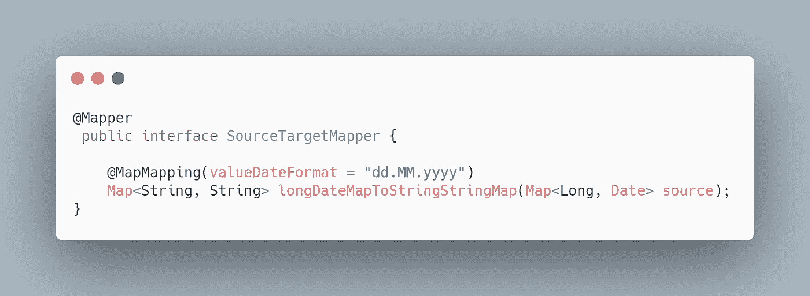*

> *花几分钟思考一下上面的代码。你注意到什么不同了吗？？？*

*是的，你完全正确。我们在这里使用了一个特殊的注释`*@MapMapping*` ，而不是通常的`*@Mapping*`注释，并为我们的地图值指定了日期格式。*

****@MapMapping*** 注释有几种方法来配置我们的地图转换，好的一面是，一如既往，我们不需要提供任何实现。Mapstruct 会为我们写这个。*

## ***调用其他映射器:***

*可能会有这样的情况，我们希望调用其他映射器，不管是 *MapStruct* 生成的还是手写的，来为我们做一些工作，在所有这些情况下，我们都可以使用 *@Mapper* 注释中的`*uses*` 方法来调用这些外部映射器。为了更好地理解，让我们举个例子:*

*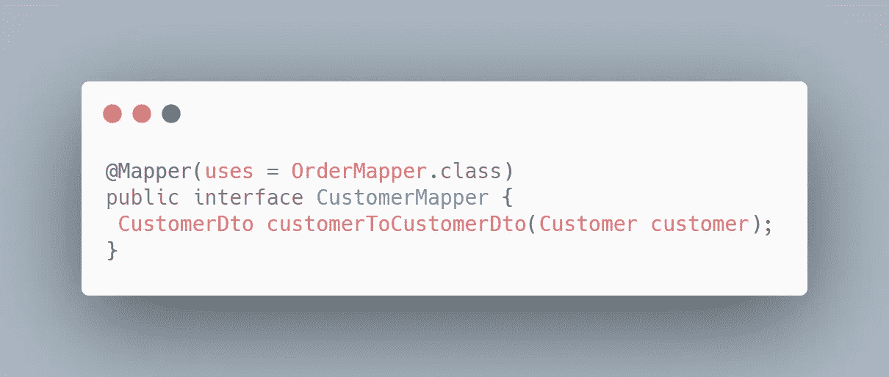*

*假设 Order.java 和 OrderDto.java 的*分别是 Customer.java*和 CustomerDto.java 的*的嵌套豆。当生成实现*customerToCustomerDto()*方法的代码时， *MapStruct* 将在*OrderMapper.java*中寻找一个在*订单*和*订单*之间具有映射逻辑的方法，并将调用该方法。**

## ***映射前和映射后注释:***

*这些注释用于标记在映射逻辑前后调用的方法。*

*在我们可能希望将一个行为应用于接口的所有映射方法的场景中，它们非常有用。*

*让我们看看下面的例子-*

*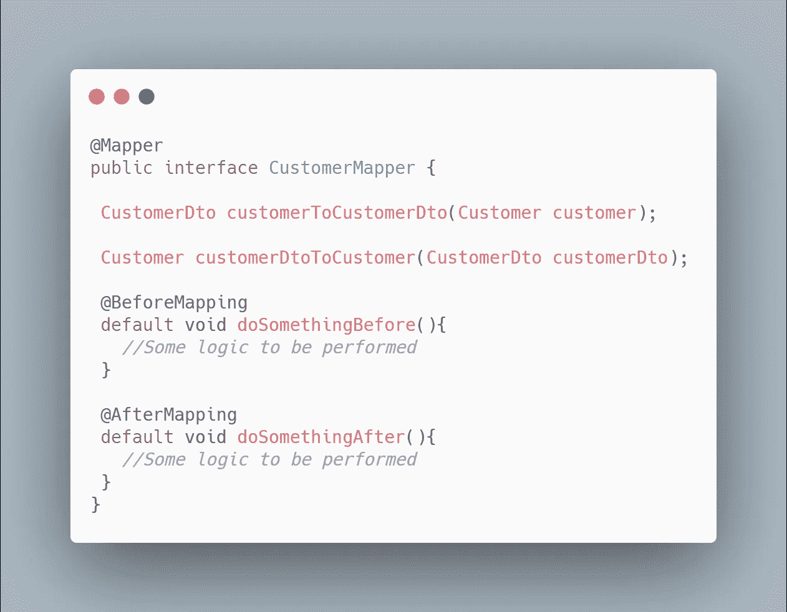*

****@ before mapping*—**标有此注释的方法将作为我们映射器的每个映射方法的第一条语句被调用。*

****@ after mapping*—**标有此注释的方法将作为我们映射器的每个映射方法的最后一条语句被调用。*

# *检索映射器和依赖注入*

## ***在没有依赖注入的情况下检索映射器:***

*在查看 Spring 与 Mapstruct 的集成之前，让我们先看看获取 mapper 实例的方法。*

*   *当不使用阿迪框架时，可以通过`**org.mapstruct.factory.Mappers**`类检索映射器实例。只需调用 `**getMapper()**`方法，传递映射器的接口类型返回，如下所示:*

*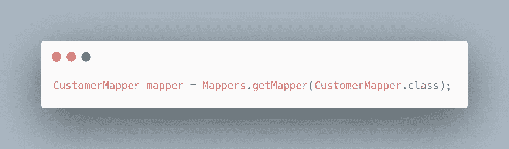*

## ***使用依赖注入检索映射器:***

*MapStruct 为 Java 企业应用提供了与依赖注入的无缝集成。目前 MapStruct 支持 [**CDI**](http://jcp.org/en/jsr/detail?id=346) (针对 JavaTM EE 的上下文和依赖注入) [**JSR330**](https://jcp.org/en/jsr/detail?id=330) (针对 Java 的依赖注入)和 [**Spring 框架**](http://www.springsource.org/spring-framework) **。***

*建议通过依赖注入而不是上述的 Mappers 类来获取 mapper 对象。为了实现映射器类实例的依赖注入， *MapStruct* 提供了一个非常简单的方法。我们所要做的就是在`*componentModel*` 方法中指定 DI 框架的***@ Mapper****注释，让我们看看如何——**

*   *****如果使用 CDI:*****

**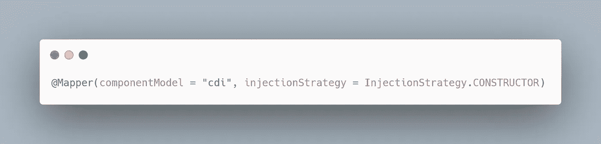**

*   *****如果使用弹簧:*****

**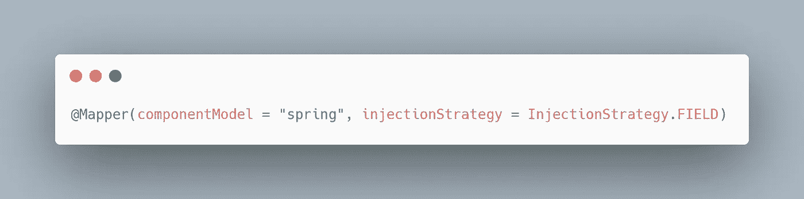**

**在上面的例子中，你可以看到我们已经指定我们想要使用 *Spring* 作为我们的依赖框架，依赖注入应该使用*字段*来完成。**

**通过做这个简单的配置，MapStruct 将把实现类标记为*组件*类，并且 *Spring* 将为它创建一个 bean。因此，每当我们需要使用我们的映射器时，我们所要做的就是*自动连接*映射器*接口并使用它。***

> ****额外提示:**有些情况下，您需要执行一些复杂的逻辑，同时将一个字段映射到您的映射器，如自动连接其他 bean，以获得一些信息，如*active spring profiles*by auto wiring Environment bean。在这种情况下，你不能使用*接口*作为你的映射器。相反，使用*抽象*类将映射方法声明为抽象方法。**

# **结论**

**我希望这个博客会鼓励你在你的项目中使用 *Mapstruct* 来节省一些时间，这样你就可以投入到你最喜欢的活动中，而不是编写一些复杂的 bean 映射代码。**

**我试图涵盖所有常用的 Mapstruct 的特性，但是 T2 map struct 提供的远不止这些。你可以随时参考 [**Mapstruct 官方文档**](https://mapstruct.org/documentation/stable/reference/html/) 深入了解 *MapStruct* 的世界。**

## **编码快乐！**