# map struct——让我来为您编写这段冗长的代码吧！

> 原文：<https://medium.com/globant/mapstruct-let-me-write-the-tedious-piece-of-code-for-you-d3c27f667314?source=collection_archive---------0----------------------->

Photo by [J. Kelly Brito](https://unsplash.com/@heykellybrito?utm_source=medium&utm_medium=referral) on [Unsplash](https://unsplash.com?utm_source=medium&utm_medium=referral)

A 你还在为多层架构应用程序中的 bean mapping 编写样板代码吗？

如果是这样，接下来的 10 分钟将会给你的编码风格带来欢乐。

# 介绍

让我介绍一下 [**MapStruct**](https://mapstruct.org/documentation/stable/reference/html/) —一个强大的 Java 注释处理器，通过为我们编写类型安全的 bean 映射类来简化我们的生活。

与手动编写映射代码相比，MapStruct 通过生成在编译时手动编写的冗长且容易出错的代码来节省时间。它使用合理的缺省值，但是当涉及到根据我们的业务需求配置或实现特殊行为时，它就不在我们的考虑范围内了。

您一定在想这个魔术是如何工作的，所以不再多说，让我们从 Mapstruct 开始吧。

# 设置

## 依赖性-

1.  *如果您使用****Maven****，请将以下依赖项添加到您的* ***POM.xml***

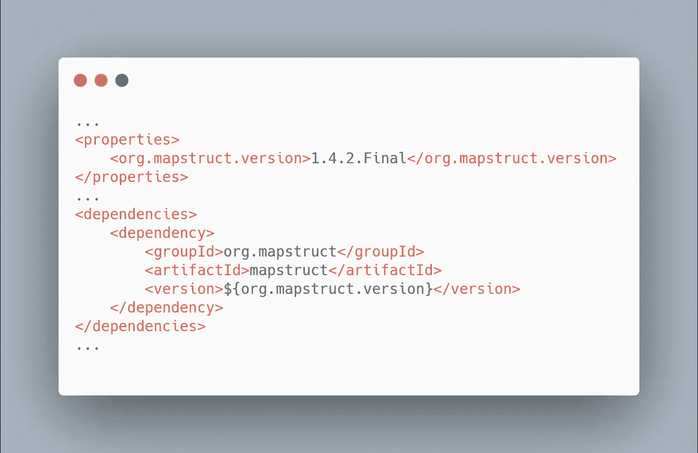

用`maven-compile-plugin`配置，用 maven 命令生成实现。

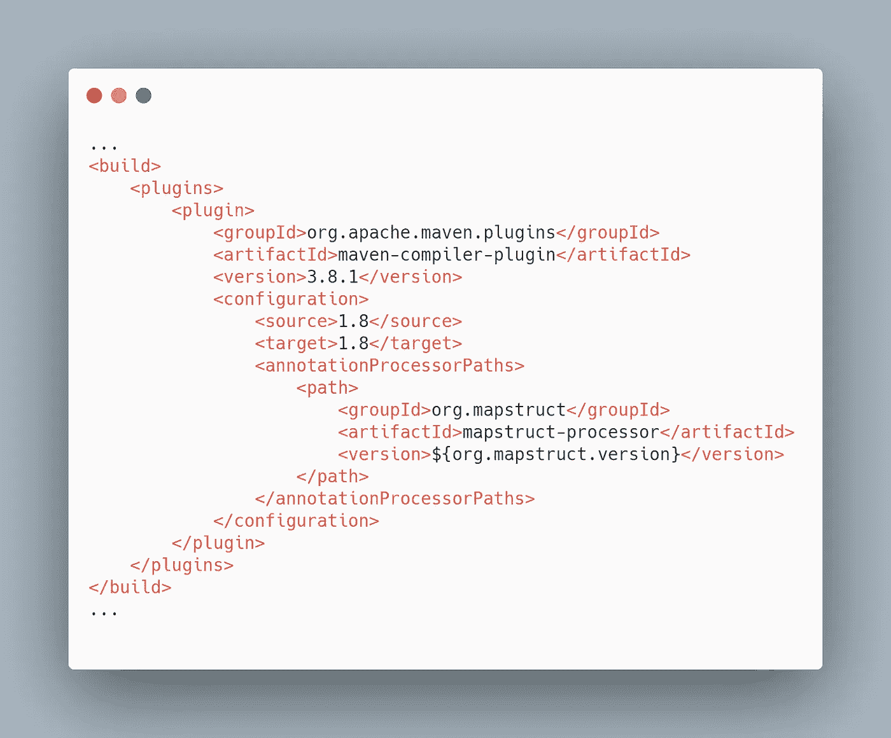

> **提示** —如果也使用 *Lombok* ，在 Mapstruct 之前声明 Lombok 的路径定义，让 Lombok 在 Mapstruct 之前生成实现，这样 Mapstruct 就可以使用 Lombok 生成的方法。

2.*如果您使用****Gradle****，请将以下依赖项添加到您的****build . Gradle***

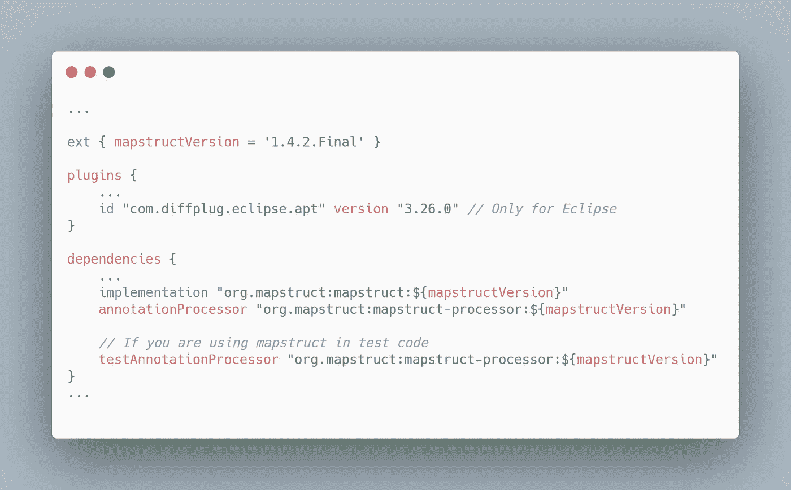

3.如果使用 *IDE* ，不要忘记执行以下动作-

a) *启用注释处理器*(首选项/设置- >构建执行部署- >编译器- >注释处理器)

b)将 MapStruct 插件安装到您的 IDE 中-

*   要在 Eclipse 中安装 MapStruct 插件， [**点击我**](https://marketplace.eclipse.org/content/mapstruct-eclipse-plugin)
*   要在 IntelliJ 中安装 MapStruct 插件， [**点击我**](https://plugins.jetbrains.com/plugin/10036-mapstruct-support)

# 履行

为了让这种神奇的事情发生，我们只需要创建一个接口，用 ***@Mapper*** 注释 *MapStruct* 并声明一些方法。

让我们举个例子:

假设我们有两个 POJO 类——*Customer.java*和*客户到*。java，我们希望在它们之间执行字段映射。

***Customer.java***

*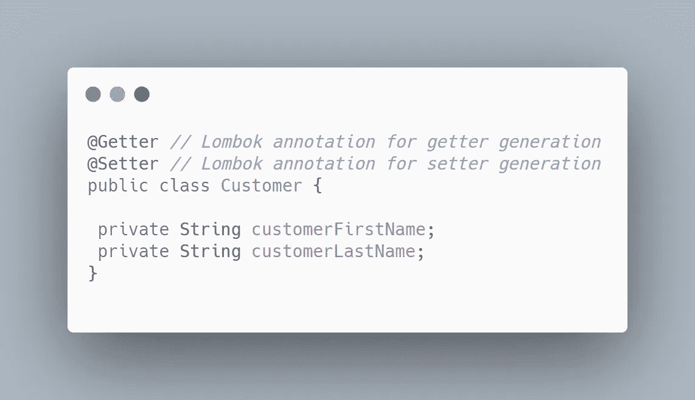*

*【CustomerDto.java】T5**T6***

*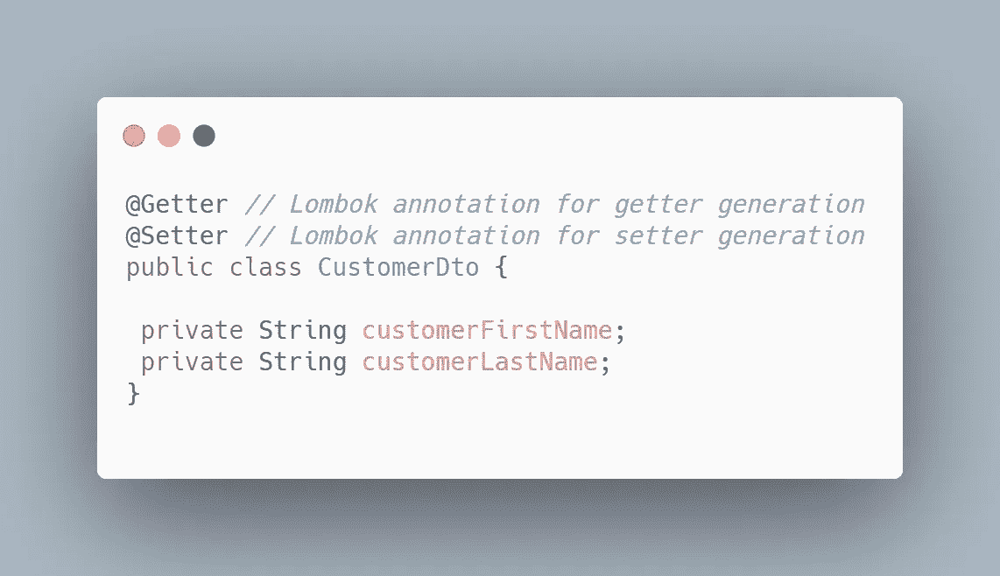*

*要在上述两个 POJOs 之间建立映射逻辑，我们只需编写如下接口*

****CustomerMapper.java****

*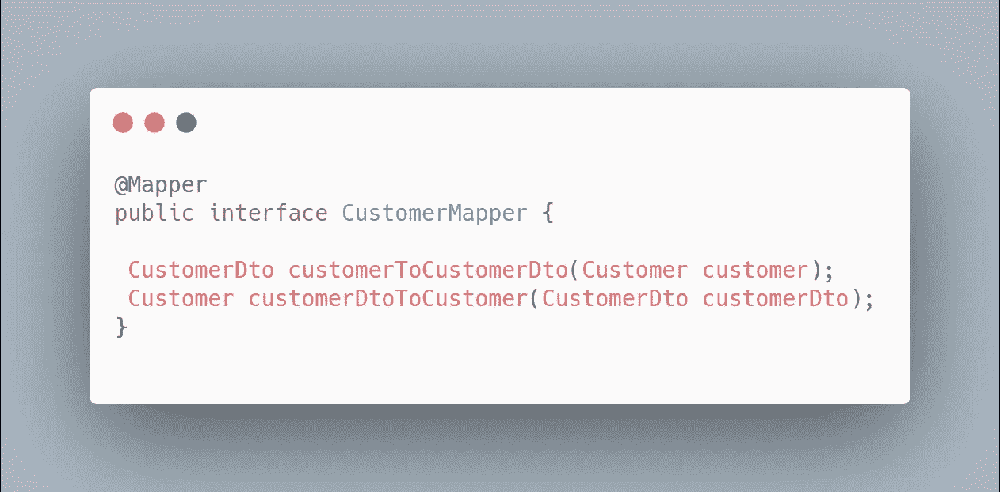*

> ****@ Mapper****—该注释将告诉 MapStruct 生成接口的实现类。**

***MapStruct* 将通过查看声明方法的返回类型和参数类型来推断用户的意图，并将为其实现逻辑。**

**编译完上面的代码后，你会得到下面由 *MapStruct* 自动生成的类**

*****CustomerMapperImpl.java*****

**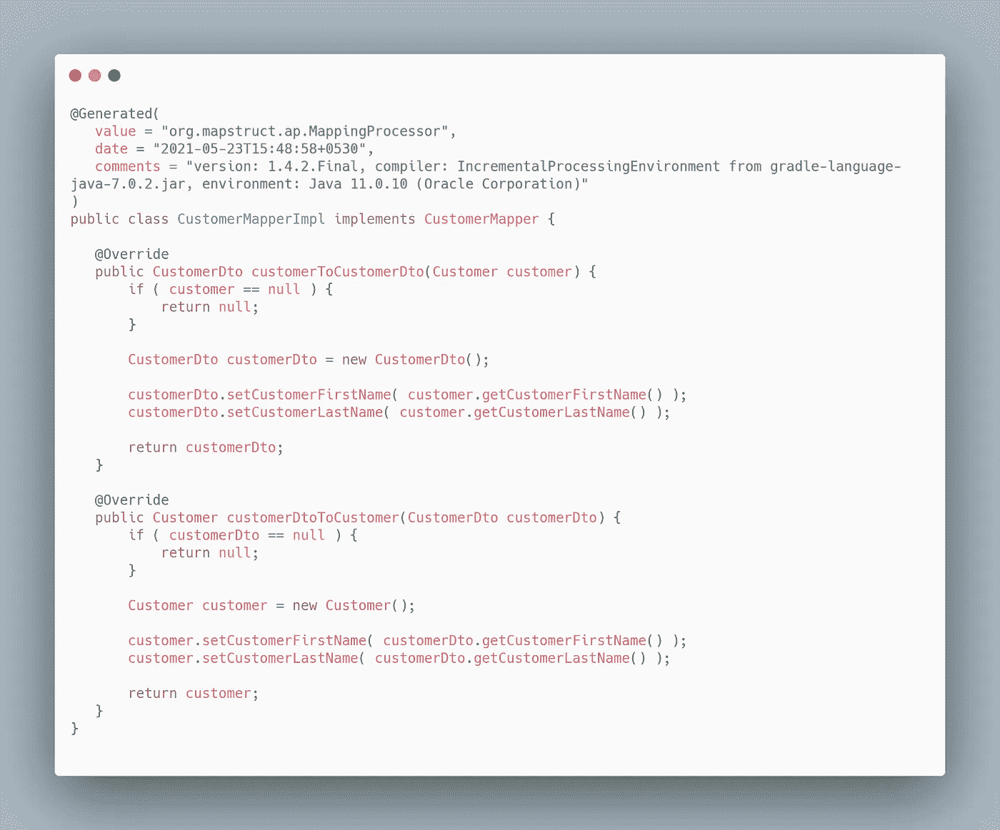**

**在这里，我们可以看到 MapStruct 通过遵循所有 Java 最佳实践为我们的 Mapper 接口生成了实现类。这只是 POJO 中两个字段的情况，但是考虑一下现实生活中的场景，我们可以有大量的字段和 POJO，在这种情况下，Mapstruct 可以非常方便地为我们生成映射。**

**这太酷了，对吧！😎**

**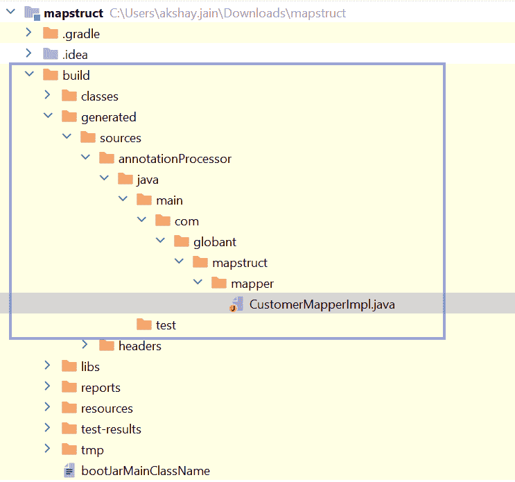**

**我们可以在以下位置找到生成的类:**

*   **如果使用 maven - *目标>生成-源>注释***
*   **如果使用 gradle - *构建>生成> annotationProcessor***

> ***上面的场景只是字段名相同的基本场景，但是我知道生活并不容易，所以现在让我们一个接一个地尝试一些真实的场景:***

## ****映射具有不同字段名的字段:****

**新的 POJOs 将会是-**

**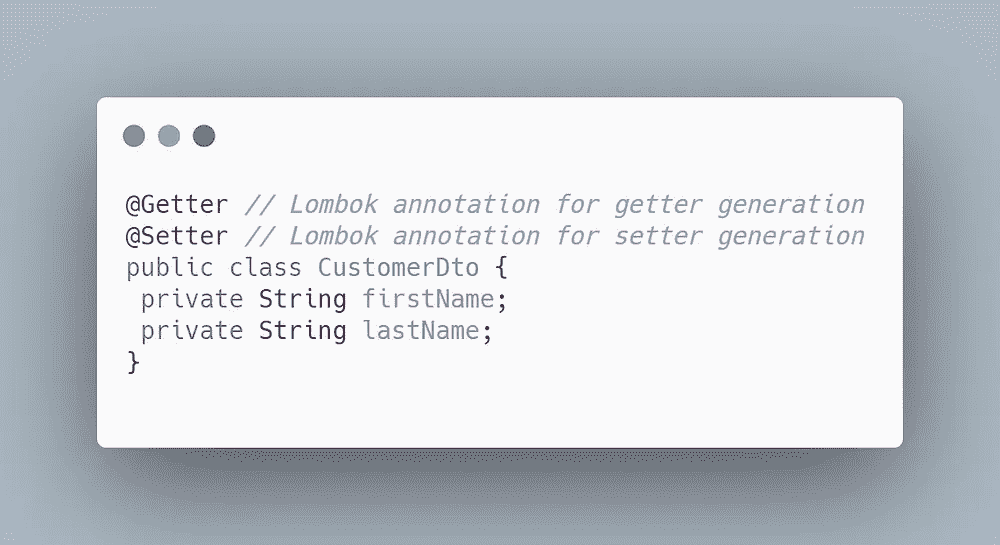****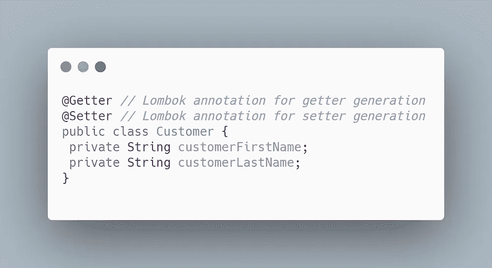**

**要用不同的名称映射这些字段，我们所要做的就是告诉 *MapStruct* 哪个字段映射到哪个字段。通过一个非常简单的注释 ***@Mapping*** ，新的 Mapper 界面将如下所示-**

**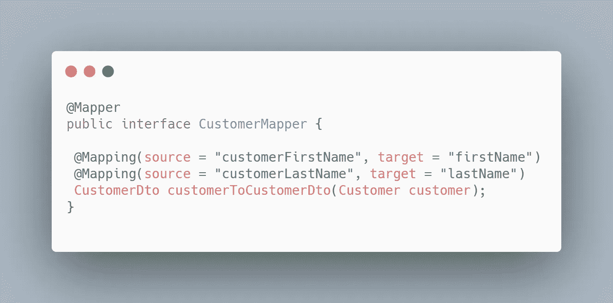**

> ****加分-****
> 
> **当有人更改了其中一个 POJOs 中的字段名称，但忘记在 Mapper 接口中更新该名称时，会发生什么情况？？？**
> 
> **会给出编译时错误吗？？？**
> 
> **答案是否定的，但是它会在运行时显示一些不希望的行为，因为不会为该字段执行映射。**

**为了在编译时发现这个错误，我们可以如下配置我们的映射器**

**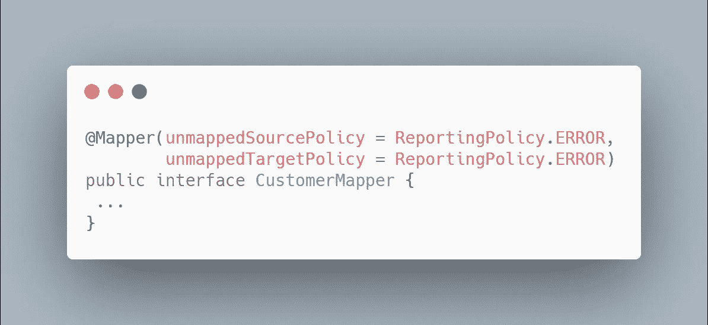**

****注意**:仅当您确定想要映射 POJO 中的所有字段时，才使用此配置，否则您可以将 *ReportingPolicy* 保留为 *IGNORE* 或 *WARN* 以避免编译错误。**

## **用嵌套 bean 映射**bean:****

**假设我们分别有*Order.java*和*OrderDto.java*在*Customer.java*和*CustomerDto.java*之内，如下-**

**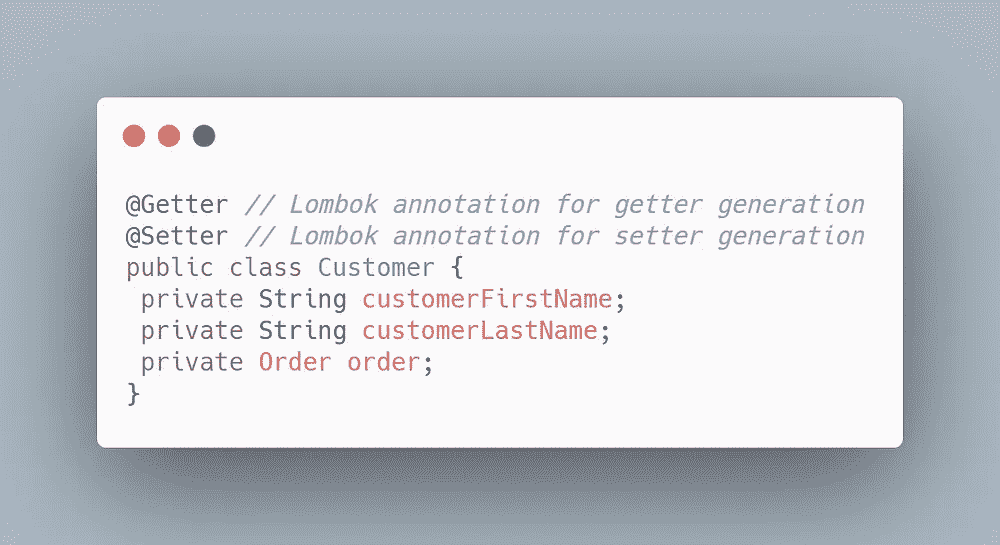****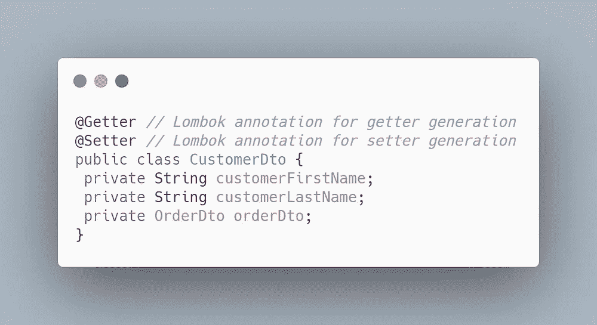**

**为了获得嵌套 beans 的映射，我们所要做的就是为*Order.java*到*OrderDto.java*添加方法，反之亦然，如果 *MapStruct* 检测到需要转换的对象类型和要转换的方法存在于同一个类中，它将自动使用它。**

**我们新的映射界面看起来像-**

**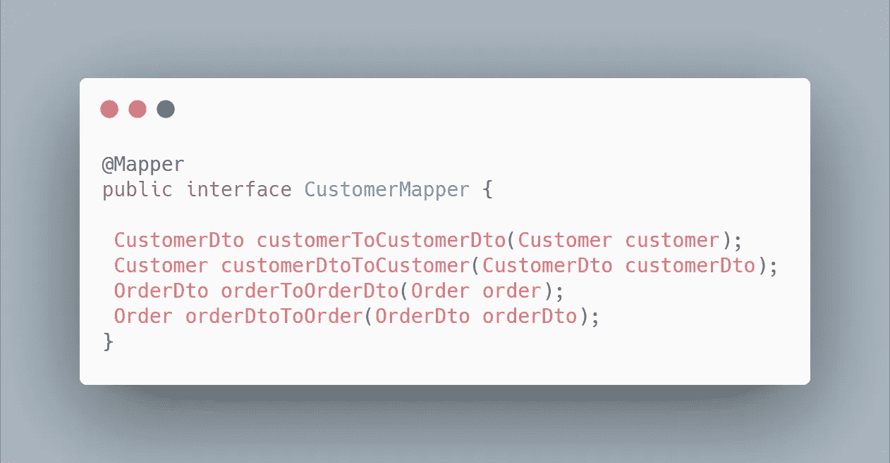**

## **映射嵌套 Bean 内的**字段:****

**让我们考虑一下，我们想要将来自*Order.java*的 *id* 映射到*CustomerDto.java*中的*Customer.java*到*订单 Id* 的嵌套 bean。**

**映射器将如下图所示-**

**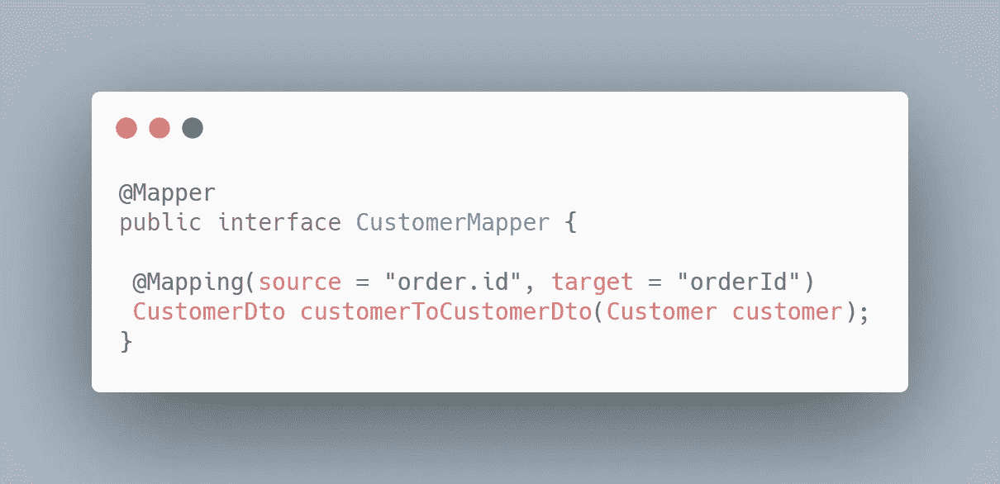**

> ***类似地，我们可以将选定的字段从一个嵌套 bean 映射到另一个嵌套 bean -***

**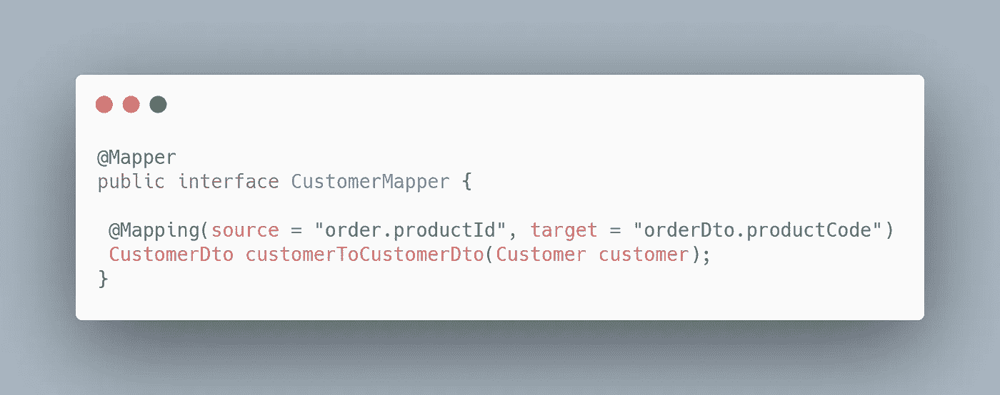**

## **用几个源参数绘制**方法:****

**MapStruct 还支持带有几个源参数的映射方法。这对于将几个实体组合成一个数据传输对象非常有用。**

**下面显示了一个例子，其中我们有两个输入 POJO*Customer.java*和*Order.java*被映射到单个 POJO*CustomerDetailDto.java*:**

**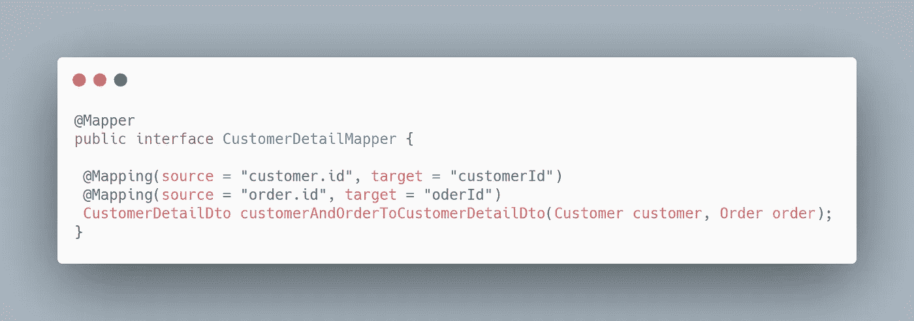**

# **结论**

**这是对 *Mapstruct* 的基本介绍，你可以随时将 *MapStruct* 与 *Lombok* 结合使用，以加速你的开发，并使你的代码免于错误和维护。**

**如果你知道其他映射框架，如*推土机*、 *Orika* 、*模型映射器*和 *JMapper* ，你一定在想为什么我要选择 *MapStruct* ？它有什么特别之处？**

**所以让我告诉你，你的思考方向是正确的，答案是-**

> ***MapStruct 用最少的配置给了我们最好的性能。***

**要进一步分析所有映射框架的性能，请阅读来自 *Baeldung* 的信息丰富的 [***文章***](https://www.baeldung.com/java-performance-mapping-frameworks) 。**

**有关 Mapstruct 的高级概念，如 Spring 集成、类型转换、集合映射等，请浏览本系列的下一篇博客， [c ***舔我，我会带你到那里！*T58**](/@akshay.jain_76848/mapstruct-advanced-concepts-and-dependency-injection-46f28af54e33)**

## **编码快乐！**