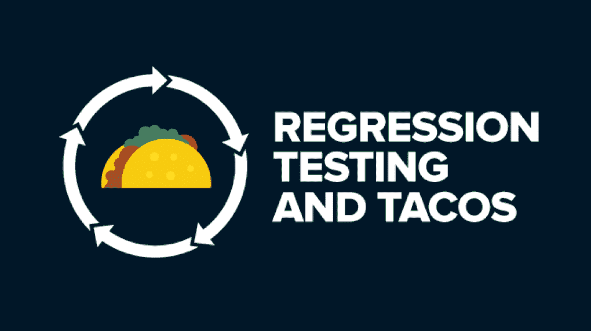
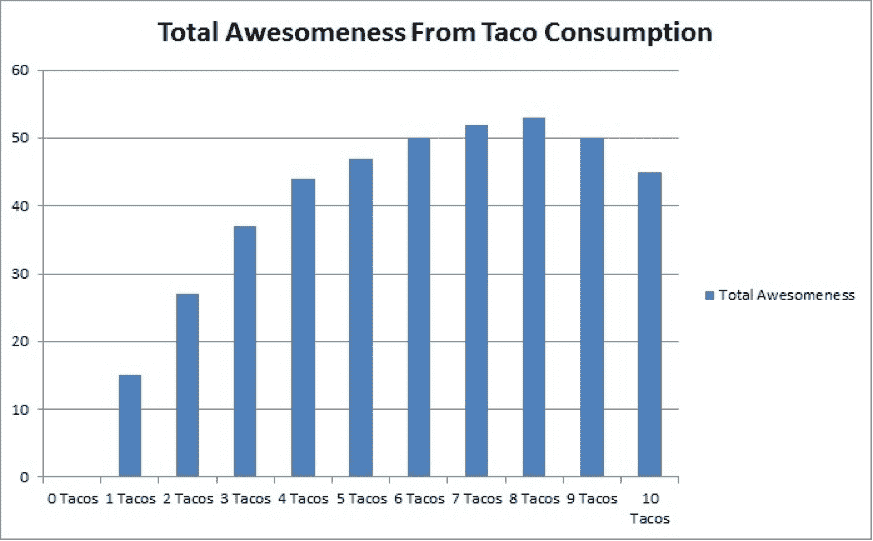

# 边际效用与玉米卷消费

> 原文：<https://medium.com/capital-one-tech/marginal-utility-and-taco-consumption-762ca42afbf0?source=collection_archive---------3----------------------->

## 回归测试套件大小的一个有趣类比

**“可变投入的边际效用”**这听起来像是所有激动人心的会议分组会议之母，不是吗？

嗯，可能吧，但这也是一个重要的经济概念。人们可能会练习它，即使他们不知道它叫什么。在本帖中，我们将看看这个概念，因为它与最佳回归测试套件大小有关。为此，我们需要定义一些工作术语。

**其中的第一个我们称之为‘效用’**

经济学家称之为*，即消费者从一件好的商品中获得的有用性。它并不总是用金钱来衡量。效用可以用你从防抱死刹车系统中感受到的安全感或者你有多喜欢你最喜欢的电视节目来衡量。这对标题陈述的“边缘”部分很重要。*

**第二个概念是‘边际’**

这是指*您正在测量的任何东西的最后一个单位*。所以，如果你把“边际”和“效用”结合起来，我们就在谈论你会有多喜欢你正在考虑购买/使用/做/看电视等的下一件事。

能够衡量边际效用是决定何时停止做某事的关键。

## 两份玉米卷还是不要两份玉米卷

让我们以深夜，大学软玉米卷的渴望为例。回想一下你 21 岁的时候——你在下午 6:30 吃了最后一份 D-hall 食物，现在是凌晨 1:30，你渴望一些肉、奶酪和软玉米饼。它进入了你的蜥蜴脑，你出不来了！所以你去了当地的深夜墨西哥餐馆，打算毁掉你之前吃软玉米卷的最好记录。只是这一次，你不用秘密的哈瓦那酱(你必须知道的绿色物质，有点像服务器上的 speakeasy 保护)。这么说吧，你得到了教训。

你吃了你的第一个玉米卷，不，吸入它，然后想，*“这只是地球上涅槃的一小部分吗？”好吧，让我们来测量一下。比方说，在吃第一个玉米卷时，你的总体感觉棒极了(在这种情况下，是“效用”的替代词)从零到十五个单位。那么，你的边际效用是多少？*

*十五。*

这也是你的总效用。也就是说，直到你吃了第二个玉米卷；也许比第一次慢了一根头发，停下来咀嚼和品尝那令人惊叹的味道。

既然你已经吃了第二份玉米卷，是时候重新考虑你的总体效用了。你肯定比你吃玉米卷之前过得更好，但是你是不是过得更好了一倍？经济法则基本上说你不是。假设你现在已经 27 岁了。那么，你的边际效用是多少？

*十二。*

这意味着，对于这个玉米卷的边际单位，你有三个单位的*递减*边际收益。这仍然是一个积极的回报，但没有第一个玉米卷那么多。

这个概念现在应该开始成形了。所以让我们再吃一个玉米卷，然后看图表。

## 第三个玉米卷很有魅力

三号玉米卷。它仍然是美味的，仍然是好的，仍然让你怀疑这是不是神偏爱你灵魂的证明。但是现在你开始注意到它不如前两个好。也许那些更暖和更新鲜。也许这不是世界上最优质的生菜。也就是说，你的魅力已经达到 37 岁了。这是 10 的边际收益。比你的第二个玉米卷少两个，比你的第一个少五个。

让这些数字回归常态，*“你正在享受你的玉米卷，但是每多吃一个都比上一个少一点，即使你的总体享受水平在上升。”*

正如承诺的，一张图表:

## 这如何应用于回归测试？

随着你深夜墨西哥玉米卷狂欢的继续，你会注意到一些事情。吃第五个、第六个和第七个玉米卷没有第一个到第四个的边际回报高。事实上，在吃了八个玉米饼后，你开始出现负的边际收益*。这有道理；吃了九个玉米卷后，任何人都会开始觉得有点恶心，并质疑自己在这个世界上的地位。*

所有这些都回避了这个问题:*“这如何解释回归测试套件的规模，尤其是当应用于即将到来的 CI/CD 过程时？”*嗯，我们有一个有限的资源(时间),我们需要在其中进行所有的回归测试，因此我们需要确保从我们的可变输入(测试套件)中获得总回报和边际回报的最佳平衡。

一个网站的高价值流量有哪些？每次都需要工作的流程？可能是*登录、忘记密码、更改用户名、*等流程。这是我们的第一个玉米卷，我们每次都要先测试一下。因此，这些肯定会首先出现在测试套件中。我们要在上面放哈瓦那酱吗？(我们是否从所有类型的用户的所有入口点进行所有可能的登录)可能不是为了这个玉米卷，但肯定是为了以后的玉米卷。

我们的第二个 taco 应该是确保客户数据安全的安全服务。这些也很容易测试，因为它们通常是 API 或直接测试。在这一点上，我们可能不会考虑太多的非面向客户的测试。

我们的第三个玉米卷是什么？我们最近三次发布的新内容。一旦那变成旧帽子，也许我们可以把它们从我们的回归套件中剔除，但目前它们留在里面。我们的第四个玉米卷？也许是最近四五个周期失败的一些测试。我们的第九或第十或第十一个玉米卷？这就是我们遇到极端情况的地方。

## 回归测试正在进行

不是每个人都与抽象的类比联系在一起。然后，使用美元作为计量单位变得很重要。

当测量成本时，一些项目，如测试人员的小时成本，是显而易见的。其他项目，如客户商誉和品牌信任，则不太容易衡量。对于下面的用例，我们将以 taco 客户为例来看简单的显式测试成本。*请注意，所用数字均为虚构，仅供本站使用。*

想象一下送玉米卷的史蒂夫。史蒂夫让人们通过他的网站订购玉米卷，并把它们送到他们家门口。客户有自己的用户名和密码，他们的账户存储信用卡信息和最喜欢的订单。当客户无法登录访问他们的订单时，他们必须直接打电话给史蒂夫下订单。打电话给史蒂夫需要花费他创建三份订单的时间，而使用该网站意味着史蒂夫可以满负荷完成订单。

对于客户不能登录的每个小时，我们的 taco 企业家实际上每小时损失 50 美元。如果他的正常订单总额为每小时 250 美元，当客户无法登录时，他将损失 20%的业务。此外，如果网站持续出现问题，客户可能会感到恼火或紧张。因此，持续失败的登录尝试意味着史蒂夫也在失去品牌价值。

史蒂夫需要确保他的第一个也是最常见的测试场景涉及他的客户能够登录。这是他的第一个玉米卷。

让我们看看其他场景，看看史蒂夫在哪里测试他的网站最合适。

**场景一，史蒂夫的客户忘记了密码。**这在正常情况下不是问题，因为客户可以自助恢复密码。然而，当自助服务软件无法正常工作时，史蒂夫不得不接听电话。这些电话花费了他约 10%的业务，但仅在软件出现故障时。

如果我们将我们的测试示例用作玉米卷，这个密码恢复场景可能会出现在第二个或第三个玉米卷周围。

**场景二，顾客住的地方太远，无法送货。**玉米卷送货员史蒂夫扩大了业务范围，覆盖了整个城市。然而，有时他会收到送货区外的订单。通常，系统会在订单完成和账户收费前检测到这一点，但如果用户有一个特别旧的浏览器，它就不会。结果是订单被发出，司机意识到送货太远，订单无法兑现。这种情况一个月发生四五次；每一次，这意味着食品成本的损失和潜在的一些顾客的好感。

当 Steve 向他的网站承包商询问如何检测这些潜在的损失时，他被告知，相对于造成的损失，测试这些场景的成本相当高，但每次主要浏览器发布时都可以这样做。这必然会将这些测试用例排在远端——我们的第五或第六个 taco——因为它们运行起来很昂贵，而且边际回报很低。

## 超越墨西哥卷饼

我们的两个场景代表了光谱的两个简化端，但从财务角度来看，应该清楚的是，我们虚构的 Taco 递送员的任何回归套件都应该有比地理/浏览器检测案例更多的客户登录用例。这是平衡总回报和边际回报并从我们的玉米卷中获得最大收益的最佳方式。

那么，我们能从吃玉米卷中学到什么呢？使您的回归测试套件灵活，并在设计时考虑边际价值。保持以风险为基础。保持敏捷。你的团队将节省时间、金钱和挫折。

此外，没有人喜欢吃太多玉米饼而生病。

*最初发表于*[*【developer.capitalone.com】*](https://developer.capitalone.com/blog-post/marginal-utility-and-taco-consumption-a-tasty-analogy-for-regression-testing-suite-size/)*。*

*欲了解更多关于 Capital One 的 API、开源、社区活动和开发人员文化的信息，请访问我们的一站式开发人员门户网站 DevExchange。*[*https://developer.capitalone.com/*](https://developer.capitalone.com/)