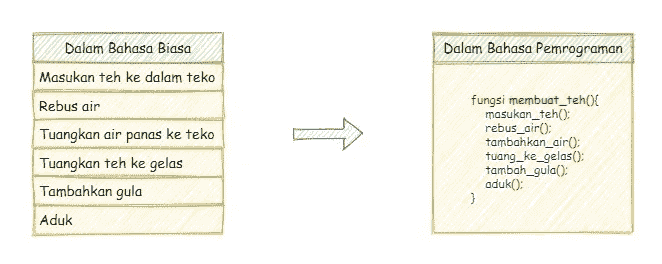
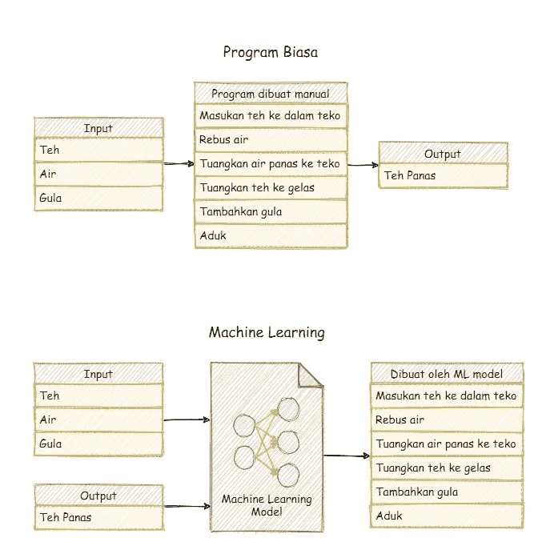
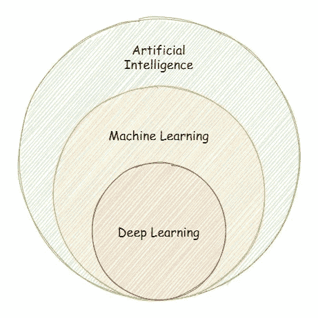
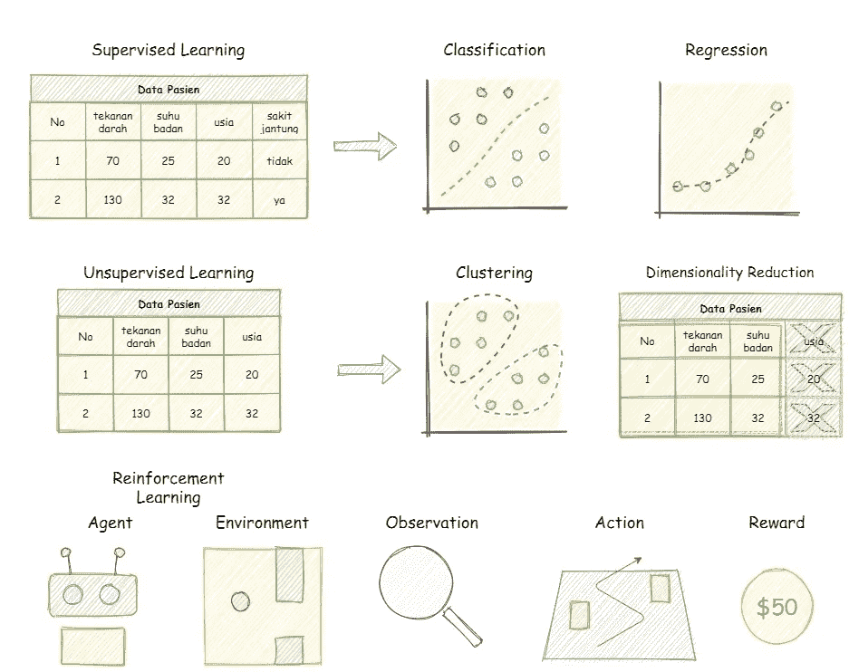
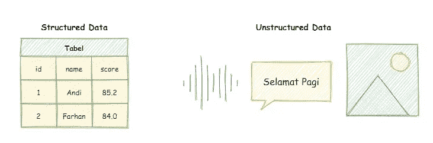
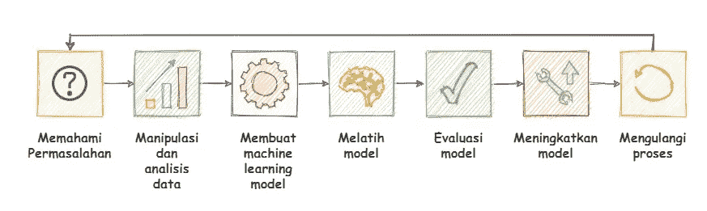
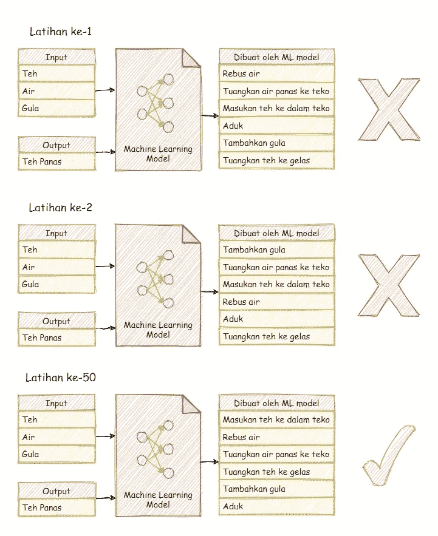

# Belajar Fundamental Machine Learning Untuk Pemula

> 原文：<https://medium.easyread.co/mari-berkenalan-dengan-machine-learning-b4778ff2914a?source=collection_archive---------3----------------------->

## Pengenalan machine learning dengan materi komprehensif beserta contoh permasalahan

Photo by [AltumCode](https://unsplash.com/@altumcode?utm_source=medium&utm_medium=referral) on [Unsplash](https://unsplash.com?utm_source=medium&utm_medium=referral)

Mungkin Anda sudah sering mendengar istilah tentang AI atau Artificial Intelligence (Kecerdasan Buatan) di media. Beberapa contohnya adalah Tesla Autopilot yang dapat mengenadari mobil secara otomatis, robot Sophia yaitu robot humanoid yang dapat diajak bicara dan berinteraksi layaknya manusia, AlphaGO yaitu AI yang hampir tidak terkalahkan dalam permainan GO, atau OpenAI yang mengalahkan Dendi dalam 1 vs 1 permainan Dota 2.

Benar, teknologi tersebut menggunakan sistem kecerdasan buatan dimana komputer telah dilatih terus menerus dengan komputer super canggih yang sangat cepat selama waktu berbulan bulan hingga dapat memiliki kemampuan sedemikian rupa.

Jika Anda adalah seorang programmer atau bahkan bukan programmer sama sekali, tidak perlu khawatir karena pada artikel ini tidak akan langsung diberikan kode pemrograman sama sekali. Setelah membaca artikel ini Anda diharapkan dapat mengerti apa itu AI dan konsep mengenai bagaimana kita dapat membuat AI. Saya berharap dapat menumbuhkan rasa penasaran Anda sehingga merasa tertarik dan tidak sabar untuk belajar tentang Machine Learning.

## Sedikit Mengulas Mengenai Pemrograman

Jika Anda belum pernah mempelajari pemrograman, secara sederhana program dibuat dengan cara memberikan urutan perintah atau instruksi kepada komputer.

Contoh: Anda ingin membuat program untuk melakukan otomatisasi dalam seleksi atlet lari dengan program berdasarkan data atlet. Anda harus menentukan berdasarkan data tinggi badan dan berat badan. Jika tinggi badan kurang dari 150 cm atau berat badan lebih dari 60 kg, atlet tersebut dinyatakan tidak lolos seleksi tahap pertama.

Namun, komputer tidak dapat mengerti instruksi yang kita berikan menggunakan Bahasa Indonesia seperti contoh di atas. Komputer memiliki kaidah atau aturan tersendiri, sehingga instruksi yang kita tulis berbentuk kode. Aturan aturan dalam menuliskan program disebut dengan *Syntax.* Untuk lebih jelasnya, silakan analisa contoh di bawah ini.

Menerjemahkan bahasa biasa menjadi bahasa pemrograman

## Apa itu Machine Learning ?

> Machine Learning adalah sebuah metode untuk melatih sebuah program komputer

Dengan machine learning, program dapat dilatih untuk memecahkan masalah spesifik tanpa harus menulis sistem logika satu per satu. Contohnya pada kasus program seleksi atlet diatas, dengan memanfaatkan machine learning kita tidak perlu menuliskan instruksi secara mendetail jika tinggi badan kurang dari sekian atau berat badan kurang dari sekian.

## Kenapa Menggunakan Machine Learning ?

Untuk contoh kasus diatas, memang parameter yang dipakai hanya dua, yaitu tinggi badan dan berat badan. Sehingga untuk kasus permasalahan tersebut kita tidak memerlukan machine learning dan cukup menulis program biasa, kasus tersebut hanya Saya gunakan untuk contoh saja agar dapat mudah dimengerti. Jika terdapat puluhan atau ratusan parameter mestinya kita akan repot jika harus menuliskan instruksi secara manual sehingga machine learning adalah solusinya.

## Perbedaan Machine Learning Dengan Program Biasa

Program biasa dibuat dengan cara menuliskan urutan perintah secara manual untuk menghasilkan output yang diinginkan dari sebuah input tertentu. Namun, dengan *Machine Learning* , kita memberikan data berupa input dan output kepada program, dan program akan membuat sendiri urutan perintahnya.

Perbedaan Machine Learning dengan program biasa

> **Perlu diingat !** Kecerdasan Buatan belajar sesuai dengan data yang diberikan. Jika kita memberikan data yang buruk maka hasilnya akan buruk. Semakin banyak data maka bahan belajar semakin banyak, sehingga hasilnya dapat semakin baik. Semakin banyak data maka semakin lama waktu yang diperlukan untuk belajar.

Dalam machine learning, semua serba tergantung dengan data yang kita miliki. Data ini kita gunakan untuk melatih machine learning, namun pada kenyataannya, justru machine learning yang harus menyesuaikan dengan data yang kita miliki. Data tersebut bisa bermacam macam, ada yang berupa tabel, gambar, suara, video, dll (Akan dibahas lebih lanjut dibawah).

## Machine Learning Hanya Menyelesaikan Masalah Spesifik

Maksudnya, satu program hanya dibuat untuk memecahkan satu permasalahan. Contohnya AI self driving car hanya dapat menyetir mobil saja, AI untuk memprediksi cuaca hanya dapat memprediksi cuaca saja. Untuk saat ini (2021) belum ada AI yang dapat melakukan banyak hal sekaligus, semuanya spesifik untuk satu permasalahan. Sehingga jika ingin menyelesaikan banyak permasalahan diperlukan banyak program.

## Artificial Inteligence, Machine Learning dan Deep Learning

Tiga istilah tersebut akan sering Anda temukan saat belajar nanti. *Machine Learning* merupakan bagian dari *Artificial Intelligence* . Di dalam *Machine Learning* , terdapat *Deep Learning* . Namun tenang saja, dalam artikel ini tidak akan langsung dibahas semuanya.

Artificial Intelligence, Machine Learning dan Deep Learning

## Contoh Produk Yang Menggunakan AI

1.  Robot Sophia, yaitu sebuah robot humanoid (dibuat menyerupai manusia) yang dikembangkan oleh Hanson Robotics. Sophia dirancang untuk memberikan jawaban dengan dialog secara langsung seperti bicara dengan manusia. Sophia juga dapat menampilkan emosi pada wajahnya.
2.  Tesla Autopilot, yaitu AI yang dapat mengendarai mobil. Meskipun tidak 100% dikendalikan oleh AI karena masih dalam tahap pengembangan, saat ini Autopilot baru menjadi asisten pengendara saja.
3.  AlphaGo, yaitu AI yang dikembangkan oleh DeepMind Technologies yang dapat bermain permainan Go dan menjadi player yang hampir tidak bisa dikalahkan.
4.  OpenAI Five, yaitu AI yang dapat bermain permainan Dota 2\. Pada tahun 2017 OpenAI berhasil mengalahkan pemain Dota 2 profesional yaitu Dendi dalam duel 1 vs 1.

## Jenis Jenis Machine Learning

1.  ***Supervised Learning*** (Data dengan label) dibagi menjadi dua, yaitu ***Classification*** , contohnya sama dengan kasus seleksi atlet olahraga apakah atlet lolos atau gugur. ***Regression*** , contohnya prediksi cuaca berdasarkan data arah angin, kelembaban, dll.
2.  ***Unsupervised Learning*** (Data tanpa label) dibagi menjadi dua, yaitu ***Clustering*** , contohnya melakukan segmentasi pelanggan supermarket untuk membantu tim bisnis menentukan target pelaksanaan promosi. ***Dimensionality Reduction*** *,* yaitu proses untuk menghapus data yang sebetulnya tidak diperlukan agar penyimpanan lebih kecil dan jika data tersebut akan dipakai untuk melatih AI, waktu yang diperlukan bisa lebih singkat.
3.  ***Reinforcement Learning*** (Agent and Environment), contohnay AI yang bermain game atau mengendarai mobil.

Jenis jenis machine learning

## Jenis Jenis Data Dalam Machine Learning

Dua jenis data dalam machine learning

1.  ***Data terstruktur*** *(Structured data)* , yaitu data dalam bentuk tabel. Contohnya yaitu tanggal, nomor telepon, alamat rumah, nama, dll.
2.  ***Data tidak terstruktur*** *(Unstructured data)* . Contohnya yaitu file gambar, suara, video, teks pesan, email, dan komentar. Data tersebut tidak dapat disimpan di dalam tabel

# Langkah — Langkah Dalam Proyek Machine Learning

Langkah langkah membuat machine learning project

1.  Memahami permasalahan yang ingin anda selesaikan. Apakah anda memerlukan Machine Learning ? Bagaimana data yang anda miliki ?
2.  Menganalisis dan memproses data. Data mana yang dapat digunakan ? Data mana yang seharusnya dibuang? Pada tahap ini dilakukan analisis dan pengolahan data.
3.  Membuat model machine learning. Jenis machine learning mana yang cocok untuk data yang Anda miliki ?
4.  Melatih program ( *Machine Learning Model* ). Model dilatih dengan memberikan data yang sudah diproses sebelumnya.
5.  Melakukan evaluasi terhadap model. Apa yang salah dengan Model? Kenapa akurasinya rendah?
6.  Meningkatkan model. Berdasarkan evaluasi, bagian model mana yang harus diubah? Pada tahap ini *Machine Learning* Model diperbarui.
7.  Mengulangi semua proses dan menambah data baru

## Memahami Permasalahan

Pahami terlebih dahulu permasalahan apa yang akan Anda selesaikan. Jika Anda memiliki label dalam data tersebut, artinya permasalahan tersebut *Supervised Learning* . Jika, Anda ingin melakukan klasifikasi, maka itu adalah permasalahan *Classification* . Jika Anda ingin melakukan prediksi, maka permasalahan *Regression* .

Jika data yang anda miliki tidak memiliki label, maka permasalahan tesebut *Unsupervised Learning* . Jika anda ingin mengelompokan data, maka permasalahan *Clustering* . Atau jika anda ingin meringkas data, maka permasalahan *Dimensionality Reduction* .

Setelah berhasil menemukan permasalahan *Machine Learning* , maka dilanjutkan dengan wujud data anda. Apakah *Structured Data* atau *Unstructured Data* .

## Menganalisis dan Memproses Data

Setelah memahami permasalahan *Machine Learning* , maka proses dilanjutkan dengan melakukan analisis data. Data mana yang seharusnya dipakai dan dibuang. Temukan korelasi antar data yang Anda miliki. Untuk membantu melakukan analisa, dapat dilakukan dengan visualisasi data.

Pada tahap ini kita juga memproses data, juga disebut dengan istilah *Data Preprocessing* . Komputer tidak dapat memahami teks, gambar atau suara. Maka data yang kita miliki harus diubah menjadi angka supaya dapat dibaca oleh komputer.

Setelah itu dilanjutkan dengan melakukan pemisahan data. Data yang kita miliki akan dipisah menjadi dua bagian, yaitu data latihan dan data tes. Jika Anda memiliki data dengan jumlah yang besar, Anda dapat memisah data menjadi tiga bagian, yaitu data latihan, validasi dan tes.

## Membuat Machine Learning Model

Jika data Anda sudah siap, maka proses dilanjutkan dengan membuat *Machine Learning Model* . *Machine Learning Model* dibuat dengan menerapkan rumus matematika.

Namun, dalam membuat *Machine Learning* khususnya dengan Bahasa Pemrograman Python, rumus sudah tersedia dan kita tinggal memilih rumus mana yang akan kita pakai untuk setiap permasalahan yang kita miliki.

Tentu saja kita harus memahami cara kerja rumus rumus tersebut agar kita dapat memilih rumus yang tepat untuk setiap permasalahan yang berbeda.

Saya berikan beberapa contoh rumus *Machine Learning* . Contoh, *Support Vector Machine (SVM), Random Forest, Logistic Regression, XGBoost* dan masih banyak lagi. Untuk sekarang anda tidak perlu khawatir, karena anda tidak perlu menghafalkan semua itu saat ini juga.

## Melatih Model

Setelah Model berhasil dibuat dengan rumus matematika yang telah kita pilih, maka langkah selanjutnya adalah melatih model. Model dilatih selama berkali kali, hingga mendapatkan akurasi maksimal.

Saat pertama kali latihan, pasti Model melakukan banyak kesalahan sehingga akurasi model sangat rendah, namun akan terjadi perhitungan setiap kali latihan, sehingga jika kita memilih rumus matematika yang tepat, akurasi dapat meningkat. Program akan terus mencari pola dalam data diri agar akurasi saat latihan mengalami kenaikan.

Proses Pelatihan Machine Learning

Saat proses pelatihan model. Sering terjadi model terlalu banyak mengingat pola data latihan, akibatnya model memiliki akurasi sangat tinggi saat latihan, namun akurasi rendah pada saat dilakukan tes. Isilah ini disebut dengan *overfit* , sedangkan istilah untuk model dengan akurasi rendah pada semua data disebut dengan *underfit* , artinya model tidak mempelajari apapun.

***Overfiting*** dapat terjadi karena jumlah data latihan terlalu sedikit atau karena model terlalu banyak melihat data latihan. Sedangkan, ***Underfiting*** bisa terjadi karena rumus matematika yang kita pilih terlalu simpel atau tidak sesuai untuk masalah yang kita miliki.

Setelah proses latihan selesai, sekarang saatnya melakukan uji coba model terhadap data tes yang belum pernah dilihat oleh model, untuk membuktikan apakah model tersebut layak diterjunkan dalam pekerjaan di dunia nyata.

## Evaluasi Model

Dilakukanlah evaluasi atau analisa terhadap hasil serta proses latihan model. Hasil latihan model dapat diperiksa dalam matrix yang disebut dengan *Error Metric* . Berdasarkan *Error Metric* tersebut, kita dapat menganalisa model dan menemukan letak kesalahan model.

## Meningkatkan Model

Setelah kita mengetahui letak kesalahan model, saatnya kita evaluasi kesalahan tersebut. Maka kita harus perbarui model untuk meningkatkan akurasi. Untuk meningkatkan model, dapat dilakukan dengan berbagai cara, seperti menambah data latihan atau dengan cara tuning model. Cara ini disebut dengan istilah *Tuning Hyperparameters* .

## Ulangi Proses

Setelah kita berhasil memperbarui model, kita dapat mengulangi semua proses dari awal untuk meningkatkan model terus menerus. Yaitu dengan cara menambah data, memproses kembali data yang dimiliki, melatih model dengan Tuning Hyperparameter, atau mungkin dengan mencoba rumus matematika yang berbeda, serta melakukan evaluasi kembali terhadap model yang kita miliki.

## Step By Step Mempelajari Machine Learning

1.  Pelajari bahasa pemrograman, contohnya Python (rekomendasi) atau bahasa R. Menguasai *Syntax* dasar, struktur data, algoritma, dan menguasai penggunaan berbagai library yang umum digunakan dalam bahasa tersebut
2.  Pelajari teknik manipulasi data dengan library pandas dan numpy
3.  Pelajari teknik visualisasi dan analisis data dengan matplotlib dan seaborn
4.  Pelajari mengoperasikan Jupyter Notebook (disarankan). Jupyter Notebook akan sangat membantu. Dengan Jupyter Notebook Anda dapat memisahkan kode menjadi blok blok. Anda dapat menjalankan kode blok satu per satu dan langsung melihat outputnya. Anda dapat menggunakan Google Colab sebagai alternatif, jika komputer anda low end.
5.  Pelajari *library* **sklearn** atau **sci-kit learn** . Karena pada *library* sklearn tersedia banyak sekali peralatan siap pakai untuk membuat program *Machine Learning* .
6.  Pelajari **Tensorflow** atau **Pytorch** untuk mempelajari *Deep Learning* ( *Advanced* ). Setelah anda berhasil memahami *Machine Learning* dan berhasil membuat beberapa proyek, maka anda harus terus meningkatkan kemampuan anda dengan mempelajari *Deep Learning* , dimana anda akan mempelajari tentang *Neural Network* (Jaringan Syaraf Tiruan)

> Step Bonus: Jika Anda belajar machine learning dan ingin menjadi ML Engineer, jangan hanya berhenti pada pembuatan model AI. Lanjutkanlah pekerjaan Anda hingga bisa membuat API atau aplikasi yang berupa produk.

## Tips Mempermudah Proses Belajar

1.  Kemampuan Bahasa Inggris. Kebanyakan ilmu yang Saya pelajari didapatkan dari sumber luar negeri dengan Bahasa Ingriss.
2.  Belajar dengan membuat proyek / project. Supaya anda benar benar memahami *Machine Learnin* g, anda jangan hanya menonton video atau copy paste kode dari artikel saja. Anda harus membuat proyek sendiri.

## Setelah Selesai Membaca Artikel Ini

Sekarang Anda telah memiliki gambaran mengenai *Machine Learning* , setelah ini anda dapat melanjutkan proses belajar Anda. Buatlah project *Machine Learning* pertamamu. Mulailah dengan yang paling mudah, buatlah model *Classification* dan *Regression* sederhana. Anda dapat mencari data secara online di situs Kaggle. Carilah data yang kecil dan sederhana. Saya harap, artikel ini dapat digunakan sebagai jembatan untuk melanjutkan belajar.

Anda bisa coba belajar pertama dengan membaca artikel membuat project machine learning dan dengan project yang saya buat di situs Kaggle dibawah ini

 [## Membuat Proyek Machine Learning dengan Python — Part 1

### Part 1: Analisis, Visualisasi dan Preprocessing Data

medium.com](https://medium.com/easyread/membuat-proyek-machine-learning-dengan-python-part-1-8e8a03095636)  [## SVM-Multiclass-Classification

### Explore and run machine learning code with Kaggle Notebooks | Using data from Drug Classification

www.kaggle.com](https://www.kaggle.com/code/philippurwokoap/svm-multiclass-classification) 