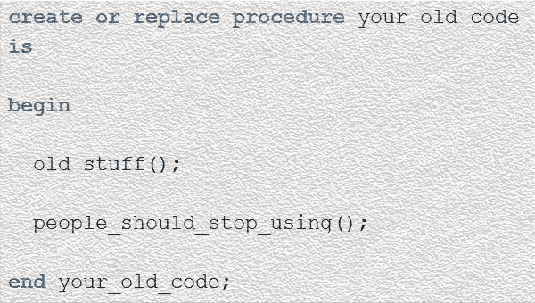

# 将旧的 PL/SQL 代码标记为“不可使用”:开发人员会喜欢的关于 Oracle Database 12c 第 2 版第 11 部分的 12 件事

> 原文：<https://medium.com/oracledevs/mark-old-code-as-not-for-use-12-things-developers-will-love-about-oracle-database-12c-release-2-d09eb1233f7a?source=collection_archive---------0----------------------->

时代变了。新代码很快变成遗留代码。遗留代码经常被更好、更快的代码所取代。所以你反对旧的代码。



但这带来了一个问题:

你如何阻止人们使用遗留模块？

人们倾向于坚持他们所知道的。即使在你反复告诉每个人转移到新模块之后，总有(至少)一个开发人员坚持使用废弃的过程，而不是更新、更好的选项。

在复杂的应用程序中，很难跟踪什么是过时的。

这很难解决。

因此，为了帮助您完成弃用过程，我们为此引入了一个新的 pragma。

要使用它，请放置

```
pragma deprecate ( 
  deprecated_thing, 
  'Message to other developers' 
);
```

退役部分下面。

太好了。但是这有什么用呢？

我们添加了一些新的 PL/SQL 警告:PLW-6019 到 PLW-6022。启用这些选项，Oracle 会告诉您是否正在使用不推荐使用的代码:

```
alter session set plsql_warnings = 'enable:(6019,6020,6021,6022)';create or replace procedure your_old_code is 
  pragma deprecate ( 
    your_old_code, 
    'This is deprecated. Use new_code instead!' 
  ); 
  begin 
    null; 
  end your_old_code; 
/ show err 
Warning(2,3): PLW-06019: entity YOUR_OLD_CODE is deprecated
```

这太棒了。但是我们一直都忽略了“AUTHID DEFINER”的警告！如果代码真的过时了，如果你能阻止人们一起使用它就好了。

幸运的是你可以！

警告的好处就在于此。你可以把它们升级成错误！当您编写调用不赞成使用的项的代码时，会引发 PLW-6020。将此设置为 error，违规代码将无法编译:

```
alter session set plsql_warnings = 'error:6020'; create or replace procedure calling_old_code is 
begin 
  your_old_code(); 
end calling_old_code; 
/ 
show err 
3/3 PLS-06020: reference to a deprecated entity: 
  This is deprecated. Use new_code instead!
```

当然，如果你把 PLW-6020 变成一个错误系统，很多东西可能会坏掉！因此您可以在给定的对象上有选择地升级它:

```
alter procedure calling_old_code compile 
  plsql_warnings = 'error:6020' reuse settings;
```

所以现在你有权力强迫别人停止使用史前代码。

*全文原载于 2016 年 11 月 10 日*[*【blogs.oracle.com】*](https://blogs.oracle.com/sql/12-things-developers-will-love-about-oracle-database-12c-release-2)*。*