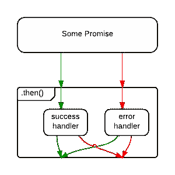
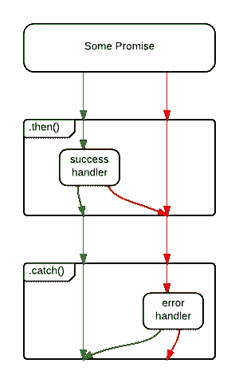

# 掌握 JavaScript 面试:什么是承诺？

> 原文：<https://medium.com/javascript-scene/master-the-javascript-interview-what-is-a-promise-27fc71e77261?source=collection_archive---------1----------------------->


Photo by Kabun (CC BY NC SA 2.0)

> “掌握 JavaScript 面试”是一系列的帖子，旨在帮助候选人准备在申请中高级 JavaScript 职位时可能遇到的常见问题。这些是我在真实面试中经常用到的问题。

# 什么是承诺？

承诺是一个可能在未来某个时间产生单个值的对象:一个已解决的值，或者一个未解决的原因(例如，发生了网络错误)。承诺可能处于三种状态之一:已履行、已拒绝或待定。Promise 用户可以附加回调来处理实现的值或拒绝的原因。

承诺是急切的，这意味着一旦调用了承诺构造函数，承诺就会开始执行您交给它的任何任务。如果你需要偷懒，看看[可观察的事物](https://github.com/Reactive-Extensions/RxJS)或[任务](https://github.com/rpominov/fun-task)。

# 承诺的不完整历史

早在 20 世纪 80 年代，promises 和 futures(一种类似/相关的思想)的早期实现就开始出现在 MultiLisp 和 Concurrent Prolog 等语言中。单词“promise”的使用是由 Barbara Liskov 和 Liuba Shrira 在 1988 年创造的[1]。

我第一次听说 JavaScript 中的承诺时，Node 是全新的，社区正在讨论处理异步行为的最佳方式。社区试验了一段时间的承诺，但最终确定了节点标准错误优先回调。

大约在同一时间，Dojo 通过 Deferred API 添加了承诺。不断增长的兴趣和活动最终导致了新形成的 Promises/一个旨在使各种承诺更具互操作性的规范。

jQuery 的异步行为围绕承诺进行了重构。jQuery 的 promise 支持与 Dojo 的 Deferred 有显著的相似之处，并且由于 jQuery 的广泛流行，它很快成为 JavaScript 中最常用的 promise 实现——有一段时间。然而，[它不支持双通道(履行/拒绝)链接行为&异常管理](https://blog.domenic.me/youre-missing-the-point-of-promises/)，人们指望它在承诺之上构建工具。

尽管存在这些弱点，jQuery 还是正式让 JavaScript promises 成为主流，更好的独立 promise 库如 Q、When 和 Bluebird 变得非常流行。jQuery 实现的不兼容性激发了 promise 规范中一些重要的澄清，该规范被重写并更名为 [Promises/A+规范](https://promisesaplus.com/)。

ES6 带来了一个符合 Promises/A+的`Promise` global，一些非常重要的 API 建立在新标准 Promise 支持之上:特别是 [WHATWG Fetch](https://fetch.spec.whatwg.org/) 规范和 [Async Functions](https://tc39.github.io/ecmascript-asyncawait/) 标准(在撰写本文时是第 3 阶段草案)。

这里描述的承诺是那些与承诺/A+规范兼容的承诺，重点是 ECMAScript 标准`Promise`的实现。

# 承诺是如何运作的

承诺是可以从异步函数同步返回的对象。它将处于三种可能状态之一:

*   **应验了:** `onFulfilled()`会被召唤(如`resolve()`会被召唤)
*   **被拒绝:** `onRejected()`将被调用(如`reject()`被调用)
*   **待定:**尚未履行或拒绝

如果一个承诺不是悬而未决的(它已经被解决或拒绝),它就是**解决的**。有时人们用*已解决*和*已解决*来表示同一个意思:*未决*。

承诺一旦达成，就不能再兑现。再次调用`resolve()`或`reject()`不会有任何效果。约定承诺的不变性是一个重要特征。

原生 JavaScript 承诺不公开承诺状态。相反，你应该把承诺当成一个黑盒。只有负责创建承诺的功能才知道承诺状态，或者有权解决或拒绝。

下面是一个返回承诺的函数，该承诺将在指定的时间延迟后解决:

[wait — promise example on CodePen](http://codepen.io/ericelliott/pen/EZWyaY?editors=0012)

我们的`wait(3000)`调用会等待 3000ms (3 秒)，然后登录`'Hello!'`。所有规范兼容的承诺都定义了一个`.then()`方法，您可以用它来传递处理程序，这些处理程序可以接受解析或拒绝的值。

ES6 promise 构造函数接受一个函数。该函数有两个参数，`resolve()`和`reject()`。在上面的例子中，我们只使用了`resolve()`，所以我把`reject()`从参数列表中去掉了。然后我们调用`setTimeout()`来创建延迟，并在完成时调用`resolve()`。

你可以选择带值的`resolve()`或`reject()`，这些值将被传递给带有`.then()`的回调函数。

当我用一个值`reject()`时，我总是传递一个`Error`对象。一般来说，我希望有两种可能的解决状态:正常的快乐路径，或者例外——任何阻止正常快乐路径发生的事情。传递一个`Error`对象可以使这一点显式化。

# 重要的承诺规则

承诺的标准是由[承诺/A+规范](https://promisesaplus.com/implementations)社区定义的。有许多实现符合该标准，包括 JavaScript 标准 ECMAScript promises。

遵循规范的承诺必须遵循一套特定的规则:

*   承诺或“thenable”是一个提供符合标准的`.then()`方法的对象。
*   待定承诺可能会转变为已履行或已拒绝状态。
*   一个被实现或拒绝的承诺是确定的，不能转换到任何其他状态。
*   承诺一旦谈妥，就必须有一个值(可能是`undefined`)。这一价值不能改变。

这个语境中的变化指的是同一性(`===`)比较。一个对象可能被用作实现的值，并且对象属性可能发生变化。

每个承诺必须提供一个带有以下签名的`.then()`方法:

```
promise.then(
  onFulfilled?: Function,
  onRejected?: Function
) => Promise
```

`.then()`方法必须符合以下规则:

*   `onFulfilled()`和`onRejected()`都是可选的。
*   如果提供的参数不是函数，则必须忽略它们。
*   `onFulfilled()`将在承诺兑现后调用，以承诺的值作为第一个参数。
*   `onRejected()`承诺被拒绝后会被调用，拒绝原因作为第一个参数。原因可能是任何有效的 JavaScript 值，但是因为拒绝本质上等同于异常，所以我建议使用错误对象。
*   `onFulfilled()`和`onRejected()`都不能被调用一次以上。
*   `.then()`同一承诺可能被多次叫停。换句话说，承诺可以用来聚集回调。
*   `.then()`必须返回新的承诺，`promise2`。
*   如果`onFulfilled()`或`onRejected()`返回值`x`，且`x`为承诺，`promise2`将锁定`x`(假设状态和值相同)。否则，`promise2`将用`x`的值来完成。
*   如果`onFulfilled`或`onRejected`中有一个抛出异常`e`，则`promise2`必须被拒绝，原因是`e`。
*   如果`onFulfilled`不是一个函数并且`promise1`被满足，`promise2`必须用与`promise1`相同的值来满足。
*   如果`onRejected`不是功能，且`promise1`被拒绝，则`promise2`必须被拒绝，原因与`promise1`相同。

# 承诺链

因为`.then()`总是返回一个新的承诺，所以可以通过精确控制错误处理的方式和位置来连锁承诺。承诺允许你模仿普通同步代码的`try` / `catch`行为。

像同步代码一样，链接将产生一个串行运行的序列。换句话说，您可以:

```
fetch(url)
  .then(process)
  .then(save)
  .catch(handleErrors)
;
```

假设`fetch()`、`process()`、`save()`各函数返回承诺，`process()`将等待`fetch()`完成后再启动，`save()`将等待`process()`完成后再启动。`handleErrors()`只有在先前的承诺被拒绝时才会运行。

这是一个复杂的承诺链的例子，有多次拒绝:

[Promise chaining behavior example on CodePen](http://codepen.io/ericelliott/pen/MJmqgN?editors=0012)

# 错误处理

请注意，承诺既有成功处理程序，也有错误处理程序，这样做的代码非常常见:

```
save().then(
  handleSuccess,
  handleError
);
```

但是如果`handleSuccess()`抛出一个错误会怎么样呢？从`.then()`返回的承诺将被拒绝，但是没有任何东西可以捕捉到拒绝——这意味着你的应用程序中的一个错误被忽略了。哎呀！

出于这个原因，有些人认为上面的代码是反模式的，并建议使用下面的代码:

```
save()
  .then(handleSuccess)
  .catch(handleError)
;
```

差别很微妙，但很重要。在第一个例子中，源于`save()`操作的错误将被捕获，但源于`handleSuccess()`函数的错误将被接受。



Without .catch(), an error in the success handler is uncaught.

在第二个例子中，`.catch()`将处理来自`save()`或`handleSuccess()`的拒绝。



With .catch(), both error sources are handled. ([diagram source](http://stackoverflow.com/questions/24662289/when-is-thensuccess-fail-considered-an-antipattern-for-promises))

当然，`save()`错误可能是网络错误，而`handleSuccess()`错误可能是因为开发人员忘记处理特定的状态代码。如果你想用不同的方式处理它们呢？您可以选择同时处理这两种情况:

```
save()
  .then(
    handleSuccess,
    handleNetworkError
  )
  .catch(handleProgrammerError)
;
```

无论你喜欢什么，我建议用一个`.catch()`结束所有的承诺链。值得重复的是:

> 我建议用一个`.catch()`结束所有的承诺链。

# 如何取消承诺？

new promise 用户经常想知道的第一件事是如何取消一个承诺。这里有个想法:以“取消”为理由拒绝承诺就好。如果您需要以不同于“正常”错误的方式处理它，请在错误处理程序中进行分支。

以下是人们在取消承诺时会犯的一些常见错误:

## 添加中。取消承诺

添加`.cancel()`使承诺变得不标准，但也违反了承诺的另一条规则:只有创建承诺的函数才应该能够解决、拒绝或取消承诺。公开它打破了这种封装，并鼓励人们编写代码，在不应该知道它的地方操纵承诺。避免意大利面和失信。

## 忘记打扫卫生

一些聪明人已经发现有一种方法可以使用`Promise.race()`作为取消机制。这样做的问题是取消控制来自创建承诺的函数，这是您可以进行适当清理活动的唯一地方，例如清除超时或通过清除对数据的引用来释放内存，等等...

## 忘记处理被拒绝的取消承诺

你知道吗，当你忘记处理拒绝承诺时，Chrome 会在整个控制台上抛出警告信息。哎呀！

## 过于复杂

[撤回的 TC39 取消提案](https://github.com/tc39/proposal-cancelable-promises)提出了单独的取消消息传递渠道。它还使用了一个叫做注销令牌的新概念。在我看来，这个解决方案会大大扩充 promise 规范，并且它提供的唯一不直接支持推测的特性是拒绝和取消的分离，在我看来，这并不是一开始就必须的。

您是否希望根据是否有例外或取消来进行切换？是的，绝对的。那是诺言的工作吗？在我看来，不，不是。

## 重新思考承诺取消

一般来说，我会传递承诺创建时确定如何解决/拒绝/取消所需的所有信息。那样的话，承诺就不需要`.cancel()`方法了。你可能想知道你怎么可能知道你是否会在承诺创建时取消。

> “如果我还不知道是否要取消，当我创建承诺时，我怎么知道要传递什么？”

要是有某种物体能代表未来的潜在价值就好了……*哦，等等。*

我们传入的表示是否取消的值本身就是一个承诺。这看起来可能是这样的:

[Cancellable wait — try it on CodePen](http://codepen.io/ericelliott/pen/MJpewL?editors=0012)

我们使用默认参数赋值来告诉它默认情况下不要取消。这使得`cancel`参数可以方便地选择。然后，我们像以前一样设置超时，但这次我们捕获超时的 id，以便我们可以在以后清除它。

我们使用`cancel.then()`方法来处理取消和资源清理。只有在承诺有机会解决之前被取消，才会运行。如果你取消得太晚，你已经错过了机会。那列火车已经离开车站。

> 注意:你可能想知道`noop()`函数是干什么用的。noop 这个词代表 no-op，意思是一个什么也不做的函数。没有它，V8 会抛出警告:`UnhandledPromiseRejectionWarning: Unhandled promise rejection`。这是一个好主意，**总是处理承诺拒绝，**即使你的处理者是一个`noop()`。

## 抽象承诺取消

这对于一个`wait()`定时器来说很好，但是我们可以进一步抽象这个想法来封装你必须记住的一切:

1.  默认情况下拒绝取消承诺——如果没有传递取消承诺，我们不想取消或抛出错误。
2.  当您拒绝取消时，请记住执行清理。
3.  记住`onCancel`清理本身可能会抛出一个错误，这个错误也需要处理。(注意，在上面的等待示例中省略了错误处理—这很容易忘记！)

让我们创建一个可取消的承诺实用程序，您可以用它来包装任何承诺。例如，为了处理网络请求等，签名将如下所示:

```
speculation(fn: SpecFunction, shouldCancel: Promise) => Promise
```

SpecFunction 就像您将传递到`Promise`构造函数中的函数，只有一个例外——它需要一个`onCancel()`处理程序:

```
SpecFunction(resolve: Function, reject: Function, onCancel: Function) => Void
```

注意，这个例子只是一个说明，给你它是如何工作的要点。还有一些你需要考虑的边缘情况。例如，在这个版本中，如果您取消已经结算的承诺，将会调用`handleCancel`。

我已经实现了一个维护的产品版本，边缘案例作为开源库，[推测](https://github.com/ericelliott/speculation)。

让我们使用改进的库抽象来重写以前的可取消的`wait()`实用程序。首次安装推测:

```
npm install --save speculation
```

现在您可以导入并使用它:

这稍微简化了一些事情，因为你不必担心`noop()`，在你的`onCancel()`，函数或者其他边缘情况下捕捉错误。那些细节已经被`speculation()`抽象掉了。检查一下，并在实际项目中随意使用。

# 原生 JS 承诺的额外内容

原生`Promise`对象有一些您可能感兴趣的额外内容:

*   返回被拒绝的承诺。
*   `Promise.resolve()`返回已解决的承诺。
*   `Promise.race()`接受一个数组(或任何 iterable)并返回一个承诺，该承诺以 iterable 中第一个解析的承诺的值进行解析，或者以第一个拒绝的承诺的原因进行拒绝。
*   `Promise.all()`接受一个数组(或任何可迭代的)并返回一个承诺，当*可迭代的参数中的所有承诺*都已解决时，该承诺将解决，或以第一个传递的承诺拒绝的原因拒绝。

# 结论

承诺已经成为 JavaScript 中几个习惯用法不可或缺的一部分，包括用于大多数现代 ajax 请求的 WHATWG Fetch 标准和用于使异步代码看起来同步的 Async Functions 标准。

在撰写本文时，异步函数还处于第三阶段，但是我预测它们将很快成为 JavaScript 中非常流行、非常常用的异步编程解决方案——这意味着在不久的将来，学会珍惜承诺对 JavaScript 开发人员来说将变得更加重要。

例如，如果您使用 redux，我建议您查看一下 [redux-saga](https://github.com/redux-saga/redux-saga) :一个用于管理 Redux 副作用的库，它依赖于整个文档中的异步函数。

我希望即使是有经验的 promise 用户，在看完这篇文章后，也能更好地理解什么是承诺以及它们是如何工作的，以及如何更好地使用它们。

## 探索该系列

*   [什么是闭包？](/javascript-scene/master-the-javascript-interview-what-is-a-closure-b2f0d2152b36#.ecfskj935)
*   [类和原型继承有什么区别？](/javascript-scene/master-the-javascript-interview-what-s-the-difference-between-class-prototypal-inheritance-e4cd0a7562e9#.h96dymht1)
*   [什么是纯函数？](/javascript-scene/master-the-javascript-interview-what-is-a-pure-function-d1c076bec976#.4256pjcfq)
*   [什么是函数构成？](/javascript-scene/master-the-javascript-interview-what-is-function-composition-20dfb109a1a0#.i84zm53fb)
*   [什么是函数式编程？](/javascript-scene/master-the-javascript-interview-what-is-functional-programming-7f218c68b3a0#.jddz30xy3)
*   [什么是承诺？](/javascript-scene/master-the-javascript-interview-what-is-a-promise-27fc71e77261#.aa7ubggsy)
*   [软技能](/javascript-scene/master-the-javascript-interview-soft-skills-a8a5fb02c466)

1.  *芭芭拉·利斯科夫；柳巴·施里拉(1988 年)。“Promises:分布式系统中高效异步过程调用的语言支持”。SIGPLAN '88 程序设计语言设计和实现会议录:美国乔治亚州亚特兰大，第 260-267 页。ISBN 0–89791–269–1，由 ACM 出版。也发表在 ACM SIGPLAN Notices，第 23 卷，第 7 期，1988 年 7 月。*

[](https://ericelliottjs.com/premium-content/lesson-pure-functions)

[Start your free lesson on EricElliottJS.com](https://ericelliottjs.com/premium-content/lesson-pure-functions)

***埃里克·艾略特*** *是一位科技产品和平台顾问，《 [*【作曲软件】*](https://leanpub.com/composingsoftware)*[*【EricElliottJS.com】*](https://ericelliottjs.com)*[*devanywhere . io*](https://devanywhere.io)*的联合创始人，以及 dev 团队导师。他曾为 Adobe Systems、* ***、Zumba Fitness、*** ***【华尔街日报、*******【ESPN、*******【BBC】****等顶级录音艺人和包括* ***Usher、【Metallica】********

*他和世界上最美丽的女人享受着与世隔绝的生活方式。*