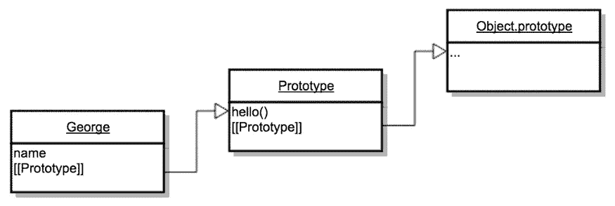

# 掌握 JavaScript 面试:类和原型继承有什么区别？

> 原文：<https://medium.com/javascript-scene/master-the-javascript-interview-what-s-the-difference-between-class-prototypal-inheritance-e4cd0a7562e9?source=collection_archive---------1----------------------->


Electric Guitar — Feliciano Guimarães (CC BY 2.0)

> “掌握 JavaScript 面试”是一系列的帖子，旨在帮助候选人准备在申请中高级 JavaScript 职位时可能遇到的常见问题。这些是我在真实面试中经常用到的问题。想从头开始吗？参见[“什么是闭包？”](/javascript-scene/master-the-javascript-interview-what-is-a-closure-b2f0d2152b36#.6xq65f6f5)
> 
> 注意:本文使用 ES6 示例。如果你还没学过 ES6，请看[“如何学习 ES6”](/javascript-scene/how-to-learn-es6-47d9a1ac2620)。

JavaScript 中经常使用对象，了解如何有效地使用它们将大大提高您的工作效率。事实上，糟糕的面向对象设计可能会导致项目失败，在最坏的情况下，[公司失败](/javascript-scene/inside-the-dev-team-death-spiral-6a7ea255467b)。

与大多数其他语言不同，JavaScript 的对象系统基于**原型，而不是类**。不幸的是，大多数 JavaScript 开发人员不理解 JavaScript 的对象系统，也不知道如何最好地利用它。其他人理解它，但希望它的行为更像基于类的系统。结果是 JavaScript 的对象系统具有令人困惑的分裂个性，这意味着 JavaScript 开发人员需要了解一些关于原型和类的知识。

## 类继承和原型继承有什么区别？

这可能是一个棘手的问题，你可能需要通过后续的问答来为你的答案辩护，所以要特别注意了解它们的区别，以及如何应用这些知识来编写更好的代码。

**类继承:** ***类就像一个蓝图——对要创建的对象的描述。*** 类继承自类，**创建子类关系**:层次类分类法。

实例通常通过带有 *`new`* 关键字的构造函数来实例化。类继承可能使用也可能不使用 ES6 中的 *`class`* 关键字。从技术上讲，JavaScript 中并不存在 Java 等语言中的类。而是使用构造函数。ES6 *`class`* 关键字反糖到一个构造函数:

```
class Foo {}
typeof Foo // 'function'
```

在 JavaScript 中，类继承是在原型继承之上实现的，但是这并不意味着它做同样的事情

JavaScript 的类继承使用原型链将子 *`Constructor.prototype`* 连接到父 *`Constructor.prototype`* 进行委托。通常， *`super()`* 构造函数也被调用。这些步骤形成了**单祖先父/子层次**和 ***创建了 OO 设计中最紧密的耦合。***

> "类从类继承并且**创建子类关系**:层次类分类法."

**原型继承:** ***原型是工作对象实例。*** 对象直接继承其他对象。

实例可以由许多不同的源对象组成，允许简单的选择性继承和扁平的[[Prototype]]委托层次结构。换句话说，**类分类法不是原型 OO** : *的自动副作用，这是一个关键的区别。*

实例通常通过工厂函数、对象文字或 *`Object.create()`* 进行实例化。

> ***“原型是一个工作对象的实例。*** 对象直接继承其他对象。”

## 为什么这很重要？

继承从根本上说是一种代码重用机制:不同种类的对象共享代码的一种方式。分享代码的方式很重要，因为如果你做错了，**它会产生很多问题，**具体来说:

**类继承的副作用是创建父/子对象分类法**。

这些分类法实际上不可能对所有的新用例都正确，基类的广泛使用导致了**脆弱的基类问题，**当它们出错时，很难修复。事实上，类继承导致了 OO 设计中许多众所周知的问题:

*   **紧耦合问题**(类继承是 oo 设计中可用的最紧耦合)，导致下一个…
*   **脆弱的基础类问题**
*   **不灵活的层级问题**(最终，所有进化的层级对于新的用途都是错误的)
*   **必然的复制问题**(由于不灵活的层次结构，新的用例通常是通过复制，而不是修改现有的代码来实现的)
*   **大猩猩/香蕉问题**(你想要的是一只香蕉，但你得到的是一只拿着香蕉的大猩猩，以及整个丛林)

所有这些问题的解决方案是优先选择对象组合而不是类继承。

> "优先选择对象组合而不是类继承."
> ~四人帮，[《设计模式:可复用面向对象软件的要素》](http://www.amazon.com/gp/product/0201633612?ie=UTF8&camp=213733&creative=393185&creativeASIN=0201633612&linkCode=shr&tag=eejs-20&linkId=WMUILDJNIUXY4NSH)

总结得很好:

## 所有的遗传都是不好的吗？

当人们说“偏好组合胜过继承”时，那是“偏好组合胜过**类**继承”的简称(最初引自四人帮的“设计模式”)。这是 OO 设计中的常识，因为**类继承有很多缺陷**并导致很多问题。当人们谈论类继承时，经常会省略掉单词 **class** ，这听起来好像所有的继承都是不好的——但事实并非如此。

实际上有几种不同类型的继承，其中大多数非常适合从多个组件对象组成复合对象。

## 三种不同的原型遗传

在我们深入其他种类的继承之前，让我们仔细看看我所说的**类继承**是什么意思:

您可以在 Codepen 上试验这个例子。

*`BassAmp`* 继承自 *`GuitarAmp`* ， *`ChannelStrip`* 继承自*` bassamp `*&*` guitar amp `。这是面向对象设计出错的一个例子。通道条实际上不是一种吉他放大器，实际上根本不需要音箱。更好的选择是创建一个新的基础类，放大器和通道条都从该基础类继承而来，但即使这样也有局限性。*

最终，新的共享基类策略也失败了。

有更好的方法。使用对象组合，您可以继承您真正需要的东西:

[在 CodePen](http://codepen.io/ericelliott/pen/XXzadQ?editors=001) 上做这个实验。

如果你仔细观察，你可能会发现我们对哪些对象获得哪些属性变得更加具体，因为有了 composition， ***我们可以*** 。对于类继承来说，这并不是一个真正的选择。当你继承了一个类，你就得到一切，*即使你不想要。*

此时，您可能会对自己说，“这很好，但是原型在哪里呢？”

要理解这一点，你必须理解有三种不同的原型 OO。

**串联继承:**通过复制源对象属性，从一个对象直接向另一个对象继承特性的过程。在 JavaScript 中，源原型通常被称为**混合。**从 ES6 开始，这个特性在 JavaScript 中有一个便利的实用程序，叫做 *`Object.assign()`* 。在 ES6 之前，这通常是用下划线/Lodash 的 *`.extend()`* jQuery 的 *`$。extend()`、*等等……上面的合成例子使用了串联继承。

**原型委托:**在 JavaScript 中，一个对象可以链接到**委托**的原型。如果在对象上找不到属性，查找将被**委托**给**委托原型，**可能有一个到它自己的委托原型的链接，依此类推，直到到达根委托 *`Object.prototype`* 。这是当你附加到一个*` constructor . prototype`*并使用 *`new '实例化时得到的原型。*你也可以使用 *`Object.create()`* 来实现这个目的，甚至可以将这种技术与串联混合使用，以便将多个原型展平为一个委托，或者在创建后扩展对象实例。



The JavaScript Prototype Chain

**函数继承:**在 JavaScript 中，任何函数都可以创建一个对象。当该函数不是构造函数(或 *`class`* )时，它被称为**工厂函数**。函数继承的工作方式是从工厂产生一个对象，并通过直接为其分配属性(使用串联继承)来扩展所产生的对象。道格拉斯·克洛克福特创造了这个术语，但是函数继承在 JavaScript 中已经普遍使用了很长时间。

您可能已经开始意识到，**串联继承是 JavaScript** 中支持对象组合的秘密武器，这使得原型委托和函数继承变得更加有趣。

当大多数人想到 JavaScript 中的原型 OO 时，他们会想到原型委托。现在你应该明白他们错过了很多。委托原型不是类继承的很好的替代物— **对象组合是**。

## **为什么复合对脆弱基类问题免疫**

要理解脆弱基类问题以及为什么它不适用于合成，首先你必须理解它是如何发生的:

1.  *`A`* 是基类
2.  *`B`* 继承自 *`A`*
3.  *`C`* 继承自 *`B`*
4.  *`D`* 继承自 *`B`*

*“C”*调用*“超级”*，后者在*“B”*中运行代码。*“b”*调用*“super”【T9 },后者在*“a”*中运行代码。*

*“a”和*“b”包含*“c”和&*“d”都需要的不相关特征。*“d”*是一个新的用例，需要*在*“a”*的初始化代码中有一点不同于*“c”*需要的*行为。所以新手开发者去调整*的初始化代码。 *`* 、**、 *C`* 因为依赖于已有行为而断裂**，并且 *`D`* 开始工作。***

我们这里有分布在*‘a’*和*‘b’*之间的特性，即*‘c’*和*‘d’*需要以各种方式使用。*“C”和*“D”并没有使用*“A”和*“B”的所有特性……他们只是想继承一些已经在*“A”和*“B”中定义的东西。但是通过继承和调用*‘super’，* **你不能对你继承的东西有所选择**。您继承了一切:

> “…面向对象语言的问题在于，他们随身携带着所有这些隐含的环境。**你想要一根香蕉，但是你得到的是一只大猩猩拿着香蕉**和整个丛林。”~乔·阿姆斯特朗— [“程序员在工作”](http://www.amazon.com/gp/product/1430219483?ie=UTF8&camp=213733&creative=393185&creativeASIN=1430219483&linkCode=shr&tag=eejs-20&linkId=3MNWRRZU3C4Q4BDN)

**有了组合**
想象你有特征而不是类:

```
feat1, feat2, feat3, feat4
```

*“c”*需要*“feat 1”*和*“feat 3”*、*“d”*需要*“feat 1”、“feat2”、“feat 4”*:

```
const C = compose(feat1, feat3);
const D = compose(feat1, feat2, feat4);
```

现在，假设您发现*` d}*需要**与*` feat 1}*稍微不同的**行为。实际上不需要改变*“feat 1”*，相反**你可以定制*“feat 1”*“T90”并使用。您仍然可以继承*“feat 2”*和*“feat 4”*中的现有行为，没有任何变化:**

```
const D = compose(custom1, feat2, feat4);
```

*`***' c`不受**影响。

使用类继承不可能做到这一点的原因是因为**当您使用类继承时，您购买了整个现有的类分类法。**

如果你想为一个新的用例做一点调整，你要么复制现有分类法的一部分(必然的复制问题)，要么你重构所有依赖于现有分类法的东西，使分类法适应新的用例，因为**脆弱的基类问题**。

组合对两者都是免疫的。

## 你认为你了解原型，但是…

如果你被教导构建类或构造函数并继承它们，你被教导的是**而不是原型继承**。你学会了如何**使用原型**模仿类继承。参见[“JavaScript 中关于继承的常见误解”](/javascript-scene/common-misconceptions-about-inheritance-in-javascript-d5d9bab29b0a#.khem2m91q)。

在 JavaScript 中，类继承建立在很久以前构建在语言中的非常丰富、灵活的原型继承特性之上，但是当您使用类继承时——即使是构建在原型之上的 ES6+ *`class`* 继承，您也没有使用原型 OO 的全部功能&灵活性。事实上，你把自己画到了角落里，选择了所有的类继承问题。

> 在 JavaScript 中使用类继承就像把你的新 Tesla Model S 开到经销商那里，换一辆生锈的 1973 年福特 Pinto。

## 探索该系列

*   [什么是关闭？](/javascript-scene/master-the-javascript-interview-what-is-a-closure-b2f0d2152b36#.ecfskj935)
*   [类和原型继承有什么区别？](/javascript-scene/master-the-javascript-interview-what-s-the-difference-between-class-prototypal-inheritance-e4cd0a7562e9#.h96dymht1)
*   [什么是纯函数？](/javascript-scene/master-the-javascript-interview-what-is-a-pure-function-d1c076bec976#.4256pjcfq)
*   [什么是函数构成？](/javascript-scene/master-the-javascript-interview-what-is-function-composition-20dfb109a1a0#.i84zm53fb)
*   [什么是函数式编程？](/javascript-scene/master-the-javascript-interview-what-is-functional-programming-7f218c68b3a0#.jddz30xy3)
*   什么是承诺？
*   [软技能](/javascript-scene/master-the-javascript-interview-soft-skills-a8a5fb02c466)

# 提升你的技能

[跟 Eric Elliott 学 JavaScript】。如果你不是会员，你就错过了！](http://ericelliottjs.com/product/lifetime-access-pass/)

[](https://ericelliottjs.com/product/lifetime-access-pass/)

***埃里克·艾略特*** *是一位科技产品和平台顾问，《 [*【作曲软件】*](https://leanpub.com/composingsoftware)*[*【EricElliottJS.com】*](https://ericelliottjs.com)*[*devanywhere . io*](https://devanywhere.io)*的联合创始人，以及 dev 团队导师。他曾为 Adobe Systems、* ***、Zumba Fitness、*** ***【华尔街日报、*******【ESPN、*******【BBC】****等顶级录音艺人和包括* ***Usher、【Metallica】********

*他和世界上最美丽的女人享受着与世隔绝的生活方式。*