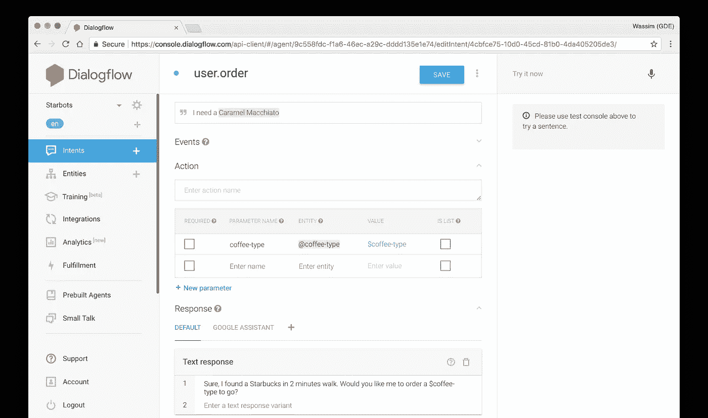
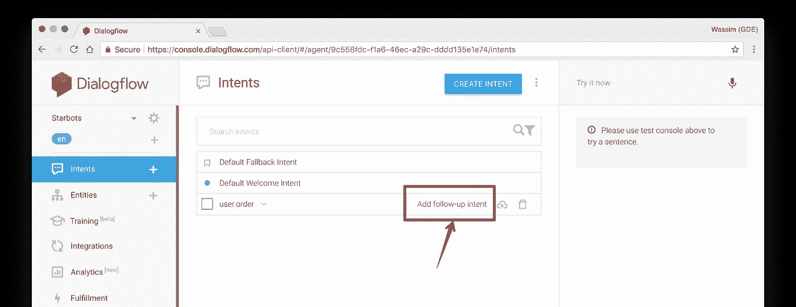
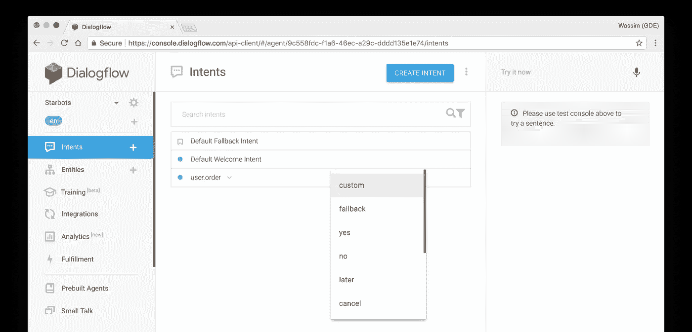
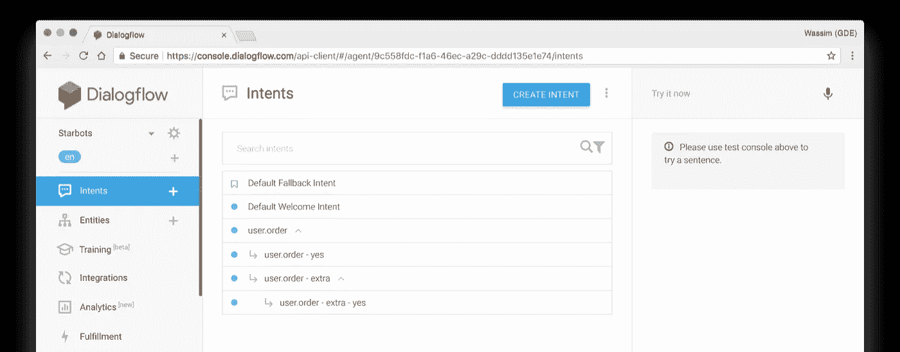
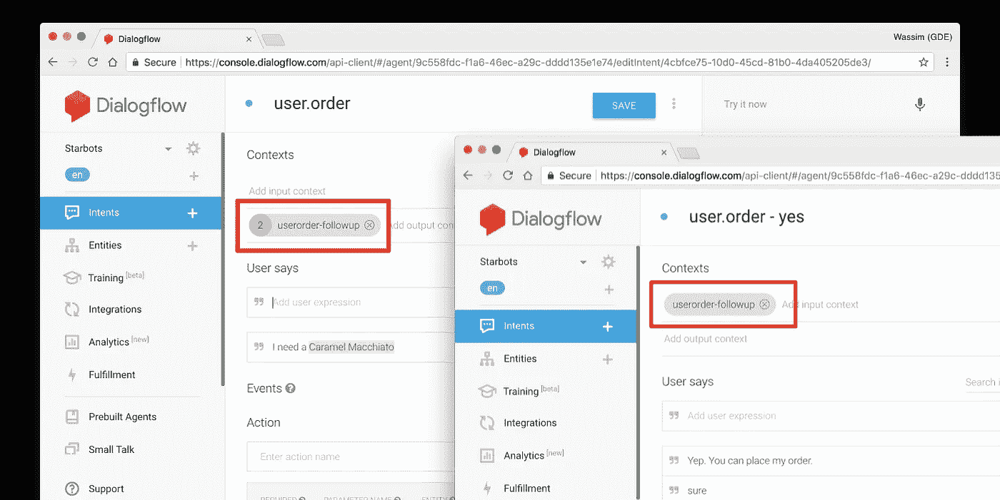
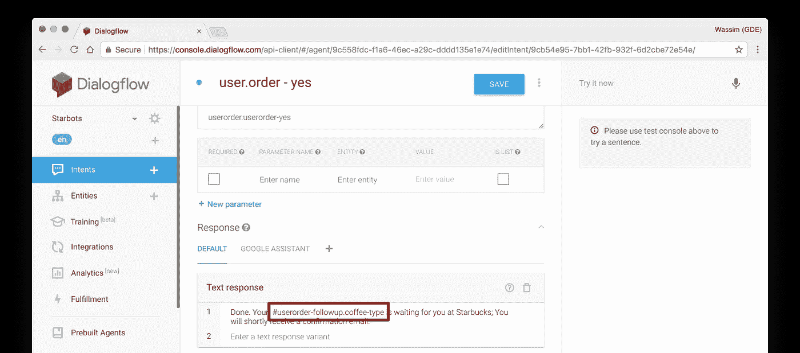
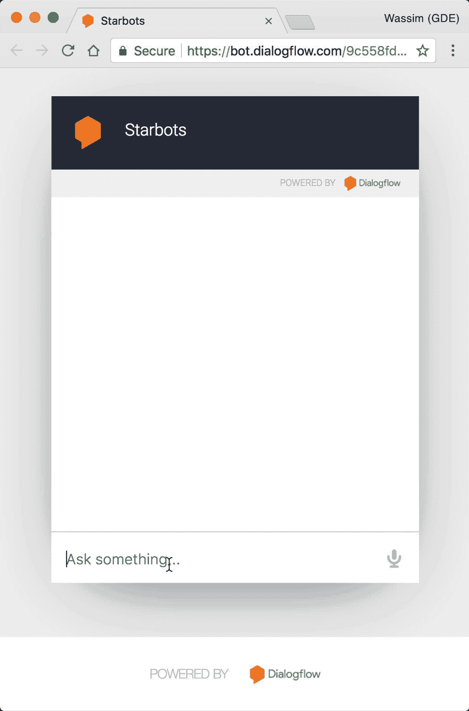

# 使用 DialogFlow 掌握跟进意图

> 原文：<https://medium.com/google-developer-experts/mastering-follow-up-intents-with-dialogflow-851b75b83f5a?source=collection_archive---------1----------------------->

Credits: [https://blog.catchapp.mobi/coffee-addict-check-out-the-best-coffee-places-in-london-11a839676030](https://blog.catchapp.mobi/coffee-addict-check-out-the-best-coffee-places-in-london-11a839676030)

几乎在每一个 CUI ( [对话式 UI](https://developers.google.com/actions/design/) )中，你——作为一个 [VUI 的设计师](https://en.wikipedia.org/wiki/Voice_user_interface)——都需要负责用户对话，包括跟进和确认。以下面的对话为例:

1.  *我*:“嘿伙计，我需要一杯[焦糖玛奇朵](https://www.starbucks.com/menu/drinks/espresso/caramel-macchiato)。”
2.  StarBots :“当然，我找到了一家星巴克，步行不到两分钟。要不要我点一杯焦糖玛奇朵？”
3.  *我*:“等等，能给我多来点鲜奶油吗？”
4.  StarBots :“我给你的订单多加了一份鲜奶油。就这些吗？”
5.  *我*:“对。你可以下我的订单。”
6.  *星际机器人*:“完成。你的焦糖玛奇朵加额外的鲜奶油在星巴克等着你；您将很快收到一封确认电子邮件。”

根据这段对话中的“[快乐之路](https://developers.google.com/actions/design/walkthrough#journey_1_happy_path)”，您可以清楚地识别主要意图(**点一杯咖啡**)、次要意图(**添加额外的配料、订单确认**)、实体(**焦糖玛奇朵、奶油**)和上下文，这使得 *StarBots* 可以跟踪该对话中涉及的实体和用户的请求。

为了设计这样的对话，你不仅需要有一个符合用户“要一杯咖啡”的主要意图；而且，第二意图是处理“额外请求”和订单确认(是/否)。令人欣慰的是，DialogFlow 让我们可以轻松地创造这些“次要”意图。我们简单地称之为“跟进”意图。

# 让我们使用 DialogFlow 来设计这个对话。

首先，让我们创建与用户订单请求相匹配的主要意图，比如“我需要一杯焦糖玛奇朵”。我们还可以将“焦糖玛奇朵”标记为我们创建的名为“@coffee-type”的自定义实体:

接下来，我们将添加嵌套在主要意图中的第二个意图，这些嵌套的意图被称为“后续”意图。

> 后续意图是保持其父意图上下文的正常意图。

要添加跟进意向，只需将鼠标悬停在意向上，然后点击“添加跟进意向”标签:

这将添加一个嵌套在所选意图内的新意图。我们可以从各种常见的[后续表达](https://dialogflow.com/docs/reference/follow-up-intent-expressions)中进行选择，比如确认、重复、取消……等等。或者，我们可以添加一个自定义跟进意向:

让我们回到上面的话题。我们需要设计两个场景:

1.  如果用户只是要了一杯咖啡，然后确认了订单，我们只需要两个意向:主要意向+一个“是”的后续意向。
2.  如果用户想要添加额外的浇头，那么我们需要三个意图:主要意图+一个“额外的”后续+一个“是”后续(对于额外的)。

最终，我们会得到如下结果:

*   **user.order** :我们主要的“订单”意向。
*   **user.order — yes** :订单确认。
*   **user.order—extra** :额外浇头的意图。
*   **user.order—extra—yes** :确认带浇头的订单。

添加跟进意向时，DialogFlow 会自动创建:

1.  父意图中的输出上下文(具有有限的生命周期)
2.  后续意图中的输入上下文。

> 上下文的生命周期是两个参与者之间的交换次数。

这些语境是一样的。它们有相同的名称，并作为两个意图之间的联系。这也意味着您可以访问这个上下文来读取存储它们的参数(实体值)。

您可以使用下面的语法来做到这一点:`#some-context.some-argument`。对于我们的场景，这将是:`#userorder-followup.coffee-type`。

# 那都是乡亲们！

这是我们示例对话的“快乐之路”的快速演示，我们只花了大约 3 分钟来设计和制作一个交互式演示，我们可以迭代改进。

*在 Twitter 上关注我*[*@ manekinekko*](https://twitter.com/manekinekko)*了解更多关于聊天机器人、谷歌助手和网络平台的信息。*