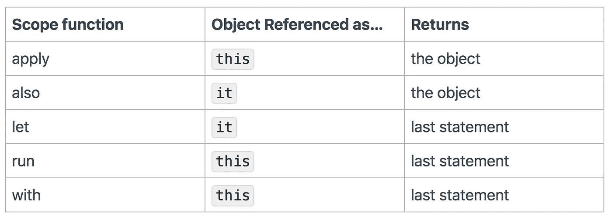

# 掌握 Kotlin 作用域和高阶函数

> 原文：<https://blog.kotlin-academy.com/mastering-kotlin-scoped-and-higher-order-functions-23e2dd34d660?source=collection_archive---------0----------------------->

学习如何创造，而不是如何使用

如果您正在使用 Kotlin，您一定见过如下表格:



## **暂时忘记表中所说的内容。不要背表。让我们从头开始。**

声明:这将是一篇长文(掌握一些需要努力的东西)。我会将文章分成几个部分，并添加休息，每当你看到一个休息标题，休息一下。

# 休息一会儿💆

网上有很多(我是认真的)文章解释作用域函数做什么以及如何使用它们。本文更进了一步。我们不仅会理解他们做了什么，而且会“掌握这个概念”

> **大师都是做什么的？大师是这样的人，他的基础很清楚，他知道如何创造东西，而不仅仅是如何使用。**

你需要理解两个非常简单和容易的概念，你就能成为大师。

1.  **扩展功能**
2.  **高阶函数和λ**

**如果你想知道为什么这两个概念与作用域函数(let、apply、also、run 等)相关。)**！你很快就会知道。这里我们快速复习一下题目。如果你没有用过这两个概念，我推荐你多读官方文档和文章。

## 扩展功能

根据[官方文档，Kotlin 提供了用新功能扩展类的能力，而不必从类继承或使用设计模式，如 Decorator。](https://kotlinlang.org/docs/reference/extensions.html)

简而言之，您可以在一个类中声明一个新的函数，而无需更改原始代码，并使用该类的实例来调用该函数。您甚至不必访问该类的源代码。

语法是:

```
fun AnyClass.yourNewFunction(optionalParamIfNeeded : Type) {

   // do your magic here and use the instance of AnyClass as `this`}
```

假设您希望在`String`类中有一个函数将值转换为`camelcase`。你可以定义一个`function`:

```
fun String.toCamelCase() { 
// some magic, the instance of String is available as `this`
  return camelCased;
}fun String.toCamelCase() {
   this.substring(1)   // referring the caller as thisreturn camelCased;
}
```

## 高阶函数和λ

[根据这里的官方文档](https://kotlinlang.org/docs/reference/lambdas.html)，高阶函数是以函数为参数或者返回函数的函数。让我们看一个例子:

```
fundoSomething(block: () -> Unit) {
}
```

这个函数`doSomething`接受一个没有参数的函数`() -> Unit`并返回单位。Kotlin 中没有 void 的概念，如果一个函数返回 nothing，那么它返回 Unit(编译器为你添加 return 语句)。该函数在参数中是必需的，参数名为`block`您可以随意命名，甚至 xyz

```
fundoSomething(xyz: () -> Unit) { // valid, xyz is the param name
}
```

`doSomething`函数如何调用传递的参数函数？语法非常简单:

```
fundoSomething(xyz: () -> Unit) {
    xyz() // call like a normal function
}
```

答案是像普通函数一样调用。

```
fundoSomething(block: () -> Unit) {
    block() // call like a normal function
}
```

# 休息一会儿💆

让我们看看高阶函数的另一个例子:

```
fundoSomething(block: () -> String) {
    val someString:String = block()  // param funtion returns String
}
```

这一次，`parameter`T2 返回一个`String`。

```
fundoSomething(block: (i:Int) -> String) { 
    // param funtion returns String
    val someString:String = block(1)  
}
```

这次，`parameter`T5 接受一个 Int 并返回一个`String`。

```
fundoSomething(block: () -> String):String {
    return block()  // param funtion returns String
}
```

这一次，`doSomething`使用`block`返回它想要的字符串，因为这个块也返回一个字符串

## 将函数作为参数传递

```
**fun** doSomething(block: () -> Unit) {
}
```

`doSomething`想要一个没有参数，返回单位的函数。

有几种方法可以调用`doSomething`并传递函数

## 方式 1 —传递与结构匹配的现有函数

假设我们有一个函数:

```
**fun** randomFunction(){ println("I am random function") }
```

这里，随机函数不接受任何参数，也不返回任何内容(该结构与我们在`doSomething)`中想要的相匹配)

我们可以打电话给:

```
*doSomething*(::randomFunction)
```

这里我们调用`doSomething`函数，并将`randomFunction`作为参数传递。语法`::`是引用一个函数

```
**fun** randomFunction(){ println("I am random") }**fun** doSomething(block: () -> Unit) {
   block() // It will print "I am random"
}*doSomething*(::randomFunction) 
```

## 用参数调用传递的函数

假设传递的`function`接受`parameters`，调用它和其他函数没什么区别:

```
**fun** randomFunction(){ println("I am random") }**fun** doSomething(block: (i:Int) -> Unit) {}// will not compile ❌ as randomFunction does not accept Int*doSomething*(::randomFunction)
```

## 方式 2—传递匿名函数

```
**fun** doSomething(block: (i:Int) -> Unit) {}
```

我们可以传递一个匿名函数，如下所示:

```
*doSomething* (fun(x:Int){

})
```

注意，我们创建了一个匿名函数，并作为参数传递。如果从`doSomething`调用`block(99)`，那么我们传递的函数将被调用，x 的值为 99

# 休息一会儿💆

## 方式 3—创建一个扩展函数类型的类，并传递你的类的实例

## 例 1。

```
interface CustomFunctionType : () -> Unit {
    override fun invoke()
}
```

这里，我们创建了一个扩展了`function`类型的`interface`。这个`function`的定义是它接受 no `parameter`并返回`Unit`。

上面的定义等于有了一个函数:

```
**fun** customFunction() {}
```

不同之处在于我们可以创建`CustomFunctionType`的实例，并在运行时提供实现，如下所示:

```
// Here we are creating an anonymous class **val** dynamic = **object** : CustomFunctionType{
    **override fun** invoke() {
      // do your magic here    
    }
}
```

如果我们有一个期待类似签名函数的函数，我们可以传递上面创建的对象

```
**fun** doSomething(block: () -> Unit) {
   block() // It will print "I am random"
}doSomething(dynamic)
```

乍一看，这似乎有点困难。重点是我们可以创建接口/类，它用涉及参数和返回类型的签名来扩展函数类型，例如`()->Unit`，并且我们可以在函数签名匹配的地方将该类/接口的实例作为参数传递。

## 例 2。

```
interface CustomFunctionType : (Int) -> Unit {
    override fun invoke(i:Int)
}
```

这里，我们创建了另一个扩展函数类型的接口。这个函数的定义是:它接受一个 int 参数，不返回任何东西。

## 例 3。

```
interface CustomFunctionType : (Int, Int) -> String {
    override fun invoke(i:Int, j:Int):String
}
```

这相当于一个接受两个 int 并返回一个 String 的函数。

## 加分

我想你的大脑正在嗡嗡作响。正如我们所知，高阶函数也可以赋给变量。这里有一个例子:

```
fun doSum(i:Int, j:Int):Int{ 
  return i + j 
}valsum: (Int, Int) -> Int = ::doSum
```

这里 sum 的类型是`functionType`,它接受两个 Int 参数并返回一个 Int。我们用参考号`::`分配函数`doSum`

现在我们可以称之为

```
sum(1, 1) // equivalent to doSum(1,1)
```

# 休息一会儿💆

## 方式 4—进入 Lambda 世界

正如我们在上面看到的，我们可以扩展函数类型并传递你的类的实例。科特林有一个同样的简写语法。这是一个λ。我们可以在任何需要 FunctionType 的地方使用 lambda。语法是花括号，后面是参数，后面是正文。

```
valsum: (Int, Int) -> Int = {x: Int, y: Int -> x + y}
```

右边是一个 lambda，我们知道在 kotlin 中的类型推断，我们可以省略参数的类型。

```
valsum: (Int, Int) -> Int = {x, y -> x + y}
```

正如我们所知，我们可以在任何需要 FunctionType 的地方使用 lambda。这意味着我们可以使用一个 lambda，在这里我们使用一个函数作为函数参数。让我们看同一个例子:

```
fundoSomething(block: () -> Unit) {
}
```

同样，`doSomething`需要一个函数，我们刚刚说过我们可以在这里使用λ。这个函数不接受任何参数，也不返回任何东西(这意味着 Unit)，下面是一个用 lambda 的调用

```
doSomething({})
```

是的，就是这么简单。

我们如何用 lambda 接受参数？同样非常简单，我们可以输入参数名，然后输入类型。

```
fundoSomething(block: (i:Int, j:Int) -> Unit) {
}// call with lambda
doSomething({x:int, y:Int -> })
```

但是我们如何从λ返回呢？我们知道科特林很聪明。lambda 的最后一行被推断为返回，并且类型必须与预期的类型相匹配。示例:

```
fundoSomething(block: (i:Int, j:Int) -> String) {
}// call with lambda
doSomething({x:int, y:Int -> 
// do some magic here 
"TheStringToReturn"
})
```

在上面的例子中，我们正在返回`TheStringToReturn`，因为函数类型期望接受两个 int 并返回一个 String。当然，这是科特林，我们不需要罗嗦。我们可以省略参数类型

```
doSomething({x, y -> 
// do some magic here 
})
```

## Lambda 语法:特殊语法

如果您调用的函数接受 lambda(函数类型)，您可以在函数调用后键入 lambda。乍一看似乎很奇怪，但这是一个简短的语法。我们可以将上面的 lambda 调用写成:

```
doSomething(){x, y -> 
// do some magic here 
}
```

## Lambda 语法:特殊的一个——还有一个技巧

如果没有其他参数，只有 lambda，我们也可以省略花括号。所以上面的例子变成了:

```
doSomething {x, y -> 
// do some magic here 
}
```

是的，这是合法的，真的很短。

## Lambda 语法:特殊的一个——最后一招

如果 lambda 中只有一个参数，也可以省略名称。默认名称是`**it,**` 是的，你可以访问 lambda 里面的参数为`**it**`

这里有一个例子:

```
fundoSomething(block: (i:Int) -> String) { 
  block(5)
}doSomething{"Hello, the value of single parameter passed is : $it"}
```

上面的代码片段调用了接受函数类型的`doSomething`函数。我们使用了具有 Kotlin 提供的最短语法的 lambda 表达式。我们没有使用花括号，也没有使用 lambda 参数名，因为只有一个。我们指的是`$it`。lambda 返回的字符串是 Lambda 的最后一行。不需要 return 语句。

> 实际上用 lambda 调用也没什么神奇的。科特林创建了一个类型为`FunctionXX.`的匿名类

# 休息一会儿💆

## 接收器类型和λ

在我们进入作用域函数`let, apply, also etc.`之前，我们需要理解最后一个概念。`**Receiver Type**`

现在我们知道了扩展函数和函数类型参数，在这个上下文中考虑接收器类型是两者的组合。我们可以用扩展函数语法定义函数类型 param:

```
fundoSomething(block: String.() -> Unit) {
}
```

在上面的例子中，我们在函数类型参数前使用了`String.`。它说，新的`function`成为了`String`类的匿名扩展，需要一个`String`的实例来调用这个`function`类型。这里有一个例子:

```
fundoSomething(block: String.() -> Unit) { block() 
  // ❌ not allowed as the function type is extension of String "Gaurav".block() 
  // ✅allowed, we are using String instance to call
}// the shortest syntax
doSomething { **this**.*substring*(1) // this is referring to String instance, in this case Gaurav
}
```

在上面的例子中，我们看到了字符串接收类型和函数类型参数的使用。它在 String 类上创建了一个匿名扩展函数。该函数被分配给参数名称，并且只能在我们可以访问该参数`block.`的地方调用，但是如果我们不想硬编码接收方类型甚至返回类型，该怎么办呢？是的，你能猜到。

## 具有泛型的接收器类型

Kotlin 和 Java 中的泛型是编译时类型，但它们令人惊叹，编译器在给运行时错觉方面做得非常出色。关于泛型的细节超出了本文的范围。这里是官方文件，我建议你读一些博客。让我们来看看 Generic 的实际应用:

```
fun<R> doSomething(block: String.(i: Int) -> R) {
    *println*("Gaurav".block(1))
}
```

这一次我们在函数类型参数的返回类型中使用了 Generic + Receiver 类型。我们可以用`<Type>`调用如下函数:

```
*doSomething*<Int> {
  // do something here
  100
}
```

上面的调用是用`<Int>`进行的，所以编译器会要求函数类型返回 Int。上面的 lambda 是返回 100。

```
*doSomething*<String> {
  // do something here
  "Gaurav Khanna"
}
```

现在，我们使用 String 并返回一个字符串。记住，科特林很聪明，它能推断出类型。为什么要申报？Kotlin 可以从 lambda 的最后一条语句中推断出返回类型:

```
*doSomething* {
  // do something here
  "Gaurav Khanna"
}
```

上述调用相当于用<string>调用</string>

类似地，我们可以将泛型与接收器类型一起使用:

```
fun<T,R> doSomething(t:T, block: T.() -> R) {
    *println*(t.block())
}
```

这里，我们用一个通用的接收者类型声明了函数类型，这意味着调用者将在这里定义类型。我们是这样称呼它的:

```
*doSomething*<String, Int>("Gaurav") {
    this.*substring*(1)
    "from inside"
    1
}
```

我们明确指出，调用者是字符串类型，返回类型是 Int 类型。我们需要传递一个 Caller 类型的实例(本例中为 String)。否则，函数`doSomething`不能调用函数类型，因为它需要一个由调用者定义的类型`T`的实例。是的，我们可以再次省略类型，编译器会为我们推断。

```
*doSomething*("Gaurav") {
    this.*substring*(1)
    "from inside"
    1
}
```

上述函数调用相当于使用

最后一个带有接收器类型的通用示例:

```
fun<T,R> T.doSomething(block: T.() -> R) {
    *println*(block())
}
```

🥺🥺If，你的大脑嗡嗡嗡，继续站着。不要放弃。

在这里，`doSomething`被定义为一个带有泛型`T` ( `T.doSomething`)的扩展函数，这意味着它是每个调用方的扩展函数。是的，字面上每个实例都可以调用它是一个成员函数。

function type 也是 type T `(T.() -> R`上的一个匿名扩展函数，也就是说每个类的每个实例。

为什么我们不需要 T 的实例来调用上面例子中的`block()`？答案是`doSomething`也是扩展函数，`block`也是扩展函数。间接的，它们是 T 类型的成员函数，同一个类的两个成员函数可以直接或者用关键字`this`互相调用，如下所示

```
fun<T,R> T.doSomething(block: T.() -> R) {
    *println*(this.block())
}
```

## 🥺🥺If，你的大脑嗡嗡嗡，继续站着。不要放弃。

这里，`doSomething`被定义为一个带有泛型`T` ( `T.doSomething`)的扩展函数，这意味着它是每个调用者的扩展函数。是的，字面上每个实例都可以调用它是一个成员函数。

function type 也是 type T `(T.() -> R`上的匿名扩展函数，也就是说每个类的每个实例。

为什么我们不需要 T 的实例来调用上面例子中的`block()`？答案是`doSomething`也是一个扩展函数，`block`也是一个扩展函数。间接的，它们是 T 类型的成员函数，同一个类的两个成员函数可以直接或者用关键字`this`互相调用，如下所示

# 休息一下，修改总结💆💆

# 最后，让我们来看看 Kotlin 提供的范围函数

或者让我们等一段时间

我想创造一些例子，向你展示我们以前读过的东西的力量。

```
fun <T> T.callMyAnonymousLambda(block: (T) -> Unit) {
   block(this)
}
```

在上面的代码片段中，我们用泛型声明了一个扩展函数。它接受一个函数类型的参数，该参数有一个与 caller 类型相同的参数，并且不返回任何内容(Unit)。

`block(this)`用于调用 lambda，因为它需要一个参数类型 T，而`this`是指来自< T >的函数`callMyAnonymousLambda`的调用者。下面是一个调用上述函数的示例:

```
"Gaurav".*callMyAnonymousLambda* {name ->
    *println*("My name is $name")
}
```

现在 T 变成了`String`并且`lambda`有一个参数`String`作为`name`传递

记住。如果我们没有在单个参数`lambda`中给`parameter`一个明确的名称，我们可以使用`it`

```
"Gaurav".*callMyAnonymousLambda* {
    *println*("My name is $it")
}
```

# 我的朋友，我们刚刚创建了自己的`let`函数，类似于 Kotlin

下面是 let 功能代码:

```
fun <T, R> T.let(block: (T) -> R): R {
    return block(this)
}
```

`let`用`Generic T`定义为每个类的扩展函数。调用者变成了`T`，返回类型既可以显式声明，也可以由编译器推断。`function-type`参数`block`接受一个类型为`T`的参数(在我们的例子中是调用者)并返回`R`。函数`let`也返回`R.`；T24 不知道`R`，所以它使用`block`返回`R`

```
"Gaurav".*let*{ name->
    *println*("My name is $name")
}
```

当然，我们可以省略单个参数，并参考`it`

```
"Gaurav".*let*{ 
    *println*("My name is $it")
}
```

还记得上表中的`let`条目吗？


function, refer inside lambda, return

let 是一个扩展函数，lambda 有一个参数(这是默认名称),它返回 lambda 的最后一条语句，因为 let 函数`returns block(this)`

## 让我们创建另一个自定义函数:

```
fun <T> T.callExtensionLambdaAndReturnSelf(block: T.() -> Unit) {
    block()
}
```

这里用`Generics <T>`定义了`callExtensionLambdaAndReturnSelf`，所以这里调用者变成了`T`。它接受匿名扩展`function-type`，该扩展不接受`parameter`，也不返回任何内容。我们的自定义`function`也不返回任何东西(`Unit`)

因为`callExtensionLambda_AndReturnSelf`和`block`都是 t 类型的扩展成员，所以`block()`在没有任何对象的情况下被调用。它们不需要任何显式引用。你也可以使用`this.block()`来表达同样的意思。

# 我的朋友，我们刚刚创建了自己的`apply`函数，类似于 Kotlin

以下是应用功能代码:

```
fun <T> T.apply(block: T.() -> Unit): T {
    block()
    return this
}
```

这里 apply 是任何类型<t>上的扩展函数，function-type 参数也是类型<t>上的匿名扩展函数。apply 函数调用带有内部引用`this`的`block`并返回调用者`this`</t></t>

这里有一个例子:

```
class Workshop(val car:Car){}
workshop = Workshop(Ferrari())workshop.*apply*<Workshop> {  }
OR
workshop.apply{ 
// do some magic here
// the caller is `this` workshop with member ferrari car
}
```


function, refer inside lambda, return

我相信你已经掌握了这个概念，你不只是试图记住这个表。以下是其他作用域函数

# 也

```
fun <T> T.also(block: (T) -> Unit): T {
    block(this)
    return this
}
```


function, refer inside lambda, return

`also`函数也是一个带有`Generic <T>`的扩展函数，它接受一个函数类型的参数，该参数具有一个与调用者相同的`T`类型的参数。apply 函数返回调用者的类型。lambda 内部的`it`背后的原因是对 lambda 的调用`block(this),`你可以随意命名任何你想命名的东西。

# 奔跑

```
fun <T, R> T.run(block: T.() -> R): R {
    return block()
}
```


function, refer inside lambda, return

正如我们所见，`run`函数是用泛型< T >定义的扩展函数，因此任何调用者都可以像调用成员函数一样调用它，它接受 lambda，这也是 T 类型的匿名扩展。run 函数返回 R 类型，它将 R 类型委托给 lambda。我们以`this`的形式访问调用者，因为它是一个扩展函数。

# 随着

```
with(receiver: T, block: T.() -> R): R {
    return receiver.block()
}
```

这里 with 不是扩展函数，但函数类型参数是。这次我们将 T 作为参数`receiver`传递，并使用它来调用`block` Rest。


function, refer inside lambda, return

# 但是在哪里使用哪个呢？

这篇文章旨在教你 scoped `functions`的内部和基础知识。不可否认`functions`起初看起来令人困惑。你可以在你的项目中随意使用它们，但是让我分享一些使用案例:

`**apply**`一般用于设置你感兴趣的对象和调用者对象作为返回类型(可选)。例如

```
dialog.**apply** { 
  setOkButton("Ok")
  setCancelButton("cancel")
}
```

`let`用于改变范围和我们感兴趣的结果时的λ。它非常适合可空类型。例如

```
fun doMagic(car:Car?) {  
  car?.**let** {
    it.start() 
  }
}
```

`run`有两个变量，1 用于改变范围，这样你就可以使用你的变量并返回一些东西。其他`run`定义为调用方的听筒类型参数的扩展函数。

语义上`also`可以用来链接函数调用。例如

```
car.also{ // do soem magic }.also{ // do more magic }
```

`with`可以像`apply`一样使用，一个用例是在不参考`this`和`dot`的情况下改变属性，例如

```
with(car) { model ="x6" manu ="bmw" }
```

# 结论

我希望你能从这篇文章中学到一些东西。我的目的是让您成为一名大师，这样您不仅可以使用限定了作用域的函数，还可以自己创建一个。这都是关于基本面的。我们看到`extension functions`和`function-type`参数起到了非常重要的作用。作用域函数只是让你的生活变得简单的工具。不需要记忆任何表格。弄清楚你的基本知识，并明智地使用它。不要混淆`this`和`it,`之间的关系，总是要理解它的来源和背后的原因。最后，**练习，练习，再练习**。

我写关于 Android、Java、Kotlin 和软件的文章。如果你来到这里并且喜欢/学习了这篇文章，请在你的圈子里分享。关注我在 [**推特**](https://twitter.com/khanna2402) **或** [**中**](https://medium.com/@gaurav.khanna) **或访问** [**我的网站**](https://gaurav-khanna.in)

下面是我写的另一个长系列(现在不要看，书签以后用):

 [## Java 到 Kotlin 的完整指南

### 简化学习

高拉夫-卡纳](https://gaurav-khanna.in/blogs/programming/java-to-kotlin/) 

不断学习，不断分享。

# 最后，休息一下💆💆💆

自我推销

[](https://share.goodapp.in/gaurav) [## Google Play 上的优秀应用程序、20 多个健康应用程序和 2 个大脑游戏应用程序

### 当你可以在一个应用中获得所有功能时，为什么要为 20 多个应用付费呢？GoodApp 旨在改善您的生活。它触及:📱数字…

share.goodapp.in](https://share.goodapp.in/gaurav) 

# 单击👏说“谢谢！”并帮助他人找到这篇文章。

了解卡帕头最新的重大新闻。学院，[订阅时事通讯](https://kotlin-academy.us17.list-manage.com/subscribe?u=5d3a48e1893758cb5be5c2919&id=d2ba84960a)，[观察推特](https://twitter.com/ktdotacademy)并在媒体上关注我们。

如果你需要一个科特林工作室，看看我们如何能帮助你: [kt.academy](https://www.kt.academy/) 。

[](https://kotlin-academy.us17.list-manage.com/subscribe?u=5d3a48e1893758cb5be5c2919&id=d2ba84960a)