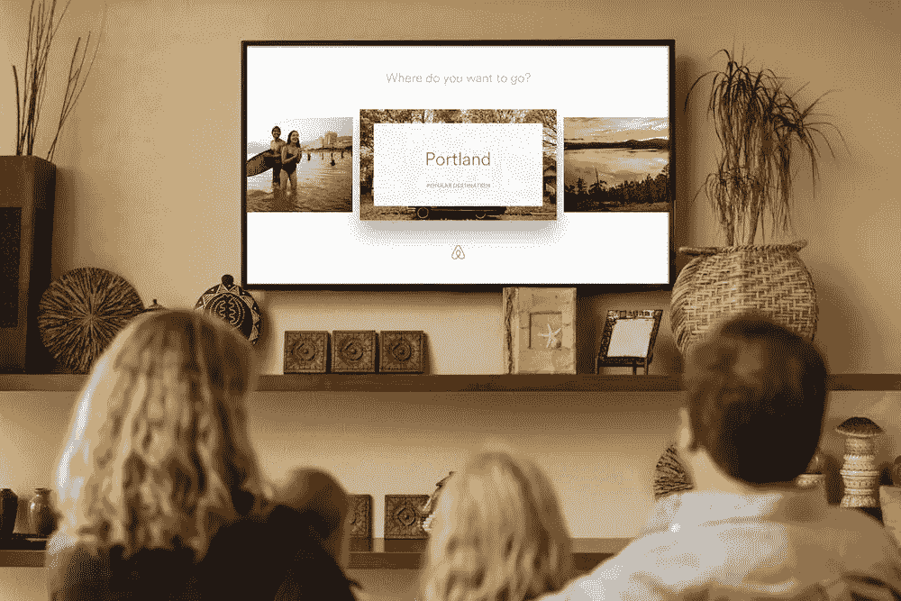
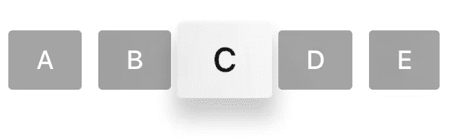

# 掌握 tvOS 焦点引擎

> 原文：<https://medium.com/airbnb-engineering/mastering-the-tvos-focus-engine-f8a13b371083?source=collection_archive---------0----------------------->

由迈克尔·巴赫德和亚当·米凯拉分别出演

tvOS 交互范例向开发者和设计者提出了独特的挑战。新的 Apple TV 将一个类似触控板的遥控器与一个没有传统光标的用户界面配对。因此，“焦点”是应用程序在用户导航时向用户提供视觉反馈的唯一方式。

您可以将焦点引擎视为用户和您闪亮的新 tvOS 应用程序之间的桥梁。尽管这位桥梁守护者并不指望你知道一只空载燕子的[空速](https://youtu.be/cV0tCphFMr8?t=2m49s)，但与 focus engine 成为朋友是构建一个感觉像是这个平台的应用程序的重要一步。

任何经验丰富的 iOS 工程师都会觉得在 tvOS 上使用 UIKit 很舒服——但不要让这些平台显著的相似性诱使你相信它们是相同的。苹果让你的 iOS 应用移植到 tvOS 变得很容易。但是如果你没有从一开始就考虑你的应用程序将如何与焦点引擎交互，当你接近终点线时，你会发现自己在打一场艰苦的战斗。

# 专注到底是什么意思？

用户通过在屏幕上的项目之间移动焦点来导航 tvOS 应用。当一个项目被聚焦时，它的外观会被调整以突出屏幕上其他项目的外观。聚焦效应是 tvOS 公共化的关键。聚焦效果不仅向遥控者提供视觉反馈，也向跟随的旁观者提供视觉反馈。正是它们将这种本地电视体验与在大屏幕上播放你的 iPad 区分开来。

# 有什么可聚焦的？

只有视图可以获得焦点，并且一次只能聚焦一个视图。考虑这些按钮:

按钮 C 当前处于焦点中。在遥控器上向左滑动将聚焦按钮 b。向右滑动将聚焦按钮 d。更积极地向左或向右滑动将分别聚焦按钮 A 或按钮 E。值得注意的是，即使更激进的左击会导致按钮 A 最终获得焦点，按钮 B 也会在这个过程中瞬间获得(然后失去)焦点。

一个特定的视图是否可聚焦是由一个新的实例方法决定的。

苹果已经审计了它的公共框架，并为 *canBecomeFocused()* 提供了明智的实现。只有 UIKit 附带的以下类是可聚焦的:

*   *ui 按钮*
*   *UIControl*
*   *UISegmentedControl*
*   *UITabBar*
*   *UITextField*
*   *UISearchBar* (虽然 *UISearchBar* 本身是不可聚焦的，但是它的内部文本字段是可聚焦的)

*UICollectionViewCell* 和 *UITableViewCell* 是例外。单元格是否可聚焦由 *UICollectionView* 或 *UITableView* 委托决定:

*   *集合视图(_:canFocusItemAtIndexPath:)*
*   *表格视图(_:canFocusRowAtIndexPath:)*

虽然 *UIImageView* 本身是不可聚焦的，但它也是添加了*adjustimagewhancestorfocused*属性的特例。启用后，每当祖先获得焦点时， *UIImageView* 实例将显示聚焦效果。由于系统没有为 *UICollectionView* 单元格提供默认的聚焦效果，这是一种为基于图像的集合视图注入活力的简单方法。你会看到苹果在整个系统用户界面和内置应用程序中广泛使用这种技术。

# 目前的焦点是什么？

您可以询问任何视图它当前是否在焦点上。

您也可以要求屏幕显示当前聚焦的视图(如果存在)。

# 响应焦点更新

在 tvOS 中，所有参与 focus 系统的类都符合 *UIFocusEnvironment* 协议。每个焦点环境对应于视图层次结构的一个特定分支，这意味着焦点环境可以嵌套。

ui focus environment API 允许开发人员和焦点引擎之间就如何在视图层次结构的特定分支内更新焦点进行双向对话。UIView、UIViewController 和 UIPresentationController 符合开箱即用的 UIFocusEnvironment。

覆盖*shouldUpdateFocusInContext(_:)*提供了一个在应用焦点更新之前检查它的机会。 *UICollectionView* 和 *UITableView* 委托提供了此 API 的基于 *NSIndexPath* 的版本，其中所提供的上下文包含上一个和下一个聚焦的索引路径，而不是视图本身。

*   *集合视图(_:shouldUpdateFocusInContext:)*
*   *表视图(_:shouldUpdateFocusInContext:)*

这里有一个玩具示例，展示了如何使用*UICollectionView*delegate 方法在一个单元格被选中时禁用集合视图中的焦点更新。

覆盖*diddupdatefocusincontext(_:withAnimationCoordinator:)*提供了响应焦点更新并参与相关动画的机会。给定两个相邻的按钮，下面是如何将当前处于焦点的按钮水平居中。

当焦点更新周期发生时，在接收焦点的视图、失去焦点的视图以及这两个视图的所有父焦点环境上调用每个方法。

# 请求聚焦

焦点引擎将在适当的时候自动启动焦点更新，如应用程序启动或当当前聚焦的视图从视图层次结构中移除时。开发人员也可以请求 focus 更新，但是任何请求都必须通过 focus 引擎发出。因为只有 focus 引擎可以更新 focus，所以 focus 引擎实际上扮演了桥梁守护者的角色。

*UIFocusEnvironment* 的 *setNeedsFocusUpdate()* 和*updatefocusifneed()*与焦点引擎的交互方式与 *setNeedsLayout()* 和*layoutifneed()*与布局引擎的交互方式非常相似。调用 *setNeedsFocusUpdate()* 将记录您的请求并立即返回。焦点引擎将在下一个更新周期中重新计算焦点。调用*updatefocusifneed()*会立即强制焦点更新。

当一个更新周期开始时，焦点引擎向发起的焦点环境查询它的 *preferredFocusedView* 。如果这个视图是非 *nil* 并且是可聚焦的，那么 focus 引擎将试图通过 focus responder 链发出上述通知事件来为这个视图提供焦点。

让我们看几个我创建的特别没用的 *AnimalsViewController* 的例子。在每个例子中，*狗按钮*最初都有焦点。

焦点引擎将只接受由当前*包含*焦点的焦点环境发出的请求。因此，尽管 *catButton* 的 *preferredFocusedView* 是它自己，但是 *catButton* 更新焦点的请求被忽略。

然而，当 *animalsViewController* 请求焦点更新时，焦点将从 *dogButton* 移动到 *catButton* ，因为当前聚焦的视图( *dogButton* )在由 *animalsViewController* 焦点环境管理的视图层次结构的分支内。

当两个焦点环境同时请求焦点更新时，焦点引擎将遵从父环境。

# 往前走！

有了这份 focus engine 初级读本，您就可以充分利用这个新平台了。focus 系统和 API 是熟悉的和设计良好的，因此当您将应用程序带到电视上时，它很容易成为一种事后的想法。但是，你在这个平台上工作得越多，就越能清楚地看到，利用 focus 引擎的全部能力将标志着 iOS 端口和本地 tvOS 体验之间的差异。

## 在 [airbnb.io](http://airbnb.io) 查看我们所有的开源项目，并在 Twitter 上关注我们:[@ Airbnb eng](https://twitter.com/AirbnbEng)+[@ Airbnb data](https://twitter.com/AirbnbData)

*原载于 2015 年 9 月 11 日*[*nerds.airbnb.com*](http://nerds.airbnb.com/tvos-focus-engine/)*。*