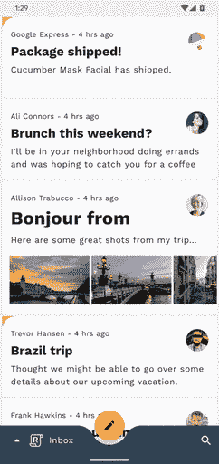

# 使用 MDC 的材料运动

> 原文：<https://medium.com/androiddevelopers/material-motion-with-mdc-c1f09bb90bf9?source=collection_archive---------3----------------------->

## 为 Android 构建带有材质运动的美丽过渡

*这篇文章也发布在* [*材料设计博客*](https://material.io/blog/android-material-motion) *上。*

最近作为 [MDC-Android 库(v 1.2.0)](/google-design/material-components-for-android-1-2-0-is-now-available-aade483ed841) 的一部分发布的[材质运动系统](https://material.io/design/motion/the-motion-system.html)，将常见的过渡提炼为一组简单的模式，以实现更流畅、更易于理解的用户体验。材料运动目前包括四种转变:

*   [容器转换](https://material.io/design/motion/the-motion-system.html#container-transform)
*   [共享轴](https://material.io/design/motion/the-motion-system.html#shared-axis)
*   [淡入淡出](https://material.io/design/motion/the-motion-system.html#fade-through)
*   [褪色](https://material.io/design/motion/the-motion-system.html#fade)

我们已经在 [Android 平台](https://developer.android.com/reference/android/transition/package-summary) & [AndroidX 转换系统](https://developer.android.com/reference/androidx/transition/package-summary)上实现了这些转换，因此它们可以在活动、片段和视图之间移动时轻松使用。

这篇文章介绍了每种模式，并解释了如何将它们添加到您的应用程序中。我将通过为我们的示例应用程序 [Reply](https://material.io/design/material-studies/reply.html) 实现来说明每个步骤，这是一个简单易用的电子邮件客户端。该应用程序的三个流程将获得运动过渡:**打开电子邮件，打开搜索页面，以及切换邮箱**。

如果你更喜欢动手学习，想要直接进入代码，那么考虑做 [Material motion codelab](https://codelabs.developers.google.com/codelabs/material-motion-android) ，它可以让你通过执行每一步来练习这些技术。它还包括关于在 Android 上使用这些过渡的附加信息。

# 容器转换:打开电子邮件

容器转换是转换的“英雄”，当一件事变成另一件事时使用。这是什么意思？例子包括扩展成详细页面的列表项，变形成工具栏的 [FAB](https://material.io/components/buttons-floating-action-button) ，或者扩展成浮动[卡](https://material.io/components/cards)的[芯片](https://material.io/components/chips)。在每种情况下，都有一个组件转换成另一个组件，维护一个共享的“外部”容器，同时动态地交换“内部”内容。使用容器转换在视图之间制作动画有助于加强它们之间的关系，并维护用户的导航上下文。

作为回应，我们在保存电子邮件列表的片段(`[HomeFragment](https://github.com/material-components/material-components-android-examples/blob/develop/Reply/app/src/main/java/com/materialstudies/reply/ui/home/HomeFragment.kt)`)和电子邮件详细信息片段(`[EmailFragment](https://github.com/material-components/material-components-android-examples/blob/develop/Reply/app/src/main/java/com/materialstudies/reply/ui/email/EmailFragment.kt)`)之间添加了一个容器转换。如果你熟悉 [Android 共享元素转换](https://developer.android.com/training/transitions/start-activity)，设置非常相似！

首先确定我们的两个共享元素视图，并给它们分别一个[转换名称](https://developer.android.com/reference/android/view/View#attr_android:transitionName)。第一个是单个电子邮件列表项目卡，我们将使用[数据绑定](https://developer.android.com/topic/libraries/data-binding)来确保每个项目都有唯一的转换名称。

第二个是我们的`[EmailFragment](https://github.com/material-components/material-components-android-examples/blob/develop/Reply/app/src/main/java/com/materialstudies/reply/ui/email/EmailFragment.kt)`中的全屏卡，可以给它一个静态转换名，因为它是视图层次中唯一的一个。注意，我们的第一个和第二个共享元素不需要使用相同的转换名称。

这两个视图将被我们的容器转换获取。在引擎盖下，两者都将被放置在一个 drawable 中，该 drawable 的边界被裁剪在一个“容器”中，该容器将其形状从一个列表项动画化为一个详细信息页面。在转换过程中，容器的内容(列表项和详细信息页面)通过在输出屏幕的顶部淡入输入屏幕来交换。

现在我们已经标记了我们的共享元素视图，让我们创建并设置我们的目标片段的`[sharedElementEnterTransition](https://developer.android.com/reference/androidx/fragment/app/Fragment#setSharedElementEnterTransition(java.lang.Object))`为`[MaterialContainerTransform](https://github.com/material-components/material-components-android/blob/master/lib/java/com/google/android/material/transition/MaterialContainerTransform.java)`的一个新实例。默认情况下，从详情页返回时，这个`sharedElementEnterTransition`也会自动反转播放。

> *关于* `*MaterialContainerTransform*` *参数的详细信息，参见* [*运动文档*](https://github.com/material-components/material-components-android/blob/master/docs/theming/Motion.md#container-transform) *。*

现在，当单击一封电子邮件时，我们需要做的就是为片段事务提供开始和结束视图转换名称之间的映射。有了这些信息，细节片段的共享元素转换就能够使用我们提供的`MaterialContainerTransform`找到并激活这两个视图。

> 在上面的代码片段中，我们还为输出列表片段设置了一个`exit`和`reenter`转换。Material Components 提供了两个辅助过渡来平滑地为被替换的片段制作动画:`[Hold](https://github.com/material-components/material-components-android/blob/master/lib/java/com/google/android/material/transition/Hold.java)`和`[MaterialElevationScale](https://github.com/material-components/material-components-android/blob/master/lib/java/com/google/android/material/transition/MaterialElevationScale.java)`。除了淡出功能，`MaterialElevationScale`还会在退出时缩小我们的邮件列表，在重新进入时缩小它们。`Hold`将我们的电子邮件列表放在原处。如果不设置退出过渡，我们的电子邮件列表会立即被删除，从视图中消失。

如果我们在此时运行代码，并从详细信息页面导航回我们的电子邮件列表，return 转换将不会运行。这是因为转换系统无法找到映射到我们的转换名称的两个视图，因为当我们的转换开始时，电子邮件列表适配器还没有被填充。幸运的是，我们有两个方便的方法可以使用:`postponeEnterTransition`和`startPostponedEnterTransition`。这些允许我们延迟转换，直到我们知道我们的共享元素被布置好并且可以被转换系统找到。作为回答，我们可以推迟，直到我们确定已经填充了我们的`RecyclerView`适配器，并且我们的列表项已经使用下面的代码片段绑定了转换名称:

在您自己的应用程序中，您可能需要尝试这两种方法，根据您填充 UI 的方式和时间，找到开始延迟过渡的正确时间。如果您发现您的返回动画没有运行，在共享元素准备好之前开始过渡可能是原因。

转到我们的搜索屏幕！

# 共享轴:打开搜索页面

共享轴模式用于具有空间或导航关系的 UI 元素之间的转换。作为回复，打开搜索会把用户带到一个新的页面，这个页面位于电子邮件列表的顶部。为了说明这个三维模型，我们可以在电子邮件列表(`[HomeFragment](https://github.com/material-components/material-components-android-examples/blob/develop/Reply/app/src/main/java/com/materialstudies/reply/ui/home/HomeFragment.kt)`)和搜索页面(`[SearchFragment](https://github.com/material-components/material-components-android-examples/blob/develop/Reply/app/src/main/java/com/materialstudies/reply/ui/search/SearchFragment.kt)`)之间使用一个共享的 z 轴转换。

共享轴变换同时作用于两个目标，以创建最终的、编排好的变换。这意味着“成对”的转场一起运行，以创建连续的“定向”动画。对于片段，这些对是

*   碎片 a 的`exitTransition`和碎片 B 的`enterTransition`
*   碎片 a 的`reenterTransition`和碎片 b 的`returnTransition`

实现共享轴模式的类`[MaterialSharedAxis](https://github.com/material-components/material-components-android/blob/master/lib/java/com/google/android/material/transition/MaterialSharedAxis.java)`接受一个名为`forward`的属性来控制方向性的概念。对于每个过渡对，`forward`必须设置为相同的值，以使该对的动画正确协调。

> 参见[运动文档](http://currentnavigationfragment?.apply%20%7B%20%20%20%20exitTransition%20=%20MaterialSharedAxis(MaterialSharedAxis.Z,%20true).apply%20%7B%20%20%20%20%20%20%20%20duration%20=%20resources.getInteger(R.integer.reply_motion_duration_large).toLong()%20%20%20%20%7D%20%20%20%20reenterTransition%20=%20MaterialSharedAxis(MaterialSharedAxis.Z,%20false).apply%20%7B%20%20%20%20%20%20%20%20duration%20=%20resources.getInteger(R.integer.reply_motion_duration_large).toLong()%20%20%20%20%7D%20%7D)了解共享轴方向性的更多细节。

作为回答，下面是我们如何为当前片段(`[HomeFragment](https://github.com/material-components/material-components-android-examples/blob/develop/Reply/app/src/main/java/com/materialstudies/reply/ui/home/HomeFragment.kt)`)设置退出并重新输入转换。

在我们的目的地片段(`[SearchFragment](https://github.com/material-components/material-components-android-examples/blob/develop/Reply/app/src/main/java/com/materialstudies/reply/ui/search/SearchFragment.kt)`)中，我们设置了进入和返回转换。

注意当前片段的退出转换和搜索片段的进入转换对`forward` — `true`使用了相同的值。当前片段的重新进入过渡和搜索片段的返回过渡也是如此。

接下来，默认情况下，过渡在其场景根层次内的所有子视图上运行。这意味着共享轴转换将应用于列表页面中的每封电子邮件和搜索页面的每个子页面。如果你想“传播”或“[交错](https://material.io/archive/guidelines/motion/choreography.html#choreography-creation)动画，这可能是一个很好的特性，但是因为我们想将每个片段的根作为一个整体来制作动画，我们需要在我们的[电子邮件列表](https://github.com/material-components/material-components-android-examples/blob/develop/Reply/app/src/main/res/layout/fragment_home.xml#L18) `[RecyclerView](https://github.com/material-components/material-components-android-examples/blob/develop/Reply/app/src/main/res/layout/fragment_home.xml#L18)`和我们的[搜索页面根视图组](https://github.com/material-components/material-components-android-examples/blob/develop/Reply/app/src/main/res/layout/fragment_search.xml#L17)上设置`**android:transitionGroup="true"**`。

这样，我们应该有一个很好的共享 z 轴转换到我们的搜索页面和从我们的搜索页面！Shared axis 是一种真正灵活的过渡，可以在许多不同的场景中工作，从页面过渡到智能回复选择，再到入职或垂直步进流程。现在您已经配置好了设置，您还可以试验一下`[MaterialSharedAxis](https://github.com/material-components/material-components-android/blob/master/lib/java/com/google/android/material/transition/MaterialSharedAxis.java)`的`axis`参数，看看其他轴动画是什么样子的。

# 淡入淡出:切换邮箱

我们要讨论的最后一个模式是渐变模式。淡入淡出可用于在*与*没有强关系的 UI 元素之间转换。当在邮箱之间转换时，我们不希望用户认为他们发送的邮件与他们的收件箱有导航联系。因为每个邮箱都是一个顶级目的地，所以淡入淡出是一个合适的选择。作为回复，我们将用不同的邮件列表(`[HomeFragment](https://github.com/material-components/material-components-android-examples/blob/develop/Reply/app/src/main/java/com/materialstudies/reply/ui/home/HomeFragment.kt)`和新的参数)替换邮件列表(`[HomeFragment](https://github.com/material-components/material-components-android-examples/blob/develop/Reply/app/src/main/java/com/materialstudies/reply/ui/home/HomeFragment.kt)`)。

由于`[MaterialFadeThrough](https://github.com/material-components/material-components-android/blob/master/lib/java/com/google/android/material/transition/MaterialFadeThrough.java)`没有方向性的概念，设置起来更加容易。我们可以在传出片段上设置一个退出转换，在传入片段上设置一个进入转换。

在我们的电子邮件的 `[RecyclerView](https://github.com/material-components/material-components-android-examples/blob/develop/Reply/app/src/main/res/layout/fragment_home.xml#L25)`的[列表上设置`**android:transitionGroup="true"**`的需求也适用于此，但这已经在我们的共享轴配置步骤中考虑到了。](https://github.com/material-components/material-components-android-examples/blob/develop/Reply/app/src/main/res/layout/fragment_home.xml#L25)

这就是淡入淡出过渡！在你自己的应用程序中寻找有趣的地方来使用淡入淡出模式，比如在底部导航目的地之间切换，交换项目列表，或者替换工具栏菜单。

# 继续前进！

这是对 Android 上的材质运动系统的简要介绍。使用提供的模式，你可以对[定制动作](https://material.io/design/motion/customization.html)做很多事情，让动作成为你品牌体验的一部分。还要记住，当我们查看片段转换时，运动系统可以用来在活动之间转换，一直到视图。查看完整的[动作规范](https://material.io/design/motion/the-motion-system.html)以获得一些鼓舞人心的例子，让你思考你可以在哪里改进你的应用程序的核心体验，或者在小地方增加一些额外的乐趣。

要继续学习，请查看以下附加资源:

[**素材运动开发者文档**](https://github.com/material-components/material-components-android/blob/master/docs/theming/Motion.md)

在 Material Android 的 motion 文档中可以找到很多关于活动和视图之间动画的定制选项和提示！

[**材料运动 codelab**](https://codelabs.developers.google.com/codelabs/material-motion-android/#0)

一个完整的，一步一步的开发者教程，涵盖了如何添加材料运动回复。

[**谷歌安卓驱动**](https://play.google.com/store/apps/details?id=com.google.android.apps.docs)

看看 Android 上的 Google Drive，看看运动系统的运行情况。点击文件夹、打开搜索、在底部导航目的地之间导航都使用 MDC-Android 的转换。