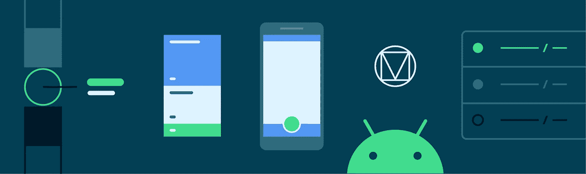
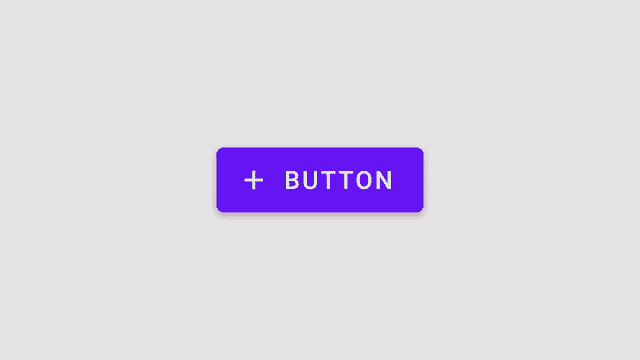
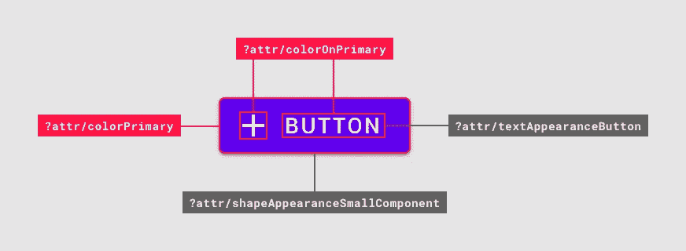
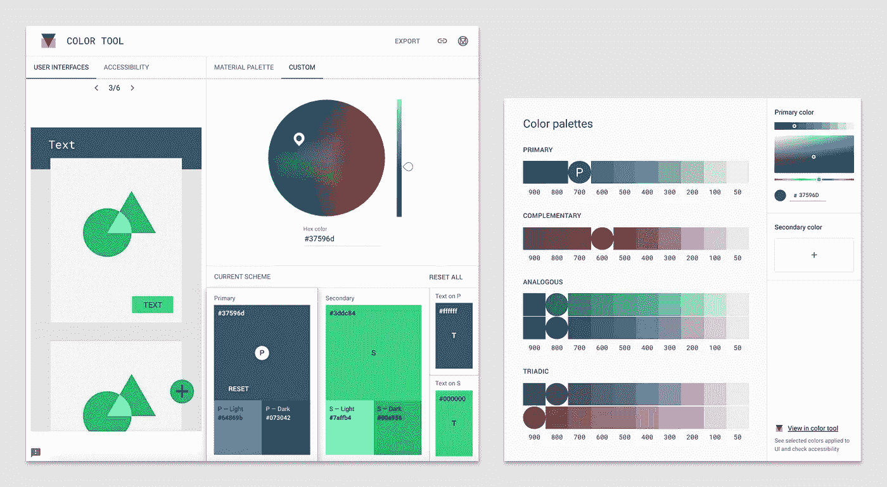
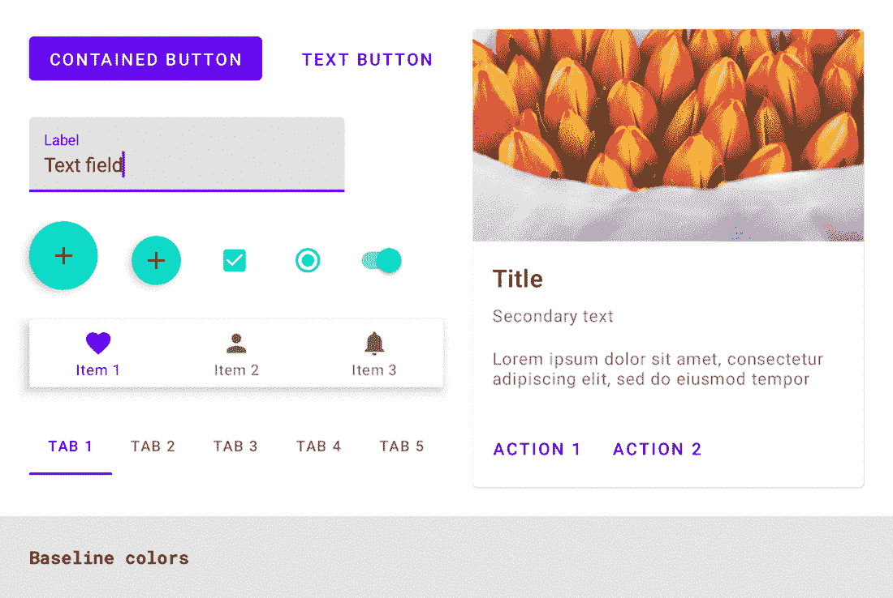
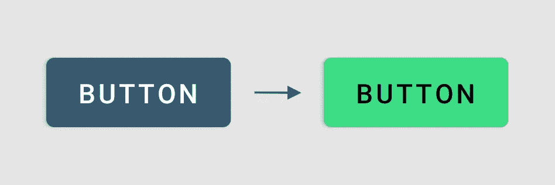
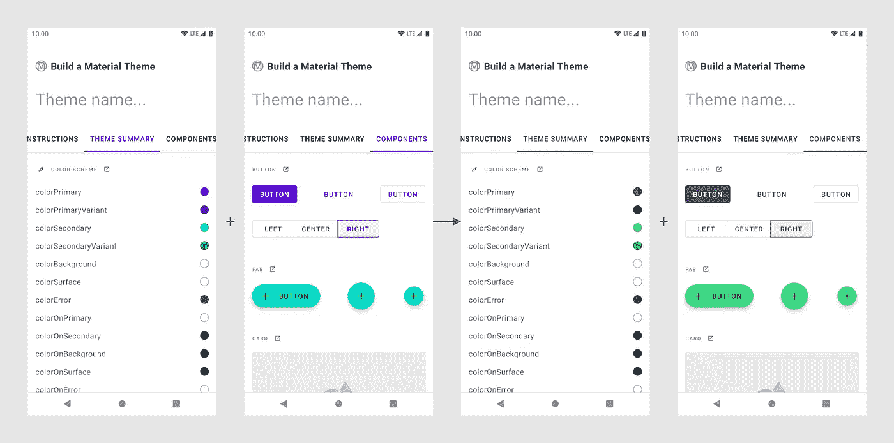
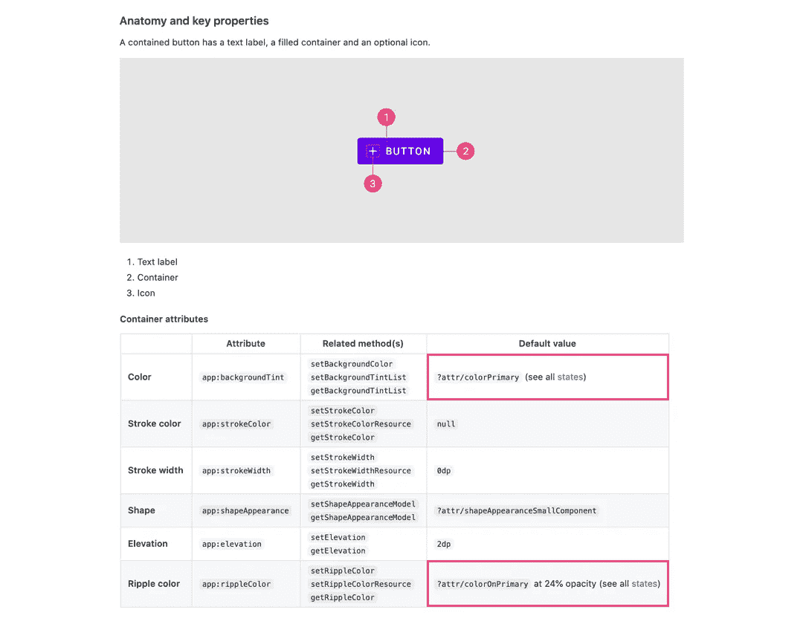
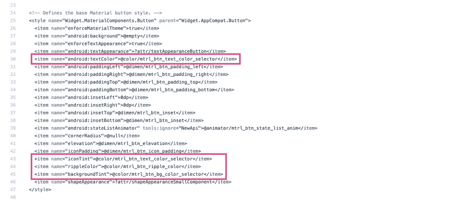

# 使用 MDC 的材质主题:颜色

> 原文：<https://medium.com/androiddevelopers/material-theming-with-mdc-color-860dbba8ce2f?source=collection_archive---------0----------------------->



## 使用 MDC 库的 Android 颜色主题

*这篇文章也发布在* [*材料设计博客*](https://material.io/blog/android-material-theme-color) *上。*

[材料主题化](https://material.io/design/material-theming/overview.html#material-theming)是一种定制[材料成分](https://material.io/components)以符合您的品牌的方式。材质主题包括[颜色](https://material.io/design/color/)、[版式](https://material.io/design/typography/)和[形状](https://material.io/design/shape/)参数，您可以调整这些参数以获得组件的近乎无限的变化——同时保持它们的核心结构和可用性。



在 Android 上，从版本`1.1.0`开始，可以使用[材料组件(MDC)库](https://github.com/material-components/material-components-android)实现材料主题化。如果您希望从设计支持库或 MDC `1.0.0`进行迁移，请查看我们的迁移指南。

[](/androiddevelopers/migrating-to-material-components-for-android-ec6757795351) [## 迁移到 Android 的材料组件

### 来自设计支持库👉MDC 1.0.0👉MDC 1.1.0 及更高版本

medium.com](/androiddevelopers/migrating-to-material-components-for-android-ec6757795351) 

这篇文章将集中在颜色主题上。

# 颜色属性

材料设计提供了 12 种颜色的“插槽”,构成了应用程序的整体调色板。每一个都有一个设计术语(如“原色”)以及一个相应的颜色属性，可以在你的应用程序主题中覆盖(如`colorPrimary`)。亮主题和暗主题都有默认的“基线”值。


MDC color attributes with light baseline values


MDC color attributes with dark baseline values

材质组件使用这些颜色属性来给小部件的元素着色。



Color attributes used by a button

它们与 eg 一起使用。

```
app:backgroundTint=”?attr/colorSecondary”
```

在布局和部件样式中。

你可能会认出*这些颜色属性中的一些*，比如`colorPrimary`。这是因为其中一些是从 AppCompat 和平台继承的，而其余的是 MDC 新引入的。下表说明了每个属性的来源。

# 挑选颜色

确定每个槽使用的颜色值可能是设计师的责任，或者来自于您的产品品牌。但是，了解每种颜色的作用、它们之间的关系以及如何满足可访问性要求仍然很有用:

*   `colorPrimary`和`colorSecondary`代表您品牌的颜色
*   `colorPrimaryVariant`和`colorSecondaryVariant`是您品牌颜色中较浅的*或较深的*
*   `colorSurface`用于材料的“薄片”(如卡片和底层)
*   `android:colorBackground`是您的应用程序的窗口背景颜色
*   `colorError`顾名思义，表示错误和警告
*   各种“开”颜色(`colorOnPrimary`、`colorOnSecondary`、`colorOnSurface`等)。)用于给显示在其他颜色之上的*前景内容(如文本和图标)着色。它们需要满足[的可访问性要求](https://material.io/design/usability/accessibility.html#color-and-contrast)，并且与展示它们的颜色有足够的对比度。*

## 颜色工具

材料设计为预览颜色和确定合适的变体和“开”色提供了有用的工具:

*   [**材质颜色工具**](https://material.io/resources/color/) **:** 获得你的原色和次原色的亮/暗变体以及合适的“开”色。预览这些在示例屏幕中的外观。
*   [**材质调色板生成器**](https://material.io/design/color/the-color-system.html#tools-for-picking-colors) **:** 为一种颜色生成全色调调色板(shade 50–900)。获取互补色、类似色和三色的建议。



Material color tool (left) and Material palette generator (right)

## 需要考虑的事项

*   你几乎总是想覆盖`colorPrimary`、`colorSecondary`和它们的变体，除非你的品牌恰好使用完全相同的紫色/蓝绿色十六进制值作为基线材质主题。
*   您不必覆盖所有颜色。有些，比如`colorSurface`，使用中性色，所以依赖默认值是完全没问题的。
*   如果您的品牌没有定义任何类型的辅助色或强调色，那么可以对`colorPrimary`和`colorSecondary`使用单一颜色。变体也是如此(例如`colorPrimary`和`colorPrimaryVariant`可能相同)。
*   尽管是独立的属性，但颜色、它的变体(如果存在的话)和它的“开”色(例如`colorPrimary`、`colorPrimaryVariant`和`colorOnPrimary`)之间有着内在的联系。覆盖一个意味着检查其他的是否有意义，是否满足可访问性需求。

## 附加颜色插槽

您的设计系统可能需要材质主题指定的 12 个颜色槽之外的额外颜色槽。幸运的是，在 Android 上通过声明一个颜色属性，这相对容易做到:

# 色彩资源

颜色值被定义为`<color>`资源。对于自定义颜色，我们推荐两种方法来帮助分离关注点，并为您的应用程序中的颜色主题值创建一个真实的来源:

*   将所有的`<color>`存储在一个单独的 res/values/colors.xml 文件中
*   使用文字名称来描述值，而不是分配语义含义:
*   这样做鼓励在使用颜色时使用`?attr/`引用，这是支持深色主题的推荐方法
*   使用像`green_500`或`brand_name_yellow`这样的名字
*   避免语义名称，如`color_primary`

# 覆盖应用程序主题中的颜色

让我们来看看如何通过覆盖相关属性将您选择的调色板添加到应用程序主题中。

首先，我们建议设置你的主题来优雅地处理浅色和深色调色板，同时减少基本主题的重复。关于这个话题的更多信息，请看一下 [Chris Banes](https://medium.com/u/9303277cb6db?source=post_page-----860dbba8ce2f--------------------------------) 关于黑暗主题的文章，以及[他和](https://chris.banes.dev/talks/2019/developing-themes-with-style-berlin/) [Nick Butcher](https://medium.com/u/22c02a30ae04?source=post_page-----860dbba8ce2f--------------------------------) 的【用风格开发主题】演讲。

[](/androiddevelopers/dark-theme-with-mdc-4c6fc357d956) [## MDC 的黑暗主题

### 使用材料设计组件实现黑暗主题

medium.com](/androiddevelopers/dark-theme-with-mdc-4c6fc357d956) 

设置好之后，覆盖你想在明暗主题中改变的颜色属性:

材质组件将响应主题级别的颜色覆盖:



Material Design components responding to theme-level color overrides

# 颜色可重用性和最佳实践

有许多情况涉及到在布局、绘图、风格和其他地方使用颜色。我们将通过一些方法使你的代码尽可能地可重用，而不管你的应用主题中指定的颜色值。

## 首选属性

我们建议最重要的是使用`?attr/`颜色参考。这是创建可重用布局和默认样式的推荐方法，这些布局和样式支持多种主题，如亮/暗。

看看 Nick Butcher 的“Android 风格:偏好主题属性”文章，了解更多解释和一些例外情况。

[](/androiddevelopers/android-styling-prefer-theme-attributes-412caa748774) [## Android 风格:偏好主题属性

### 所有事物的主题属性

medium.com](/androiddevelopers/android-styling-prefer-theme-attributes-412caa748774) 

## 带 alpha 的颜色

有时候，您可能希望使用 MDC 主题中的一种颜色，其 alpha 值为 60%。这方面的例子包括触摸波纹和检查状态覆盖。

Android `<color>`资源*是否*允许 alpha 通道:

```
<!-- 60% alpha = 99 -->
<color name=”navy_700_alpha_60”>#9937596D</color>
```

然而，使用这种方法，我们需要为每个 alpha 值维护单独的颜色资源。这也意味着我们不能使用这些作为`?attr/`，这违背了我们上面提到的单一来源的真理方法。

相反，我们建议利用存储在你的 res/color 目录中的`ColorStateList`。一个 CSL 可以有一个包含颜色引用*和 alpha 值*的项目，这对于我们的用例来说是完美的:

使用这些可能会让你感到惊讶——它们引用了`@color/primary_60`符号——但是考虑到我们正在处理一个本身使用`?attr/`来引用底层主题颜色的 CSL，这没有问题。

## 每个状态的颜色和主题覆盖

`ColorStateList`更常用于根据视图状态在颜色(和 alpha 值)之间切换。MDC 小部件对禁用状态、悬停状态和按下状态等大量使用了这一点。下面是 MDC [源代码](https://github.com/material-components/material-components-android/blob/master/lib/java/com/google/android/material/button/res/color/mtrl_btn_bg_color_selector.xml)中一个按钮背景色调的例子:

以按钮为例，假设您想将主背景色从原色更改为次色:



Primary button (left) and secondary button (right)

您可以*将上面的源文件*复制到您的代码库中，并将`colorPrimary`更改为`colorSecondary`，但是这很繁琐，而且如果源代码发生变化，就会出现问题。

更好的方法是使用主题叠加。Nick Butcher 在他的“Android 风格:主题叠加”的帖子中对此进行了详细介绍。本质上，我们可以为特定的`View`或`ViewGroup`以及任何后代(在我们的例子中是一个按钮)替换特定主题属性的值(在我们的例子中是 T0)。

[](/androiddevelopers/android-styling-themes-overlay-1ffd57745207) [## Android 风格:主题覆盖

### 在本系列关于 Android 风格的前几篇文章中，我们已经看到了风格和主题之间的区别…

medium.com](/androiddevelopers/android-styling-themes-overlay-1ffd57745207) 

下面可以看到一个基本的主题叠加。请注意空的父对象，这确保我们只覆盖我们希望更改的属性:

在 XML 中应用主题覆盖时，有两个选项需要考虑:

*   `android:theme`:适用于所有小工具，不适用于默认样式
*   `app:materialThemeOverlay`:仅适用于 MDC 窗口小部件(或在使用[materialsthemeoverlay # wrap](https://github.com/material-components/material-components-android/blob/master/lib/java/com/google/android/material/theme/overlay/MaterialThemeOverlay.java#L61)的自定义视图中)，适用于默认样式

## API 兼容性

csl 和其他地方对`?attr/`的平台支持只在 API 23 中添加。如果你的 minSdk 低于这个，不要担心:兼容性类确实存在！事实上，MDC 和 AppCompat 小部件都利用了这些底层功能，因此在使用它们时不需要额外的工作。

对于需要以编程方式使用 csl 的场景，使用`[AppCompatResources](https://developer.android.com/reference/androidx/appcompat/content/res/AppCompatResources)`:

```
val primary60 = AppCompatResources.getColorStateList(
    context, R.color.primary60
)
```

# MDC 小部件中的颜色

前面我们说过，MDC 小部件响应主题级别颜色属性的覆盖。但是你怎么知道，例如，一个按钮使用`colorPrimary`作为它的背景色调，使用`colorOnPrimary`作为它的图标和文本标签呢？让我们来看看几个选项。

## 建立一个物质主题

[构建一个材质主题](https://material.io/resources/build-a-material-theme)是一个交互式 Android 项目，让你通过定制颜色、字体和形状的值来创建自己的材质主题。它还包括所有主题化参数和组件的目录。可以通过以下方式确定哪些小部件响应主题颜色属性的变化:

*   克隆[项目](https://github.com/material-components/material-components-android-examples/tree/develop/MaterialThemeBuilder)并在 Android Studio 中运行应用程序
*   调整 [res/values/color.xml](https://github.com/material-components/material-components-android-examples/blob/develop/MaterialThemeBuilder/app/src/main/res/values/color.xml) 以及 [res/values/themes.xml](https://github.com/material-components/material-components-android-examples/blob/develop/MaterialThemeBuilder/app/src/main/res/values/themes.xml) 和[RES/values-night/themes . XML](https://github.com/material-components/material-components-android-examples/blob/develop/MaterialThemeBuilder/app/src/main/res/values-night/themes.xml)中的值
*   通过重新运行应用程序观察视觉变化



Changes in color values in Build a Material Theme

## MDC 开发人员文档

MDC 开发人员文档最近已被刷新。作为其中的一部分，我们包含了属性表，其中包含了库中使用的设计术语和默认值。例如，查看更新的[按钮文档](https://github.com/material-components/material-components-android/blob/master/docs/components/Button.md)的“解剖和关键属性”部分。



MDC button dev doc attribute table with default color values

## 源代码

检查 MDC 源代码可以说是最可靠的方法。MDC 使用默认样式来实现材质主题化，所以查看这些以及任何可样式化的属性和 java 文件是一个好主意。例如，检查`MaterialButton`的[样式](https://github.com/material-components/material-components-android/blob/master/lib/java/com/google/android/material/button/res/values/styles.xml)、[属性](https://github.com/material-components/material-components-android/blob/master/lib/java/com/google/android/material/button/res/values/attrs.xml)和 [java 文件](https://github.com/material-components/material-components-android/blob/master/lib/java/com/google/android/material/button/MaterialButton.java)。



MDC button default style with color values

# 自定义视图中的颜色

您的应用程序可能包含您构建的或从现有库中获取的自定义微件。将这些视图与标准的 MDC 小部件一起使用时，使这些视图响应材料主题是很有用的。让我们来看看在支持定制小部件的颜色主题化时需要记住什么。

## 在`<declare-styleable>` s 和默认样式中使用 MDC 属性

允许您的定制视图被样式化涉及到使用一个`<declare-styleable>`。重用 MDC 中的 attr 名称有助于保持一致性。使用`<declare-styleable>`的默认样式也可以引用 MDC 主题颜色属性的值:

## `MaterialColors`公用事业类

可以使用一个方便的新 MDC 类`[MaterialColors](https://github.com/material-components/material-components-android/blob/master/lib/java/com/google/android/material/color/MaterialColors.java)`以编程方式解析主题颜色属性，这对于定制视图也很有用:

# 好的谷歌，下一步是什么？

我们已经使用 MDC 完成了在你的 Android 应用中实现颜色主题的过程。一定要看看我们在这个系列中的其他帖子，为什么我们建议使用 MDC，类型主题，形状主题，黑暗主题和材质的运动系统。

[](/androiddevelopers/we-recommend-material-design-components-81e6d165c2dd) [## 我们推荐材料设计组件

### 原因如下

medium.com](/androiddevelopers/we-recommend-material-design-components-81e6d165c2dd) [](/androiddevelopers/material-theming-with-mdc-type-8c2013430247) [## 使用 MDC 的材质主题:类型

### 使用 MDC 库在 Android 上输入主题

medium.com](/androiddevelopers/material-theming-with-mdc-type-8c2013430247) [](/androiddevelopers/material-theming-with-mdc-shape-126c4e5cd7b4) [## 使用 MDC 的材质主题:形状

### 使用 MDC 库在 Android 上设计主题

medium.com](/androiddevelopers/material-theming-with-mdc-shape-126c4e5cd7b4) [](/androiddevelopers/dark-theme-with-mdc-4c6fc357d956) [## MDC 的黑暗主题

### 使用材料设计组件实现黑暗主题

medium.com](/androiddevelopers/dark-theme-with-mdc-4c6fc357d956) [](/androiddevelopers/material-motion-with-mdc-c1f09bb90bf9) [## 使用 MDC 的材料运动

### 为 Android 构建带有材质运动的美丽过渡

medium.com](/androiddevelopers/material-motion-with-mdc-c1f09bb90bf9) 

一如既往，我们鼓励你在 GitHub 上提交[错误报告](https://github.com/material-components/material-components-android/issues/new?assignees=&labels=bug&template=bug_report.md&title=%5BComponent+name%5D+Short+description+of+issue)和[功能请求](https://github.com/material-components/material-components-android/issues/new?assignees=&labels=feature+request&template=feature_request.md&title=%5BComponent+name%5D+Short+description+of+request)。另外，请务必查看我们的 Android [配套示例应用](https://github.com/material-components/material-components-android-examples)。

如果你已经成功实现了颜色主题化，或者如果你在这样做时遇到了困难，请在下面留下评论，或者通过 Twitter[@ material design](https://twitter.com/materialdesign)和 [@AndroidDev](https://twitter.com/AndroidDev) 联系我们。