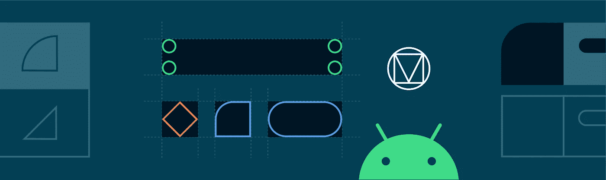
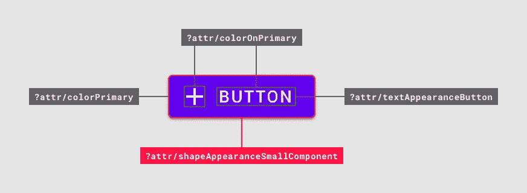
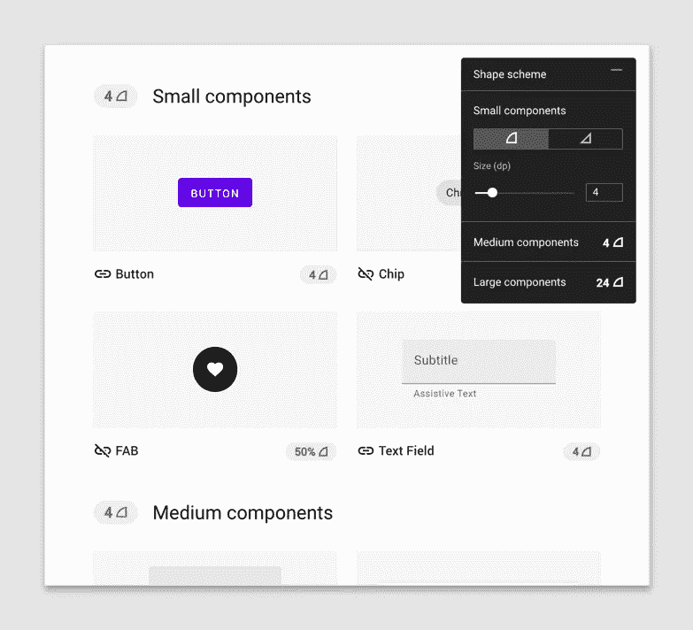
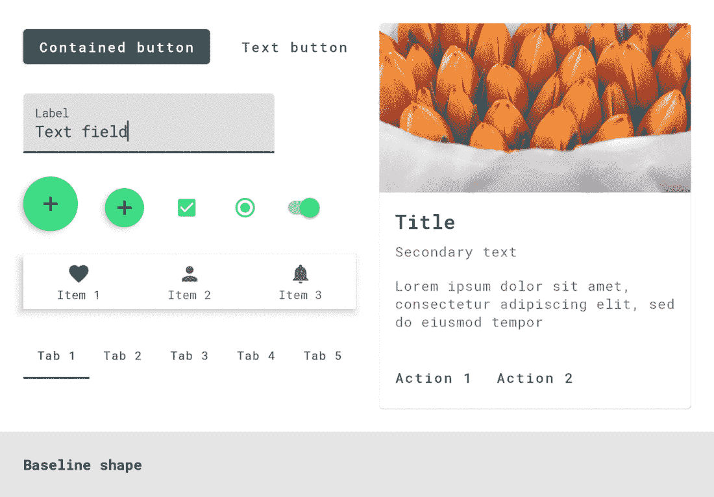
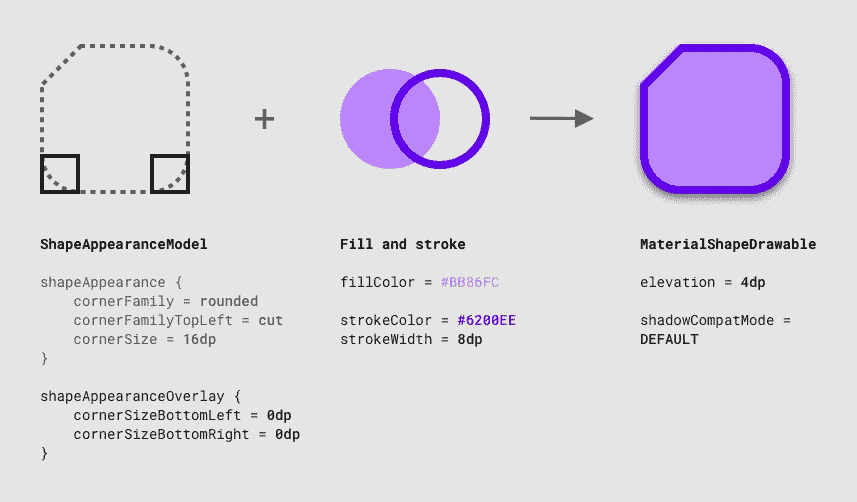
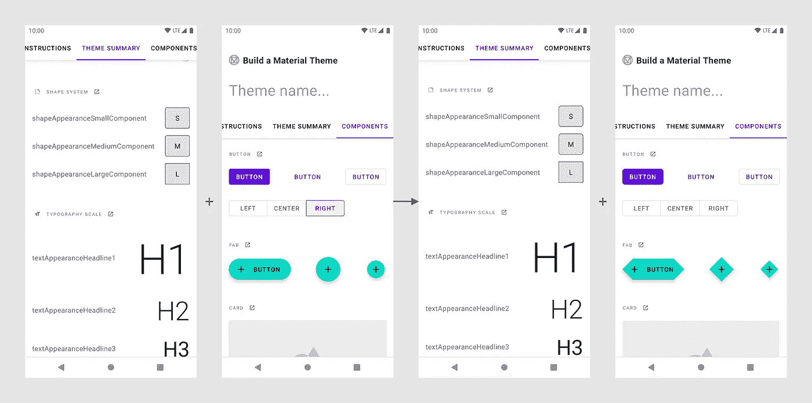
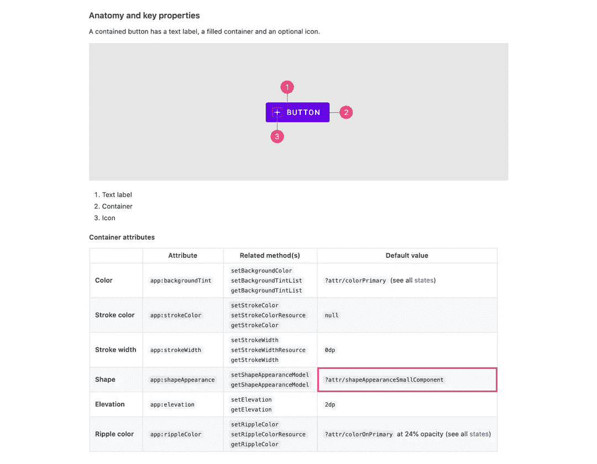
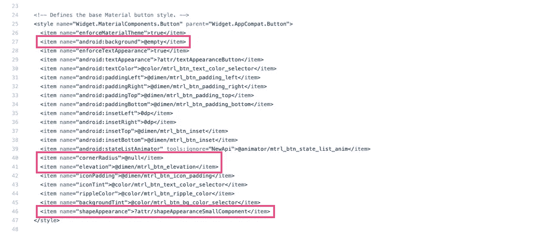

# 使用 MDC 的材质主题:形状

> 原文：<https://medium.com/androiddevelopers/material-theming-with-mdc-shape-126c4e5cd7b4?source=collection_archive---------4----------------------->



## 使用 MDC 库在 Android 上设计主题

*这篇文章也贴在* [*材料设计博客*](https://material.io/blog/android-material-theme-shape) *上。*

[材料主题化](https://material.io/design/material-theming/overview.html#material-theming)是一种定制[材料成分](https://material.io/components)以符合您的品牌的方式。材质主题包括[颜色](https://material.io/design/color/)、[版式](https://material.io/design/typography/)和[形状](https://material.io/design/shape/)参数，您可以调整这些参数以获得组件的近乎无限的变化——同时保持其核心结构和可用性。


在 Android 上，从版本`1.1.0`开始，可以使用[材质组件(MDC)库](https://github.com/material-components/material-components-android)实现材质主题化。如果您希望从设计支持库或 MDC `1.0.0`进行迁移，请查看我们的迁移指南。

[](/androiddevelopers/migrating-to-material-components-for-android-ec6757795351) [## 迁移到 Android 的材料组件

### 来自设计支持库👉MDC 1.0.0👉MDC 1.1.0 及更高版本

medium.com](/androiddevelopers/migrating-to-material-components-for-android-ec6757795351) 

这篇文章将重点讨论**形状**主题。

大多数小部件都有背景形状，但是你有没有想过形状是如何影响用户行为的？就像颜色和版式一样，形状可以引导用户的注意力，暗示交互，并在视觉上区分用户界面中的元素。Material 的形状主题化使您能够定义全局形状值，从而改变整个应用程序中组件的样式，例如，为您的所有卡片、对话框和菜单提供真正友好的圆角。

# 形状属性

材质设计提供了 3 个形状“类别”,应用于应用程序的可塑形部件。每一个都有一个设计术语(例如“小组件”)以及一个相应的形状属性，可以在你的应用程序主题中覆盖(例如`shapeAppearanceSmallComponent`)。有默认的“基线”值(拐角尺寸、拐角系列等。)每个类别。


MDC shape attributes with baseline values

材质组件使用这些形状属性来设计小部件的背景。



Shape attributes used by a button

它们与 eg 一起使用。

```
app:shapeAppearance=”?attr/shapeAppearanceSmallComponent”
```

在布局和部件样式中。

在 MDC 主题中，这些属性映射到样式，例如。

```
<style name=”Theme.MaterialComponents.*” parent="...">
    ...
    <item name=”shapeAppearanceMediumComponent”>
        @style/ShapeAppearance.MaterialComponents.MediumComponent
    </item>
<style />
```

样式和相应的属性对 MDC 来说是新的。这些将在下面的**形状资源**部分详细讨论。

# 采摘形状

确定使用哪些形状类别以及其中的值可能是设计师的责任和/或来自你的产品品牌。但是，了解每个类别的作用以及应该在哪些场景中使用它们仍然很有用:

*   `shapeAppearanceSmallComponent`用于小尺寸组件，如按钮和文本字段
*   `shapeAppearanceMediumComponent`用于中等大小的组件，如卡片和对话框
*   `shapeAppearanceLargeComponent`用于底板等大尺寸部件

参见[形状指南](https://material.io/design/shape/applying-shape-to-ui.html#shape-scheme)了解从组件到形状类别的完整映射列表。

# 形状工具

Material Design 提供了一个有用的[形状定制工具](https://material.io/design/shape/about-shape.html#shape-customization-tool)，用于预览形状类别以及如何将更改应用于各种组件的拐角。



Shape customization tool

# 形状资源

形状资源主要由`ShapeAppearance`风格组成。这些类似于类型主题化的`TextAppearance`样式；在这种情况下,“样式”只与形状属性有关。让我们来看看 Android 和 MDC 上有哪些功能，以及在声明样式时需要记住的一些事情。

## XML 形状和`android:background`

在 MDC 之前，您通常会在 res/drawable 目录中定义一个自定义背景，例如。

```
<shape android:shape="rectangle">
    ...
    <corners android:radius="8dp" />
    <solid android:color="?attr/colorSurface" />
</shape>
```

它适用于这样的小部件:

```
<View
    ...
    android:background=”@drawable/shape_background” />
```

这是一个简化的例子。XML shape drawables 可以包含许多其他元素，比如`<inset>` s、`<stroke>` s、`<gradient>` s 等。或者支持多种状态。

有时这种方法是必要的，但也有一些缺点需要考虑:

*   它缺少许多其他主题化系统的有用特性(比如颜色和类型)；预定义的属性来指定主题级别的形状，覆盖以及在样式中提取形状值的能力
*   Material Design 的[形状系统](https://material.io/design/shape/about-shape.html#shaping-material)支持圆角和切角，但是没有一个优雅的解决方案可以用 XML 或编程方式实现切角
*   应用复杂的形状处理，例如在[底部应用栏](https://material.io/components/app-bars-bottom)上的顶部边缘缩进，将是不可能的，并且将需要实现一个自定义`Drawable`

## `ShapeAppearance`款式

MDC 提供了一种定义形状的新方法。`ShapeAppearance`款式可以被看作是材质设计造型类别的 Android 等价物。它们提供了一种定义形状特征的方法，而不需要直接处理 drawables。它们目前只支持 MDC 小部件，并由一个新的`MaterialShapeDrawable`类支持，这将在下面详细讨论。

在定义您的形状主题时，我们推荐两种方法来帮助分离关注点，并为您的应用程序中的形状主题值创建一个真实的来源:

*   将所有的`ShapeAppearance`样式存储在一个文件中
*   使用 MDC `ShapeAppearance`样式作为父样式，并遵循相同的命名约定

您可以在这些样式中使用的属性和值与那些受`MaterialShapeDrawable`支持的保持一致:

*   `cornerFamily`是所有角落的家族，不是`rounded`就是`cut`
*   `cornerFamilyTopLeft`、`cornerFamilyTopRight`、`cornerFamilyBottomLeft`和`cornerFamilyBottomRight`允许您更改特定角的族，并优先于`cornerFamily`
*   `cornerSize`是所有角的尺寸，通常是一个`dp`尺寸
*   `cornerSizeTopLeft`、`cornerSizeTopRight`、`cornerSizeBottomLeft`和`cornerSizeBottomRight`允许您改变特定角的大小，并优先于`cornerSize`

## `ShapeAppearance`叠加

您也可以定义支持所有相同属性的`ShapeAppearance`叠加，其作用类似于主题叠加。

这些可以与常规的`ShapeAppearance`样式和`app:shapeAppearanceOverlay`一起应用，以改变特定角属性的值。下面是一个底部工作表覆盖的示例，它将底部的角更改为与屏幕齐平，来自 MDC 源代码:

***注意:*** *一些 MDC 小部件默认应用了覆盖，您可能需要在调整它们的* `*shapeAppearance*` *时考虑到这一点。这样的例子包括* `[*FloatingActionButton*](https://github.com/material-components/material-components-android/blob/master/lib/java/com/google/android/material/floatingactionbutton/FloatingActionButton.java)` *和* `[*Chip*](https://github.com/material-components/material-components-android/blob/master/lib/java/com/google/android/material/chip/Chip.java)` *，它们都通过叠加将其* `*cornerSize*` *设置为 50%。*

## 填充和描边

与 XML drawables 不同，`ShapeAppearance`样式不包含任何填充或描边的概念。MDC 倾向于通过在主要的小部件样式中单独指定来分离关注点:

```
<style name=”Widget.MaterialComponents.*” parent=”...”>
    ...
    <!-- Fill -->
    <item name=”backgroundTint”>?attr/colorSurface</item>
    <!-- Stroke -->
    <item name="strokeColor">?attr/colorOnSurface</item>
    <item name="strokeWidth">1dp</item>
    <!-- Shape -->
    <item name=”shapeAppearance”>
        ?attr/shapeAppearanceLargeComponent
    </item>
</style>
```

***注意:*** `*ShapeAppearance*` *样式和底衬* `*MaterialShapeDrawable*` *类只支持填充和描边的纯色。目前还不支持渐变，在这种情况下，您需要使用带有* `*<gradient>*` *的 XML drawables。*

# 覆盖应用程序主题中的形状类别

让我们来看看如何通过覆盖相关属性将您选择的形状类别添加到应用程序主题中。

首先，我们建议设置你的主题来优雅地处理浅色和深色调色板，同时减少基本主题的重复。关于这个话题的更多信息，请看一下[克里斯·贝恩斯](https://medium.com/u/9303277cb6db?source=post_page-----126c4e5cd7b4--------------------------------)关于黑暗主题的文章，以及[他和](https://chris.banes.dev/talks/2019/developing-themes-with-style-berlin/)[尼克·布彻](https://medium.com/u/22c02a30ae04?source=post_page-----126c4e5cd7b4--------------------------------)所做的关于“用风格开发主题”的演讲。

[](/androiddevelopers/dark-theme-with-mdc-4c6fc357d956) [## MDC 的黑暗主题

### 使用材料设计组件实现黑暗主题

medium.com](/androiddevelopers/dark-theme-with-mdc-4c6fc357d956) 

设置完成后，覆盖您希望在基本主题中更改的形状属性:

材料设计组件将响应主题级别的形状替代:



Material Design components responding to theme-level shape overrides

# `MaterialShapeDrawable`

形状主题化由`[MaterialShapeDrawable](https://github.com/material-components/material-components-android/blob/master/lib/java/com/google/android/material/shape/MaterialShapeDrawable.java)`驱动。它是所有 MDC 小部件的默认可绘制背景，并处理呈现形状。与其他 drawables 不同，**它在 XML** 中不可用，需要以编程方式处理。



MaterialShapeDrawable and ShapeAppearanceModel visualized

一个`MaterialShapeDrawable`可以这样实例化:

## `ShapeAppearanceModel`

`[ShapeAppearanceModel](https://github.com/material-components/material-components-android/blob/master/lib/java/com/google/android/material/shape/ShapeAppearanceModel.java)`是`ShapeAppearance`样式的编程等价物，存储关于形状角和边的族和大小的数据。使用这个类来渲染它的形状。

构建器模式用于实例化一个`ShapeAppearanceModel`:

有关边缘和自定义路径的更高级示例，请参见 MDC 目录中的`[BottomAppBarCutCornersTopEdge](https://github.com/material-components/material-components-android/blob/master/catalog/java/io/material/catalog/bottomappbar/BottomAppBarCutCornersTopEdge.java)`。

## 填充和描边

`MaterialShapeDrawable`处理填充和描边的渲染。有许多方法可以调整这些属性:

## 立面和覆盖

`MaterialShapeDrawable`负责渲染叠加，以传达深色主题中的标高。默认情况下，MDC 小部件会处理这个问题。以下是该功能的启用和使用方式:

看看颜色主题的文章，还有克里斯·贝恩斯关于深色主题的文章。

[](/androiddevelopers/material-theming-with-mdc-color-860dbba8ce2f) [## 使用 MDC 的材质主题:颜色

### 使用 MDC 库的 Android 颜色主题

medium.com](/androiddevelopers/material-theming-with-mdc-color-860dbba8ce2f) [](/androiddevelopers/dark-theme-with-mdc-4c6fc357d956) [## MDC 的黑暗主题

### 使用材料设计组件实现黑暗主题

medium.com](/androiddevelopers/dark-theme-with-mdc-4c6fc357d956) 

## 阴影渲染

只有从 API 21 开始，平台才支持高度阴影渲染。`MaterialShapeDrawable`为反向移植阴影渲染提供可选支持:

## 拐角插值

`MaterialShapeDrawable`提供插值所有角尺寸的方法。这是设置角大小的[0.0，1.0]乘数，可用于动画和过渡。

# ShapeableImageView

将路径剪辑应用到图像是一个常见的用例(例如圆形头像)。为了解决这个问题，MDC 有一个方便的类叫做`ShapeableImageView`。顾名思义，这是理解形状主题的`AppCompatImageView`的延伸。它利用了熟悉的概念— `ShapeableImageView`可以阅读`shapeAppearance`和`shapeAppearanceOverlay`，甚至支持应用笔画的属性。

# MDC 小部件中的形状

前面我们说过，MDC 小部件响应主题级别形状属性的覆盖。但是你怎么知道，例如，一个按钮使用`shapeAppearanceSmallComponent`作为它的容器的样式呢？让我们来看看几个选项。

## 建立一个物质主题

[构建一个材质主题](https://material.io/resources/build-a-material-theme)是一个交互式 Android 项目，让你通过定制颜色、字体和形状的值来创建自己的材质主题。它还包括所有主题化参数和组件的目录。确定哪些窗口小部件响应主题类型属性的变化可以通过以下方式完成:

*   克隆[项目](https://github.com/material-components/material-components-android-examples/tree/develop/MaterialThemeBuilder)并在 Android Studio 中运行应用程序
*   调整 [res/values/shape.xml](https://github.com/material-components/material-components-android-examples/blob/develop/MaterialThemeBuilder/app/src/main/res/values/shape.xml) 和 [res/values/themes.xml](https://github.com/material-components/material-components-android-examples/blob/develop/MaterialThemeBuilder/app/src/main/res/values/themes.xml) 中的值
*   通过重新运行应用程序观察视觉变化



Changes in shape values in Build a Material Theme

## MDC 开发人员文档

MDC 开发人员文档最近已被刷新。作为其中的一部分，我们包含了属性表，其中包含了库中使用的设计术语和默认值。例如，查看更新的[按钮文档](https://material.io/develop/android/components/buttons/#contained-button)的“解剖和关键属性”部分。



MDC button dev doc attribute table with default shape values

## 源代码

检查 MDC 源代码可以说是最可靠的方法。MDC 使用默认样式来实现材质主题化，所以查看这些以及任何可样式化的属性和 java 文件是一个好主意。例如，检查`MaterialButton`的[样式](https://github.com/material-components/material-components-android/blob/master/lib/java/com/google/android/material/button/res/values/styles.xml)、[属性](https://github.com/material-components/material-components-android/blob/master/lib/java/com/google/android/material/button/res/values/attrs.xml)和 [java 文件](https://github.com/material-components/material-components-android/blob/master/lib/java/com/google/android/material/button/MaterialButton.java)。

一个有趣的观察是 MDC 小部件如何使用默认样式来确保`MaterialShapeDrawable`是默认背景。一般的方法是:

*   在小部件默认样式中，将`android:background`(以及其他与遗留背景相关的属性)设置为`@null`或`@empty`
*   如果在解析属性时没有检测到背景，通过编程实例化一个`MaterialShapeDrawable`,并将其设置为背景
*   如果已经设置了背景*(例如，在布局或自定义风格中)，那么请尊重这一点，不要使用`MaterialShapeDrawable`*

**

*MDC button default style with shape values*

# *自定义视图中的形状*

*您的应用程序可能包含您构建的或从现有库中获取的自定义微件。将这些视图与标准的 MDC 小部件一起使用时，使这些视图响应材料主题是很有用的。让我们来看看在支持定制小部件的形状主题化时需要记住什么。*

## *在`<declare-styleable>` s 和默认样式中使用 MDC 属性*

*允许您的定制视图被样式化涉及到使用一个`<declare-styleable>`。重用 MDC 中的 attr 名称有助于保持一致性。使用`<declare-styleable>`的默认样式也可以引用 MDC 主题形状属性作为它们的值，同时还可以使用`@null` / `@empty`方法作为`MaterialShapeDrawable`背景:*

## *记住高程和叠加*

*如果您希望您的自定义视图支持高程覆盖或后端口阴影渲染，最好覆盖`setElevation`方法并将该值传递给`MaterialShapeDrawable`背景:*

# *好的谷歌，下一步是什么？*

*我们已经使用 MDC 完成了在你的 Android 应用中实现颜色主题的过程。一定要看看我们在这个系列中的其他帖子，为什么我们建议使用 MDC，颜色主题，类型主题，黑暗主题和材质的运动系统。*

*[](/androiddevelopers/we-recommend-material-design-components-81e6d165c2dd) [## 我们推荐材料设计组件

### 原因如下

medium.com](/androiddevelopers/we-recommend-material-design-components-81e6d165c2dd) [](/androiddevelopers/material-theming-with-mdc-color-860dbba8ce2f) [## 使用 MDC 的材质主题:颜色

### 使用 MDC 库的 Android 颜色主题

medium.com](/androiddevelopers/material-theming-with-mdc-color-860dbba8ce2f) [](/androiddevelopers/material-theming-with-mdc-type-8c2013430247) [## 使用 MDC 的材质主题:类型

### 使用 MDC 库在 Android 上输入主题

medium.com](/androiddevelopers/material-theming-with-mdc-type-8c2013430247) [](/androiddevelopers/dark-theme-with-mdc-4c6fc357d956) [## MDC 的黑暗主题

### 使用材料设计组件实现黑暗主题

medium.com](/androiddevelopers/dark-theme-with-mdc-4c6fc357d956) [](/androiddevelopers/material-motion-with-mdc-c1f09bb90bf9) [## 使用 MDC 的材料运动

### 为 Android 构建带有材质运动的美丽过渡

medium.com](/androiddevelopers/material-motion-with-mdc-c1f09bb90bf9) 

一如既往，我们鼓励你在 GitHub 上提交[错误报告](https://github.com/material-components/material-components-android/issues/new?assignees=&labels=bug&template=bug_report.md&title=%5BComponent+name%5D+Short+description+of+issue)和[特性请求](https://github.com/material-components/material-components-android/issues/new?assignees=&labels=feature+request&template=feature_request.md&title=%5BComponent+name%5D+Short+description+of+request)。另外，请务必查看我们的安卓[配套示例应用](https://github.com/material-components/material-components-android-examples)。

如果你已经成功实现了形状主题化，或者如果你在这样做时遇到了困难，请在下面留下评论，或者通过 Twitter [@MaterialDesign](https://twitter.com/materialdesign) 和 [@AndroidDev](https://twitter.com/AndroidDev) 联系我们。*