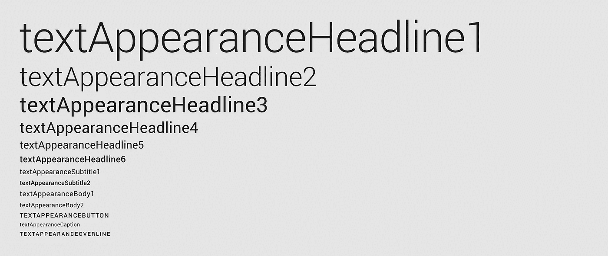
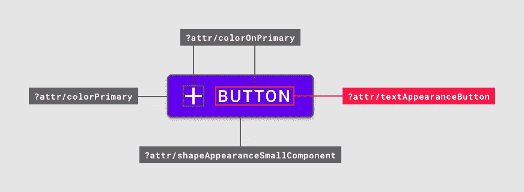
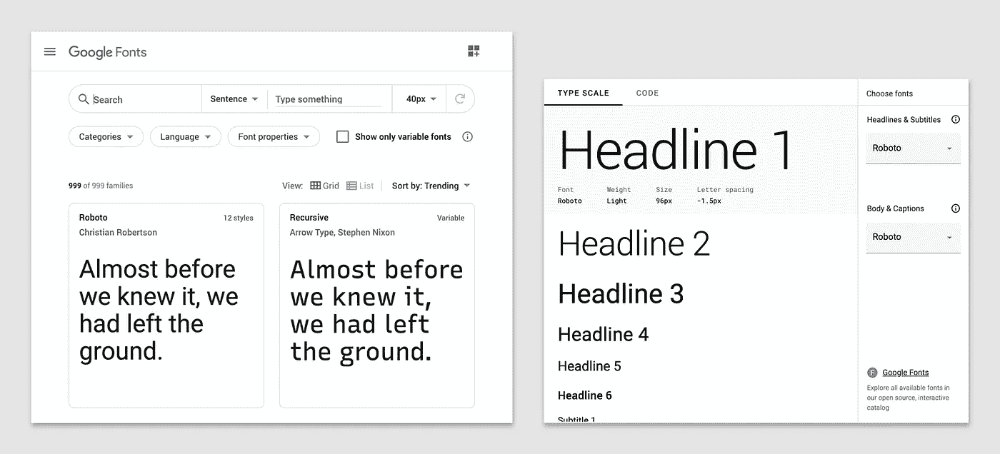
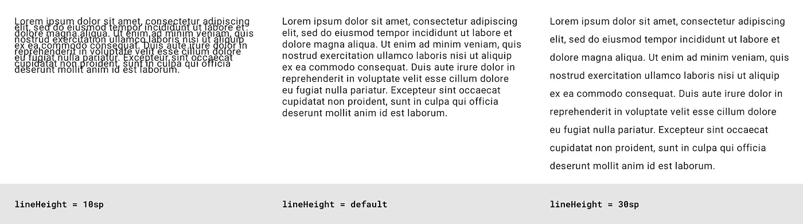
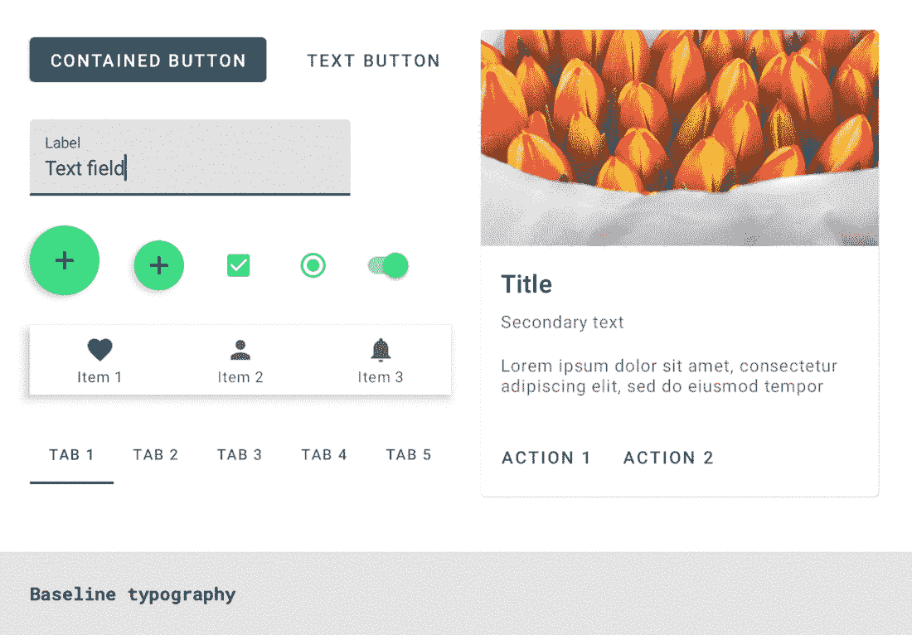
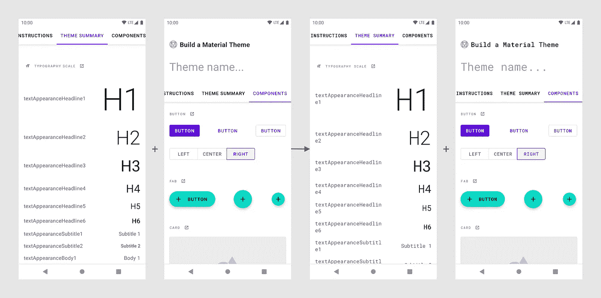
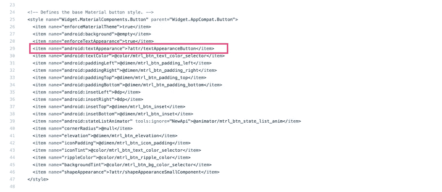

# 使用 MDC 的材质主题:类型

> 原文：<https://medium.com/androiddevelopers/material-theming-with-mdc-type-8c2013430247?source=collection_archive---------5----------------------->


## 使用 MDC 库在 Android 上输入主题

*这篇文章也发布在* [*材料设计博客*](https://material.io/blog/android-material-theme-type) *上。*

[材料主题化](https://material.io/design/material-theming/overview.html#material-theming)是一种定制[材料成分](https://material.io/components)以符合您的品牌的方式。材质主题包括[颜色](https://material.io/design/color/)、[版式](https://material.io/design/typography/)和[形状](https://material.io/design/shape/)参数，您可以调整这些参数以获得组件的近乎无限的变化——同时保持它们的核心结构和可用性。


在 Android 上，从版本`1.1.0`开始，可以使用[材料组件(MDC)库](https://github.com/material-components/material-components-android)实现材料主题化。如果您希望从设计支持库或 MDC `1.0.0`进行迁移，请查看我们的迁移指南。

[](/androiddevelopers/migrating-to-material-components-for-android-ec6757795351) [## 迁移到 Android 的材料组件

### 来自设计支持库👉MDC 1.0.0👉MDC 1.1.0 及更高版本

medium.com](/androiddevelopers/migrating-to-material-components-for-android-ec6757795351) 

这篇文章将关注于**类型**主题化。

# 类型属性

材料设计提供了 13 种类型的“样式”,可应用于应用程序中的所有文本。每一个都有一个设计术语(例如“Body 1”)以及一个相应的类型属性，可以在你的应用主题中被覆盖(例如`textAppearanceBody1`)。有默认的“基线”值(文本大小、字母间距、大小写等。)每种风格。



MDC type attributes with baseline styling

材料组件使用这些类型属性来样式化小部件的文本元素(那些子类化或包含一个或多个`TextView`的部件)。



Type attributes used by a button

它们与 eg 一起使用。

```
android:textAppearance=”?attr/textAppearanceBody1”
```

在布局和部件样式中。看看尼克·布彻的“你的文本是什么样子的？”文章，了解更多关于使用这种方法和其他样式技术的优先顺序的信息。

[](/androiddevelopers/whats-your-text-s-appearance-f3a1729192d) [## 你的文本是什么样子的？

### 了解如何在 Android 上以声明方式设计文本。

medium.com](/androiddevelopers/whats-your-text-s-appearance-f3a1729192d) 

在 MDC 主题中，这些属性映射到样式，例如。

```
<style name=”Theme.MaterialComponents.*” parent="...">
    ...
    <item name=”textAppearanceBody1”>
        @style/TextAppearance.MaterialComponents.Body1
    </item>
<style />
```

您可能会从 AppCompat 或平台中识别出`TextAppearance`样式，这些将在下面的**类型资源**部分中详细讨论。相应的属性对 MDC 来说是新的，让您能够根据主题改变版式。

# 拣选类型

确定使用哪种类型的样式以及其中的值可能是设计师的责任，或者来自于你的产品品牌。但是，了解每种风格的作用以及应该在哪些场景中使用它们仍然很有用:

*   `textAppearanceHeadline*`样式用于标题
*   `textAppearanceSubtitle*`样式是用于副标题的
*   `textAppearanceBody*`样式用于多行正文
*   `textAppearanceButton`用于按钮，但也映射到其他组件的部分，如标签和对话框动作
*   `textAppearanceCaption`用于较小的文本，如文本字段提示和错误
*   `textAppearanceOverline`也适用于较小的文本，但大写和增加的字母间距使其适合小标题和标签，如日期选择器标题

## 文字工具

Material Design 提供了一个有用的工具，用于预览字体比例，与 [Google Fonts](https://fonts.google.com/) 集成并导出代码。参见[材料设计类型比例指南](https://material.io/design/typography/the-type-system.html#type-scale)中的“类型比例生成器”。



Google Fonts (left) and Type scale generator (right)

# 资源类型

类型资源由字体和`TextAppearance`样式组成。让我们来看看 Android 上有哪些功能，以及在声明样式时需要记住的一些事情。

## XML 和可下载字体

字体存储在 res/font 目录中，用`@font/`符号引用。您可以使用本地 [XML 字体](https://developer.android.com/guide/topics/ui/look-and-feel/fonts-in-xml)或[可下载字体](https://developer.android.com/guide/topics/ui/look-and-feel/downloadable-fonts)。Android Studio 提供了一个内置的向导，让您开始下载字体，包括必要的证书和清单元数据。你可能还想看看由 [Rod Sheeter](https://medium.com/u/bb63f344c523?source=post_page-----8c2013430247--------------------------------) 撰写的“Android 开发人员更好排版指南”,以获得更详细的指南和字体预加载的进一步优化。

[](/google-design/the-android-developers-guide-to-better-typography-97e11bb0e261) [## Android 开发者更好的排版指南

### 了解如何使用 Android Studio 新的可下载字体功能构建具有独特版式的应用程序

medium.com](/google-design/the-android-developers-guide-to-better-typography-97e11bb0e261) 

一般来说，我们建议使用可下载的字体，因为它们通过利用共享的字体提供商缓存来减少应用包的大小。然而，可下载的字体目前只能在谷歌字体上使用。如果您的应用程序需要购买的或专有的字体，请使用 XML 字体。

另外值得一提的是，从 API 26 开始，Android 支持可变字体。请看一下 Rebecca Franks 的文章“Android O 🖍中的可变字体”了解更多信息。

[](/over-engineering/variable-fonts-in-android-p-c5c918275646) [## 🖍安卓系统中的可变字体

### 上周参加完 DroidCon Italy 2018 后，尼克·布彻和弗洛里纳的演讲让我兴奋不已…

medium.com](/over-engineering/variable-fonts-in-android-p-c5c918275646) 

## `TextAppearance`款式

`TextAppearance` styles 可以被看作是材质设计类型 styles 的 Android 等价物。对于自定义样式，我们推荐两种方法来帮助分离关注点，并为您的应用程序中的类型主题值创建一个真实的来源:

*   将所有`TextAppearance`样式存储在一个 res/values/type.xml 文件中
*   使用 MDC `TextAppearance`样式作为父样式，并遵循相同的命名约定

您可以在这些样式中使用的属性和值与`TextView`所支持的一致:

*   `fontFamily`是字体系列，通常是指 XML 或可下载字体的`@font/`资源
*   `android:textSize`是文本的大小，通常是一个`sp`尺寸
*   `android:textColor`是文本的颜色
*   `android:letterSpacing`是字符之间的间距
*   `android:textAllCaps`是切换文本大小写的布尔值
*   `android:textFontWeight`是字体的粗细，用于从字体系列中选择最接近的匹配，但仅在 API 28 及以上版本中可用。`android:textStyle`也可用于应用变换，如`bold`和`italic`。

## 计算`letterSpacing`

Android 上的字母间距值倾向于使用与 Sketch(跟踪)等设计工具不同的度量单位(em)。[材料设计排版指南](https://material.io/design/typography/the-type-system.html#type-scale)提供了一个相对简单的等式，用于根据跟踪值确定合适的 em 值:

**(从草图跟踪/sp 中的字体大小)=字母间距**

## `MaterialTextView`和`lineHeight`

平台`TextView`在 API 28 中增加了对`[android:lineHeight](https://developer.android.com/reference/android/widget/TextView#attr_android:lineHeight)`属性的支持。MDC 通过`[MaterialTextView](https://github.com/material-components/material-components-android/blob/master/lib/java/com/google/android/material/textview/MaterialTextView.java)` 类为此提供了后端口支持。你不需要在布局中直接使用这个类，因为`<TextView>` s 会被`[MaterialComponentsViewInflater](https://github.com/material-components/material-components-android/blob/master/lib/java/com/google/android/material/theme/MaterialComponentsViewInflater.java)`自动膨胀为`MaterialTextView` s。

您可以在各种场景中使用`lineHeight`:

*   作为项目包含在`TextAppearance`样式中(与`android:textAppearance="..."`一起应用)
*   作为一个项目包含在具有父级`Widget.MaterialComponents.TextView`的小部件样式中(通过`style="..."`应用)
*   直接应用于布局中的`<TextView>`



Different lineHeight values

## 需要考虑的事项

*   您不必重写所有的文字样式。但是，请记住，默认的 MDC 样式使用系统字体(通常是 Roboto)。一定要检查你的小工具和`TextView`正在使用的字体样式。
*   虽然`TextAppearance` *支持*`android:textColor`，但 MDC 倾向于通过在主要的小部件样式中单独指定来分离关注点，例如

```
<style name=”Widget.MaterialComponents.*” parent=”...”>
    ...
    <!-- Color -->
    <item name=”android:textColor”>?attr/colorOnSurface</item>
    <!-- Type -->
    <item name=”android:textAppearance”>
        ?attr/textAppearanceBody1
    </item>
</style>
```

## 附加文字样式

您的设计系统可能需要材料主题指定的 13 种文字样式之外的其他文字样式。幸运的是，在 Android 上，通过声明一个类型 attr，这相对容易做到:

# 在应用程序主题中覆盖文字样式

让我们来看看如何通过覆盖相关属性来将您选择的字体样式添加到您的应用程序主题中。

首先，我们建议设置你的主题来优雅地处理浅色和深色调色板，同时减少基本主题的重复。关于这个话题的更多内容，请看一下[克里斯·贝恩斯](https://medium.com/u/9303277cb6db?source=post_page-----8c2013430247--------------------------------)关于黑暗主题的文章，以及[他和](https://chris.banes.dev/talks/2019/developing-themes-with-style-berlin/)[尼克·布彻](https://medium.com/u/22c02a30ae04?source=post_page-----8c2013430247--------------------------------)所做的【用风格发展主题】演讲。

[](/androiddevelopers/dark-theme-with-mdc-4c6fc357d956) [## MDC 的黑暗主题

### 使用材料设计组件实现黑暗主题

medium.com](/androiddevelopers/dark-theme-with-mdc-4c6fc357d956) 

设置完成后，覆盖您希望在基本主题中更改的类型属性:

材质组件将响应主题级别的类型覆盖:



Material Design components responding to theme-level type overrides

# 键入 MDC 小部件

前面我们说过，MDC 小部件响应主题级别类型属性的覆盖。但是你怎么知道，例如，一个按钮使用`textAppearanceButton`作为它的文本标签的样式呢？让我们来看看几个选项。

## 建立一个物质主题

[构建一个材质主题](https://material.io/resources/build-a-material-theme)是一个交互式 Android 项目，让你通过定制颜色、字体和形状的值来创建自己的材质主题。它还包括所有主题化参数和组件的目录。确定哪些窗口小部件响应主题类型属性的变化可以通过以下方式完成:

*   克隆[项目](https://github.com/material-components/material-components-android-examples/tree/develop/MaterialThemeBuilder)并在 Android Studio 中运行应用程序
*   调整 [res/values/type.xml](https://github.com/material-components/material-components-android-examples/blob/develop/MaterialThemeBuilder/app/src/main/res/values/type.xml) 和 [res/values/themes.xml](https://github.com/material-components/material-components-android-examples/blob/develop/MaterialThemeBuilder/app/src/main/res/values/themes.xml) 中的值
*   通过重新运行应用程序观察视觉变化



Changes in type values in Build a Material Theme

## MDC 开发人员文档

MDC 开发人员文档最近已被刷新。作为其中的一部分，我们包含了属性表，其中包含了库中使用的设计术语和默认值。例如，查看更新的[按钮文档](https://material.io/develop/android/components/buttons/#contained-button)的“解剖和关键属性”部分。


MDC button dev doc attribute table with default type values

## 源代码

检查 MDC 源代码可以说是最可靠的方法。MDC 使用默认样式来实现材质主题化，所以查看这些以及任何可样式化的属性和 java 文件是一个好主意。例如，检查`MaterialButton`的[样式](https://github.com/material-components/material-components-android/blob/master/lib/java/com/google/android/material/button/res/values/styles.xml)、[属性](https://github.com/material-components/material-components-android/blob/master/lib/java/com/google/android/material/button/res/values/attrs.xml)和 [java 文件](https://github.com/material-components/material-components-android/blob/master/lib/java/com/google/android/material/button/MaterialButton.java)。



MDC button default style with type values

# 在自定义视图中键入

您的应用程序可能包含您构建的或从现有库中获取的自定义微件。将这些视图与标准的 MDC 小部件一起使用时，使这些视图响应材料主题是很有用的。让我们来看看在支持定制小部件的类型主题化时需要记住什么。

## 在`<declare-styleable>` s 和默认样式中使用 MDC 属性

允许你的自定义视图被设计风格包括使用一个`<declare-styleable>`。重用 MDC 中的 attr 名称有助于保持一致性。使用`<declare-styleable>`的默认样式也可以引用 MDC 主题类型属性的值:

# 好的谷歌，下一步是什么？

我们已经使用 MDC 完成了在你的 Android 应用中实现颜色主题的过程。一定要看看我们在这个系列中的其他帖子，为什么我们建议使用 MDC，颜色主题，形状主题，黑暗主题和材质的运动系统。

[](/androiddevelopers/we-recommend-material-design-components-81e6d165c2dd) [## 我们推荐材料设计组件

### 原因如下

medium.com](/androiddevelopers/we-recommend-material-design-components-81e6d165c2dd) [](/androiddevelopers/material-theming-with-mdc-color-860dbba8ce2f) [## 使用 MDC 的材质主题:颜色

### 使用 MDC 库的 Android 颜色主题

medium.com](/androiddevelopers/material-theming-with-mdc-color-860dbba8ce2f) [](/androiddevelopers/material-theming-with-mdc-shape-126c4e5cd7b4) [## 使用 MDC 的材质主题:形状

### 使用 MDC 库在 Android 上设计主题

medium.com](/androiddevelopers/material-theming-with-mdc-shape-126c4e5cd7b4) [](/androiddevelopers/dark-theme-with-mdc-4c6fc357d956) [## MDC 的黑暗主题

### 使用材料设计组件实现黑暗主题

medium.com](/androiddevelopers/dark-theme-with-mdc-4c6fc357d956) [](/androiddevelopers/material-motion-with-mdc-c1f09bb90bf9) [## 使用 MDC 的材料运动

### 为 Android 构建带有材质运动的美丽过渡

medium.com](/androiddevelopers/material-motion-with-mdc-c1f09bb90bf9) 

一如既往，我们鼓励你在 GitHub 上提交[错误报告](https://github.com/material-components/material-components-android/issues/new?assignees=&labels=bug&template=bug_report.md&title=%5BComponent+name%5D+Short+description+of+issue)和[特性请求](https://github.com/material-components/material-components-android/issues/new?assignees=&labels=feature+request&template=feature_request.md&title=%5BComponent+name%5D+Short+description+of+request)。另外，请务必查看我们的安卓[配套示例应用](https://github.com/material-components/material-components-android-examples)。

如果你已经成功实现了类型主题化，或者如果你在这样做时遇到了困难，请在下面留下评论，或者在 Twitter [@MaterialDesign](https://twitter.com/materialdesign) 和 [@AndroidDev](https://twitter.com/AndroidDev) 上联系我们。