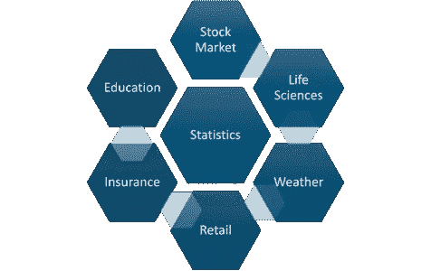
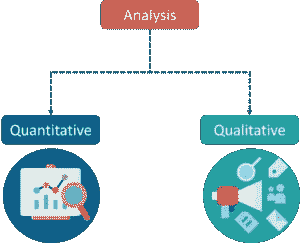
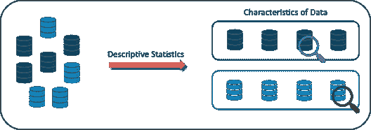
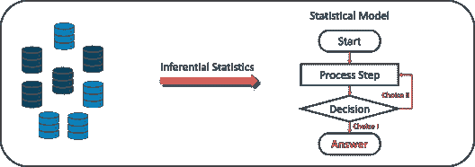
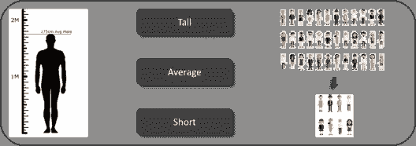
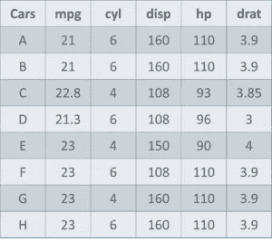
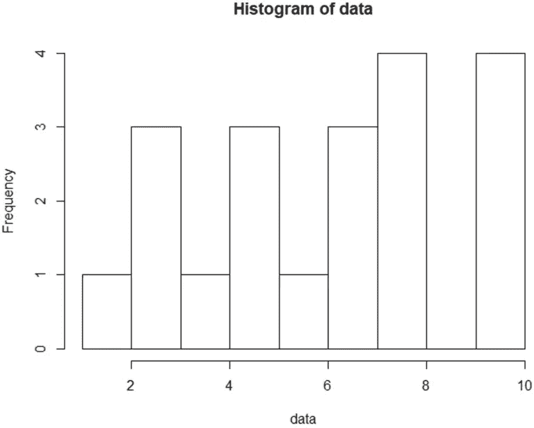
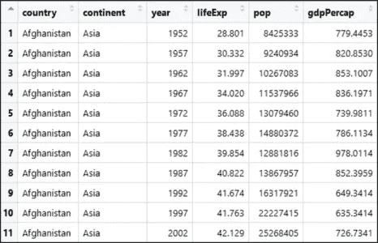
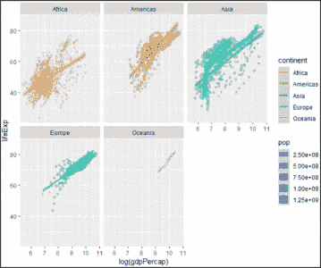

# 数据科学的基本数学和统计

> 原文：<https://medium.com/edureka/math-and-statistics-for-data-science-1152e30cee73?source=collection_archive---------0----------------------->


Math And Statistics For Data Science — Edureka

正如乔希·威尔斯曾经说过的，

> “数据科学家是比任何程序员都更擅长统计，比任何统计学家都更擅长编程的人。”

数据科学的数学和统计学是必不可少的，因为这些学科构成了所有机器学习算法的基础。事实上，数学是我们周围一切事物的背后，从形状、图案和颜色，到一朵花的花瓣数。数学融入了我们生活的方方面面。

虽然对编程语言、机器学习算法和遵循数据驱动的方法有很好的理解是成为数据科学家的必要条件，但数据科学并不完全是这些领域。在本文中，您将了解数学和统计学对于数据科学的重要性，以及如何使用它们来构建机器学习模型。

以下是我将在这篇数据科学的数学和统计学文章中涉及的主题列表:

1.  统计学导论
2.  统计学术语
3.  统计中的类别
4.  理解描述性分析
5.  R 中的描述统计
6.  理解推理分析
7.  R 中的推断统计量

# 统计学导论

要成为一名成功的数据科学家，你必须了解你的基础知识。数学和统计是机器学习算法的组成部分。了解各种机器学习算法背后的技术很重要，这样才能知道如何以及何时使用它们。现在问题来了，到底什么是统计学？

> 统计学是一门关于数据收集、分析、解释和展示的数学科学。


统计用于处理现实世界中的复杂问题，以便数据科学家和分析师可以在数据中寻找有意义的趋势和变化。简而言之，通过对数据进行数学计算，统计可用于从数据中获得有意义的见解。

实施若干统计函数、原理和算法来分析原始数据、建立统计模型并推断或预测结果。



统计领域对生活的所有领域都有影响，股票市场、生命科学、天气、零售、保险和教育等等。

继续前进。让我们讨论统计学中的基本术语。

# 统计学术语

在处理数据科学的统计数据时，应该注意一些关键的统计术语。我在下面讨论了这些术语:

*   ***人口*** *是必须从中收集数据的一组来源。*
*   *一个* ***样本*** *是总体*的子集
*   *一个* ***变量*** *是可以测量或计数的任何特性、数字或数量。变量也可以称为数据项。*
*   *也称统计模型，统计* ***参数*** *或总体参数是指一族概率分布的数量。* *例如人口的平均数、中位数等。*

在我们进一步讨论统计的类别之前，让我们先来看看分析的类型。

## 分析类型

任何事件的分析都可以通过以下两种方式之一完成:



1.  **定量分析:**定量分析或统计分析是用数字和图表收集和解释数据以确定模式和趋势的科学。
2.  **定性分析:**定性或非统计分析提供通用信息，并使用文本、声音和其他媒体形式来提供。

例如，如果我想从星巴克买一杯咖啡，它有矮杯、高杯和大杯。这是定性分析的一个例子。但是如果一家商店一周卖出 70 杯普通咖啡，这就是定量分析，因为我们有一个数字代表每周卖出的咖啡。

虽然这两种分析的目的都是提供结果，但定量分析提供了更清晰的画面，因此在分析中至关重要。

# 统计中的类别

统计学中有两个主要类别，即:

1.  描述统计学
2.  推断统计学

## 描述统计学

> 描述性统计使用数据通过数字计算、图表或表格来提供对人口的描述。

描述性统计有助于组织数据，并侧重于提供参数的数据特征。



假设您想要研究教室中学生的平均身高，在描述性统计中，您将记录该班级所有学生的身高，然后您将找出该班级的最大、最小和平均身高。


## 推断统计学

> 推断统计学根据从相关总体中提取的数据样本，对总体进行推断和预测。

推理统计学概括了大量的数据，并应用概率得出结论。它允许您根据样本统计数据推断总体参数，并在此基础上构建模型。



所以，如果我们考虑同样的例子，找出一个班级学生的平均身高，在推断统计中，你会得到一个班级的样本集，基本上是整个班级的几个人。你已经把全班分成了高、中、矮三组。在这种方法中，您基本上构建了一个统计模型，并将其扩展到整个班级。



现在让我们把注意力集中在描述统计学上，看看它是如何被用来解决分析问题的。

# 理解描述性分析

当我们试图以图表的形式表示数据时，如直方图、线图等。数据是基于某种集中趋势来表示的。集中趋势度量，如平均值、中间值或分布度量等，用于统计分析。为了更好地理解统计学，让我们借助一个例子来讨论统计学中的不同度量。



以下是包含变量的汽车样本数据集:

1.  汽车
2.  每加仑英里数
3.  气缸类型(气缸)
4.  排水量
5.  马力
6.  实际轴比(drat)。

在我们继续前进之前，让我们定义中心的主要度量或中心趋势的度量。

## 中心的度量

1.  **均值:**一个样本中所有值的平均值的度量称为均值。
2.  **中位数:**样本集中心值的度量称为中位数。
3.  **众数:**样本集中出现次数最多的值称为众数。

使用描述性分析，您可以分析样本数据集中的每个变量的平均值、标准差、最小值和最大值。

*   如果我们想找出汽车总量中汽车的平均马力，我们将检查并计算所有值的平均值。在这种情况下，我们将每辆汽车的马力总和除以汽车总数:

*平均值=(110+110+93+96+90+110+110+110)/8 = 103.625*

*   如果我们想找出 mpg 在汽车人口中的中心值，我们将 mpg 值按升序或降序排列，并选择中间值。在这种情况下，我们有 8 个值，这是一个偶数条目。因此，我们必须取两个中间值的平均值。

*8 车 mpg:21，21，21.3，22.8，23，23，23，23*
*中位数= (22.8+23 )/2 = 22.9*

*   如果我们想找出汽车中最常见的气缸类型，我们将检查重复次数最多的值。这里我们可以看到圆柱体有两个值，4 和 6。看一下数据集，可以看到最常出现的值是 6。因此 6 是我们的模式。

## 传播的度量

就像中心的测量一样，我们也有扩散的测量，包括以下测量:

1.  **Range:** 这是给定的数据集中的值分布的度量。
2.  **四分位数范围(IQR):** 它是可变性的度量，基于将数据集分成四分位数。
3.  **方差:**描述一个随机变量与其期望值相差多少。它需要计算偏差的平方。

***偏差*** *是每个元素的平均值之差。*

***总体方差*** *是离差平方的平均值*

***样本方差*** *是平均值的方差平方的平均值*

**4。标准差:**是一组数据与其均值的离差的度量。

现在我们已经看到了描述性分析背后的统计和数学，让我们试着用 r。

## R 中的统计数据

世界正在向 r 转变的原因有很多，下面列举了其中的几个:

*   r 是**开源**和**自由**可用。与 SAS 或 Matlab 不同，你可以自由地安装、使用、更新、克隆、修改、再分发和转售 r。
*   r 是**跨平台兼容**。它可以在 Windows、Mac OS X 和 Linux 上兼容运行。还可以从 Microsoft Excel、Microsoft Access、MySQL、SQLite、Oracle 等程序导入数据。
*   r 是一种强大的脚本语言，它可以处理大型复杂的数据集。
*   r 是**高度灵活**而进化出来的。统计学的许多新发展首先以 R 包的形式出现。

现在让我们继续前进，在 r 中实现描述性统计。

# R 中的描述统计

为了更好地理解一个概念，最好是执行实际的实现。在本节中，我们将执行一个小演示，向您展示如何计算平均值、中值、众数、方差、标准差，以及如何通过绘制直方图来研究变量。这是一个非常简单的演示，但它也是每个机器学习算法的基础。

**第一步:导入计算数据**

```
>set.seed(1)
#Generate random numbers and store it in a variable called data
>data = runif(20,1,10)
```

**第二步:计算数据的平均值**

```
#Calculate Mean
>mean = mean(data)
>print(mean)

[1] 5.996504
```

**第三步:计算数据的中值**

```
#Calculate Median
>median = median(data)
>print(median)

[1] 6.408853
```

**第四步:数据的计算模式**

```
#Create a function for calculating Mode
>mode <- function(x) { >ux <- unique(x) >ux[which.max(tabulate(match(x, ux)))]
}
>result <- mode(data) >print(data)

[1] 3.389578 4.349115 6.155680 9.173870 2.815137 9.085507 9.502077 6.947180 6.662026
[10] 1.556076 2.853771 2.589011 7.183206 4.456933 7.928573 5.479293 7.458567 9.927155
[19] 4.420317 7.997007

>cat("mode= {}", result)

mode= {} 3.389578
```

**第五步:计算数据的方差&标准差**

```
#Calculate Variance and std Deviation
>variance = var(data)
>standardDeviation = sqrt(var(data))
>print(standardDeviation)

[1] 2.575061
```

**第六步:绘制直方图**

```
#Plot Histogram
>hist(data, bins=10, range= c(0,10), edgecolor='black')
```

*直方图用于显示数据点的频率:*



到目前为止，你已经学习了描述性统计，现在让我们来谈谈推断性统计。

# 理解推理分析

统计学家使用假设检验来正式检查假设是被接受还是被拒绝。*假设检验是一种推断统计技术，用于确定数据样本中是否有足够的证据来推断某个条件适用于整个人群。*

为了在一般总体的特征下，我们采取随机样本并分析样本的性质。我们测试确定的结论是否准确地代表了总体，最后我们解释他们的结果。是否接受假设取决于我们从假设中得到的百分比值。

为了更好地理解这一点，我们来看一个例子。

想想四个男孩，尼克、约翰、鲍勃和哈里，他们逃课被抓了。作为惩罚，他们被要求留在学校打扫教室。


所以，约翰决定他们四个人轮流打扫教室。他想出了一个计划，把他们每个人的名字写在纸条上，然后放在一个碗里。每天他们必须从碗里拿起一个名字，这个人必须打扫教室。

现在已经三天了，每个人的名字都提到了，除了约翰！假设这个事件是完全随机的，没有偏见，约翰不作弊的概率是多少？

让我们从计算约翰一天没有被选中的概率开始:

*P(约翰一天没摘)= 3/4 = 75%*

这里的概率是 75%，相当高。现在，如果约翰连续三天没有被选中，概率下降到 42%

*P(约翰三天没摘)= 3/4 ×3/4× 3/4 = 0.42(近似值)*

现在，让我们考虑约翰连续 12 天没有被选中的情况！概率下降到 3.2%。因此，约翰作弊的可能性变得相当高。

p(约翰 12 天没有被选中)= (3/4) ^12 = 0.032 < 𝟎.𝟎𝟓

为了让统计学家得出结论，他们定义了所谓的阈值。考虑到上述情况，如果阈值设置为 5%，则表明，如果概率低于 5%，则 John 正在通过欺骗摆脱拘留。但是如果概率高于阈值，那么约翰就是幸运的，他的名字不会被选中。

概率和假设检验产生了两个重要的概念，即:

*   **零假设:**结果与假设没有区别。
*   **替代假设:**结果否定了假设。

因此，在我们的例子中，如果一个事件发生的概率小于 5%，那么它就是一个有偏差的事件，因此它认可了另一个假设。

# R 中的推断统计量

在本演示中，我们将使用 *gapminder* 数据集来执行假设检验。gapminder 数据集包含 142 个国家的列表，从 1952 年到 2007 年，每五年一次，分别列出它们的预期寿命、人均 GDP 和人口。

我们将从下载 gapminder 包并将其加载到我们的 R 环境开始:

```
#Install and Load gapminder package
install.packages("gapminder")
library(gapminder)
data("gapminder")
```

现在，让我们通过使用 R:

```
#Display gapminder dataset
View(gapminder)
```

下面快速浏览一下我们的数据集:



下一步是加载 r 提供的臭名昭著的 dplyr 包，我们特别希望在 dplyr 包中使用管道(%>%)操作符。对于那些不知道管道操作符是做什么的人来说，它基本上允许你把数据从管道的左边输送到管道的右边。这是不言自明的。

```
#Install and Load dplyr package
install.packages("dplyr")
library(dplyr)
```

我们的下一步是比较两个地方(爱尔兰和南非)的预期寿命，并进行 t 检验，以检查比较是否遵循零假设或替代假设。

```
#Comparing the variance in life expectancy in South Africa & Ireland
df1 <-gapminder %>%
select(country, lifeExp) %>%
filter(country == "South Africa" | country =="Ireland")
```

因此，在对数据帧(df1)应用 t-test 并比较预期寿命后，您可以看到以下结果:

```
#Perform t-test

t.test(data = df1, lifeExp ~ country)

Welch Two Sample t-test

data: lifeExp by country
t = 10.067, df = 19.109, p-value = 4.466e-09
alternative hypothesis: true difference in means is not equal to 0
95 percent confidence interval:
15.07022 22.97794
sample estimates:
mean in group Ireland mean in group South Africa
73.01725              53.99317
```

注意爱尔兰组和南非组的平均值，你可以看到预期寿命相差 20。现在我们需要检查南非和爱尔兰预期寿命值的差异是否真的有效，而不仅仅是偶然的。为此，进行了 t 检验。

请特别注意 p 值，也称为概率值。在确保模型的显著性时，p 值是一个非常重要的度量。只有当 p 值小于预定的统计显著性水平(理想情况下为 0.05)时，才认为模型具有统计显著性。从输出中可以看出，p 值是 4.466e-09，这是一个非常小的值。

在模型总结中，请注意另一个重要参数，称为 t 值。较大的 t 值表明另一个假设是正确的，预期寿命的差异不等于零完全是运气使然。因此，在我们的例子中，零假设是不成立的。

作为演示的结束，我们将为每个洲绘制一张图表，该图表显示了每个洲的预期寿命如何随该洲各自的人均 GDP 而变化。

```
#Plotting a gdpPercap vs lifeExp graph for each continent
#Install and Load ggplot2 package
install.packages("ggplot2")
library(ggplot2)
gapminder%>%
filter(gdpPercap &amp;lt; 50000) %>%
ggplot(aes(x=log(gdpPercap), y=lifeExp, col=continent, size=pop))+
geom_point(alpha=0.3)+
geom_smooth(method = lm)+
facet_wrap(~continent)
```



在上图中，你几乎可以看到各大洲人均预期寿命相对于人均 GDP 的线性变化。这也显示了 R 语言在统计分析中的应用有多好。

就这样，我们到了这篇文章的结尾。如果你对这个话题有任何疑问，请在下面留下评论，我们会尽快回复你。

现在你知道了数据科学背后的统计数据，如果你想查看更多关于市场上最流行的技术的文章，如 Python、DevOps、Ethical Hacking，那么你可以参考 [Edureka 的官方网站。](https://www.edureka.co/blog/?utm_source=medium&utm_medium=content-link&utm_campaign=math-and-statistics-for-data-science)

请留意本系列中的其他文章，它们将解释数据科学的各个方面。

> 1.[数据科学教程](/edureka/data-science-tutorial-484da1ff952b)
> 
> 2.[R 中的机器学习](/edureka/machine-learning-with-r-c7d3edf1f7b)
> 
> 3.[机器学习算法](/edureka/machine-learning-algorithms-29eea8b69a54)
> 
> 4.[R 中的线性回归](/edureka/linear-regression-in-r-da3e42f16dd3)
> 
> 5.[R 中的逻辑回归](/edureka/logistic-regression-in-r-2d08ac51cd4f)
> 
> 6.[分类算法](/edureka/classification-algorithms-ba27044f28f1)
> 
> 7.[R 中的决策树](/edureka/a-complete-guide-on-decision-tree-algorithm-3245e269ece)
> 
> 8.[R 中的随机森林](/edureka/random-forest-classifier-92123fd2b5f9)
> 
> 9.[机器学习简介](/edureka/introduction-to-machine-learning-97973c43e776)
> 
> 10.[R 中的朴素贝叶斯](/edureka/naive-bayes-in-r-37ca73f3e85c)
> 
> 11.[统计与概率](/edureka/statistics-and-probability-cf736d703703)
> 
> 12.[如何创建一个完美的决策树？](/edureka/decision-trees-b00348e0ac89)
> 
> 13.[关于数据科学家角色的十大误区](/edureka/data-scientists-myths-14acade1f6f7)
> 
> 14.[顶级数据科学项目](/edureka/data-science-projects-b32f1328eed8)
> 
> 15.[数据分析师 vs 数据工程师 vs 数据科学家](/edureka/data-analyst-vs-data-engineer-vs-data-scientist-27aacdcaffa5)
> 
> 16.[人工智能的种类](/edureka/types-of-artificial-intelligence-4c40a35f784)
> 
> 17. [R vs Python](/edureka/r-vs-python-48eb86b7b40f)
> 
> 18.[人工智能 vs 机器学习 vs 深度学习](/edureka/ai-vs-machine-learning-vs-deep-learning-1725e8b30b2e)

*原载于 2019 年 2 月 26 日 www.edureka.co**[*。*](https://www.edureka.co/blog/math-and-statistics-for-data-science/)*