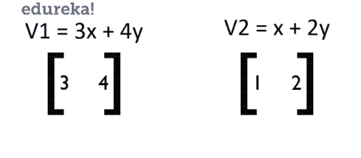

# 机器学习的数学:你需要知道的一切

> 原文：<https://medium.com/edureka/mathematics-for-machine-learning-f439375b9541?source=collection_archive---------0----------------------->

数学，自古以来伪装成敌人的好朋友。它的重要性不需要我来重申，因为你们都知道它在历史上帮助我们实现了什么。那么数学和机器学习有什么关系呢？让我们找出答案。

这篇关于机器学习数学的文章涵盖了以下主题:

***1。机器学习数学入门***

**2*。线性代数***

*   数量
*   向量
*   向量运算
*   [数]矩阵
*   矩阵运算
*   向量作为矩阵
*   *排梯队形式*
*   *矩阵的逆矩阵*
*   特征向量
*   线性代数在机器学习中的应用

***3。多元微积分***

*   什么是差异化？
*   微分法则
*   偏导法
*   多元微积分在机器学习中的应用

***4。概率***

*   概率是什么？
*   概率术语
*   概率分布
*   概率的类型
*   贝叶斯定理
*   概率在机器学习中的应用

***5。统计***

*   什么是统计学？
*   统计学中的基本术语
*   取样技术
*   统计类型
*   假设检验

***6。*概要**

准备好弄脏你的手，因为这将是一个漫长的旅程！开始吧:)

# 机器学习数学导论

有抱负的机器学习工程师往往会问“*当我们有计算机来做这一切时，数学对机器学习有什么用？*”。嗯，那是真的。我们的计算机已经变得足够强大，能够在瞬间完成我们需要几分钟或几小时才能完成的计算。但事实上，这不是解决数学问题的能力。相反，它是数学需要如何应用的眼睛。

您需要分析数据并推断信息，以便可以创建从数据中学习的模型。数学可以在很多方面帮助你，以至于有人会讨厌这门学科，这令人难以置信。当然，手工做数学也是我讨厌的事情，但是知道我如何使用数学足以解释我对数学的热爱。

请允许我把这份爱也传递给你们，因为我不会只教你们机器学习的数学，而是你们可以在现实生活中使用它的各种应用！

# 线性代数

下面的图表将帮助你很容易地理解线性代数在机器学习中应用最广泛。它涵盖了很多方面，如果你想学习机器学习的数学，这是不可避免的。

线性代数有助于优化数据，可以对像素执行的操作，如剪切、旋转等等。你可以理解为什么线性代数在机器学习的数学中是如此重要的一个方面。

现在让我们从机器学习的数学开始，尽可能多的理解。请记住，没有人能一蹴而就。帮助你掌握数学需要时间、耐心和真实世界的经验，但这篇文章肯定会帮助你掌握基础知识！

## 数量

我们对标量的理解是什么？简单地说，标量只是代表某种东西的值。它可以是像房子的大小到引擎中的温度，标量帮助我们表示它们和它们的值。标量中的数学？只是简单的算术。

让我给你举个小例子，这样你就能明白我想表达的意思。让我举一个正在销售的笔记本电脑的例子:

*   假设一台笔记本电脑的价格约为 50，000 卢比，正在以 50%的价格打折。这意味着它是价格的一半，你通过除以 2 来计算价格: **50，000 / 2 = 25，000**
*   如果你想买 5 台同样的正在打折的笔记本电脑，你只要乘以 5:**25000 X 5 = 125000**
*   你想购买笔记本电脑的附件，你添加它们的特定值: **25，000 + 1000 = 26，000**
*   如果你不想要这个配件，只需从总额中减去它们的价值: **26，000–1000 = 25，000**

简单来说，就是一个标量。简单的算术，没有任何花哨。这就是你需要知道的关于标量的全部内容。让我们转到机器学习的数学文章中的向量！

## 向量

矢量可能会变得有点复杂，因为它们对于不同的背景是不同的。

*   计算机科学的人可以把向量解释为代表某种东西的一系列数字。
*   物理学家认为矢量是一个有方向的标量，它独立于平面。
*   数学家认为向量是两者的组合，并试图将其推广到所有人。

所有这些观点都是绝对正确的，这也是为什么学习线性代数的人会对机器学习的数学感到困惑。

在机器学习中，当数据是由行和列组成的表格时，我们通常从计算机科学家的角度考虑向量。当我们的数据是像素(图片)的形式时，我们认为它们是绑定到原点的向量，并将它们转换为矩阵并执行我们将在后面讨论的操作。

现在我们对向量有了一个简单的概念，让我们跳到使用向量时需要知道的运算。

## 向量运算

只有当您知道正在处理哪种数据时，才能应用向量运算。假设您有像素数据，并希望应用旋转，但最终做了完全不同的事情，您的模型将不会工作，因为它在这里做了错误的操作。因此，请确保您知道您正在处理什么，然后才应用所需的操作。

## 向量加法(点积)

这个运算是两个向量的相加，但不仅仅是简单的算术。这实际上是我们通过这两个向量的功，得到的位移。下图将帮助您更好地理解这一点。

你可以看到我们有两个向量 V1 和 V2，把它们加起来，把它们的效果加在一起。例如，如果 V1 的值为[1，2]，V2 的值为[1，-1]，分别对应于 X 轴和 Y 轴，则有效的 V1+V2 将具有值[2，1]，该值将矢量的标量值相加。这也称为点积。

点积的等式是 **^A.^B = a1+b1，a2+b2，…**

## 纯量乘法

如果一个矢量乘以一个常数，它就会相应地变大或变小。这可以用于所谓的**剪切**，这有助于像素信息的处理。

标量乘法的等式是 **+k.^A** 或 **-k.^A = ^A'**

下图将帮助您理解这是如何工作的。

至此，让我们转到机器学习的数学文章中的投影。

## 一个向量到另一个向量的投影

一个向量到另一个向量的投影就是我们在这里计算的。投影有助于找到像素的阴影。然后，它们可用于查找长度和距离，并将 2D 对象映射到 3D 对象，以便进行更好的分析。

等式是这样的:**^v2 的 proj(^v1)= ^v1.(^V2 / |^V2|)**

随着投影的完成，我们已经完成了纯矢量所需的基础知识。让我们转到这篇机器学习数学文章中的矩阵。

## [数]矩阵

什么是矩阵？想想两个等式。比方说，

> **2x + 2y = 10** —公式 1
> 
> **4x + y =18** —公式 2

如果我们将等式 1 乘以 2，将等式 2 乘以-1，那么通过简化，我们得到的结果为:

> **4x + 4y = 20**
> 
> **-4x — y = -18**

带领我们，

> **3y = 2 - > y = ⅔**
> 
> **x = 13/3**

这个等式没必要这么难，但是，想一想，如果有一个更简单的方法来做所有这些。这就是矩阵发挥作用的地方。

因此，上述等式可以表示为:

那么解决问题就变得非常容易了。我们可以使用矩阵运算来有效地解决这个问题。但是为什么矩阵如此重要呢？那是因为它们是我们可以在电脑中用来表现的东西。

函数以一般化的形式表示数据。这就是理解它们如此重要的原因。然后可以求解这些函数以获得坐标，我们可以根据应用将它们用于其他用途。

只是为了你的知识，确保你通过矩阵的类型。我列举了一些如下:

*   **行矩阵**:1 行多列
*   **列矩阵**:1 列多行
*   **方阵**:行数和列数相等
*   **对角矩阵**:只有对角元素是值，其他为零
*   **单位矩阵**:矩阵的所有元素都是 1
*   **稀疏矩阵**:矩阵中的值非常少
*   **密集矩阵**:矩阵中有很多值

现在我们已经了解了什么是矩阵和一些重要的类型，让我们看看机器学习的数学文章中的矩阵运算。

## 矩阵运算

可以在矩阵上进行各种操作:

*   矩阵加法
*   矩阵乘法
*   移项
*   决定因素
*   相反的

现在就让我们全部了解吧！

***矩阵加法***

矩阵加法是将两个矩阵的相应元素相加的简单过程。就这么简单。C = A + B 其中 A 和 B 是两个矩阵。

矩阵加法就是这么简单！让我们转到矩阵乘法。

***矩阵乘法***

矩阵乘法就是将 2 个矩阵的行和列相应相乘。具体来说，将矩阵 1 的第一行的元素与矩阵 2 的列相乘。

等式是这样的:C = A x B

考虑到 A 和 B 都是 2 阶，这意味着它们都有 2 行 2 列，那么深入的等式如下:

**C =[[a11 * b11+a12 * b21 a11 * B12+a12 * b22]]**
**【a21 * b11+a22 * b21 a21 * B12+a22 * b22】]**

矩阵乘法就是这样发生的。让我给你看一个例子，帮助你更好地理解。

***矩阵的转置***

矩阵的转置是交换行和列，产生新的矩阵。转置可用于翻转代表信息的矩阵或像素的维度。

矩阵的转置用下标 t 表示。下面是矩阵转置的一个例子。

***矩阵的行列式***

矩阵的行列式就是矩阵的值，具体来说就是告诉你矩阵的标量。行列式给你矩阵中特征值的乘积。行列式可以通过以下运算找到:

***矩阵的逆***

矩阵的逆是这样的，当一个矩阵与它相乘时，它返回给我们一个单位矩阵。但是，这个什么时候有用呢？当我们解方程和对矩阵进行变换时。我们如何找到矩阵的逆矩阵？真的很简单。

在某些情况下，矩阵没有逆矩阵。这意味着不可能确定值，因为矩阵没有足够的数据来帮助我们求逆。

这就把我们带到了机器学习所需的操作的结尾。接下来，让我们看一下这些向量和矩阵是如何相互映射的。

## 向量作为矩阵

向量可以有 2 个或 3 个分量，并与原点成一定角度。这可以很容易地转化为矩阵。当涉及到像素数据时，它可以用来执行三个最著名的应用。

我们可以对像素数据进行缩放、旋转和剪切。制作一个算法，它可以学习像素的因子，并在获得输出时执行得更好。

比如说向量 **V1 = 3x + 4y** ，向量 **V2 = x + 2y** 。我们如何将它们转化为矩阵？如果你能仔细看看这些操作，我已经在《矩阵导论》中用这个概念得到了答案。

所以，这些向量被简单地翻译成:

现在对它们进行变换真的很简单，因为它们现在是矩阵的形式。下面的矩阵用于对它们应用变换。

缩放矩阵缩放矢量，使其变小或变大。剪切将通过特定的边或坐标改变矢量。旋转是根据提供的值围绕原点旋转矢量。

当我们有矩阵形式的向量时，实现起来真的很简单。因此，这两种类型的融合。既然我们对向量和矩阵都没问题，让我们看看解方程的两种最重要的方法:

1.  ***排梯队法***
2.  ***逆法***

让我们深入了解他们。

***1。排梯队法***

让我们取一些向量的线性方程形式，

> **2x + y — z = 2**
> 
> **x + 3y + 2z = 1**
> 
> **x + y + z = 2**

现在，让我们将它们转化为矩阵形式，得到:

> **[[2 1-1 2]****【1 3 2 1】****【1 1 1 1】]**

现在，让我们将它们转化为矩阵形式，得到:

> **[[2 1 -1 2]**
> 
> **【1 3 2 1】**
> 
> **【1 1 1 1】]**

让我们把它简化成梯队形式:

我们现在已经完成了将我们的矩阵简化成它的梯队形式。但是这有什么用呢？你可能没有注意到，或者你已经注意到了，但是我们已经解决了这个方程。是的，我们的方程已经解出来了，我们有了 x，y，z 的值。

如果我们仔细观察并将矩阵转换回方程，我们将得到:

> **x = 2**
> 
> **y = -1**
> 
> **z = 1**

这是一个简单的例子，说明了我们如何求解向量的值。是不是很酷？还有另一种方法，通过求逆来做同样的事情。在我们的机器学习数学文章中，让我们现在就开始吧！

***2。逆法***

让我们取一些方程形式的向量。举个例子，

> **4x + 3y = -1**
> 
> **3**-10x—2y = 5

其矩阵形式为:

我们现在知道，

> **A.B = C**

因此，如果我们把两边乘以 A 的倒数，它不会改变方程的值，对吗？我们得到，

> **A-1。A-1。C**

现在，如果我们假设 B 是要求其值的矩阵，那么 A 和 A 就很容易相互抵消，得到一个单位矩阵。我们只剩下，

> B = A-。C

所以，我们用这个逻辑，求 x 和 y 的值。

我们已经把方程设定成那种形式。我们来解决！

通过这个方法，我们可以很容易的找到 x 和 y 的值。当我们需要求解向量的坐标等等时，这些方法非常方便。这就是你开始学习机器所需要知道的一切。你当然可以深入了解这些概念，但是对于我们的需求来说，这已经足够了。

到目前为止，我希望你们能够理解向量和矩阵的确切含义以及它们的运算，这样我们就可以进一步学习了。我们现在转向特征向量和特征值。

## 特征向量

什么是特征向量和特征值？让我用一个简单的例子向你们解释一下。

假设我们有一个矩形，其中有两个向量 V1 和 V2，这有助于我们描述这个矩形。简单到可以理解，对吧？现在，如果我们在这个矩形上应用剪切操作会怎么样？

你可以看到向量 V1 和 V2 的大小是成比例的，但是还有比看上去更大的东西。矢量 V1 也改变了方向。但我们的矢量 V2 却不是这样。尽管 V2 的规模变了，但方向没有变。

无论你应用缩放或剪切操作，这个向量 V2 的方向不会改变，这就是为什么 V2 是一个特征向量。那么什么是特征值呢？这是向量变换不影响特征向量方向的因素列表。

根据定义，特征向量是那些即使对它们进行变换也不会改变方向的向量。对特征向量应用变换并确保方向不变的值列表就是特征值。

我希望这能帮助你理解什么是特征向量和特征值。但是特征向量的意义是什么呢？他们为我们服务的真正目的是什么？让我们在文章的下一部分讨论它们。

## 线性代数在机器学习中的应用

既然我们已经讨论了这么多线性代数，主要问题是我们如何使用所有这些？现在就来寻找这个问题的答案吧。

*   *主成分分析(PCA)* 是深入利用线性代数的最重要的技术之一。PCA 背后的主要动机是使用特征分解和矩阵来降低数据的维数。如下图所示，方差随着组分的增加而增加，因此 PCA 消除了方差。

*   当您处理图像时，您可以使用线性代数的概念来缩放、平滑、裁剪等等。您有预定义的操作，或者您可以创建这样的操作来处理所有这一切。您可以利用 NumPy 数组并加载图像数据，然后利用这些操作来完成您的工作。
*   对数据集进行编码是使用线性代数的另一个应用。许多语言中都有内置函数，可以帮助你将字符串编码成字符或其他东西。这些函数是用线性代数来实现的。
*   您可能知道如何优化输出，以便我们可以获得模型所需的最佳值。主要使用多元微积分，但有时甚至可以使用线性代数方程等来优化我们的模型及其产生输出的权重。
*   *奇异值分解(SVD)* 是另一个与 PCA 同类的应用，但用于一维。这有助于减少噪音，有助于提高从维度获得的信息的质量，等等。它使用特征向量和矩阵分解(矩阵运算)进行工作。
*   图像可以改变，新的图像可以从他们身上。我们使用阴影、投影等高级概念。在神经网络中转换像素以获得该图像的替代图像。它能够将 2D 物体转换成需要线性代数的 3D 物体。
*   潜在语义分析使用稀疏矩阵分解和 SVD 来给出文本文档中最重要的部分。这些可以用于自然语言处理。
*   深度学习需要线性代数，因为它致力于优化和更多，以提供尽可能好的输出。

你必须明白的一件事是，你应该知道如何应用数学，而不是做数学。我上面提到的文章是线性代数发挥巨大作用的一个明显例子。

至此，我们已经涵盖了机器学习线性代数中您需要学习的所有内容。让我们转到多元微积分，以及它如何在这篇机器学习的数学文章中帮助我们。

# 多元微积分

多元微积分是机器学习数学中最重要的部分之一。它帮助我们解决我们在开发机器学习模型时面临的第二个最重要的问题。第一个问题显然是数据的预处理，其次是模型的优化。

这有助于我们优化和提高模型的性能，并为我们提供一些最可靠的结果。那么，这个几乎一半的同学都讨厌的东西，如何帮助我们解决这样的问题呢？让我们打破所有的僵局。但在此之前，我们需要了解基础知识。所以我们来计算一下！

## 什么是差异化？

微分就是将函数分解成几个部分，这样你就可以理解每一个元素，并对其进行深入分析。它们有助于发现函数对不同输入的敏感度。一个好的函数给出一个好的输出，可以用一个相当简单的等式来描述。对于一个不好的函数来说，情况就不一样了。

下面是一组图表，描述了到底什么是好-坏函数及其相应的方程。

如果你仔细观察这里，破解 **y=ex** 的函数确实很容易，然而破解 **y=1/x** 的函数要困难得多，因为该函数对于不同的输入表现不同。因此，我们可以说 **ex** 在输入变化时效率更高，但对于 **1/x** 就不一样了。

那么，这一切有什么用呢？是的，我们知道哪些数据是敏感的，哪些不是。为了知道我们在做什么，我们需要学习微分的所有基础知识，以理解我们试图做什么。

所以，现在让我们从基础开始。现在让我们推导微分公式。

让我们假设有一辆车只朝一个方向行驶，并且已经在运动了。如果我们画出它的速度对时间的曲线图，它告诉我们速度是如何随着时间的增加而变化的，并在某一点后停止。如果我们想知道速度随时间变化的速率，结果是我们实际上找到了加速度。汽车的加速度可以绘制如下:

这意味着加速度实际上是速度的导数，因为我们这里的速度只是量级，并不包含更多简化的因素。如果没有速度，也就没有加速度。

现在我们有了加速度，我们可以证明汽车的速度是变化的还是恒定的，以及更多我们想知道的。但在这种情况下，这就是我们所需要的。

现在，假设你想找出加速度在时间跨度的某个范围内的变化。我们标记 2 个点“x”和一些比“x”大一小部分的变量。我们可以将此表示为'**x+δx**'。让我们在图中标出这一点:

现在我们知道这个范围有很多介于两者之间的值。但是如果我们只想知道一点和下一点之间的变化率呢？我们知道这是不可能的，因为在一个区间内，函数是连续的，有无数个数字。因此，我们近似认为两个输入变量之间的极限或步长为 0。

请记住，我们所假设的这个 0 只是我们可以弥补的最小可能值，而不是绝对的 0。如果我们使用绝对的 0，我们将永远不会有任何函数。

如果你仍然困惑，这个零基本上是 0.00000 的某个值……和前面的一些数字，但从来不是真正的零。这是我们唯一能把它理解为。所以现在我们已经明白了我们真正要找的是什么，让我们把它变成一个通用的等式。我们来推导推导公式。

这就是这个公式的由来。这有助于我们找到从一点到另一点的变化率。这是一个如此重要的概念，因为它在机器学习模型的优化中起着巨大的作用。

你需要明白这只是微分的一阶。如果我们对一阶微分的输出进行微分，就变成了二阶微分，以此类推。这就是我们从差异化中需要的所有介绍。

## 微分法则

既然我们已经导出了求导的基本公式，让我们来理解一些我们在微分中最重要的规则。我还将展示这个规则是如何形成的。我们在这里讨论的规则是:

*   权力规则
*   求和规则
*   乘积规则
*   链式法则

**权力法则**

让我们用推导公式来理解幂律。假设我们有一个函数 **f(x) = 3x** 。我们需要找到它的导数。那我们该怎么办？让我们把这个代入方程，然后求解。

这就是我们如何用求导函数解决问题。通过观察这些问题的解决方案，我们发现了一个共同的模式，因此我们推导出如下链式法则。这些规则有助于更快更有效地解决问题。

每当你遇到这样的问题，只要运用幂法则，瞬间就能解决。对于一些问题，你不能使用这条规则，所以它有自己的解决方法。在这一节的最后，我将列出最常见的函数，供您参考。

**求和规则**

求和规则试图传达的信息非常直接。如果变量之间有附加符号，那么导数就是变量导数的相加。我们来解决一个问题，推导求和规则。

假设我们有一个等式，f(x) = 3x + 5x。

这意味着求和规则现在可以定义如下:

这就是求和规则的全部内容。就这么简单。我们也可以将同样的方法应用于两个变量的差(f(x1-x2))。让我们转到产品规则。

**产品规则**

乘积法则指出，如果我们有一个 f(x)形式的函数。g(x)，那么我们可以通过应用如下所示的规则非常容易地找到导数。我不会给你看一个例子，因为它太复杂了。可以在网上找各种资源了解更多。

**链式法则**

链式法则指出，如果我们有嵌入的函数，例如 f(g(x))的形式，那么我们可以通过下面的法则很容易地找到这个函数的导数:

这些都是你在机器学习中使用微积分需要记住的规则。下一步？尽可能多地练习，以掌握使用这些规则的窍门。正如我所承诺的，我已经写下了一些最常重复的函数，你可以作为一个备忘单来解决这些问题。

现在我们终于了解了关于微分的所有知识，让我们扩展这个概念。是时候转向一些现实的、业内人士在现实生活中使用的东西了。

## 偏导法

偏导数是一个重要的概念，我们大多数人在我们的学院中都忽略了它。“偏微分帮助我们实现了什么？”是你们大多数人现在都会有的问题。让我给你举个例子，这样你就能明白它的重要性。

假设你是一名汽车设计师。有这么多的因素，你会想改变你的车身，使你能够提供最好的性能。你打算改变什么？发动机和其他内部零件？不要！你要改变车身。你改变设计，添加或删除各种挡风玻璃，进气口和出气口，所有这些都是当你是一名设计师。

当你是汽车的调音师，你不改变车身和其他参数。你只需要改变引擎等内部部件，这样你就可以让赛车发挥出最佳性能。

那么你从这个例子中明白了什么？

总而言之，你只改变你感兴趣的某些参数，而不是赛车的其他部分。只区分你想要的，其他参数保持不变。这就是偏导数。

当然，这是一个非常平淡无奇的例子，但在现实中，这是遵循相同的逻辑。您可以改变一些参数并区分其他参数，以便获得最佳性能。如果要调整发动机，在保持其他部件不变的情况下改变进油量，然后观察性能。简单到可以理解对吗？

但是，微分和偏微分有什么区别呢？答案就在于你处理参数的方式。这里要注意的一点是，微分只有一个变量，而偏导数有很多变量。

还是，迷茫？

让我给你看看做偏导数的方程。

我们来解一个小例子，这样你就能明白偏导数到底是怎么回事了。假设我们的等式是:

有了这个，你就能明白到底发生了什么。 **y** 项对任何事情都没有贡献，并且该等式真正只依赖于 **x** 和 **z** 项。它们帮助我们通过等式推导出我们正在寻找的东西。

现在我们已经清楚地了解了什么是偏导数，以及为什么偏导数是现实世界计算中如此重要的一部分，让我们直接进入我们在机器学习中面临的真实场景，多元微积分在机器学习中的应用！

## 多元微积分在机器学习中的应用

*多元微积分*在机器学习领域找到了自己牢固的抓手。它能够帮助我们优化我们的模型，用于深度学习，发现错误等等。现在就全部讨论一下吧。

*   雅可比矩阵是一阶导数的向量矩阵，它指向数据集中的最大全局值。雅可比矩阵也能够线性化一个非线性函数，通过它我们能够应用一个可以应用于线性类型的标准函数。
*   Hessian 是二阶导数的向量矩阵。它在线性代数中起着巨大的作用，并有助于迭代地找到函数输出中可以获得的最小误差。
*   梯度下降帮助我们找到方程的最优权重，这样我们就能够找到问题的最佳输出。我们从随机权重入手，找到点与点之间的最小误差，优化模型。
*   它们也被用于制作深度学习模型。

现在我们知道了应用程序，我们需要知道这在现实生活中是如何发生的。

这就把我们带到了多元微积分在数学领域对机器学习的所有要求的尽头。希望线性代数和多元微积分已经简单易懂，高效可视化。

# 可能性

概率，假设的核心。我这么说是什么意思？嗯，当你假设某事时，这个假设总有发生的可能性。但是我们如何用数学术语来表达呢？这就是概率帮助我们的地方。

概率也是我们做出假设、假说等等的原因。所以当涉及到机器学习的数学时，它起着非常重要的作用。所以请耐心等待，因为我们现在要理解概率中所有需要的数学知识。

## 概率是什么？

用最简单的解释来说，概率就是某件事情发生的可能性，但是是以一种量化的方式。意思是有一个数字与发生的事情联系在一起。当我说让我们掷硬币时，它要么是正面，要么是反面的可能性是相等的。所以如果我们用数字来表示，有 50%的可能是头或尾。

在正式意义上，“概率是一个事件发生的可能性的度量。”它可以写为:

> **概率=期望事件/总结果**

假设我们有一副牌，从中我们需要找出抽出的牌是一颗心的概率。我们知道一副牌里有 52 张牌。13 张红心、梅花、黑桃和方块牌。这意味着有 13 张我们喜欢的牌，总共有 52 张。因此概率计算如下:

> **13/52 = 1/4 = 0.25**

这就是我们找出概率的方法。现在我们已经了解了什么是概率以及如何找到它，让我们更深入地探究根源，了解我们需要的所有必要信息。

## 概率术语

在深入研究概率概念之前，理解概率中使用的基本术语很重要:

*   **随机实验**:结果无法确定预测的实验或过程。
*   **样本空间**:一个随机实验的整个可能结果集就是这个实验的样本空间。
*   **事件**:一个实验的一个或多个结果称为一个事件。它是样本空间的子集。概率事件有两种类型:

1.  **分离事件:** *分离事件没有任何共同的结果。*例如，从一副牌中抽出的一张牌不能是国王和王后
2.  **联合事件:** *非分离事件可以有共同的结果。*比如一个学生统计学可以得 100 分，概率可以得 100 分

## 概率分布

概率分布帮助我们理解我们正在处理的数据的种类，它们是如何分布的，以及它们之间的不同。数据的每个方面都可以理解，使用分布可视化。

对于机器学习，我们将只关注 3 种分布:

1.  **概率密度函数** (PDF)与连续随机变量呈现给定值的相对可能性有关。PDF 给出了介于范围“a”和“b”之间的变量的概率。
2.  **正态分布**是一种概率分布，表示均值的对称性质。它推断平均值周围的数据代表整个数据集。
3.  **中心极限定理**陈述了如果样本量足够大，任何独立的、随机变量的均值的抽样分布将是正态或接近正态的。

## 概率的类型

概率取决于我们正在使用的应用程序的类型。基本上我们有三种概率:

1.  **边际概率**指一个事件的发生不需要任何干预或依赖他人。
2.  **联合概率**是两个事件同时发生的度量。
3.  **条件概率**是只有在其他事件已经发生的情况下，一个事件才会发生的度量。它依赖于前一个事件。

## 贝叶斯定理

贝叶斯定理用于计算条件概率。它是基于可能与事件相关的条件的先验知识的事件发生的概率。贝叶斯定理的公式是这样的:

## 概率在机器学习中的应用

到目前为止，我们所有人都清楚概率对机器学习的影响，但真正的问题仍然存在。我们如何在现实生活中使用它？好吧，我们现在就来谈谈这个。

*   概率帮助我们优化我们的模型
*   我们的算法分类需要概率
*   损失也可以用概率来计算
*   模型是建立在概率基础上的

这是朴素贝叶斯分类器的一个实际应用，它需要概率以及它如何帮助我们建立一个好的模型。下图是朴素贝叶斯分类器工作原理的另一个例子。

至此，我们已经涵盖了机器学习领域中概率的所有内容。让我们转到机器学习中的统计学。

# 统计数字

**统计学**对于机器学习来说是一个重要的因素。它是一种工具，可以帮助你研究、分析并根据你做出的假设做出能够预测的工作。所以不要再等了，让我们一起学习吧！

## 什么是统计学？

统计学是应用数学的一个领域，涉及数据的收集、分析、解释和表达。它帮助你在你收集的数据集上测试你的假设的有效性。这使得它成为机器学习中如此重要的因素。

## 统计学中的基本术语

统计学围绕着数据。因此，理解这些术语的含义是一个非常重要的因素。基本上有两件事你需要记住。

1.  **群体**:一组个人或物体或事件的集合，其属性需要被分析
2.  **样本**:总体的一个子集叫做‘样本’。一个精心挑选的样本将包含特定总体参数的大部分信息

正如你从上图中看到的，我们有一个完整的鱼种群，这是一个完整的数据集。由此，我们选择最能代表总体的一组。我希望这个例子能帮助你理解这些相当简单的术语。

## 取样技术

抽样是从全部数据中选择样本的过程。但是样本应该足够有效，以便它能够帮助您了解关于数据的一切。但是我们怎么做呢？有几种方法:

## 统计类型

谈到数学，基本上有两种统计学。我们有:

1.  **描述性统计** —这是你试图描述你正在处理的数据类型的时候。它描述了数据有什么，它覆盖了什么，等等。
2.  **推断统计** —这是当你试图从数据中推断出一些知识或信息的时候。假设你做了一个假设，并对其进行了检验，你会从中得到一些推论。

现在让我们转到假设检验。

## 假设检验

我们首先想到的是，“什么是假设？”。还记得我之前讲概率时提到的假设吗，那些假设就是我们所说的假设。我们制造一种可能发生的情况或陈述。

至此，我们已经结束了机器学习中的统计学。我希望你们都明白了，让我们结束这次漫长的旅程。

# 摘要

这很难理解，但是相信我，如果你已经学完了，你应该知道机器学习的数学基础。我为什么说基础是因为每个问题都是不同的，解决它们有助于你掌握它。但是你至少对那些问题有了一个开始。

让我们总结一下到目前为止我们所学的内容。

*   我们理解了为什么机器学习的数学如此重要，以及为什么你应该学习它。
*   然后，我们还介绍了线性代数以及如何将它用于 PCA 等各种任务。
*   此后，我们从多元微积分开始，它的规则，以及它如何有助于优化我们创建的模型。
*   统计学和概率是分开教授的，但当涉及到机器学习、假设是什么以及更多内容时，它们有很多共同点。

如果你想查看更多关于 Python、DevOps、Ethical Hacking 等市场最热门技术的文章，你可以参考 Edureka 的官方网站。

请留意本系列中的其他文章，它们将解释数据科学的各个方面。

> *1。* [*初学 R 的机器学习*](/edureka/machine-learning-with-r-c7d3edf1f7b)
> 
> *2。* [*数据科学的数学与统计*](/edureka/math-and-statistics-for-data-science-1152e30cee73)
> 
> *3。*[*R 中的线性回归*](/edureka/linear-regression-in-r-da3e42f16dd3)
> 
> *4。* [*机器学习算法*](/edureka/machine-learning-algorithms-29eea8b69a54)
> 
> *5。*[*R 中的逻辑回归*](/edureka/logistic-regression-in-r-2d08ac51cd4f)
> 
> *6。* [*分类算法*](/edureka/classification-algorithms-ba27044f28f1)
> 
> *7。* [*随机森林中的 R*](/edureka/random-forest-classifier-92123fd2b5f9)
> 
> *8。* [*决策树中的 R*](/edureka/a-complete-guide-on-decision-tree-algorithm-3245e269ece)
> 
> *9。* [*机器学习入门*](/edureka/introduction-to-machine-learning-97973c43e776)
> 
> *10。* [*朴素贝叶斯在 R*](/edureka/naive-bayes-in-r-37ca73f3e85c)
> 
> *11。* [*统计与概率*](/edureka/statistics-and-probability-cf736d703703)
> 
> *12。* [*如何创建一个完美的决策树？*](/edureka/decision-trees-b00348e0ac89)
> 
> *13。* [*关于数据科学家角色的十大神话*](/edureka/data-scientists-myths-14acade1f6f7)
> 
> *14。* [*顶级数据科学项目*](/edureka/data-science-projects-b32f1328eed8)
> 
> *15。* [*数据分析师 vs 数据工程师 vs 数据科学家*](/edureka/data-analyst-vs-data-engineer-vs-data-scientist-27aacdcaffa5)
> 
> *16。* [*人工智能的种类*](/edureka/types-of-artificial-intelligence-4c40a35f784)
> 
> *17。*[*R vs Python*](/edureka/r-vs-python-48eb86b7b40f)
> 
> 18。 [*人工智能 vs 机器学习 vs 深度学习*](/edureka/ai-vs-machine-learning-vs-deep-learning-1725e8b30b2e)
> 
> 19。 [*机器学习项目*](/edureka/machine-learning-projects-cb0130d0606f)
> 
> *二十。* [*数据分析师面试问答*](/edureka/data-analyst-interview-questions-867756f37e3d)
> 
> *21。* [*面向非程序员的数据科学和机器学习工具*](/edureka/data-science-and-machine-learning-for-non-programmers-c9366f4ac3fb)
> 
> 22。 [*十大机器学习框架*](/edureka/top-10-machine-learning-frameworks-72459e902ebb)
> 
> *23。* [*用于机器学习的统计*](/edureka/statistics-for-machine-learning-c8bc158bb3c8)
> 
> *二十四。* [*机器学习面试问答*](/edureka/machine-learning-interview-questions-a5aef8a3ca60)
> 
> *25。* [*广度优先搜索算法*](/edureka/breadth-first-search-algorithm-17d2c72f0eaa)
> 
> *26。*[*R 中的线性判别分析*](/edureka/linear-discriminant-analysis-88fa8ad59d0f)
> 
> *27。* [*机器学习的先决条件*](/edureka/prerequisites-for-machine-learning-68430f467427)
> 
> *28。* [*互动 WebApps 使用 R 闪亮*](/edureka/r-shiny-tutorial-47b050927bd2)
> 
> *29。* [*机器学习十大书籍*](/edureka/top-10-machine-learning-books-541f011d824e)
> 
> *三十。* [*无监督学习*](/edureka/unsupervised-learning-40a82b0bac64)
> 
> *31.1* [*0 最佳数据科学书籍*](/edureka/10-best-books-data-science-9161f8e82aca)
> 
> *32。* [*监督学习*](/edureka/supervised-learning-5a72987484d0)

*原载于 2019 年 12 月 13 日*[*https://www.edureka.co*](https://www.edureka.co/blog/mathematics-for-machine-learning/)*。*