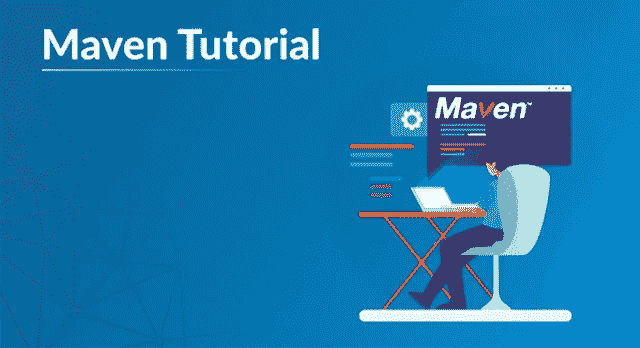

# 开始使用 Maven 构建 Java 应用程序

> 原文：<https://medium.com/edureka/maven-tutorial-2e87a4669faf?source=collection_archive---------2----------------------->

Maven Tutorial — Edureka

与其编写冗长的脚本来构建项目并手动下载依赖项，为什么不使用 Maven 来摆脱这种混乱呢？本文将涵盖在项目中开始使用 Maven 所需的一切。在彻底理解了这篇 Maven 教程之后，下一步可能是学习 Jenkins，它涵盖了…