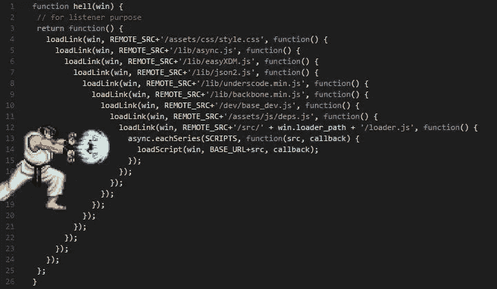

# 愿协程的力量与你同在…

> 原文：<https://medium.com/globant/may-the-power-of-coroutine-be-with-you-e345cb5f82e1?source=collection_archive---------4----------------------->

使用协程轻松摆脱回调和异步编程。



科特林的[协同程序](https://kotlinlang.org/docs/reference/coroutines-overview.html)引入了一种新的并发方式，可以在 Android 上使用来简化异步代码。它是在 kot Lin 1.3 中引入的，从那以后我就广泛地使用它来进行异步编程。一路走来，我学到了一些用例，在某种程度上让我很惊讶。了解协程的基本知识是理解以下概念的先决条件。

# 将回调转换为挂起的函数

Kotlin 提供了漂亮流畅的 API 来将回调转换为挂起的函数。Kotlin 提供了一个构建器[suspendecancelablecoroutine](https://kotlin.github.io/kotlinx.coroutines/kotlinx-coroutines-core/kotlinx.coroutines/suspend-cancellable-coroutine.html)，它将充当协程世界和基于回调的世界之间的适配器。

它需要一个 lambda 作为输入，它将被执行并立即挂起。将提供 cancellableContinuation，使用它我们可以在稍后的时间点恢复执行。

*   如果收到成功的回调，您必须调用 [resume(value: T)](https://kotlinlang.org/api/latest/jvm/stdlib/kotlin.coroutines/resume.html)

> 继续执行相应的协程，将[value]作为最后一个暂停点的返回值。

*   如果出现错误，您需要调用 [resumeWithException(异常:Throwable)](https://kotlinlang.org/api/latest/jvm/stdlib/kotlin.coroutines/resume-with-exception.html)

> 恢复相应协程的执行，以便在最后一个暂停点之后立即重新抛出[异常]。

*   我们可以通过调用[cancelablecontinuation . cancel](https://kotlin.github.io/kotlinx.coroutines/kotlinx-coroutines-core/kotlinx.coroutines/-cancellable-continuation/cancel.html)**()**来取消协程的执行

> 通过可选取消`*cause*`取消该延续。如果这个调用导致这个延续被取消，那么结果是`*true*`，否则是`*false*`。

我正在使用 MVVM 架构，并决定存储库将只具有暂停的功能。这可以从 viewModelScope 中的 ViewModel 中进一步调用。它对房间数据库和改造库非常有用，因为它们支持开箱即用的协程。

我遇到了一个需要位置更新的场景。我决定把它写在存储库中，因为它只是移动设备中另一个传感器的输入。按照标准惯例，我使用 [FusedLocationAPI](https://developers.google.com/android/reference/com/google/android/gms/location/FusedLocationProviderClient) 来获取所需的位置细节。

按照我的规则，存储库将只有暂停的功能。这种约束迫使我去寻找其他的选择，于是我遇到了这个生成器。

# 获取最后已知位置

第一个目标是创建一个 suspend 函数，它可以返回设备的最后一个已知位置(如果它可用的话),或者抛出适当的错误。 [FusedLocationAPI](https://developers.google.com/android/reference/com/google/android/gms/location/FusedLocationProviderClient) 提供了一个方法 [getLastLocation()](https://developers.google.com/android/reference/com/google/android/gms/location/FusedLocationProviderClient#public-tasklocation-getlastlocation-) ，该方法将返回包含位置或异常的任务。我们可以在这个任务中添加一个完整的监听器来观察结果。

为了将这个基于回调的函数转换成挂起的函数，我使用了如下所示的[suspendecancellablecoroutine](https://kotlin.github.io/kotlinx.coroutines/kotlinx-coroutines-core/kotlinx.coroutines/suspend-cancellable-coroutine.html)。

```
**suspend fun** getLastKnownLocation(): Location? {
    **return** *suspendCancellableCoroutine* **{** continuation **->
        val** flp = LocationServices.getFusedLocationProviderClient(**context**)
        **val** task = flp.*lastLocation* task.addOnCompleteListener **{
            if** (**it**.*isSuccessful*)
                continuation.*resume*(task.*result*)
            **else** continuation.*resumeWithException*(**it**.*exception* ?: NullPointerException())
        **}
    }** }
```

# 检查设备的 GPS 设置

[需要访问 SettingAPI](https://developers.google.com/android/reference/com/google/android/gms/location/SettingsClient) ，以确保设备的系统设置正确配置，满足应用程序的定位需求。请求定位服务时，设备的系统设置可能处于阻止应用程序获取所需位置数据的状态。例如，GPS 或 Wi-Fi 扫描可能会关闭。这一意图使得以下操作变得容易:

*   确定设备上的相关系统设置是否已启用，以执行所需的位置请求。
*   可选地，调用一个对话框，该对话框允许用户通过单击来启用必要的位置设置。

为了将它转换成挂起的函数，我使用了下面的代码

```
**suspend fun** checkLocationSettings(locationRequest: LocationRequest): Unit {
    **return** *suspendCancellableCoroutine* **{** continuation **->
        val** builder = LocationSettingsRequest.Builder()
            .addLocationRequest(locationRequest) **val** client: SettingsClient = LocationServices.getSettingsClient(**context**)
        **val** task: Task<LocationSettingsResponse> = client.checkLocationSettings(builder.build()) task.addOnSuccessListener **{** continuation.*resume*(LocationSettingResult(true))
        **}**task.addOnFailureListener **{** continuation.*resume*(LocationSettingResult(false, **it**))
        **}
    }** }**data class** LocationSettingResult(**val success**: Boolean, **val error**: Exception? = **null**)
```

这里，我故意不在失败回调中调用 resumeWithException()方法，因为我不想突然取消执行，而是想显示一个位置设置弹出窗口。

# 获取连续的位置更新

作为用例的最后一部分，我想从 [FusedLocationAPI](https://developers.google.com/android/reference/com/google/android/gms/location/FusedLocationProviderClient) 获得连续的位置更新。在获取位置更新之前，我会检查位置设置，如果一切顺利，我会开始更新。

```
**suspend fun** getLocationUpdates(
    onLocationUpdated: (Pair<Double, Double>?, error: Exception?) -> Unit) {
    **return** *coroutineScope* **{
        val** request = LocationRequest.create().*apply* **{** *interval* = 10000
            *fastestInterval* = 2000
            *priority* = LocationRequest.*PRIORITY_HIGH_ACCURACY* **}** **val** locationSettingsResult = checkLocationSettings(request) **if** (locationSettingsResult.**success**) {
            **val** done = *CompletableDeferred*<Unit>()
            **val** flp = LocationServices.getFusedLocationProviderClient(**context**) **val** callback = **object** : LocationCallback() {
                **val mutex** = *Mutex*()
                **var job**: Job? = **null
                override fun** onLocationResult(locationRestult: LocationResult?) {
                    locationRestult?.*lastLocation*?.*let* **{
                        job**?.cancel()
                        **job** = *launch* **{
                            mutex**.*withLock* **{** onLocationUpdated(Pair(**it**.*latitude*, **it**.*longitude*), **null**)
                            **}
                        }
                    }** }
            } **try** {
                flp.requestLocationUpdates(request, callback, Looper.getMainLooper())
                done.await()
            } **finally** {
                flp.removeLocationUpdates(callback)
            }
        } **else** {
            onLocationUpdated(**null**, locationSettingsResult.**error**)
        }
    **}**
```

getLocationUpdates()函数将输入作为 lambda，当接收到位置或错误时将调用该函数。让我们考虑一个场景，其中 GPS 设置不合适，需要打开它，然后 getLocationUpdates()将被调用，并出现异常。通过调用[设置 API](https://developers.google.com/android/reference/com/google/android/gms/location/SettingsClient) 中提到的方法，可以显示位置启用弹出窗口。

另一方面，如果 GPS 设置是适当的，那么 getLocationUpdates()将被包含纬度和经度的对<double double="">调用。</double>

getLocationUpdates()函数将从 viewModelScope 调用，因此直到 ViewModel 在内存中，位置更新才会被传递。协程支持结构化并发，因此如果 viewModelScope 过期，它将抛出异常，该异常将被 finally block 捕获，更新将被停止。这样，我们可以保证在执行过程中不会发生内存泄漏。

使用这个构建函数，我们可以很容易地在基于回调和基于协程的世界之间架起一座桥梁。这也适用于任何未来、任务、单身、也许等等。对象，因为它们在内部使用回调。