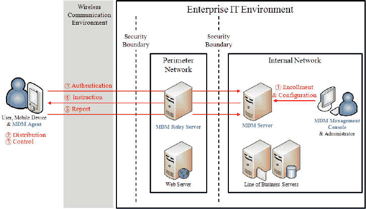
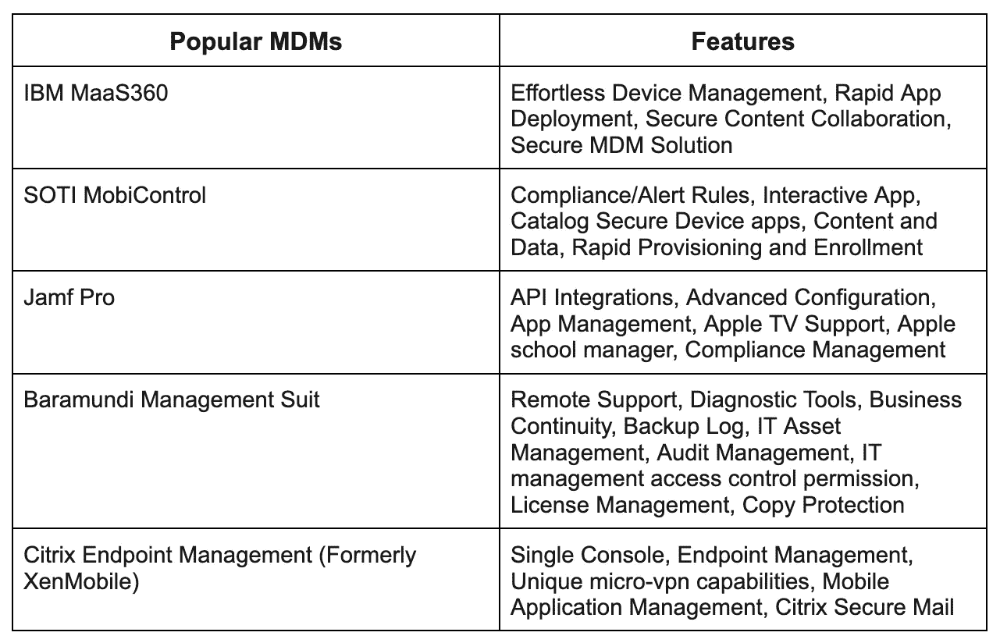

# MDM，企业移动管理的礼物(EMM)

> 原文：<https://medium.com/globant/mdm-a-gift-for-enterprise-mobility-management-emm-1a9f27f6f173?source=collection_archive---------8----------------------->

**什么是 MDM(移动设备管理)？**

在企业中，所有与管理和通信相关的活动都通过移动设备进行管理，减少了人工干预。单独管理每台设备是一项非常繁琐和耗时的任务。MDM 是我们可以克服这些问题的技术。其中，管理员可以远程控制数百台设备，无需任何人工干预，它成为了 EMM(企业移动性管理)的核心组件。

通过 MDM，我们只需点击一下鼠标，就可以控制访问管理、文件同步/共享、更新设备软件、增强企业网络(LAN/WAN)的安全性。

**MDM 工作的设备**

1.  所有类型的手机(安卓、iOS、Windows)
2.  平板电脑(安卓、iOS)
3.  所有电脑(Windows、Mac 和 Linux)
4.  企业设备(RFID、条形码、二维码扫描仪、像电视一样安装的娱乐设备、车载娱乐系统等等)

## **MDM 需求**

在当今的企业环境中，一切都将依赖于移动设备(手机、平板电脑、iPad、电视、POS 等)，主要的艰巨任务是分别管理所有这些设备。

假设一个组织的一个部门想要向整个企业中当前使用的所有移动设备发送一些数据或文件，那么有两种选择可以让他做到这一点，要么他走到每一台设备前，将该设备与他们的笔记本电脑或计算机连接，然后传输文件。在这个步骤中，时间被极大地浪费了。一个人可能无法在一天内将重要文件发送到每台设备上。因此，在这个步骤中浪费了时间和金钱。

其次，他可以在互联网(云)上发送这些文件，特定移动设备的每个管理员都必须下载该文件。但是在这一步中，组织中的许多问题也可以避免，例如安全性和人力浪费。

最后，我们可以在组织中建立一个基于软件的流程，远程控制所有移动设备。这就是 MDM(移动设备管理),管理员只需点击一下鼠标，就可以管理数百台设备。他可以发送/同步文件、管理安全性、安装或卸载设备软件、管理这些设备上的访问控制等等。

总之，我们可以说 MDM 可以在以下几点上为企业提供帮助:

1.  降低安全风险
2.  帮助降低成本
3.  改进工作流程
4.  简化内部 IT 需求
5.  低人力损耗

## **MDM 的特点**

移动操作系统开发者和移动设备制造商控制着 MDM 软件能做什么和不能做什么。它们给予特殊的许可来使用设备和操作系统的不同核心功能。

以下是 MDM 的一些核心特性:

1.  用户访问管理
2.  控制 AD(活动目录)
3.  保护企业内部的网络
4.  远程控制
5.  应用程序白名单和黑名单
6.  安全的数据/文件传输
7.  更多…(取决于市场上提供的不同 MDM)

## **MDM 如何工作**

MDM 软件由一个服务器和一个客户端代理组成，两者都通过 API 连接。借助 API，服务器可以通过安装在移动设备上的代理应用程序发送和接收命令。

但是服务器和代理总是通过 ping 机制连接，这意味着代理不断地 ping 服务器以检查它是否连接。通常，服务器和代理通过套接字连接进行连接，这是在同一网络上进行数据传输的一种非常快速的模式。

使用下图，您可以更好地理解服务器和代理之间的工作。

下图说明了移动设备管理(MDM)架构和操作。

source: [*https://www.devicemagic.com/blog/5-mobile-device-management-software-benefits/*](https://www.devicemagic.com/blog/5-mobile-device-management-software-benefits/)

MDM 架构的基本操作步骤描述如下:

**第一步**。注册/配置:在这一步中，用户将在 MDM 系统中注册其移动设备的数据。

**第二步**。分发:在这一步中，MDM 代理将被分发并安装在移动设备中。

**第三步**。身份验证:在 MDM 代理安装并运行之后，数据被发送到 MDM 服务器进行身份验证和匹配，如果输入的数据正确的话。

**第四步**。指令:MDM 服务器根据移动设备的状态将指令重定向到 MDM 代理。

**第五步**。控制/报告:MDM 代理按照设备控制策略处理移动设备的功能，并将结果发送回 MDM 服务器。

IT 管理员通过 MDM server 的管理控制台配置策略，服务器通过无线方式将策略推送到设备上的 MDM 代理。代理通过与直接内置于设备操作系统中的应用编程接口(API)进行通信，将这些策略应用于设备。

同样，IT 管理员可以通过 MDM server 将应用程序部署到受管设备上。

## **MDM 的优势**

## **1。减少 IT 人力**

单独管理企业中的数百台移动设备需要更多的 IT 人员。因为每个设备同时需要不同的支持，所以这个问题可以通过一个 MDM 解决方案来解决。通过 MDM，您可以由一名管理员或一名 IT 人员远程控制 1000 台或更多设备。

## 2.提高最终用户的工作效率

企业中的最终用户是指企业移动设备的用户。他们通常很容易习惯企业任务和设备上安装的软件。当新技术改变设备时，他们害怕更新相关的设备，当技术改变发生时，他们需要额外的时间来处理。MDM 还解决了这个问题，因为通过设备更新新的策略和软件比以往任何时候都更简单，而且它通常得到旧技术或软件的完全备份支持。

## 3.信息技术风险是可以避免的

当您谈论企业时，必须始终考虑的主要问题是数据和网络安全。尤其是当企业允许“自带设备”时。通过 MDM，您只需单击一下鼠标，就可以实施最佳安全实践并安装最佳策略。MDM 还支持数据加密和解密。它也可以与自带设备一起使用，在这种情况下，您的个人和组织数据会被分开。

## 4.减少移动设备支出

我们需要组织中的 100 或 1000 台移动设备来自动化该过程。这将增加支出负担。MDM 可以通过在员工的设备上启用自带设备来降低成本。通过这种方式，员工可以在自己携带的同一台设备上使用企业级数据/传输、访问管理和远程同步。在此之前，MDM 会发送特定的策略，以便在员工进入组织时自动安装。

## **MDM 解决方案提供商**

以下是 EMM 部分的一些最佳 MDM 供应商列表:

**结论**

通过以上的解释，我们可以说，MDM 是给任何企业的礼物。这是一个每天都在发展的软件解决方案。对于处理各种移动设备的组织来说，MDM 是一种新兴的需求。有两个主要因素会影响 MDM 的采用。第一个因素是**组织规模**，第二个因素是**自带设备文化**。许多大型移动制造巨头也在根据 MDM 市场的当前需求改变他们的设备硬件和操作系统。由于更多的移动设备以及对标准流程和安全问题的需要，大型组织正在非常频繁地采用 MDM，但是小型组织由于利润率较低而不太可能使用 MDM。这就是为什么我们说 MDM 是一种不断发展的技术，正在帮助组织扩展他们的业务。这在未来肯定会更有效率和成本效益，这样小企业也能从这项技术中受益。

## **参考:**

1.  [*https://www . researchgate . net/figure/illustrates-how-Mobile-Device-Management-MDM-architecture-and-operations _ fig 1 _ 305380830*](https://www.researchgate.net/figure/illustrates-how-Mobile-Device-Management-MDM-architecture-and-operations_fig1_305380830)