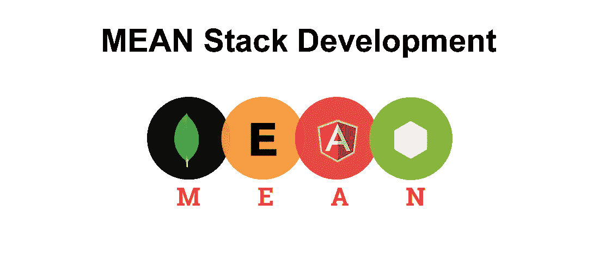

# 平均堆栈—学习指南

> 原文：<https://medium.com/quick-code/mean-stack-learning-guide-4d9921a55f52?source=collection_archive---------1----------------------->

## 了解如何开始使用 MEAN Stack

NodeJS 在 2011 年 7 月首次发布时，彻底改变了人们对 Javascript 的看法。它为 Javascript 带来了服务器端编程能力，这在当时彻底改变了编程社区。从那以后，在 Angular 等其他框架中的后续开发，意味着整个应用程序从前端到后端都可以完全用 Javascript 实现。随着非结构化数据的增加，MongoDB 成为了两个 JS 框架的完美补充，由此形成了 MEAN framework 的概念。这不是业内最流行的全栈编程技能之一。

## 介绍

“MEAN”是一个缩写词，其扩展如下:

Mongo DB -这是一个无模式的 NoSQL 数据库，以 JSON 格式存储数据，这使得在不同组件之间传递数据更加容易。

**Express JS**——受 Ruby framework Sinatra 的启发，Express 是一个面向 Node JS 的健壮的 web 应用开发框架。它可以用来构建 SPA 单页面应用程序和常规的多页面应用程序

**Angular JS-** 由 Google 开发，是业界最强大、最健壮、最流行的前端开发语言之一。

Node JS——最初推出时，它是一个革命性的 javascript 框架，用于服务器端功能。它支持快速开发高度可伸缩的并发应用程序。

## 工作机会

通常被称为平均栈开发人员，全栈开发人员，平均开发技能是 Web 开发和应用程序开发行业的热点之一。因此，他们也是收入最高的职业之一。在 linked for MEAN developers 网站上快速搜索一下，就有超过 14000 个结果。不要忘记，这些技能与网络开发人员技能密切相关，仅在美国就有另外 21000 个工作岗位。世界各地对平均发展的需求相当高。所以如果你是抱着职业的心态选择挑这个的话，你的选择是不会出错的。

现在，我们来了解一下 MEAN Full Stack 开发的入门学习路径。

## 初学者主题-我将在平均[第 1-3 天]中讨论

1.  介绍平均概念和理解 SPA-单页应用程序
2.  安装 IDE，Angular JS 简介
3.  Node JS 简介，Node JS 设置环境
4.  在项目中设置节点和角度 CLI
5.  探索项目结构

## 初学者主题-第二部分平均涵盖[第 4-7 天]

1.  角度-了解文件夹结构，角度组件，添加您自己的角度组件
2.  角度事件监听、内容输出、用户输入
3.  角柱输出，结构指令
4.  Angular-创建带有属性和事件绑定的帖子
5.  Angular- Post 模型，添加表单，从帖子创建到帖子列表获取帖子

下面是几个在线教程，帮助你了解 MEAN Stack 开发框架的基础知识。

 [## 95%折扣-学习和理解 NodeJS - Udemy 优惠券

### 深入 NodeJS 的引擎盖下。学习 V8、Express、均值堆栈、核心 Javascript 概念等等。

www.quickcode.co](https://www.quickcode.co/free/course/learn/Learn-and-Understand-NodeJS-/2842??utm_source=mediumPub&utm_medium=social&utm_campaign=LearningGuide&utm_term=LG_meanStack)  [## 100%折扣- Mongo DB 和 Node & Express - Udemy 免费课程优惠券

### 通过学习如何使用 Mongo DB 存储数据，开始您的全栈 JavaScript 开发之旅。-免费课程

www.quickcode.co](https://www.quickcode.co/free/course/learn/Mongo-DB-with-Node---Express-/1664?utm_source=mediumPub&utm_medium=social&utm_campaign=LearningGuide&utm_term=LG_meanStack) 

## 中级主题-我将在平均[第 7-14 天]中涵盖

1.  NodeJS-理解 NodeJS 和 Angular JS 之间的交互
2.  了解 REST API
3.  NodeJS——将 NodeJS 后端添加到项目中
4.  将快速框架添加到项目中
5.  了解 server.js 代码，增强文件
6.  通过 Angular 使用 HTTP 客户端，了解 CORS
7.  添加 POST 后端点，添加 Angular JS 到项目

 [## 100%折扣-学习使用 Mean Stack 构建 ToDo 应用程序课程- Eduonix 免费课程优惠券

### Mean Stack 课程是一套 MongoDB，Express，Angular & Nodejs。它允许开发人员创建 ToDo 应用程序…

www.quickcode.co](https://www.quickcode.co/free/course/learn/Learn-to-Build-ToDo-Application-with-Mean-Stack-Course-/1111?utm_source=mediumPub&utm_medium=social&utm_campaign=LearningGuide&utm_term=LG_meanStack) 

## 中级主题-II 平均涵盖[第 15-20 天]

1.  MongoDB 简介，了解 SQL 和 NoSQL 的区别
2.  设置 MongoDB，将 Angular 连接到 DB
3.  添加 mongose，了解 mongose 模式和模型
4.  Post 实例，将节点的 Express 应用程序与 MongoDB 连接起来
5.  MongoDB 中的 CRUD 操作
6.  删除、更新帖子、更新应用程序的前端

 [## 100%折扣- MongoDB Essentials -完整的 MongoDB 指南- Udemy 免费课程优惠券

### 使用 JavaScript Mongo Shell，Robo 3T (Robomongo)和 MongoDB Compass - Free 课程掌握 MongoDB 数据库

www.quickcode.co](https://www.quickcode.co/free/course/learn/MongoDB-Essentials---Complete-MongoDB-Guide-/908?utm_source=mediumPub&utm_medium=social&utm_campaign=LearningGuide&utm_term=LG_meanStack) 

## 高级主题-我将在平均[第 21- 27 天]涵盖

1.  MVC 架构
2.  在 Express 中使用 Ejs
3.  胡子，车把
4.  哈巴狗
5.  Cookie 解析器和快速会话
6.  使用 Mongo DB 进行 Angular 和 Crud 操作的 Ajax

 [## Web 开发者 100%免费堆栈:基于 Javascript 构建网站- Udemy 免费课程优惠券

### 使用尖端工具，通过 MongoDB、Express、Angular 和 Node 构建快速、健壮的基于 Javascript 的 web 应用程序

www.quickcode.co](http://www.quickcode.co/free/course/learn/MEAN-Stack-For-Web-Developers--Build-Websites-on-Javascript/45?utm_source=mediumPub&utm_medium=social&utm_campaign=LearningGuide&utm_term=LG_meanStack) 

## 高级主题-第二阶段平均涵盖[第 28- 32 天]

1.  使用 Swagger 休息 API
2.  具有反应形式和材料数据的 CRUD
3.  部署-设置 Heroku 应用程序
4.  在 Heroku 上创建 MongoDB 实例，在 Heroku 上部署

 [## 100%折扣-学习使用 Mean Stack 构建 ToDo 应用程序课程- Eduonix 免费课程优惠券

### Mean Stack 课程是一套 MongoDB，Express，Angular & Nodejs。它允许开发人员创建 ToDo 应用程序…

www.quickcode.co](https://www.quickcode.co/free/course/learn/Learn-to-Build-ToDo-Application-with-Mean-Stack-Course-/1111?utm_source=mediumPub&utm_medium=social&utm_campaign=LearningGuide&utm_term=LG_meanStack) 

## 互补技能

通常，我们的学习指导会有 4-5 项补充技能，以及一份工作的主要技能。但是，MEAN stack 作为一个概念，是从前端到后端的技能组合。所以你所有的补充技能都包含在内了。尽管如此，如果你是编程世界的绝对初学者并且想知道，我会建议拿起 HTML 5 和 Jquery。一旦你真正完成了普通堆栈开发技巧的训练，剩下的就都好办了。

## 技能一般的热门职位

1.  平均栈开发者
2.  MEAN Stack Rockstar(这是真的，我在 LinkedIn 上验证过！)
3.  全栈开发者
4.  Web 应用程序开发人员
5.  软件工程师

**结论**

这让我们结束了均值堆栈开发的学习之路。如果有任何进一步的问题或反馈，请在这里告诉我们，QuickCode 团队将在这里帮助您满足学习需求。

*原载于 2019 年 3 月 26 日*[*【www.quickcode.co*](http://www.quickcode.co/learning-guide/learn-mean-stackguide)*。*