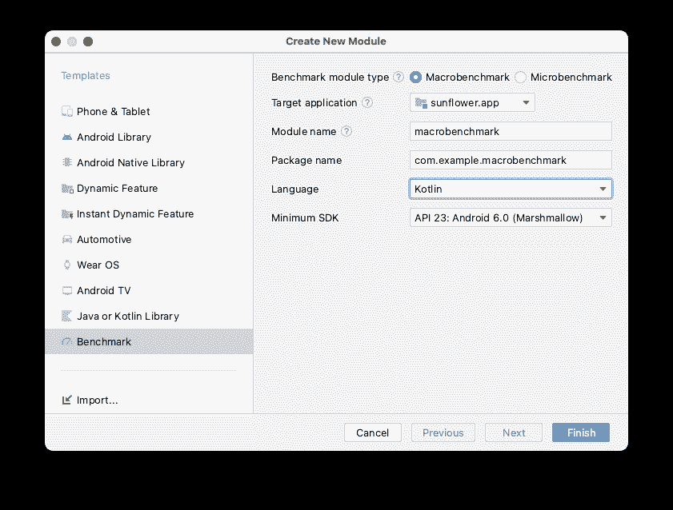
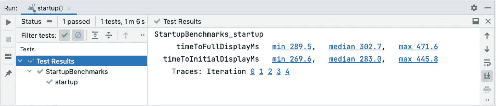
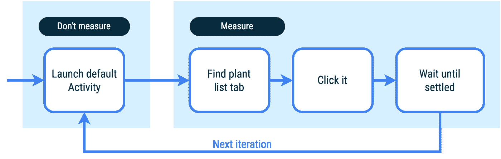
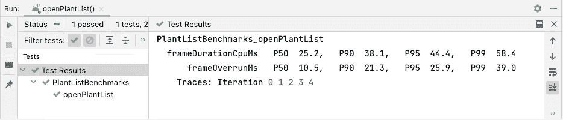
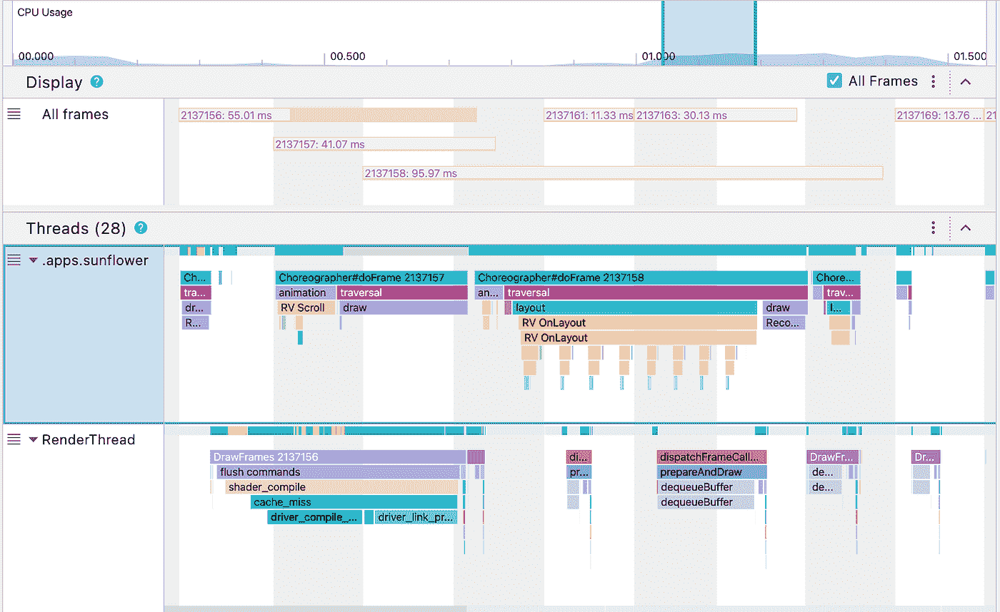
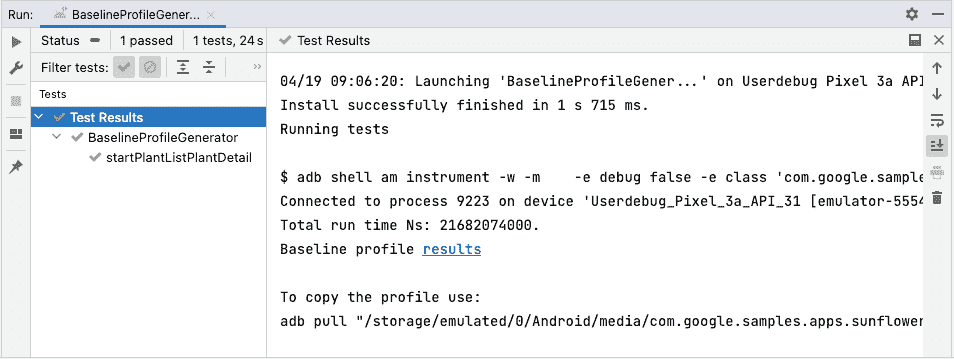
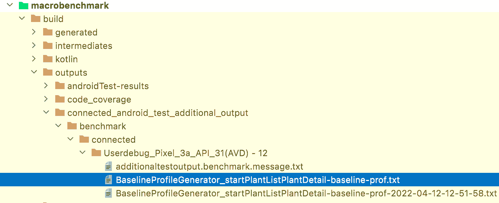
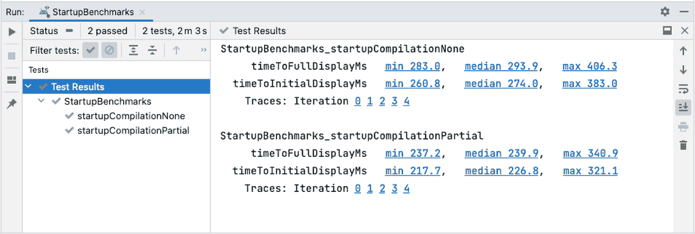

# 使用 Macrobenchmark 衡量和提高性能

> 原文：<https://medium.com/androiddevelopers/measure-and-improve-performance-with-macrobenchmark-560abd0aa5bb?source=collection_archive---------0----------------------->

## *Jetpack 宏基准和基准配置文件简介*

你是否在考虑优化你的应用程序的性能，但不知道从何下手？或者您是否优化了性能并怀疑是否还有改进的空间？

您可以对您的应用进行基准测试！

在本文中，我们将了解 [Jetpack Macrobenchmark 库](https://developer.android.com/studio/profile/macrobenchmark-overview)如何帮助您了解应用程序的性能，以及如何[使用基线配置文件将应用程序的启动时间提高 30%](https://android-developers.googleblog.com/2022/01/improving-app-performance-with-baseline.html) ！

# 什么是 Jetpack 宏基准

Jetpack Macrobenchmark 是用于测量(和基准测试)应用程序性能的库。宏基准适用于端到端用例，如应用启动、跨活动导航、滚动列表或其他 UI 操作。该库直接在 Android Studio 中提供结果，并将结果写入 JSON 文件。这使得它不仅适用于在您的工作站上进行本地测量，还适用于持续集成(CI)中的性能测试。

借助 Jetpack Macrobenchmark，您可以:

*   使用确定的启动模式和滚动速度多次测量应用程序
*   控制应用程序的编译状态——性能稳定性的主要因素
*   通过本地复制谷歌 Play 商店执行的安装时优化来检查真实世界的性能

使用这个库的检测不直接调用您的应用程序代码，而是像用户一样导航您的应用程序。如果您想直接测量您的应用程序代码的一部分，请参见 [Jetpack 微基准](https://developer.android.com/studio/profile/microbenchmark-overview)。

宏基准测试在一个单独的进程中运行，以允许重启或预编译您的应用程序。这意味着像 Espresso 这样的进程内机制不起作用，你可以使用`[UiAutomator](https://developer.android.com/training/testing/other-components/ui-automator)`来与目标应用程序交互。

理论讲够了，我们开始吧。

# 将基准添加到项目中

在本文中，我们将向[向日葵示例](https://github.com/android/sunflower)应用程序添加宏基准。

宏基准测试需要在项目中添加一个新的 Gradle 模块。最简单的开始方式是使用 Android Studio 模板(至少需要北极狐 2020.3.1)。

1.  在**项目**面板中右键单击您的项目或模块。
2.  选择**新>模块**。
3.  从**模板**窗格中选择**基准**。
4.  选择**宏基准**作为基准模块类型，并填写详细信息。
5.  设置你要基准测试的**最低 SDK** ，至少需要 Android 6 (API 等级 23)。

向导为您做了几件事:

*   为宏基准创建一个`com.android.test`模块。
*   添加将`debuggable`设置为假并将`signingConfig`设置为`debug`的`benchmark`构建类型。
*   将`<profileable>`标签添加到 AndroidManifest。
*   创建一个基本的启动基准框架。

我们将`signingConfig`设置为`debug`只是为了能够在不需要生产密钥库的情况下进行构建。我们还需要禁用`debuggable`,因为它增加了很多性能开销，并使结果计时不稳定。然而，因为我们禁用了`debuggable`，所以我们需要添加`<profileable>`标签，以允许基准测试通过发布性能来分析您的应用。要获得更多关于`<profileable>`的信息，请查看我们的[文档](https://developer.android.com/studio/profile#profileable-apps)。

现在我们可以开始编写实际的基准测试了。

# 测量应用程序启动

[应用启动时间](https://developer.android.com/topic/performance/vitals/launch-time)，或者说用户开始使用你的应用所需的时间，是衡量用户参与度的一个关键指标。要使用 macrobenchmarks 测量应用程序的启动时间，请编写如下的`@Test`(如果您使用模板创建了模块，Android Studio 已经为您创建了该模块):

让我们来分解一下这一切意味着什么。
宏基准是常规的插装单元测试，因此它们使用 JUnit 语法— `@RunWith`、`@Rule`、`@Test`等。编写基准时，您的入口点是`MacrobenchmarkRule`的`measureRepeated`函数，在这里您至少需要指定这些参数:

*   `packageName`–由于基准测试在单独的进程中运行，您需要指定要测量的应用程序。
*   `metrics`–捕获信息的主要类型。在我们的例子中，我们关心启动时间。
*   `iterations`–循环将重复多少次。更多的迭代意味着更稳定的结果，但代价是更长的执行时间。
*   `measureBlock`(最后一个 lambda 参数)–macro benchmark 将在此块中跟踪并记录定义的指标。您在这里执行想要测量的动作。

也可以选择指定`CompilationMode`和`StartupMode`。

`CompilationMode`定义了如何将应用程序预编译成机器代码，并有以下选项:

*   `None()`–不预编译应用程序，但 JIT 在应用程序执行过程中仍然启用。
*   `Partial()`–使用基线配置文件和/或预热运行预编译应用。
*   `Full()`–预编译整个应用程序。这是 Android 6 (API 23)和更低版本上的唯一选项。

`StartupMode`允许您定义您的应用程序[应该如何在基准开始时](https://developer.android.com/topic/performance/vitals/launch-time)启动。可用选项有`COLD`、`WARM`和`HOT`。您可以从代表您的应用程序必须完成的最大工作量的`StartupMode.COLD`开始。

让我们运行它——与您运行任何单元测试的方式相同——在测试旁边使用 gutter 图标。

您应该在真实设备上进行基准测试，而不是在 Android 模拟器上。如果您试图在模拟器上运行基准测试，它将在运行时失败，并警告您可能会给出不正确的结果。虽然从技术上讲，您可以在模拟器上运行它(如果您[抑制警告](https://developer.android.com/studio/profile/macrobenchmark-instrumentation-args#suppresserrors))，但您基本上是在测量您的主机性能——如果它处于重负载下，您的基准测试会显得更慢，反之亦然。

在执行过程中，基准将启动和停止您的应用几次(基于`iterations`)，然后它将结果输出到 Android Studio:

结果以毫秒为单位给出了你的应用程序启动 ( `timeToInitialDisplayMs`)所用的时间[。每个结果本身都是一个带有系统跟踪的链接，您可以在 Android Studio 中打开它，进一步调查初创公司的情况，并采取措施进行优化。](https://developer.android.com/topic/performance/vitals/launch-time#time-initial)

一个常见的情况是测量应用程序已经完全加载了内容，用户可以与之交互，也称为[完全显示的时间](https://developer.android.com/topic/performance/vitals/launch-time#time-full)。为了告诉系统这种情况何时发生，您必须调用`Activity.reportFullyDrawn()`。如果这样做，启动基准将自动捕获`timeToFullDisplayMs`。请注意，您需要等待基准中的内容，否则基准会在第一个渲染帧结束，并可能跳过指标。

例如，下面的代码片段一直等到`garden_list`有了几个孩子:

好了，我们已经测量了应用启动时间！我们能做得更多吗？可以测帧，调查 jank！

# 测量帧时序并检测 jank

在你的用户登陆你的应用后，他们遇到的第二个指标是应用的流畅程度。或者用我们的话来说，应用程序能以多快的速度生成帧。为了测量它，我们将使用`[FrameTimingMetric](https://developer.android.com/reference/androidx/benchmark/macro/FrameTimingMetric)`。

要使用 Macrobenchmark 实现上述流程，您需要编写如下基准:

让我们以与启动基准测试相同的方式运行它，并获得以下结果:

此指标输出第 50、90、95 和 99 百分位的帧持续时间，单位为毫秒(`frameDurationCpuMs`)。在 Android 12 (API level 31)及更高版本上，它还会返回你的帧数超过限制多长时间(`frameOverrunMs`)。该值可以是负数，这意味着产生一帧的剩余时间。

 [## 与 Macrobenchmark | Android 开发人员一起检查应用性能

### 在这个 codelab 中，您将学习使用 macrobenchmark 库。你将测量应用程序的启动时间，这是一个关键…

咕咕](https://goo.gle/benchmarking-codelab) 

# 我们已经测量过了，那又怎样？

Macrobenchmarks 为每次迭代生成系统跟踪，让您进一步调查执行期间发生了什么。你可以在 Android Studio 中直接打开跟踪文件，方法是从结果中点击迭代(或者在应用启动的情况下点击 min/median/max)。

正如我们在基准测试中看到的，当打开工厂细节时，一些帧被跳过。我们可以开始调查跟踪文件的问题。

系统跟踪显示平台代码捕获的各个部分，以及作为应用程序一部分的库。通常它没有足够的信息。为了改善这一点，使用`trace(“MySection”) { /* this will be in the trace */ }`添加带有 [AndroidX 跟踪](https://developer.android.com/jetpack/androidx/releases/tracing)库的定制跟踪部分。有关读取跟踪和[添加自定义](https://developer.android.com/topic/performance/tracing/custom-events#kotlin)事件的更多信息，请访问[系统跟踪概述](https://developer.android.com/topic/performance/tracing)。

现在，关于提高性能。

# 使用基线配置文件提高性能

基线配置文件是 APK 中包含的类和方法的列表，它们在应用程序安装过程中预编译为机器码。这可以使你的应用程序启动更快，减少 jank，并提高一般性能。这是因为 JIT 编译器在遇到代码的指定部分时不需要被触发。

您可以通过将定制项目添加到您的`src/main`目录下的`baseline-prof.txt`文件中来将它们添加到基线概要文件中。但是，如果您不想自己编写成百上千个重要的方法到文件中，您可以简化过程，用 Macrobenchmark 生成基线概要文件！查看[基线配置文件](https://developer.android.com/studio/profile/baselineprofiles)了解更多关于这些如何工作的信息。

通常，你会为你的应用程序的典型用户旅程生成配置文件。
在我们的示例中，我们可以识别这三种旅程:

1.  启动应用程序(这对大多数应用程序来说至关重要)
2.  转到工厂列表(来自上一示例)
3.  转到工厂详情

为了生成概要文件，您将使用`BaselineProfileRule`(而不是之前的`MacrobenchmarkRule`)并调用`collectBaselineProfile(packageName)`。下面的代码片段显示了如何为提到的旅程生成配置文件:

要运行这个，你需要一个运行 Android 9 (API 级别 28)或更高版本的`userdebug`或根仿真器(没有谷歌 Play 商店)。在运行测试之前，通过从终端调用`adb root`以 root 权限重启 adb。现在您可以运行测试来生成概要文件。

运行测试后，您需要做几件事来使基线配置文件与您的应用程序一起工作:

1.  您需要将生成的基线概要文件放到您的`src/main`文件夹中(在`AndroidManifest.xml`旁边)。要检索该文件，您可以从位于`project_root/macrobenchmark/build/outputs/`的`connected_android_test_additional_output`文件夹中复制它，如下图所示。

或者，您可以点击 Android Studio 输出中的`Baseline Profile **results**`链接并保存内容，或者使用输出中打印的`adb pull`命令。

2.您需要将文件重命名为`baseline-prof.txt`。

3.向您的应用程序添加 profileinstaller 依赖项

为了验证基线概要文件被正确加载，您可以运行我们之前定义的基准，但是使用`CompilationMode.Partial()`作为`compilationMode`参数。默认情况下，此参数要求基线配置文件在应用程序安装期间可用。

在下面的截图中，我们可以看到两个基准测试的结果— `startupCompilationPartial`使用了基线概要文件，而`startupCompilationNone`没有。

从结果中我们可以看到，未编译应用程序的`timeToFullDisplayMs`中值为**293.9 毫秒**，而使用基准配置文件的应用程序的中值为**239.9 毫秒**。这给了我们 **~22%** 更快的启动时间！这是一个使用视图的示例应用程序，视图是为整个系统预先编译的。如果您的应用程序使用 Jetpack Compose，其中 UI 代码包含在您的 APK 中，性能增益将会更大！

 [## 借助基线档案提高应用性能| Android 开发人员

### 在这个 codelab 中，您将了解如何生成基线配置文件来优化您的应用程序的性能，以及如何…

咕咕](https://goo.gle/baseline-profiles-codelab) 

# 接下来呢？

本文只是触及了宏基准测试的皮毛。

在本地运行基准测试来发现是否有问题是很好的，但是在您的 CI 上跟踪性能会更好。现在，您可以查看[文档](https://developer.android.com/studio/profile/benchmarking-in-ci)，其中我们展示了如何在 CI 中进行基准测试，并查看我们示例中 Firebase 测试实验室的[设置。](https://github.com/android/performance-samples/tree/main/MacrobenchmarkSample/ftl)

如果你想深入了解，我们最近修改了我们的[文档](https://developer.android.com/studio/profile/macrobenchmark-overview)，所以来看看吧。如果您遗漏了什么，或者您有一个想要测量的想法，请在我们的[追踪器](https://issuetracker.google.com/issues/new?component=975669&template=1519452)中告诉我们！我们感谢任何反馈。

此外，请让我们知道您使用基线配置文件在应用中获得了哪些性能优势！