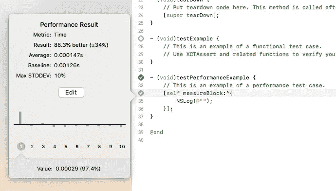
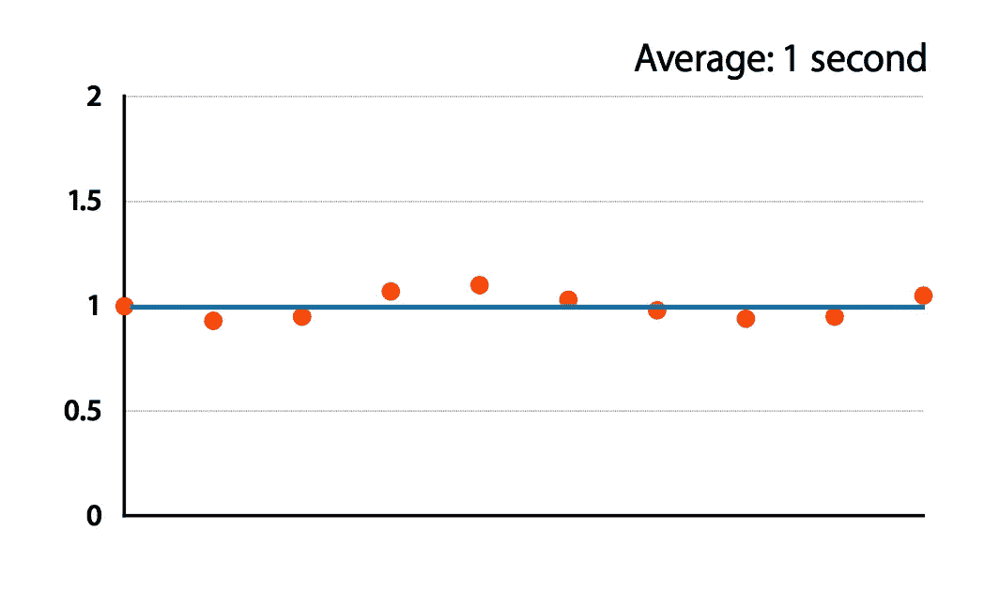
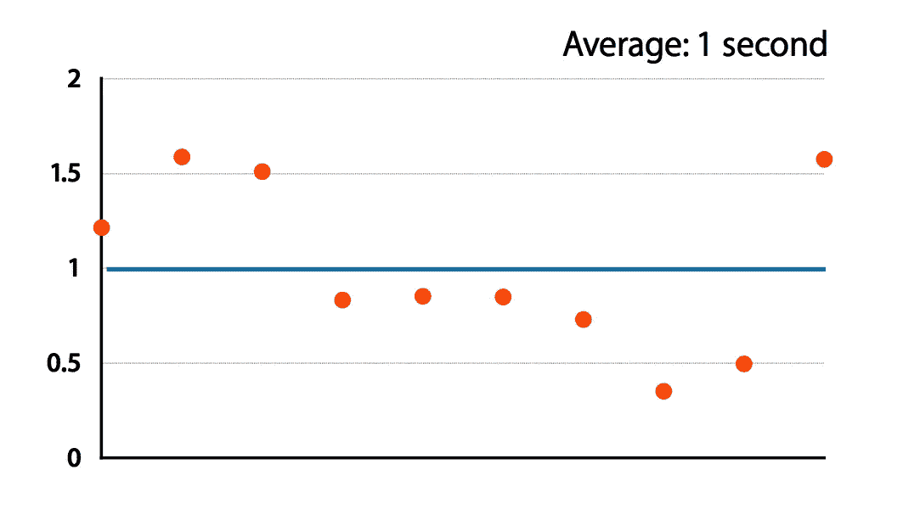

# measure block:iOS 中的性能测试是如何工作的？

> 原文：<https://medium.com/square-corner-blog/measureblock-how-does-performance-testing-work-in-ios-c1424eceb208?source=collection_archive---------2----------------------->

> 注意，我们已经行动了！如果您想继续了解 Square 的最新技术内容，请访问我们的新家[https://developer.squareup.com/blog](https://developer.squareup.com/blog)

我在 [Square](http://squareup.com/) 做一个小型项目，涉及 iOS 的性能单元测试——主要是研究我们如何引入性能单元测试，我们有哪些选择，以及它如何在我们的 CI(持续集成)上扩展。在关注苹果作为其单元测试套件的一部分提供的一个工具，神奇的`measureBlock`方法时，问题是:它是如何工作的？这对我们和我们的 CI 流程有用吗？

# measureBlock 是什么？

对于那些不知道`measureBlock,`的人来说，有一点背景:当你在`XCTest`中编写单元测试时，有一个特性允许你测量一段代码执行需要多长时间。在 Objective-C 中是这样的:

或者在 Swift 中:

Xcode 运行了很多次，并建立了一个基线。如果在给定的后续测试中，标准偏差离基线太远，则测试失败。此外，Xcode 为您提供了一个漂亮的弹出窗口，向您显示各种运行的持续时间，并让您选择自己的基线和设置:

Screenshot of a performance unit test written in Objective-C in Xcode

# 它是如何工作的？

## 基础知识

不幸的是，谷歌搜索结果非常肤浅，直到我偶然发现了 2014 年 WWDC 会议的一些旧幻灯片。

本文档说明`measureBlock` **运行您的程序块 10 次**，并计算运行您的程序块所需的平均时间。然后将该平均值用作基线。当您第一次运行您的测试时，它将会失败，因为在第一次运行时，还没有建立基线。您可以手动修改基线。在随后的测试运行中，`measureBlock`仍然运行您的程序块 10 次，但是这次它将运行时间的标准偏差与基线进行比较。如果上涨或下跌超过 10%，那么你的测试就会失败。所有这些设置也可以手动更改。

## 基线与平均值

Xcode 显示一个小弹出窗口，显示基线和平均值。两者之间的区别是:平均值是您上次运行测试时运行代码块所花费的时间。基线是您选择的固定设置(如果您不这样做，Xcode 会自动设置)。将标准偏差与基线进行比较；弹出窗口中显示的平均值对您的测试没有任何影响。

## 为什么使用标准差

下图显示了给定代码块运行 10 次的运行时间:

Graph showing 10 time measurements that average to 1 second, with little spread

*平均时间为 1 秒。(来自苹果 WWDC 幻灯片)*

现在，这是第二张图，平均时间也是 1 秒:

Graph showing 10 time measurements that average to 1 second, with a large spread

显然，平均水平并不能说明全部情况。这就是为什么`measureBlock`将标准偏差与基线进行比较——因为标准偏差告诉我们测量的范围。

# 基线存储在哪里？

因此，对于那些在多台机器上运行 CI 的大公司工作的人来说，现在的大问题是:基线存储在哪里？我通过使用 git、添加一个性能单元测试并查看文件 diff 简单地解决了这个问题。

Xcode 将基线存储在项目文件包中的`project.xcodeproj/xcshareddata/xcbaselines/...`下。该文件夹将包含一个列出给定主机+运行目标组合的所有性能测试设置的`.plist`，以及一个包含所有主机列表的`Info.plist`。基线特定于运行测试的主机和目标设备(例如 iPhone 7 模拟器)。Xcode 会生成一个唯一的 UUID 来标识组合(机器+目标),并将所有性能设置绑定到它。组合是由机器的规格定义的——因此，如果您在具有完全相同规格的不同机器上运行您的性能测试，那么将会提取相同的基线(请参见下面的截图，了解使用什么规格来定义组合)。

索引所有主机和目标组合的`Info.plist`如下所示:

Screenshot of the Info.plist showing all the host machine and target environment combos as well as their respective specifications

这是给定主机性能测试设置的`.plist`示例:

Screenshot showing a plist that belongs to a specific host machine and target combo, containing the test baselines for that combo

因此，当这些被签入代码库中时，每台机器都必须有自己的设置。这是合理的，因为主机和模拟器的性能会有所不同。然而，如果您在一家大公司拥有数百台虚拟机，这可能会变得棘手。

# 问与答(Question and Answer)

*   **这是什么版本的 Xcode？**
    *Xcode 9.2*
*   **你是怎么算出普利斯特的？**
    *我使用 Xcode 对基线进行了更改，并使用 git 来检测文件更改。然后我打开 plists，试着手工修改，看结果。我还尝试在另一台机器上运行我的测试，看看哪些基线被删除了。*
*   **我可以用脚本生成 plists 吗？**
    *可以(只要苹果不改东西)。你可以生成一个随机的 UUID 来命名一个组合，并插入所有你想要的规格。请确保不要忘记任何字段。* `*Info.plist*` *文件需要包含对组合(机器+目标)的引用并包含规格。您还需要一个以 UUID 命名的文件，带有一个* `*.plist*` *扩展名，包含所有的测试名称和相关的基线。*
*   **我可以从 plist 中删除字段以使其更通用，并为多种类型的机器或目标重用“组合”吗？**
    *否。如果一个组合与机器的规格不完全匹配，那么 Xcode 会生成一个新的 UUID，并用机器的确切规格填充它。这将需要您添加新的基准来绑定到此 UUID。*

# 结论

关于`measureBlock`的关键决定:

*   `measureBlock`运行你的代码块 10 次。
*   将标准偏差与基线进行比较。
*   基线由 Xcode 计算，但也可以手动设置。
*   您的测试基线存储在`.xcodeproj`文件中，但同时是特定于主机和目标设备的。

从本质上来说，苹果为 iOS 开发者提供了一个伟大、简单的性能单元测试工具。然而，如果没有大量额外的工具和脚本，它可能无法适用于在数百台不同规格的机器上运行自动化测试的公司。

# 参考

*   [2014 年 WWDC 青奥会 Xcode 6 测试](https://developer.apple.com/videos/play/wwdc2014/414/)