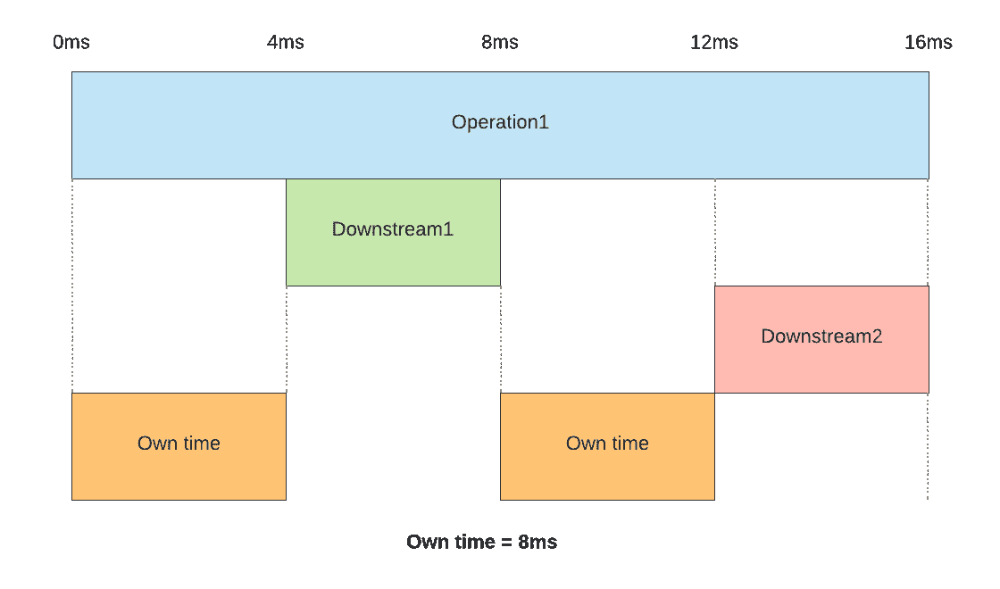
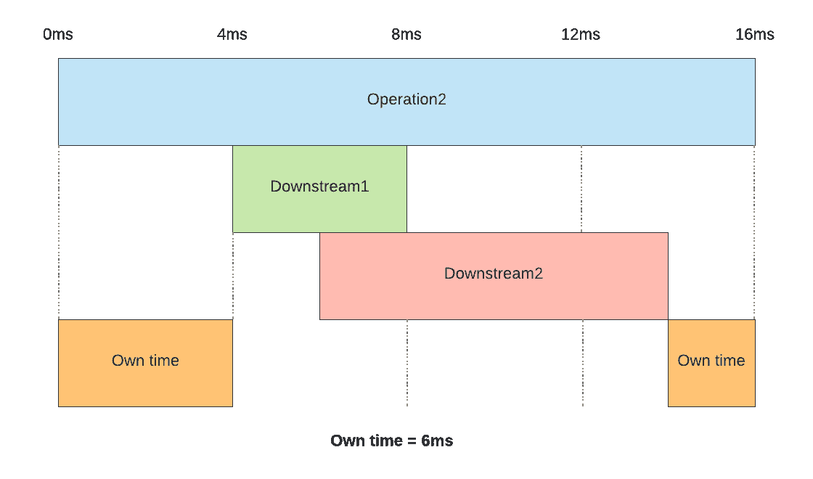
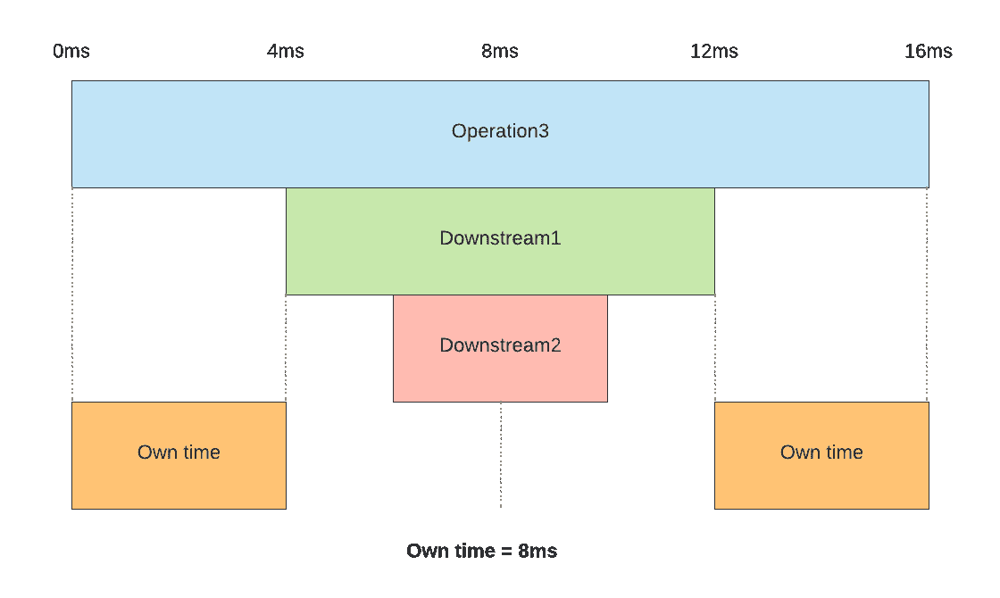
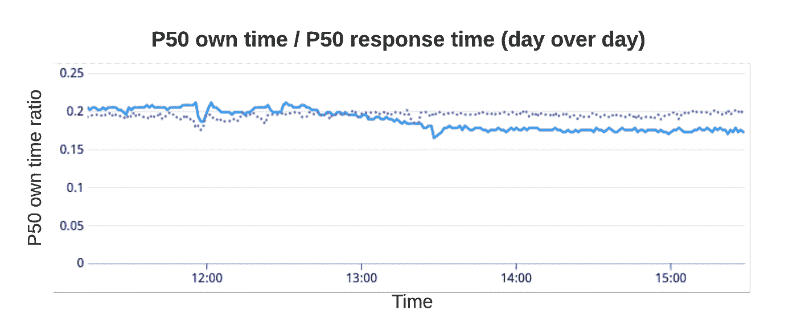
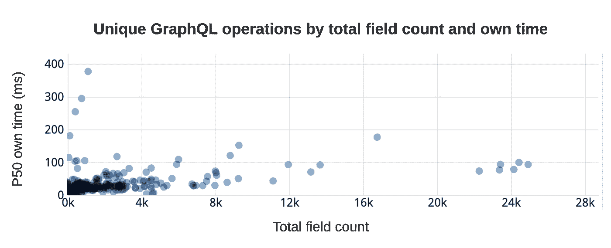
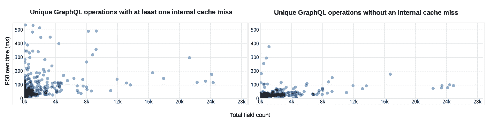

# 用自己的时间测量延迟开销

> 原文：<https://medium.com/airbnb-engineering/measuring-latency-overhead-with-own-time-f4373f586ca?source=collection_archive---------1----------------------->

作者:[吉米·奥尼尔](https://www.linkedin.com/in/jimmyoneill)


## 量化高架桥框架延迟开销的新指标

[高架桥](/airbnb-engineering/taming-service-oriented-architecture-using-a-data-oriented-service-mesh-da771a841344)，一个基于 GraphQL 的面向数据的服务网格，是 Airbnb 的铺路解决方案，用于获取内部数据和服务面向公众的 API 请求。作为统一的数据访问层，高架桥框架处理高吞吐量，并能够在执行任意 GraphQL 查询时动态路由到数百个下游目的地。

# 高架桥中的性能挑战

高架桥作为数据访问层的角色使其处于 Airbnb 上大多数活动的关键路径上。这使得运行时性能至关重要，因为框架中的开销将普遍适用，并可能产生倍增效应。同时，高架桥接受对统一数据图的任意查询。在实践中，这相当于生产中成千上万的异构查询，每个查询都能够在查询执行过程中进行任意数量的下游调用，并且经常是并发调用。

这对我们提出了挑战。高架桥的运行时间开销是我们监控和改善的关键，但我们没有很好的措施。端到端查询延迟的指标受到下游服务性能的干扰，因此很难准确判断高架桥性能干预的效果。我们需要一个度量标准，使*将高架桥变化的性能影响与下游服务的性能影响隔离开来。*

# 定义自己的时间

为此，我们创建了一个名为“自己的时间”的指标。Own time 测量没有下游请求时请求的挂钟时间部分。以下是在给定根请求时间跨度和一组下游提取时间跨度的情况下计算自身时间的伪代码:

```
def calculateOwnTime(rootSpan, fetchSpans):
  ownTime = 0
  maxEndTimeSoFar = rootSpan.startTime
  sortedFetchSpans = fetchSpans sorted by increasing start-time
  for fetchSpan in sortedFetchSpans:
    if (maxEndTimeSoFar < fetchSpan.startTime)
      ownTime += (fetchSpan.startTime - maxEndTimeSoFar)
    maxEndTimeSoFar = max(maxEndTimeSoFar, fetchSpan.endTime)
    ownTime += (rootSpan.endTime - maxEndTimeSoFar)
  return ownTime
```

自有时间指标允许我们关注高架桥的开销方面，这些方面显然与下游服务依赖无关。虽然它没有涵盖高架桥开销的所有方面，但我们发现它足以成为开销成本的一个有价值的指标。

**例题**

在所有下游调用都是串行进行的简单情况下，自己的时间是根操作跨度和下游时间跨度之和的简单跨度差。



当有多个下游调用时，它们可以完全或部分并行进行。



在这个例子中，下游调用部分并行发生，产生的自己的时间值不包括任何下游请求正在进行的时间，无论是否并行。



# 识别和减少运行时延迟

**测量 CPU 与 I/O 对请求延迟的影响**

通过整体操作延迟来标准化操作拥有时间，可以让我们估计一个操作受 CPU 和 I/O 限制的程度。我们称之为查询的“自己的时间比率”。例如，下图所示的高架桥操作的自身时间比率为 20%，表明高架桥中 20%的请求运行时间是在没有下游请求的情况下度过的。在部署内部高架桥性能改进后，这一操作的自身时间比率下降到 17%，因为高架桥开销得到改善，而下游性能保持不变。



This graph shows a day-over-day reduction in own time ratio for a Viaduct operation after a runtime overhead improvement was deployed.

操作的低自有时间比率表明，最大的整体延迟增益可能会通过优化下游服务而不是高架桥来实现。较高的自身时间比率表明，有意义的等待时间增益可来自优化内部高架桥运行时间。当为了一个操作而进行这样的优化时，我们也可以在所有操作中使用自己的时间比率，尤其是低比率的操作，以确保我们不会引入更广泛的回归。

**量化查询大小对运行时开销的影响**

高架桥用户报告称，大型查询的运行速度比预期的要慢，这是高架桥开销造成的。在此之前，我们没有评估此类报告的标准。在介绍了自己的时间之后，我们有了一个起点，但是我们需要进一步细化这个用例的指标。

随着操作返回的字段数量的增加，预计自己的时间也会增加。但这是合理的预期吗？我们发现，通过由操作返回的字段的计数来标准化自己的时间产生了一个度量，该度量更有效地指示，在一组不同的操作中，自己的时间何时过多。我们将字段计数定义为包括对象字段和单个数组元素。

下图显示了在我们的一组操作中，自身时间和字段计数之间确实存在总体关系，以及一些具有异常高的自身时间与字段计数比率的异常值。



This chart plots the number of fields resolved against own time for unique GraphQL operations.

字段计数和自己的时间之间的关系鼓励我们关注运行在所有操作的每个字段上的框架逻辑，而不是代码库的其他部分。通过一些 CPU 分析，我们能够快速识别瓶颈。由此带来的一个改进是对现场执行的多线程模型的改变，它将所有操作的时间减少了 25%。

**量化内部缓存对运行时开销的影响**

高架桥遇到了另一个性能问题。对于某些操作，延迟似乎变化很大，甚至在相同的请求之间也是如此。在这里，我们再次用自己的时间来指导我们对根本原因的调查。

高架桥依靠大量内部缓存来确保执行速度，例如用于解析和验证 GraphQL 文档的缓存。自己的时间指标表明，高架桥运行时间开销，而不是下游服务依赖，是造成延迟差异的原因。我们推测缓存未命中是罪魁祸首。为了测试这个理论，我们对缓存进行了测试，以报告在操作执行期间是否发生了任何查找未命中，并将这个命中/未命中状态附加到我们自己的时间度量输出中。这使我们能够根据每个缓存、每个操作的缓存命中/未命中状态来报告自己的时间。



将这些信息添加到自己的时间中，使我们既可以确认我们的理论，又可以量化实施解决方案的潜在优势，例如在投入实际工程资源之前，额外的缓存预热或将内存中的缓存移动到分布式缓存。将存储 GraphQL 文档验证状态的内存缓存迁移到分布式缓存降低了未命中率。这对尾部延迟有重大影响，尤其是对于更有可能遇到冷缓存状态的低 QPS 操作。

# 设置运行时开销目标

建立自己的按字段计数标准化的时间度量标准是解决查询模式变化的一个很好的方法。因此，我们现在使用跨所有操作聚合的这个指标来设置框架级的性能目标，这些目标与客户端查询模式的变化无关。特别是，在每个季度开始时测量标准化自己时间的基本比率后，我们设定了一个目标，即每季度提高一个特定百分比的标准化自己时间。

我们还使用这个指标，在每个操作的基础上汇总，让操作所有者知道他们的操作开销与系统的其余部分相比如何。

# 将自己的时间整合到发布周期中

为了量化变化对运行时性能的影响，我们可以设置实验，让两个分阶段的控制和处理应用程序接收相同的生产流量重放。然后我们可以用图表表示他们之间的时差。这允许我们量化各种框架干预对运行时开销的影响，并测量每个干预对我们的性能目标的影响。

虽然重放实验有助于我们评估有限用例集上的变化的潜在运行时改进，但目标狭窄的优化可能会导致更广泛的性能退化，这仍可能意外发生。为了防止这种倒退，我们在部署之前利用了自动化的金丝雀分析流程。canary 实例和基线实例在一段时间内接收相同的生产重放流量，它们之间的较大差异会自动停止部署过程。通过检查 canary 实例和基线实例之间的时间差，我们可以在回归投入生产之前识别出意外的性能回归。

除了自动化金丝雀分析之外，生产中的日复一日、周复一周和月复一月的时间图表向我们展示了长期孤立的性能趋势，并允许我们对生产中的任何回归进行一分为二。

# 局限性和未来工作

通过忽略高架桥在所有下游调用期间所做的事情，own time 没有考虑对下游请求本身的调用模式的可能优化。例如，可以通过增加下游调用的并发性或完全删除一些调用来加速请求的执行。

虽然 own time 给出了挂钟运行时服务开销的度量，但它没有说明*什么* 导致了开销，或者如何最好地改善它，这将在 GraphQL 服务器中的操作之间有所不同。但是，跟踪内存中的下游请求跨度提供了基线数据，可以用其他元数据丰富这些数据，并进一步过滤这些数据，以测量特定于应用程序的活动对自己时间的贡献。

追踪非预期的自身时间变化的根本原因或理解为什么操作是自身时间异常值需要人工检查，有时还需要额外的一次性测量，这需要宝贵的工程时间。我们可以通过测量应用程序的各个部分对自己时间的贡献来自动化这些调查的第一步。这将加快根本原因分析，并限制手动分析 CPU 使用情况所花费的时间。

# 结论

Own time 使我们能够分离出高架桥的运行时性能特征，这是我们基于 GraphQL 的面向数据的服务网格。利用自己的时间，我们可以精确地测量应用程序更改对生产运行时性能的影响，设置独立于下游的性能目标，并针对任意底层应用程序的这些目标来测量我们的长期进展。用特定于应用程序的数据来丰富自己的时间，例如在高架桥中提取的字段计数和缓存命中/未命中状态，让我们对应用程序的状态与其运行时性能特征之间的关系有一个总体的了解。

# 承认

感谢所有支持高架桥框架、集思广益并对本文提供反馈的人，包括艾琳·陈、陈玉春、佐兰·季米特里耶维奇、亚当·米斯杰维茨、帕斯·沙阿、雷米·斯塔塔和金·施特劳赫。

所有产品名称、徽标和品牌都是其各自所有者的财产。本网站中使用的所有公司、产品和服务名称仅用于识别目的。使用这些名称、标志和品牌并不意味着认可。