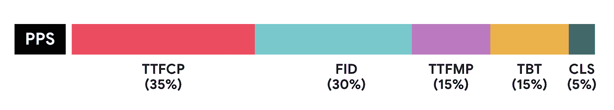
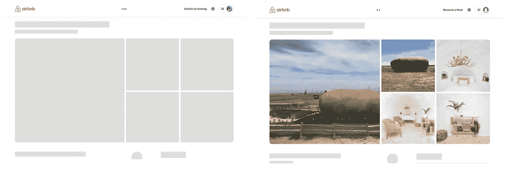

# 在 Airbnb 测量网络性能

> 原文：<https://medium.com/airbnb-engineering/measuring-web-performance-at-airbnb-122da8d3ea3f?source=collection_archive---------0----------------------->

了解 Airbnb 跟踪哪些网络性能指标，我们如何衡量它们，以及我们在实践中如何权衡它们。

乔希·纳尔逊

加载这个网页花了多长时间？这是全行业普遍存在的问题，但这是正确的问题吗？最近，从使用基于单秒的指标，如“页面加载”，到描绘更全面的性能图，从网站用户的角度表现体验的指标，已经发生了转变。在 Airbnb，衡量我们的客人和主人实际体验到的网络性能至关重要。之前，我们描述了 Airbnb [如何创建页面性能分数](/airbnb-engineering/creating-airbnbs-page-performance-score-5f664be0936)来将来自真实用户的多个指标组合成一个单一分数。在这篇博文中，我们描述了我们认为对我们的网站很重要的指标，以及它们与行业标准的关系。我们还讨论了一些移动这些指标的案例研究，以及它们如何影响网站访问者的体验。

# Web 性能指标

我们在网站上衡量五个关键绩效指标。我们选择这些指标是因为它们代表了用户体验时的性能，也因为它们的定义[简单、可解释，并且便于计算](https://chromium.googlesource.com/chromium/src/+/lkgr/docs/speed/good_toplevel_metrics.md)。

我们记录对网站的直接请求以及页面之间的客户端转换请求的这些指标(Airbnb 使用[单页面应用](https://developer.mozilla.org/en-US/docs/Glossary/SPA)架构)。我们将概述这些指标，我们如何衡量它们，以及它们在我们的总体[页面性能得分](/airbnb-engineering/creating-airbnbs-page-performance-score-5f664be0936)中的相对权重。

## 第一次满意的绘画时间

首次内容丰富绘画的时间( [TTFCP](https://web.dev/fcp/) )测量导航开始和**任何内容出现在屏幕**之间的时间。这可以是文本，加载微调，或任何视觉确认用户网站已收到他们的请求。对于直接请求，我们使用[绘制计时 API](https://web.dev/fcp/#measure-fcp-in-javascript) 。对于客户端路由的转换，我们编写了自己的工具，在页面转换开始时触发:

*A simplified version of our FCP polyfill for client transitions*

## 是时候开始有意义的绘画了

首次有意义绘画的时间(TTFMP)测量从导航开始到最有意义的元素出现在屏幕上的点**的时间。这通常是页面最大的图像或最高的标题。这向用户表明有用的信息已经到达，他们可以开始使用页面的内容。**

为了检测 TTFMP，产品工程师用 id 标记页面中有意义的元素——我们称之为 FMP 目标。然后我们递归搜索页面的 FMP 目标。

*A simplified version of our TTFMP polyfill*

值得注意的是，这个指标需要我们的产品工程师*手动操作*——每一页都必须包括一个“FMP 目标”，否则我们将永远不会记录第一个有意义的油漆里程碑。为了确保每个页面都正确地使用 TTFMP，我们报告了这个元素在给定页面上出现的频率。如果由于缺少工具或 FMP 目标的有条件呈现而导致发现率低于 80%,我们将触发警报，警告该指标对于该页面无效。这要求开发人员通过页面重新设计、重构和 A/B 测试来保持 TTFMP 工具的更新。

自动检测 TTFMP 很困难，因为很难系统地知道页面上什么元素最“有意义”。[最大内容绘画](https://web.dev/lcp/)通过测量页面上最大的元素来解决这个问题。我们不使用最大内容绘制，因为此指标的[浏览器 API](https://developer.mozilla.org/en-US/docs/Web/API/LargestContentfulPaint) 仅返回初始加载的绘制时间，不可用于我们单页应用中的客户端过渡。如果最大内容绘制可以被重置并用于客户端路由转换，我们将使用最大内容绘制作为缺省值，不需要手动操作。

## 首次输入延迟

第一输入延迟( [FID](https://web.dev/fid/) )测量浏览器**开始响应用户交互**所需的时间。低 FID 向用户发出信号，表明该页面是可用的和有响应的。相反，任何超过 50 毫秒的时间对于用户来说都是[可察觉的延迟](https://developer.mozilla.org/en-US/docs/Web/Performance/How_long_is_too_long)。为了支持客户端转换，我们从 web-vitals 中分支出[首次输入延迟](https://github.com/GoogleChrome/web-vitals)工具来重置输入延迟的观察。

## 总阻塞时间

总阻塞时间( [TBT](https://web.dev/tbt/) )测量主线程被“阻塞”**的总时间。当 TBT 较高时，页面在滚动或交互时可能会冻结或停止响应，动画可能会不太流畅**。**耗时超过 50 毫秒的任务被视为“[长任务](https://w3c.github.io/longtasks/)”，并构成 TBT。**

使用 TBT 的一个困难是很难将阻塞归因于页面上的特定组件或部分。出于这个原因，我们创建了一个称为*交互跨度的子指标*，它捕获了在指定窗口内发生的阻塞时间。

当我们报告*总*阻塞时间时，我们知道*并非所有阻塞时间都相等*——阻塞用户交互所花费的时间比空闲阻塞时间更长。另一个缺点是阻塞时间在页面过程中无限累积，这使得指标很难综合收集，并且受到会话长度的影响。我们正在研究如何将特定的屏蔽时间归因于用户交互，并将遵循 web vitals initiative 中的[动画平滑度指标](https://web.dev/smoothness/)的方向。

TBT[目前仅在基于 Chromium 的浏览器](https://developer.mozilla.org/en-US/docs/Web/API/Long_Tasks_API#performancelongtasktiming)中可用，没有 polyfill 可用。在这些情况下，我们不报告 TBT——但是，我们发现即使浏览器支持有限，TBT 也是衡量后加载性能的有用指标。

## 累积布局移位

累积布局偏移( [CLS](https://web.dev/cls/) )衡量页面会话期间出现的布局不稳定性，通过元素偏移的大小和距离进行加权。低 CLS 向用户表明页面是可预测的 T21，并给他们信心继续与它互动。

CLS 也不能在我们支持的所有浏览器中使用。虽然没有可用的 polyfill，但我们没有报告这些浏览器中 CLS 的任何值。与 TBT 类似，我们发现即使是部分浏览器覆盖也是有用的，因为浏览器 A 中的转换也可能发生在浏览器 b 中。

# 网页性能得分

我们使用页面性能分数(PPS)系统来组合这些分数，在本系列的[前一篇文章中有描述。PPS 将输入指标组合成一个 0-100 分的分数，我们用于目标设定和回归检测。](/airbnb-engineering/creating-airbnbs-page-performance-score-5f664be0936)

*A diagram of the relative weightings of input metrics to the PPS score for a given page.* [*TTFCP*](https://web.dev/fcp/)*: 35%,* [FID](https://web.dev/fid/)*: 30%, TTFMP: 15%,* [*TBT*](https://web.dev/tbt/)*: 15%,* [*CLS*](https://web.dev/cls/)*: 5%*

# 网络生命和灯塔

[Web Vitals](https://github.com/GoogleChrome/web-vitals) 和 [Lighthouse](https://developers.google.com/web/tools/lighthouse) 是我们在网络上实施 PPS 的灵感和研究的主要来源。

Lighthouse 是一款通过运行综合测试、审计和评分来对网页进行评级的工具。然而，Lighthouse 综合运行这些测试，而 PPS 根据真实用户指标对页面进行评分。Lighthouse 是一个强大的诊断工具，而 PPS 让我们可以使用真实的用户指标进行目标设置和回归检测。

Web Vitals 是一个衡量真实用户指标的库，类似于 PPS。然而，它不包括类似于 PPS 或 Lighthouse 的数字评分系统，也没有考虑到单页应用程序中的客户转换。我们确实通过包含和优先排序类似的指标来利用网络重要指标，以确保 PPS 和网络重要指标的方向保持一致。

# 早期冲洗案例研究

当进行更改以提高性能时，我们经常运行 A/B 测试来收集关于我们的改进有多成功的数据。理想情况下，我们会通过改进前面描述的一个或多个指标来严格地改进性能。然而，我们有时会看到这样的例子:一个指标的提高是以牺牲另一个指标为代价的。PPS 系统简化了权衡利弊时的决策过程。

例如，在具有动态内容的页面上(比如我们的列表页面)，我们之前 CDN 缓存了包含加载状态的页面的通用版本，从而实现了快速的 TTFCP。然后，我们运行了一个实验，尽早从服务器刷新 HTML 内容，并跳过这个初始加载状态。

*Left: Before, CDN cached — shimmering skeleton loading state. Right: After, Early flushed page, including the first meaningful paint image.*

这个实验的结果是没有 CDN 的更慢的 TTFCP，但是更快的 TTFMP，因为我们跳过了初始加载状态。虽然我们对 TTFCP 的权重高于 TTFMP，但我们发现 TTFMP 的改善幅度超过了 TTFCP 的回归，并带来了变化。当我们有一个网页性能分数来帮助我们一致地评估权衡时，这种类型的决策很容易做出。

# 摘要

我们通过实验发现，这些指标与积极的用户体验变化相关。Web PPS 为我们提供了一个可以用于目标设定和回归检测的单一分数，同时还捕捉到了用户体验的许多不同方面:绘画时间、交互性和布局稳定性。我们希望 Web PPS 可以作为在 Airbnb 之外实现类似系统的参考。

我们最深切的感谢是为性能而工作的行业同事——随着行业的发展，Web PPS 也会发展。

感谢[陆平·林](https://www.linkedin.com/in/lupinglin/)、维克多·林、[加布·莱昂斯](https://www.linkedin.com/in/gabe-lyons-9a574543/)、[尼克·米勒](https://www.linkedin.com/in/nickbryanmiller/)、[安东尼奥·尼诺拉](https://www.linkedin.com/in/hdezninirola/)、[阿迪蒂亚·彭贾尼](https://www.linkedin.com/in/adityapunjani/)、[盖伊·里特](https://www.linkedin.com/in/guy-rittger-%E2%93%A5-1355b4/)、[安德鲁·舒尔曼](https://www.linkedin.com/in/scheuermann/)、[让-尼古拉斯·沃尔默](https://www.linkedin.com/in/jnvollmer/)和[小康欣](https://www.linkedin.com/in/xiaokangxin/)对本文和 PPS 的贡献。

*所有产品名称、标识和品牌均为其各自所有者的财产。本网站中使用的所有公司、产品和服务名称仅用于识别目的。使用这些名称、标志和品牌并不意味着认可。*