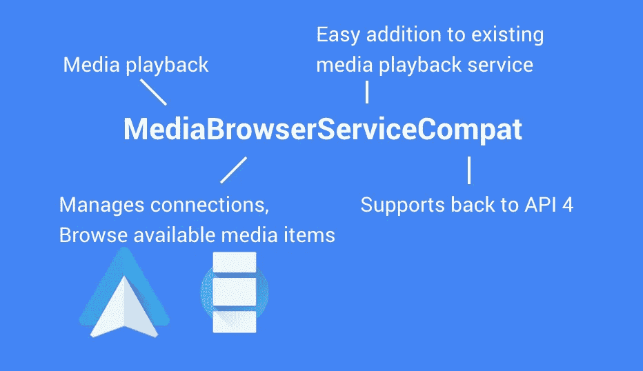

# MediaBrowserServiceCompat 和现代媒体播放应用程序

> 原文：<https://medium.com/androiddevelopers/mediabrowserservicecompat-and-the-modern-media-playback-app-7959a5196d90?source=collection_archive---------0----------------------->

与大多数应用程序相比，媒体应用程序从与 Android 系统和其他应用程序的合作中受益匪浅。有些事情，比如用音频焦点处理中断，几乎从 Android 诞生之初就一直存在，现在也和以前一样重要。虽然使用 mediasessionpat 的[媒体回放相对较新，但它提供了一种跨所有 API 4+ API 级别与系统对话的一致方式。](https://www.youtube.com/watch?v=FBC1FgWe5X4&utm_campaign=adp_series_mediabrowserservicecompat_030116&utm_source=medium&utm_medium=blog)

但是这些都没有触及最重要的部分:让你喜欢上*media session pat*——使用服务与你的用户界面或者其他任何人对话。这就是*MediaBrowserServiceCompat***介入的地方 Android 支持库的[版本 23.2 中的新添加。](http://android-developers.blogspot.com/2016/02/android-support-library-232.html?utm_campaign=adp_series_mediabrowserservicecompat_030116&utm_source=medium&utm_medium=blog)**

*****MediaBrowserServiceCompat 和 MediaBrowserCompat* 用作您的媒体播放服务和其他组件之间的预建通信协议。****

# **我们来分解一下**

****

**MediaBrowserServiceCompat 是一个很长的名字，我给你。但是大部分应该是不言自明的:**

*   ****媒体**:这个类专门针对媒体播放应用，更侧重于**音频**播放**
*   **浏览器:这是新的部分，我们将在下面详细介绍**
*   ****服务**:这是*服务*的一个子类，你可以用它作为你的媒体播放服务(管理后台播放的服务)的基类**
*   ****Compat** :与[*MediaBrowserService*](http://developer.android.com/reference/android/service/media/MediaBrowserService.html?utm_campaign=adp_series_mediabrowserservicecompat_030116&utm_source=medium&utm_medium=blog)(添加在棒棒糖中)不同，这个版本是[支持 v4](http://developer.android.com/tools/support-library/features.html?utm_campaign=adp_series_mediabrowserservicecompat_030116&utm_source=medium&utm_medium=blog#v4) 的一部分，并且一直支持回到 API 4**

**因此，如果*MediaBrowserServiceCompat*是您的服务子类，那么通信协议的另一半(即，您的 UI 将用来连接到*MediaBrowserServiceCompat*的部分)是 *MediaBrowserCompat* 。不需要编写自定义操作，管理捆绑包和意图，或任何这样的事情！**

**Compat 方面重要的一点:**这些 Compat 类与其框架版本是交叉兼容的。**这意味着您可以使用 *MediaBrowserCompat* 连接到使用 *MediaBrowserService* 的应用程序，或者使用*MediaBrowserService compat*并仍然使用 *MediaBrowser* 处理连接到您的服务的应用程序。它只是工作。**

**同时使用*MediaBrowserServiceCompat*和 *MediaBrowserCompat* 有一个显著的好处——你也可以在棒棒糖设备上使用最新的棉花糖 API。#魔法**

# **基础知识**

**让我们先把“浏览器”部分放在一边，看看最基本的:连接一个*MediaBrowserServiceCompat*和一个 *MediaBrowserCompat* 。**

**对服务的更改包括添加意图过滤器:**

```
<service android:name=".MediaPlaybackService"
  android:exported="true">
 **<intent-filter>
  <action android:name="android.media.browse.MediaBrowserService" />
 </intent-filter>**
</service>
```

**您还需要稍微更新您的代码:**

```
public class MediaPlaybackService extends MediaBrowserServiceCompat {
 private MediaSessionCompat mMediaSession; @Override
 public void onCreate() {
  super.onCreate();
  // Create your MediaSessionCompat.
  // You should already be doing this
  mMediaSession = new MediaSessionCompat(this,
    MediaPlaybackService.class.getSimpleName()); // Make sure to configure your MediaSessionCompat as per
  // [https://www.youtube.com/watch?v=FBC1FgWe5X4](https://www.youtube.com/watch?v=FBC1FgWe5X4&utm_campaign=adp_series_mediabrowserservicecompat_030116&utm_source=medium&utm_medium=blog) **setSessionToken(mMediaSession.getSessionToken());** } @Override
 **public BrowserRoot onGetRoot(@NonNull String clientPackageName,
   int clientUid, Bundle rootHints) {** // Returning null == no one can connect
  // so we’ll return something
  return new BrowserRoot(
    getString(R.string.app_name), // Name visible in Android Auto
    null); // Bundle of optional extras
 } @Override
 **public void onLoadChildren(String parentId,
    Result<List<MediaBrowserCompat.MediaItem>> result) {** // I promise we’ll get to browsing
  result.sendResult(null);
 }
}
```

**是的，我们必须实现两个新的(抽象)方法。唯一的其他变化是调用*setSessionToken()*——最好是在您的 *onCreate()* 方法中，但基本上要尽快。您不应该等待回放开始，因为我们需要在 *MediaBrowserCompat* 端使用该令牌:**

```
private MediaBrowserCompat mMediaBrowser;@Override
protected void onCreate(Bundle savedInstanceState) {
 super.onCreate(savedInstanceState);
 // The usual setContentView, etc
 // Now create the MediaBrowserCompat
 **mMediaBrowser = new MediaBrowserCompat**(
   **this**, // a Context
   **new ComponentName(this, MediaPlaybackService.class)**,
     // Which MediaBrowserService
   **new MediaBrowserCompat.ConnectionCallback()** {
    @Override
    public void onConnected() {
     try {
      // Ah, here’s our Token again
      MediaSessionCompat.Token token =
        mMediaBrowser.getSessionToken();
      // This is what gives us access to everything
      MediaControllerCompat controller =
        new MediaControllerCompat(MainActivity.this, token); // Convenience method to allow you to use
      // MediaControllerCompat.getMediaController() anywhere
      MediaControllerCompat.setMediaController(
        MainActivity.this, controller);
     } catch (RemoteException e) {
      Log.e(MainActivity.class.getSimpleName(),
        "Error creating controller", e);
     }
    } @Override
    public void onConnectionSuspended() {
     // We were connected, but no longer :-(
    } @Override
    public void onConnectionFailed() {
      // The attempt to connect failed completely.
      // Check the ComponentName!
    }
   },
   **null**); // optional Bundle
 **mMediaBrowser.connect();** }@Override
protected void onDestroy() {
 super.onDestroy();
 **mMediaBrowser.disconnect();**
}
```

**所以我们专门调用一个*组件名*来连接，并使用它来连接*MediaBrowserServiceCompat*。正如您可能已经猜到的，这为绑定服务包装了 API，这是有意义的，因为我们试图连接到一个服务。一旦连接上，我们就可以访问*mediasessionpat。令牌*。*标记*允许我们创建一个 [*媒体控制器比较*](http://developer.android.com/reference/android/support/v4/media/session/MediaControllerCompat.html?utm_campaign=adp_series_mediabrowserservicecompat_030116&utm_source=medium&utm_medium=blog) 。**

> ****注意:**在这种情况下，我们从*fragmentation activity*内部进行连接，但这不是硬性要求。它也可以是一个*片段*或*加载器*——如果你使用的是保留片段/加载器，请确保你使用的是应用程序上下文。**

**请记住，当最后一个客户端解除绑定时，绑定的**服务就会被销毁。如果您实际上使用*MediaBrowserServiceCompat*进行浏览，这通常没什么问题，但您应该在开始媒体播放时调用 [*startService()*](http://developer.android.com/reference/android/content/Context.html?utm_campaign=adp_series_mediabrowserservicecompat_030116&utm_source=medium&utm_medium=blog#startService(android.content.Intent)) ，在媒体播放停止时调用 [*stopSelf()*](http://developer.android.com/reference/android/content/Context.html?utm_campaign=adp_series_mediabrowserservicecompat_030116&utm_source=medium&utm_medium=blog#stopSelf()) ，以确保您的媒体播放不会因客户端解除绑定/重新绑定而中断——这种情况在配置更改时会发生。参见[通用 Android 音乐播放器的 *MusicService*](https://github.com/googlesamples/android-UniversalMusicPlayer/blob/master/mobile/src/main/java/com/example/android/uamp/MusicService.java?utm_campaign=adp_series_mediabrowserservicecompat_030116&utm_source=medium&utm_medium=blog) 的例子，它正确处理了这种情况。****

# **MediaControllerCompat 的力量**

**所有这些，我们得到的只是一个[*MediaControllerCompat*](http://developer.android.com/reference/android/support/v4/media/session/MediaControllerCompat.html?utm_campaign=adp_series_mediabrowserservicecompat_030116&utm_source=medium&utm_medium=blog)。谢天谢地，**一个*媒体控制器比较*足够用来构建一个完整的 UI** 。**

**用[***get metadata()***](http://developer.android.com/reference/android/support/v4/media/session/MediaControllerCompat.html?utm_campaign=adp_series_mediabrowserservicecompat_030116&utm_source=medium&utm_medium=blog#getMetadata())就可以得到当前所有的元数据。这包括当前艺术家、专辑、曲目名称、评级、专辑封面等信息，以及您在服务端传递给[*set metadata()*](https://developer.android.com/reference/android/support/v4/media/session/MediaSessionCompat.html?utm_campaign=adp_series_mediabrowserservicecompat_030116&utm_source=medium&utm_medium=blog#setMetadata(android.support.v4.media.MediaMetadataCompat))的任何其他信息。**

**使用[***getPlaybackState()***](http://developer.android.com/reference/android/support/v4/media/session/MediaControllerCompat.html?utm_campaign=adp_series_mediabrowserservicecompat_030116&utm_source=medium&utm_medium=blog#getPlaybackState())，你会发现播放的当前状态(想不到吧)是什么——播放、暂停等。以及支持什么动作(例如跳到下一个)。**

**这两个都只是时间点的读数。但是不是让你不断地轮询这些值，而是有一个[***MediaControllerCompat。回调***](http://developer.android.com/reference/android/support/v4/media/session/MediaControllerCompat.Callback.html?utm_campaign=adp_series_mediabrowserservicecompat_030116&utm_source=medium&utm_medium=blog) 可以传递给[*register callback()*](http://developer.android.com/reference/android/support/v4/media/session/MediaControllerCompat.html?utm_campaign=adp_series_mediabrowserservicecompat_030116&utm_source=medium&utm_medium=blog#registerCallback(android.support.v4.media.session.MediaControllerCompat.Callback))。无论什么时候发生变化，你都会得到一个回调，让你的用户界面和你的服务保持同步。**

**当然，这是一个双向通道，我们还没有谈到如何**获取信息到您的服务**—[***getTransportControls()***](http://developer.android.com/reference/android/support/v4/media/session/MediaControllerCompat.html?utm_campaign=adp_series_mediabrowserservicecompat_030116&utm_source=medium&utm_medium=blog#getTransportControls())填补了这一空白，为您提供了触发任何操作的方法(包括特定于您的媒体播放的自定义操作，如“向前跳过 30 秒”)。所有这些都直接触发了您的[*mediasessionpat 中的方法。回调*为您服务](https://developer.android.com/reference/android/support/v4/media/session/MediaSessionCompat.Callback.html?utm_campaign=adp_series_mediabrowserservicecompat_030116&utm_source=medium&utm_medium=blog)。**

**它还有更多的功能(音量调整、队列管理),所以我鼓励您全面了解它——您可能有自己的定制系统，可以完全替换它(节省您的代码维护！).**

# **浏览**

**到目前为止，我们一直在关注使连接工作所需的最低要求。当然，这已经给了你很多可以玩的东西。但是如果没有一些浏览功能，我们就不会称之为*MediaBrowserServiceCompat*。**浏览允许那些连接到您的*MediaBrowserServiceCompat*的用户获得您可用的媒体项目列表**作为一个基本层次，从根开始，向下一层或多层子节点。**

**虽然构建自己的 UI 是完全可选的，但浏览是 Android Auto 上构建 UI 的主要方式**。只需在[上添加 Compat，为自动训练](http://developer.android.com/training/auto/audio/index.html?utm_campaign=adp_series_mediabrowserservicecompat_030116&utm_source=medium&utm_medium=blog)提供音频回放。你会注意到 **Android Wear 也会在你的播放通知上提供一个浏览动作**。****

## **onGetRoot()**

**一切从根开始。正如上面代码中提到的，**您必须返回一个非空的 *BrowserRoot* 来允许连接到您的*MediaBrowserServiceCompat***。这个事实意味着选择返回什么根实际上是一件相当大的事情。**

**[通用 Android 音乐播放器示例应用](https://github.com/googlesamples/android-UniversalMusicPlayer?utm_campaign=adp_series_mediabrowserservicecompat_030116&utm_source=medium&utm_medium=blog) (UAMP)包含一个方便的[*package validator*](https://github.com/googlesamples/android-UniversalMusicPlayer/blob/master/mobile/src/main/java/com/example/android/uamp/PackageValidator.java?utm_campaign=adp_series_mediabrowserservicecompat_030116&utm_source=medium&utm_medium=blog)类，你可以使用它来允许你自己的应用、Android Auto 和 Android Wear 连接——这将是一个“白名单”风格的模型。你是选择使用白名单还是允许访问所有应用，更多的是商业决策，而不是技术决策。**

**返回根时要记住的另一件事是**这是一个你可以根据连接应用**改变行为的地方。例如，您可以使用 UAMP 的 [CarHelper](https://github.com/googlesamples/android-UniversalMusicPlayer/blob/master/mobile/src/main/java/com/example/android/uamp/utils/CarHelper.java?utm_campaign=adp_series_mediabrowserservicecompat_030116&utm_source=medium&utm_medium=blog) 或 [WearHelper](https://github.com/googlesamples/android-UniversalMusicPlayer/blob/master/mobile/src/main/java/com/example/android/uamp/utils/WearHelper.java?utm_campaign=adp_series_mediabrowserservicecompat_030116&utm_source=medium&utm_medium=blog) 作为检查传入包名称并返回不同根的示例。**

****返回不同的根可以在用户体验上产生巨大的差异**。例如，让我们假设你将要浏览你自己的媒体并且想要支持 Android Auto。一种简单的方法可能会让您为两者返回相同的层次结构。在 Android Auto 的安全问题上，拥有一个很深的层次或者任意长的列表(比如按字母顺序排列的艺术家列表)会导致一个沮丧的司机。考虑简化你的层级或者强调最有可能的内容(顶部的最近列表会有很大帮助！)来最小化用户和他们选择的专辑/歌曲之间的步骤数。**

**在 *MediaBrowserCompat 端*，您将使用 *getRoot()* 来获取根 id。很简单。**

## **onLoadChildren()**

**一旦返回了一个根，这个根 id 将作为 *parentMediaId* 传递给 *onLoadChildren()* 。这里是您加载 *parentMediaId* 的所有直接子节点的地方。**

**乍一看，该方法的参数似乎有点奇怪(我知道它们让我陷入了一个循环)。不是直接返回值，而是通过调用 *Result.sendResult()* 来返回值。这种机制允许您立即返回一个值(就像返回值一样)或调用 *detach()* ，将结果推送到另一个线程，并且只有在加载完所有项目后才调用 *sendResult()* 。如果你需要从网络上获取信息，这一点至关重要——不要因为把所有信息都加载到位而耽误了一切！**

> ****注意:**你会发现如果你在返回之前没有调用 detach()或者 sendResult()，你会得到一个 *IllegalStateException* 。这是 100%意料之中的。确保每个代码路径都调用一个或另一个。**

**返回的每个项目都是一个 *MediaItem* ，每个 *MediaItem* 由一个[*MediaDescriptionCompat*](http://developer.android.com/reference/android/support/v4/media/MediaDescriptionCompat.html?utm_campaign=adp_series_mediabrowserservicecompat_030116&utm_source=medium&utm_medium=blog)(元数据的一个子集)和两个可用标志的某种组合组成:**

*   ***FLAG_BROWSABLE* 表示这个 *MediaItem* 有自己的子节点(即，它的媒体 id 可以传递给 *onLoadChildren()* 以获得更多的 *MediaItem* 。**
*   ***当这个 *MediaItem* 可以直接播放(即传递给 [playFromMediaId()](http://developer.android.com/reference/android/support/v4/media/session/MediaControllerCompat.TransportControls.html?utm_campaign=adp_series_mediabrowserservicecompat_030116&utm_source=medium&utm_medium=blog#playFromMediaId(java.lang.String,%20android.os.Bundle)) 开始播放)时，应该使用 FLAG_PLAYABLE***

**在 *MediaBrowserCompat* 端检索子节点需要调用 *subscribe()* 。每当孩子发生变化时(例如，当服务调用*notifychilderchanged()*)您都会得到一个回调:**

```
String root = mediaBrowser.getRoot();
**mediaBrowser.subscribe(**root,
  **new MediaBrowserCompat.SubscriptionCallback()** {
   @Override
   **public void onChildrenLoaded(@NonNull String parentId,
     List<MediaBrowserCompat.MediaItem> children) {**
    if (children == null || children.isEmpty()) {
     return;
    }
    MediaBrowserCompat.MediaItem firstItem = children.get(0);
    // Play the first item?
    // Probably should check firstItem.isPlayable()
    MediaControllerCompat.getMediaController(MainActivity.this)
      .getTransportControls()
      .playFromMediaId(firstItem.getMediaId(), null);
  }
});
```

**当你不再喜欢回电的时候，有一个等价的 unsubscribe() 。**

## **onLoadItem()**

***onLoadItem()* 是*MediaBrowserService*API 的新成员，仅在棉花糖中添加。这是一种方便的方法，允许连接的 *MediaBrowserCompat* 实例检索仅与单个媒体 id 相关联的 *MediaItem* 。**

**您会注意到，默认实现只返回空值。因为这允许更有效地查询单个元素，所以请实现它！鉴于这应该返回与来自父节点的 *onLoadChildren()* 相同的 *MediaItem* ，您应该能够重用大部分逻辑。**

**您将在连接的 *MediaBrowserCompat* 中使用 *getItem()* 来检索特定的项目。回调 *onError()* 在您没有连接或者另一端发生了可怕的事情时使用——在大多数情况下，您会得到对 *onItemLoaded()* 的回调。**

# **我可以继续**

**我所说的大部分内容很有可能是现有的媒体播放应用程序已经在做的事情:向您的服务发送命令，广播更改以更新您的 UI，存储和检索媒体项目的层次结构，等等。相信我，如果这不是一个伟大的媒体应用程序的关键，我不会谈论这一切。**

**但是与竞争对手相比，编写和维护这种逻辑真的是你的独特的定义特征吗？我希望不会。**

**你还会收到要求你使用 *MediaBrowserService* 来支持 Android Auto 的请求吗？大概吧。我们要在这个 API 上构建更多吗？是的，是的，我们是。(我们已经添加了 Android Wear。)**

**你会发现 UAMP 已经完全升级到利用*MediaBrowserServiceCompat*以及*mediasessionpat*的优势，所以请查看[完整源代码](https://github.com/googlesamples/android-UniversalMusicPlayer?utm_campaign=adp_series_mediabrowserservicecompat_030116&utm_source=medium&utm_medium=blog)！**

**如果您一直在拖延查看 API 或将其集成到您的应用程序中，那么现在没有比*更好的时间了*来看看并#BuildBetterApps**

**关注 [Android 开发模式集合](https://plus.google.com/collection/sLR0p?utm_campaign=adp_series_mediabrowserservicecompat_030116&utm_source=medium&utm_medium=blog)了解更多！**

****