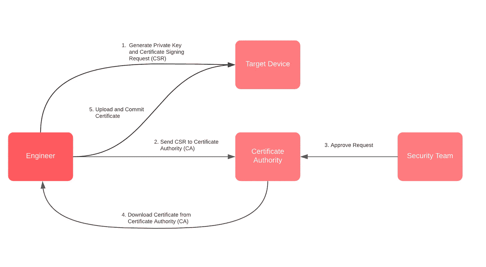
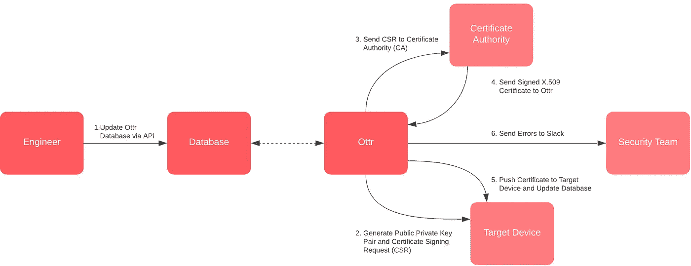
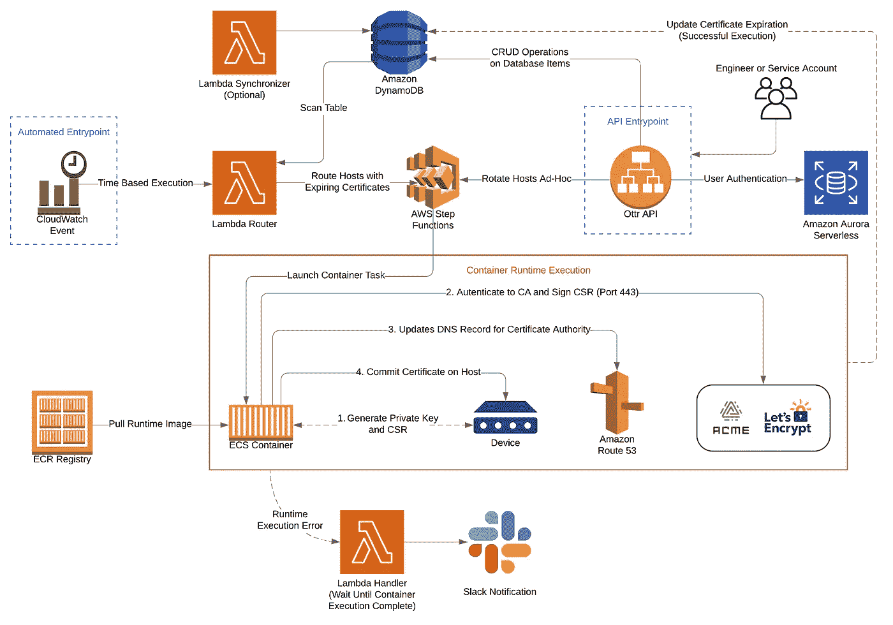
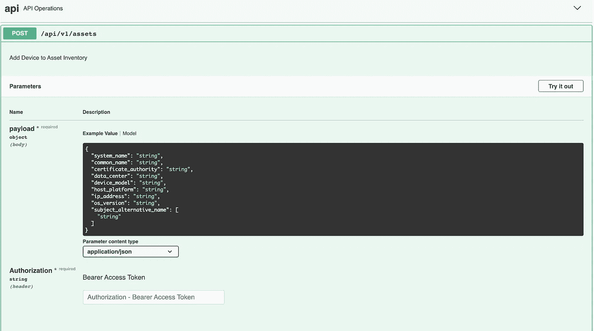
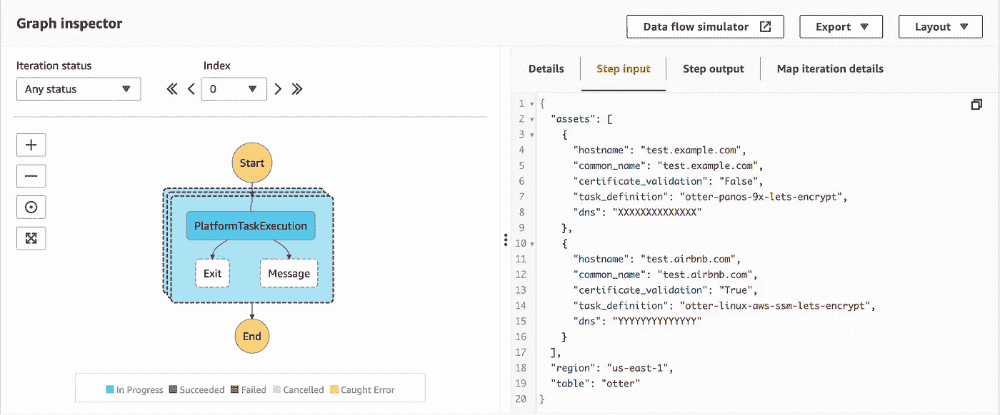
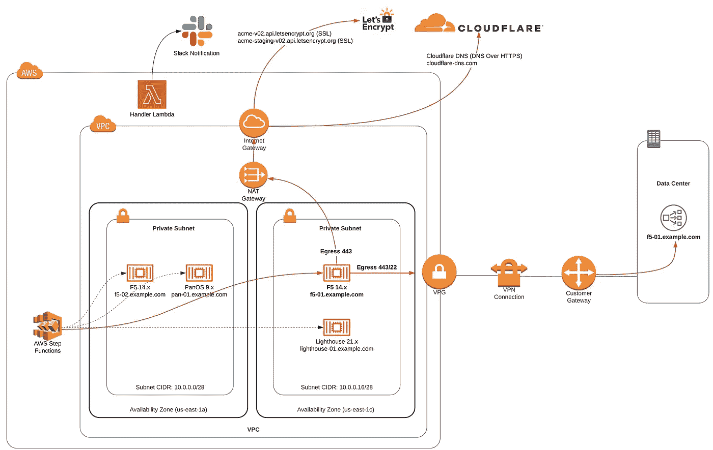

# 认识 Ottr:一个无服务器的公钥基础设施框架

> 原文：<https://medium.com/airbnb-engineering/meet-ottr-a-serverless-public-key-infrastructure-framework-f6580010ae0c?source=collection_archive---------1----------------------->

Ottr 是一个无服务器的公钥基础设施框架，它无需使用代理就能处理端到端的证书轮换。该博客的目的是通过示例参考架构、逻辑和网络流程概述 Ottr，并强调该解决方案的优势。有关安装说明，请跳到本文的开源部分。

[杨纲凯](https://www.linkedin.com/in/kenneyan/)


# 介绍

管理公钥基础设施(PKI)的证书对于任何组织来说都是一个难以大规模解决的问题。虽然有许多基于[代理的解决方案](https://letsencrypt.org/how-it-works/)来自动执行 Linux 和 Windows 发行版的证书轮换，但代理网络基础设施证书的过程通常涉及工程团队的手动干预或使用注册协议，如证书管理协议(CMP)、简单证书注册协议(SCEP)或安全传输注册(EST)，这些都存在安全问题。

我们在 Airbnb 建立了 Ottr，使其成为 AWS 上可扩展和可配置的无服务器框架，几乎没有运营开销，也不依赖于注册协议。Ottr 可以扩展为处理任何能够从远程会话(例如 API、SSH、SSM 代理)管理自己的 X.509 证书的主机(例如网络基础设施、Linux、Windows)的端到端证书轮换。

## 背景

PKI 管理数字证书的颁发，以保护敏感数据，提供唯一的数字身份，并确保安全的端到端通信。证书颁发机构(CA)负责代理这些 X.509 证书，并拥有审查接收者和颁发过程的策略、实践和程序。用于生成数字证书的 CA 可以来自您的组织管理的私有 CA，也可以来自公共 CA，例如由[互联网安全研究小组(ISRG)](https://www.abetterinternet.org/) 管理的 [Let's Encrypt](https://letsencrypt.org/) 。

在 Airbnb，工程师负责确保计算节点以及防火墙、负载平衡器和其他网络设备的端到端加密到位。下图说明了重新颁发证书的典型过程。



正如您所看到的，这是一个需要大量手动操作的流程，需要一个批准步骤，这会给多个团队带来运营开销。详细情况如下:

1.  **生成私钥和证书签名请求(CSR):**CSR 是一个加密签名的请求，包含有关组织详细信息以及证书有效的通用名称(CN)和主题备用名称(San)的信息。CSR 通常使用 OpenSSL 生成，其中私钥在目标设备上创建(并且永远不会离开主机),相关的公钥嵌入在 CSR 中。
2.  **向证书颁发机构(CA)发送 CSR:**为了让 CA 签署 CSR，必须验证域。这可以通过许多不同的方式来完成(例如，HTTP-01、DNS-01 挑战)。该 CA 可以是您的组织控制其信任链的私有 CA，也可以是公共 CA，如 Let's Encrypt，它的[信任链](https://letsencrypt.org/certificates/)在您的控制之外。
3.  **批准 CSR:** 由于证书申请流程的敏感性，通常需要安全团队的批准，以允许 CA 为提交的 CSR 生成证书。
4.  **下载证书:**批准后，证书、中间证书、根证书或完整链将可从您的 CA 获得，并可以 base64 格式下载(例如，pem，。cer，. p7b)。
5.  **上传证书:**根据平台的不同，完整的证书链将以支持的格式上传到目标设备(例如。pem)并在适用的情况下重新启动。

# 为什么是 Ottr？

当我们最初设计 Ottr 的时候，Airbnb 需要一个框架来管理 X.509 证书，供那些无法运行代理来管理其 X.509 证书的主机使用；我们需要一个可定制、可扩展的解决方案，同时仍然强调安全性。下图说明了如何使用 Ottr 重新颁发证书。



这种新框架有许多优点:

*   **无服务器:**无需管理底层基础设施，这意味着我们无需修补或加固新服务器。
*   **有限的依赖关系:**唯一主要的依赖关系是 ACME 客户端(acme.sh)，它得到了很好的维护。
*   **可定制:** Ottr 在设计上是模块化的，这意味着当基础设施中引入额外的平台时，它为开发人员提供了构建定制集成的能力。开发人员可以在 Let's Encrypt 之外使用证书颁发机构，只要它们支持 ACME 协议。
*   **可扩展:**每天执行数千个证书轮换的能力(基于 CA 设置的速率限制)。
*   **安全性:**基础设施安全性是默认的；构建 Ottr 的 Terraform 模块具有强化的配置，并遵循最小特权原则。
*   **自动化:** Ottr 处理端到端证书轮换生命周期，无需任何人工干预。
*   **可移植性:** Ottr 通过 Terraform 构建了 100 多个资源，这些资源可以通过模块轻松配置，并且可以跨任何 AWS 环境部署。
*   **成本:** Ottr 可以与运行 ACME 的私有或公共 CA(例如，让我们加密)一起使用，不需要额外的成本。
*   **错误处理:**通过 Slack 提供运行时任何潜在错误的即时反馈。
*   **开源:**任何人都可以做出贡献，随着框架的成熟，可以引入新的平台支持。

# 进入引擎盖下

*在本节中，我们将深入探讨构成 Ottr 的不同组件，并解释它们如何连接在一起，以便从最终用户那里抽象出 PKI 的复杂性。*

## 高级图表

*Ottr 架构*



让我们来看看 Ottr 的架构，以及每个组件如何与整体流程相关联地工作:

*   **CloudWatch 事件:**以可配置的时间间隔(例如，每天一次)触发 Lambda 路由器的自动入口点。
*   **Ottr API:** 可用于执行一次性证书轮换的替代入口点。
*   **Lambda 同步器:**聚集来自数据中心和/或 AWS 的主机元数据，用于通过 Ottr API 更新 DynamoDB 数据库。
*   **Lambda 路由器:**扫描 DynamoDB 数据库，确定哪些主机有资格进行证书轮换，并将数据转发给 Step 函数。
*   **步骤功能:**并行处理来自路由器 Lambda 或 API 的一批设备数据，并为作为证书轮换目标的每个主机执行 ECS 容器。
*   **ECS 容器:**根据从 Step 函数中检索的 ECS 任务定义元数据元素，从弹性容器注册表(ECR)中提取特定于平台的映像。
*   **Lambda 处理程序:**在发生容器运行时错误的情况下，有一个与 Slack 的外部集成，它将提供设备详细信息和指向 CloudWatch 日志中条目的链接。

**容器运行时:**

*   建立与设备的连接，以在设备上生成公钥/私钥对和 CSR 将 CSR 拖到容器文件系统上。
*   ACME 客户端将组织的 ACME 凭证绑定到容器上，并将 CSR 发送到 CA(例如，让我们加密)以开始证书签名流程。
*   ACME 客户端将来自 CSR 的每个公用名(CN)和主题备用名(SAN)的 DNS TXT 记录写入 Route53 中的 DNS 子委派区域。
*   CA 通过 DNS-01 质询验证域所有权；经过验证后，会生成一个证书，ACME 客户端会将完整的证书链写入容器文件系统。
*   根据平台逻辑，证书将应用于设备，并执行大量验证检查。
*   成功后，DynamoDB 数据库中的设备的新证书到期日期会更新。

## 数据库ˌ资料库

该 API 不仅是 Ottr 的备选入口点，也是管理 DynamoDB 数据库中资产的首选端点。数据库中的元素提供设备详细信息，用于确定证书何时到期，以及用于将主机映射到运行时逻辑的平台特定 ECS 任务定义的元数据。



*数据库资产输出示例*

```
{
   "system_name": "test.example.com",
   "common_name": "test.example.com",
   "certificate_authority": "lets_encrypt",
   "certificate_expiration": "2021-01-01T00:00:00",
   "certificate_validation": "True",
   "data_center": "DC1",
   "device_model": "PA-XXXX",
   "host_platform": "panos",
   "ip_address": "10.0.0.1",
   "origin": "API",
   "os_version": "9.x.x",
   "subject_alternative_name": [
   "subdomain.example.com"
   ]
}
```

## 任务路由

在路由过程中，首先扫描数据库，以建立证书在 30 天内到期的设备列表。根据主机在 DNS 子委派区域内是否有有效的 Route53 记录，该列表的范围会进一步缩小。如果这两种情况都成立，则逻辑会根据设置的路由配置将每个主机映射到相应的 ECS 任务定义。

按照下面的路由配置示例，如果有一个型号为 PA-XXXX 的 PAN-OS 设备运行 9.x.x，并且证书颁发机构设置为 Let's Encrypt，则会返回一个*otter-panos-9x-lets-Encrypt*的 ECS 任务。通过使用这种路由逻辑，最终用户可以在一个平台上执行不同类型的设备轮换逻辑。

*路由配置示例*

```
{
 "note": {
   "description": "Routes to trigger certificate renewal or generation based on Platform, OS Version, and Certificate Authority."
 },
 "platform": {
   "panos": {
     "os": {
       "9.x.x": {
         "certificate_authority": {
           "lets_encrypt": "otter-panos-9x-lets-encrypt" # ECS Task Definition
         },
         "model": [
           "PA-XXXX",
           "PA-YYYY",
         ]
       },
   ...
```

路由器根据路由配置建立主机和任务定义之间的映射后，有效负载被发送到 Step 函数并作为映射进行处理，该映射用于为每个元素运行一组步骤。Step 函数启动 ECS Fargate 容器，该容器提取 ECS 任务定义中定义的 ECR 映像。该过程与子网内可用的弹性网络接口(ENI)的最大并发数并行执行。如果需要运行的容器多于 Eni 的可用数量，Step 函数会将作业排队，直到前面的执行完成并且网络接口可用。

查看下面的步骤函数输入，它显示*test.example.com*的 ECS 任务定义为*otter-panos-9x-lets-encrypt*，而*test.airbnb.com*的 ECS 任务定义为*otter-Linux-AWS-SSM-lets-encrypt。*虽然平台和域都不同，但 Ottr 可以彼此独立地并行执行这两种循环，因为每个主机都有一个专用的容器。



## DNS 子委派

该服务的核心安全设计决策之一是限制对 Route53 (DNS)的访问。Ottr 使用 DNS-01 质询执行域验证，这意味着 ACME 客户端需要将 DNS TXT 记录写入 _acme-challenge。[FQDN]为了让证书颁发机构验证域的所有权。出于安全考虑，我们不想提供允许跨组织的主要托管区域写入权限的访问。虽然 Ottr 可能只需要将 TXT 记录写入 _ acme-challenge . test . example . com 的能力，但在撰写本文时，AWS 不提供仅指定对 TXT 记录的写入权限所必需的粒度，这意味着 Ottr 将被授予将任何记录类型(包括 A、CNAME、PTR 和 MX 记录)写入您组织的域的权限。

为了限制访问，我们向 ACME 客户端引入了 DNS 子授权。当 Ottr 的基础设施建立后，将会有一个新的 Route53 托管区域，它是根据配置创建的，例如*example-acme.com*。当 ACME 客户端向认证机构(CA)发送证书签名请求(CSR)时，CA 随后将在挑战别名字段中查找 TXT 记录，该字段将是*example-acme.com*。

这意味着，在域验证过程开始之前，需要配置 DNS 以在您的主机*test.example.com*之间建立 CNAME 映射，从而将记录转发到*example-acme.com*。

*Terraform DNS 模块*

```
module "dns_example" {
 source = "./modules/dns"certificate_common_name = "test.example.com"
 subject_alternative_names = ["subdomain.example.com",  "dev.example.com"]
}
```

*DNS CNAME 记录映射*

```
_acme-challenge.test.example.com 
  =>   _acme-challenge.test.example-acme.com

_acme-challenge.subdomain.example.com 
  =>   _acme-challenge.test.example-acme.com_acme-challenge.dev.example.com 
  =>   _acme-challenge.test.example-acme.com
```

通过添加这个映射，所有的 TXT 记录都在*example-acme.com*内被写入和读取。因此，Ottr 内的权限可以限制为只读域，如*example.com*，而写权限将授予子授权区域*example-acme.com*。

## 外部集成

默认情况下，Ottr 包含一个用于错误处理的 Slack 外部集成。每个 ECS 任务完成后，新的证书到期时间会添加到数据库中，等待成功运行。如果容器运行时出现错误，就会在 Slack 中生成一个通知，为运营团队提供即时反馈和一个链接，直接指向失败任务的 CloudWatch 日志。虽然 Slack 是默认的集成，但是如果您的组织喜欢使用其他平台或分类方法进行错误处理，也可以编写自定义逻辑。

## 网络体系结构

*Ottr 网络数据流*



让我们看看 AWS 基础设施之外的路由的网络连接。在 Step 函数确定要在其上执行证书轮换的有效主机后，它将为每个设备并行执行一个容器。这些容器的启动取决于在使用 Terraform 构建基础架构时预定义的两个子网之一中的 ENI 可用性。在连接到设备并检索 CSR 之后，ACME 客户端将 CSR 发送给证书颁发机构。默认情况下，这是让我们加密，但 Ottr 能够与任何支持 ACME 协议的 CA 集成。

在签名过程中，ACME 客户端需要到证书颁发机构和 Cloudflare DNS 端点的路由。因为让我们加密是默认的 CA，所以需要通过 443 (SSL)访问生产端点[*【acme-v02.api.letsencrypt.org】*](https://acme-v02.api.letsencrypt.org)以及中转端点[](https://acme-staging-v02.api.letsencrypt.org)*。cloud flare DNS[*cloudflare-dns.com*](https://cloudflare-dns.com)也用于使用 HTTPS 域名系统(DoH)轮询域名系统状态，以确定 ACME 客户端何时发布了用于域名验证的域名系统文本记录。通过使用 DoH，DNS 解析器通过 TLS 运行查询，这提高了安全性，因为 DNS 查询是加密的，而不是通过 UDP 上的 DNS 运行。与使用 sleep 在查询 DNS 以验证域之前等待一段时间相比，ACME 客户端轮询 DNS 也提高了性能。*

# *结果和投资回报*

*通过在 Airbnb 内部部署 Ottr，我们的组织实现了几个好处。我们已经看到了投资回报，因为节省了时间，也减少了工程团队的运营开销。自从年初引入 Ottr 以来，已经在没有任何人工干预的情况下执行了数千次证书轮换。这缓解了多个团队的一个棘手问题，包括负责监控过期证书票证并对其进行分类的运营团队、负责手动证书轮换流程的工程团队以及请求批准中涉及的安全团队。*

*另一个重要的回归与安全状况的改善有关。通过让 Ottr 充当 CA 和主机之间的代理，工程师将不再需要更改 DNS 记录来验证域所有权。这导致许多团队的 AWS IAM 权限减少，从而提高了最小特权。此外，Ottr 提供了一个可重复的框架，在这个框架中，私钥在其生命周期内永远不会离开主机，而不是让工程师在本地生成一个私钥并将其上传到主机。*

*最重要的是，证书轮替比证书更新运行得更频繁，这意味着每次执行都要换出私钥；这会导致证书寿命缩短，在私钥泄露的情况下，会缩短数据被解密的时间。*

# *结论*

*尽管公钥基础设施在大规模解决时可能是一个复杂的问题，但 Ottr 的构建是为了抽象出与证书供应相关的许多挑战，同时还在运营和安全性方面提供了额外的好处。*

*通过开源 Ottr，我们希望创建一个社区来共享、协作和扩展框架，以帮助满足其他组织的需求。如果你有兴趣帮助保护人员和数据，Airbnb Security 正在招聘。查看我们的[空缺职位](https://www.airbnb.com/careers/departments/engineering)并立即申请！*

# *开放源码*

***设置** Ottr 现在在 [Github](https://github.com/airbnb/ottr) 上开源。您可以转到设置资源页面开始构建基础架构，并通过支持的平台链接了解有关我们当前实施的更多信息。*

***投稿** 如有任何建议，请随时联系或提交拉动请求。如果您目前正在利用 Ottr 并在目前不支持的平台上运行 rotations，请查看[投稿页面](https://github.com/airbnb/ottr/tree/master/docs/CONTRIBUTE.md)并考虑帮助将您的实现添加到该平台！*

***功劳和贡献:** 本·帕拉迪斯(Airbnb 的安全工程师)
亚伦·冯·亨根(高级安全项目经理)
约翰·博罗梅奥(Airbnb 的高级网络工程师)
瑞安·迪尔斯(Airbnb 的安全工程师)
肖恩·科克伦(Airbnb 的高级系统工程师)
杰夫·南尼(Airbnb 的网络架构师)
马克·弗尔切克(Airbnb 的安全工程师)
齐山·哈迪姆(Airbnb 的前经理)
蒂娜*

*支持 acme.sh 的开发社区*

**所有产品名称、标识和品牌均为其各自所有者的财产。本网站中使用的所有公司、产品和服务名称仅用于识别目的。使用这些名称、标志和品牌并不意味着认可。**

# *附录*

*所有商标都是其注册所有者的财产；Airbnb 声称对此不承担任何责任，也不享有任何所有权。*