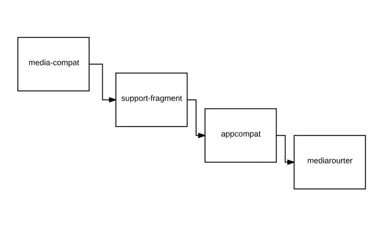
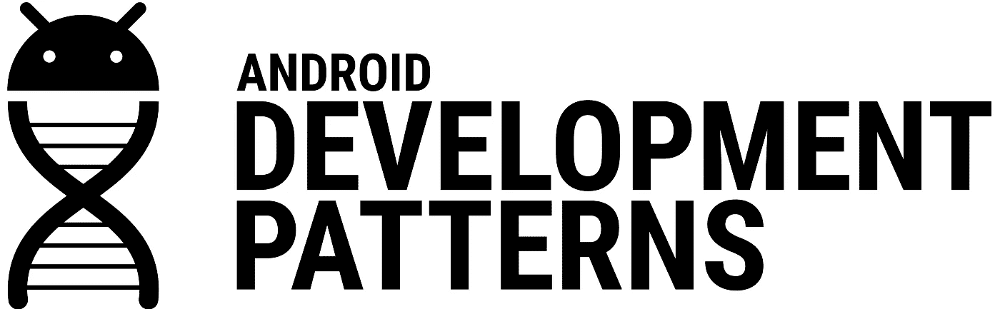

# 媒体播放和必备的支持库 API

> 原文：<https://medium.com/androiddevelopers/meida-playback-and-the-must-have-android-support-library-apis-9f48dc6b657e?source=collection_archive---------2----------------------->

当谈到媒体播放的最佳实践时，有很多 API 可以用来构建最佳体验。感谢支持库，你不需要担心的一件事就是 API 级别。但是有[很多支持库](https://developer.android.com/topic/libraries/support-library/features.html)，并且随着 [v4 支持库在版本 24.2.0](https://developer.android.com/topic/libraries/support-library/revisions.html#24-2-0-v4-refactor) 中分裂，找到所有你可能需要的媒体 API 仍然需要一点思考。

What you really need to build a media playback app

# 媒体兼容支持库

查看新的 split v4 支持库时，您首先会注意到一个闪亮的新 [Media-Compat 支持库](https://developer.android.com/topic/libraries/support-library/features.html#v4-media-compat)。正如您所料，这是绝大多数特定于媒体的支持库功能所在的地方。

这一切都从[*mediasessionpat*](https://developer.android.com/reference/android/support/v4/media/session/MediaSessionCompat.html)开始，它正好位于[将您的媒体应用与系统](https://www.youtube.com/watch?v=FBC1FgWe5X4)集成的中心。这是您如何通过提供元数据(如标题、艺术家和专辑)告诉系统正在播放什么媒体，以及您的应用程序支持什么媒体按钮事件(如播放或暂停)。

为了帮助处理那些媒体按钮事件，仅*支持库*[*MediaButtonReceiver*](https://developer.android.com/reference/android/support/v4/media/session/MediaButtonReceiver.html)使得从 broadcast receiver(API 21 之前的设备上需要)到您的媒体播放服务的媒体按钮事件变得容易，在那里您可以适当地处理它们。最棒的是:它是一个单独的清单条目和一行代码。

除此之外，[*MediaBrowserServiceCompat*](https://developer.android.com/reference/android/support/v4/media/MediaBrowserServiceCompat.html)和 [MediaBrowserCompat](https://developer.android.com/reference/android/support/v4/media/MediaBrowserCompat.html) 类是现代媒体播放应用的主干。它们充当媒体播放服务和其他组件(如 UI 或其他应用程序，如 Android Auto)之间的预建通信协议。

# 片段支持库

Media-Compat 还包含两个静态便利方法，[*mediacontrollercompat . setmediacontroller()*](https://developer.android.com/reference/android/support/v4/media/session/MediaControllerCompat.html#setMediaController(android.app.Activity, android.support.v4.media.session.MediaControllerCompat))和*mediacontrollercompat . getmediacontroller()*，如果您希望支持 API 21 之前的设备，则需要使用[*fragmentation activity*](https://developer.android.com/reference/android/support/v4/app/FragmentActivity.html)，[片段支持库](https://developer.android.com/topic/libraries/support-library/features.html#v4-fragment)的一部分。

除了为您提供一种简单的方法来检索您的[*MediaControllerCompat*](https://developer.android.com/reference/android/support/v4/media/session/MediaControllerCompat.html)以从您的 UI 触发操作之外，它们还通过调用 API 21+[*setMediaController()*](https://developer.android.com/reference/android/app/Activity.html#setMediaController(android.media.session.MediaController))在您的活动处于活动状态时捕获媒体按钮和音量事件，并确保它们被发送到您的 *MediaController* (即使您的 *MediaSession* 处于非活动状态，例如在回放尚未开始的情况下)。

# AppCompat

[AppCompat](https://developer.android.com/topic/libraries/support-library/features.html#v7-appcompat) 支持库支持目前应用程序中预期的许多材料设计主题，但它也是 [*通知 Compat 的家。media style*T5。](https://developer.android.com/reference/android/support/v7/app/NotificationCompat.MediaStyle.html)

MediaStyle 是 API 21 中添加的一种通知样式，通过支持库，它也可以在旧设备上使用。由于控制播放对于媒体播放应用程序来说至关重要，MediaStyle 将这些作为优先事项，使您添加到通知中的操作可以在折叠的通知中使用，甚至可以在扩展的通知中使用更多操作。

# 媒体路由器支持库

对 Google Cast 支持至关重要的是， [MediaRouter 支持库](https://developer.android.com/topic/libraries/support-library/features.html#v7-mediarouter)构建了连接按钮、对话框和其他与这些设备交互所需的组件。

如果你正在使用 Android 的 [Cast v3，包含 MediaRouter 支持库是你从一开始就要做的事情之一。](https://developers.google.com/cast/docs/android_sender_setup)

# 每个支持库？

当然，每个[支持库](https://developer.android.com/topic/libraries/support-library/features.html)的存在都有一个很好的理由——它们有一些有用的功能，可以简化应用程序中的逻辑，或者添加与 Android API 级别无关的全新功能。虽然上面概述的库都是支持构建优秀应用程序所需的媒体 API 所需的库，但我鼓励您在构建应用程序时仔细查看整个 *android.support* 名称空间中的完整类列表。

# BuildBetterApps

