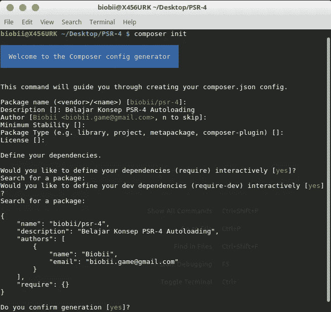
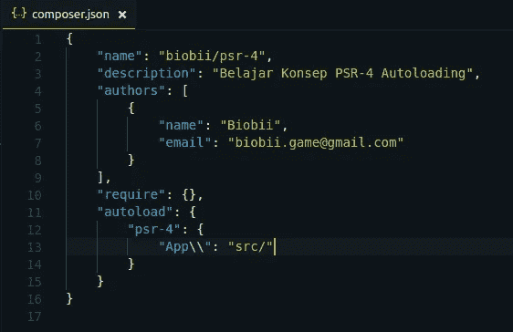
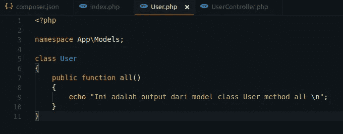

# Memahami Konsep PSR-4 Autoloading pada PHP

> 原文：<https://medium.easyread.co/memahami-konsep-psr-4-autoloading-pada-php-ba6cdefe068b?source=collection_archive---------0----------------------->

Saat mempelajari bahasa pemrograman PHP, saya biasa menggunakan *require* dan *include* untuk memanggil file-file yang lain. *Nah* , dapat dibayangkan berapa kali saya harus menuliskan *require* atau *include* bila dalam satu file saya memanggil beberapa file lain. Dengan langkah seperti ini struktur kode yang saya tulis menjadi kurang rapi dan lebih rentan bila memanggil file dengan nama *class* yang sama.

Pengalaman baru mulai saya dapatkan ketika menggunakan *framework* Laravel. Struktur dan pemanggilan *class* atau file lain semakin bersih dan terorganisir. Saya tidak perlu mempraktikkan langkah manual seperti sebelumnya, namun dapat menerapkan konsep **PSR-4 Autoloading** . *Nah* , konsep ini akan saya bahas beserta implementasinya. Informasi lengkap mengenai **PSR-4** dapat teman-teman baca pada situs resmi [PHP-FIG](https://www.php-fig.org/psr/psr-4/) .

Sebelum melanjutkan pada bagian berikutnya, pastikan teman-teman telah menginstall *composer* terlebih dahulu. Silakan mengunduh [*composer*](https://getcomposer.org/download/) pada situs resminya.

Langkah pertama, buat sebuah folder baru untuk proyek yang akan dikerjakan, lalu jalankan perintah `**composer init**` pada *terminal* atau *command prompt* yang berada pada folder proyek untuk menginisialisasi file **composer.json** . Teman-teman dapat menuliskan beberapa informasi atau langsung menekan *enter* untuk *skip* atau melanjutkan.



Menjalankan perintah composer init

Setelah perintah dijalankan, akan ada file baru yang terbentuk dengan nama **composer.json** . Sebagai informasi, saya menggunakan teks editor [Visual Studio Code](https://code.visualstudio.com/) . Teman-teman bebas memilih teks editor apa yang ingin digunakan.


Berikutnya, jalankan perintah `**composer install**` dan tunggu hingga terbentuk folder baru dengan nama vendor. Folder ini akan digunakan untuk menyimpan setiap *library* atau *third party* yang teman-teman install pada proyek.


Folder vendor setelah menjalankan perintah composer install

Selanjutnya saya akan membuat beberapa folder dan file baru dengan struktur seperti pada gambar berikut. Folder dan file ini nantinya akan saya gunakan sebagai demo bagaimana PSR-4 bekerja.


Struktur folder

Kembali lagi pada file **composer.json** , tambahkan potongan kode berikut di bawah *require* .

```
"autoload": { "psr-4": { "App\\": "src/" }}
```



Menambahkan autoload pada file composer.json

Potongan kode di atas yang berada di dalam objek psr-4 berfungsi sebagai inisial tempat di mana file-file akan berada. Nantinya pada file tersebut saya dapat menuliskan pada folder mana file tersebut berada menggunakan kata kunci `**namespace**` . Bila teman-teman familiar dengan bahasa pemograman Java, *namespace* sama halnya dengan *package* yang ditulis sebelum nama *class* dan disesuaikan dengan folder mana file itu tinggal. Pada kode di atas saya memberikan nilai pada `**App\\**` dengan `**src/**` **,** maksudnya adalah ketika saya menuliskan dengan cara: `**App\Models**` maka sama halnya dengan menulis manual seperti: `**src/Models**` . Untuk lebih mudah memahami kata kunci namespace, akan dilanjutkan pada langkah di bawah.

Berikutnya, buka file *UserController.php* dan tulis beberapa baris kode berikut.

```
<?phpnamespace App\Controllers;class UserController{ public function index() { echo "Ini adalah output dari class UserController method index \n"; }}
```


File: src/Controllers/UserController.php

Pada folder *Models* buka file *User.php* dan tambahkan kode berikut.

```
<?phpnamespace App\Models;class User{ public function all() { echo "Ini adalah output dari model class User method all \n"; }}
```



File: src/Models/User.php

*Yap* , kedua file di atas hanya berisi *method* yang berisi dengan kode sederhana. Tidak benar-benar relevan dengan fungsi aslinya karena hanya sebagai contoh saja.

Setelah itu pada file *index.php* tulis kode seperti berikut.

```
<?phprequire '../vendor/autoload.php'; use App\Controllers\UserController; $user = new UserController;$user->index();
```


File index.php

Pada *index.php* saya memanggil file *autoload.php* yang telah di- *generate* oleh *composer* ketika menjalankan perintah *composer install* sebelumnya. Kata kunci *use* digunakan untuk memanggil atau mengimport *class* /file dalam *path* yang ditulis. Pada kasus ini, saya memanggil *class UserController* yang berada pada folder `**src/Controllers**` (atau: `**App\Controllers**` ) dan melakukan *instance* untuk memanggil method *index* yang ada pada *class* tersebut.

Karena tadi saya sempat mengubah file *composer.json* , maka jalankan perintah `**composer dump-autoload**` dan tunggu sampai proses selesai. Perintah ini berguna untuk membaca ulang *script* yang berada pada **composer.json** *.*


Untuk menguji kode di atas bekerja atau tidak, jalankan perintah seperti pada gambar berikut. Teman-teman boleh mengubah *port* dengan angka lain. Perintah ini akan mengeksekusi file *index.php* yang berada pada folder /public ketika mengakses *localhost:3000* pada *browser* . Silakan buka dan lihat *output-* nya pada *browser* .


Saya menjalankan kode di atas menggunakan terminal supaya lebih praktis hehe 😃. Apabila teman-teman mendapat *output* yang sesuai, maka konsep *autoloading* telah berhasil.


Output saat menjalankan index.php

Untuk lebih memahami bagaimana melakukan *import* *class* atau file, sunting *UserController.php* dengan kode berikut.

```
<?phpnamespace App\Controllers;use App\Models\User;class UserController{ public function index() { $user = new User; $user->all(); echo "Ini adalah output dari class UserController method index \n"; }}
```


Memanggil class User pada class UserController

Dapat ditebak *output* yang dihasilkan. Kode di atas memanggil *class User* dengan cara *use* lalu pada *method* *index* akan mengeksekusi *method all()* dari *class* *User.*


Output dengan memanggil method all pada UserController

Sebenarnya ada cara lain untuk memanggil *class* lain tanpa menggunakan *use* , misalnya untuk memanggil class User maka **\App\Models\User** . Terserah teman-teman menggunakan yang mana.

Terlihat panjang namun sederhana. Saya sengaja memberikan *capture* setiap langkah supaya tulisan ini lebih mudah dipahami. Konsep seperti ini akan sangat sering ditemukan pada *modern framework* . Kode akan lebih terstruktur dan rapi. Semangat belajar!! 💪

*Artikel ini di tulis oleh* [*Biobii*](https://medium.com/u/37ae403df215?source=post_page-----ba6cdefe068b--------------------------------) *, ia sering menulis artikel menarik mengenai Software Engineering dan Programming. Ikuti profilnya untuk mendapatkan update-an terbaru artikel-artikel miliknya.*

*Jika kamu merasa artikel ini menarik dan bermanfaat, bagikan ke lingkaran pertemanan kamu, agar mereka dapat membaca artikel ini.*