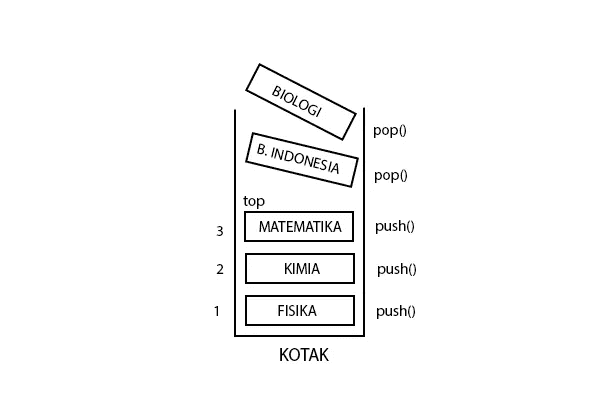

# Memahami Konsep Stack Secara Sederhana

> 原文：<https://medium.easyread.co/memahami-konsep-stack-secara-sederhana-bd4409ec560c?source=collection_archive---------0----------------------->

*Stack* atau tumpukan merupakan salah satu teknik dalam struktur data yang cukup mudah dipahami. Biasanya kita akan menjumpai topik ini pada awal materi setelah *array* karena *array* dibutuhkan dalam implementasi *stack* . Beberapa macam struktur data lain memiliki algoritma yang lebih rumit bila dibandingkan dengan *stack* . Pembahasan sederhana tentang *stack* akan saya rangkum menjadi beberapa poin agar lebih rapi dan mudah dipahami.

# Stack secara umum

Sewaktu belajar *stack* , saya selalu menganalogikan dengan sebuah kotak yang akan diisi oleh beberapa barang. Karakteristik penting *stack* adalah bersifat **LIFO ( *Last In First Out* )** artinya **data yang terakhir masuk merupakan data yang akan keluar terlebih dahulu** . Saya yakin teman-teman dapat menyimpulkan maksudnya. Kita asumsikan saja misalnya saya memasukkan data alfabet secara urut dari a sampai e (a-b-c-d-e). Kemudian saya ingin mengeluarkan alfabet b, maka saya harus mengeluarkan alfabet e, d dan c secara berurut hingga akhirnya saya dapat mengakses b. Sangat sederhana. Masih bingung? Mari kita sederhanakan lagi dengan contoh yang tadi.

> Kasusnya, saya mempunyai buku-buku pelajaran yang terdiri dari buku Matematika, Fisika, Biologi, Kimia dan Bahasa Indonesia. Untuk menghemat ruang, kemudian saya menyimpan buku-buku tersebut ke dalam kotak yang saya miliki. Saya memasukkan buku dengan urutan sebagai berikut: 1\. Fisika, 2\. Kimia, 3\. Matematika, 4\. Bahasa Indonesia, 5\. Biologi.
> 
> Karena besok jadwalnya Matematika dan saya harus belajar, maka untuk mengambil buku Matematika saya harus mengeluarkan dulu buku Biologi dan Bahasa Indonesia. Sehingga buku Matematika dapat saya ambil dan yang tersisa pada kotak saat ini adalah buku Fisika dan Kimia.



# Penggunaan Stack

Pada beberapa literatur menyebutkan bahwa *stack* umumnya digunakan untuk memisahkan ekspresi aritmatika. Saya pernah mendapat tugas mengubah notasi *infix* menjadi *postfix* menggunakan teknik *stack* . Teman-teman dapat membaca referensi infix-postfix yang menurut saya lengkap dan mudah dipahami [disini](http://bwahyudi.staff.gunadarma.ac.id/Downloads) .

# Algoritma Stack

Dengan memahami contoh yang telah dibahas pada poin sebelumnya, saya pikir cara kerja *stack* sudah dapat dibayangkan. Sederhananya seperti ini: ketika memasukkan data, uji apakah *stack* ( *array* ) sudah penuh? Jika benar, maka data tidak dapat disimpan. Jika tidak, maka data akan disimpan dan menjadi data yang paling atas dari data sebelumnya. Kemudian bagaimana dengan langkah mengeluarkan data? Sama. Uji apakah *stack* kosong? Jika benar, maka proses selesai karena tidak ada data yang harus dikeluarkan. Sebaliknya, maka ambil data yang paling akhir (atas) untuk dikeluarkan.

# Metode pada Implementasi Stack

Ada lima metode penting dalam implementasi *stack* . Potongan kode berikut saya tulis menggunakan bahasa Java.

**push()** , berfungsi untuk memasukkan data.

```
public void push(String value) {
   stack[++top] = value;
}
```

**pop()** , berfungsi untuk mengeluarkan data terakhir (atas).

```
public String pop() {
   return stack[top — ];
}
```

**peek()** , berfungsi untuk melihat data yang berada pada tumpukan paling atas (akan dikeluarkan).

```
public String peek() {
   return stack[top];
}
```

**isEmpty()** , berfungsi untuk menguji apakah *stack* masih kosong.

```
public boolean isEmpty() {
   return top == -1;
}
```

**isFull()** , berfungsi untuk menguji apakah *stack* telah penuh.

```
public boolean isFull() {
   return top == max-1;
}
```

# Contoh Implementasi Stack dengan Java

# Penjelasan Kode

```
private String[] stack;
private int max;
private int top;
```

Kode diatas merupakan bagian dari pendeklarasian *array* dan variabel. *Array* akan digunakan sebagai *stack* , variabel *max* sebagai batas kapasitas *array* dan variabel *top* sebagai *pointer* data yang paling akhir.

```
public Stack(int size) {
   max = size;
   stack = new String[max];
   top = -1;
}
```

Selanjutnya, kode diatas merupakan sebuah konstruktor yang digunakan untuk menginisialisasi variabel dan menjadi metode yang pertama dijalankan ketika dilakukan *instance object* . Pemberian nilai -1 pada variabel *top* adalah indikator bahwa *array* masih kosong. Seperti yang diketahui bahwa *array* mulai menyimpan data pertama pada indeks ke-nol.

```
public void push(String value) {
   stack[++top] = value;
}
```

Lalu kode diatas menjelaskan mengenai proses memasukkan data ke dalam *array* dengan indeks *increment* dari nilai variabel *top* . Apabila sebelumnya nilai dari *top* adalah -1, maka (-1) + 1 = 0\. Data pertama akan disimpan pada indeks ke-0 dan seterusnya.

```
public String pop() {
   return stack[top — ];
}
```

Kode diatas digunakan mengeluarkan data dari urutan paling akhir dan melakukan *decrement* nilai dari variabel *top.* Nilai data yang dikeluarkan juga di- *return* dalam metode *pop.*

```
public String peek() {
   return stack[top];
}
```

Selanjutnya, kode diatas untuk mengembalikan data yang berada pada indeks yang sama dengan nilai variabel *top* , dalam artian data yang paling belakang. Program akan *error* apabila *array* masih kosong karena dilakukan pengecekan terhadap indeks -1\. Teman-teman boleh melengkapi kode di atas untuk memberikan *exception* .

```
public boolean isEmpty() {
   return top == -1;
}
```

*Nah* , yang ini untuk mengecek apakah *array* kosong atau tidak. Mengembalikan nilai benar atau salah dari hasil pengujian *top* dengan nilai -1\. Jika sama, maka nilainya *true.*

```
public boolean isFull() {
   return top == max-1;
}
```

Jika pengujian benar, maka mengembalikan nilai *true* dan menyatakan bahwa *array* telah penuh.

Mudah-mudahan penjelasan sederhana dapat membantu teman-teman memahami konsep dari *stack* . Beri *feedback* untuk membantu saya meningkatkan konten pada artikel berikutnya.

*Artikel ini di tulis oleh* [*Mohammad Robih*](https://medium.com/@biobii) *, ia sering menulis artikel menarik mengenai Software Engineering dan Programming. Ikuti profilnya untuk mendapatkan update-an terbaru artikel-artikel miliknya.*

*Jika kamu merasa artikel ini menarik dan bermanfaat, bagikan ke lingkaran pertemanan kamu, agar mereka dapat membaca artikel ini.*