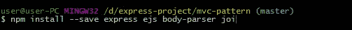

# Memahami Middleware NodeJS Secara Singkat dan Mudah

> 原文：<https://medium.easyread.co/memahami-middleware-nodejs-secara-singkat-dan-mudah-di-pahami-c34e4e087e88?source=collection_archive---------1----------------------->

## Apa sih sebenarnya middleware?

## M *iddleware*

*Middleware* pada dasarnya adalah ‘penengah’. Kalau dalam aplikasi *middleware* adalah sebuah aturan yang harus dilewati terlebih dahulu sebelum masuk kedalam sebuah sistem atau keluar dari sebuah sistem.

Analoginya seperti ini, misalnya teman-teman ingin mendaftar di sebuah pekerjaan yaitu menjadi seorang *programmer* , maka sebelum teman-teman masuk menjadi karyawan, harus melewati prosedur terlebih dahulu. Misalnya, teman-teman akan dicek apakah usianya sudah layak untuk bekerja, atau teman-teman akan di interview terlebih dahulu, atau mengerjakan test untuk mengetahui skillnya terlebih dahulu. *Nah,* semua tahapan-tahapan tersebut disebut dengan *middleware* .

*Middleware* sendiri sebenarnya konsep umum yang banyak dipakai pada *library* maupun *framework* , contohnya Laravel. Jika teman-teman belajar Laravel maka akan ketemu istilah *middleware* *before* dan *after* .

Berikut ini contohnya

Potongan fungsi diatas merupakan contoh *middleware* yang ada pada Laravel yang berfungsi untuk memvalidasi *request* dari *client* , dimana ketika user yang sesuai dengan role yang ada, maka sistem akan menjalankan proses selanjutnya dengan mereturn `**next($request)**` . Artinya ketika *middleware* diletakkan diantara *route* dan *controller* , maka sistem akan menjalankan *middleware* dan ketika *request* sesuai aturan *middleware* maka sistem akan mengarahkan atau melanjutkan ke *controller* dengan menjalankan fungsi `**next($request)**` .

## **Memulai Project Pada Nodejs**

Sebelum memulai project, kita persiapkan terlebih kebutuhan *library* pada aplikasi kita, install ***ExpressJS*** (framework populer web untuk nodejs), ***Template Engine Ejs*** (untuk membuat tampilan), ***bodyParser*** ( untuk memparsing/mengambil nilai dari form-html), dan ***Joi*** (library untuk keperluan validasi). Buka command promt dan jalankan perintah berikut :

jika proses install selesai, selanjutnya siapkan folder project seperti dibawah ini :

Kemudian siapkan configurasi penggunaan library yang telah kita install. Saya membuat file bernama ***app.js*** , berikut codingannya :

Kemudian isi file ***login.ejs*** dengan codingan berikut :

Selanjut kita akan isi file ***middleware.js*** dengan codingan berikut :

**Penjelasan** Pada file *middleware.js* diatas kita memanggil *library* Joi yang telah kita install sebelumnya, *library* ini nantinya kita gunakan untuk memvalidasi data yang masuk saat kita submit dari form html.

Pada fungsi `**cekUsia**` kita mengambil nilai dari param url dengan cara `**req.params.usia**` , lalu kita melakukan pengecekan apakah usia tidak lebih besar dari 18\. Jika usia tidak lebih besar maka munculkan tulisan ‘kamu belum cukup umur’ dan sebaliknya jika lebih besar maka jalankan fungsi `**next()**` untuk menjalankan proses selanjutnya.

Pada fungsi `**carbon**` kita membuat fungsi yang bertugas untuk mengonkonversi tulisan menjadi tulisan kapital. Kita mengambil nilai `**req.params.title**` lalu kemudian kita konversi dengan fungsi bawan javascript `**toUpperCase()**` , setelah itu kita mengubah nilai `**req.params.title**` secara global dengan yang baru, selanjutnya nilai yang baru inilah nantinya yang dikirim ke fungsi tahap selanjutnya.

Pada fungsi `**validasi_user**` , kita memanfaatkan library Joi untuk membuat validasi. Kita membuat aturan properti didalam object schema, dimana username harus bersifat string dengan panjang maximal 4 dan tipe password harus bersifat string dengan panjang minimal 7.

Ambil nilai data yang kita post melalui `**req.body**` lalu lakukan validasi dengan dengan menjalankan `**Joi.validasi(req.body,schema)**` . Jika nilai `**req.body**` sesuai aturan schema yang kita buat maka kita menjalankan fungsi `**next()**` untuk menjalankan fungsi selanjutnya.

Kemudian selanjutnya buat isi file ***AdminController.js*** dengan code berikut :

dan yang terakhir file ***router.js*** berisi codingan berikut :

pada baris pertama dan kedua kita meng include/import file ***AdminController*** dan ***middleware*** dengan module require.

Selanjutnya untuk uji coba, jalankan server dengan cara berikut :

Buka browser dan jalankan perintah **localhost:1337/lamaran/12**

Jalankan juga perintah **localhost:1337/title/game of throne**

Sekarang nilai `**req.params.title**` berubah jadi kapital, karena telah di konversi difungsi sebelumnya di *middleware* .

Terakhir jalankan **localhost:1337/login** , masukkan username dan password kemudian klik tombol submit. Lihat hasilnya.

> **Note** : *coba kamu hapus code* `***next()***` *pada* middleware *, maka sistem tidak akan menjalankan fungsi controller selanjutnya.*

Sekitan tulisan kali ini. Semoga bermanfaat. Jangan lupa *claps* yah!! Terima kasih. Happy coding! 😄