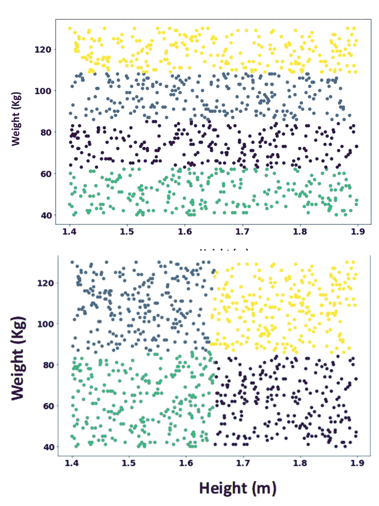
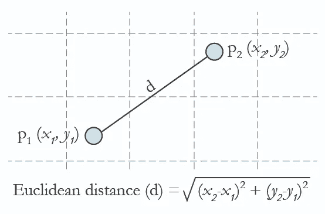
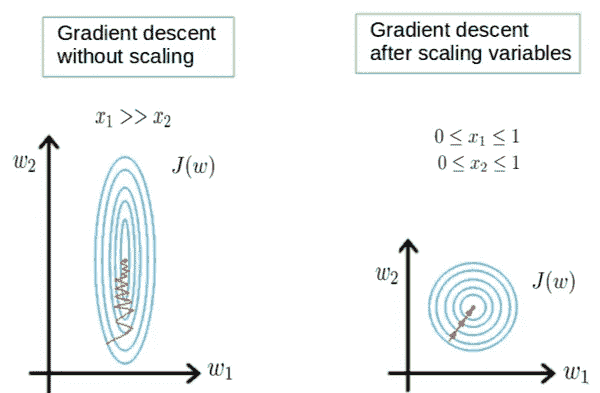
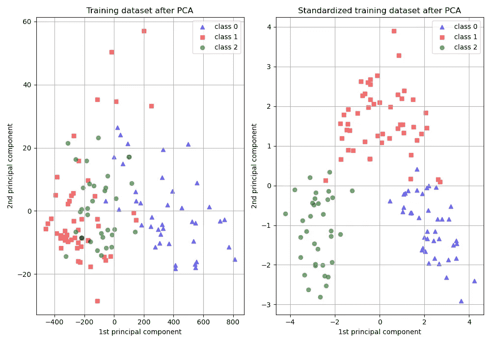
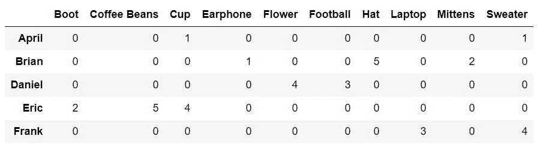
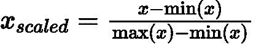
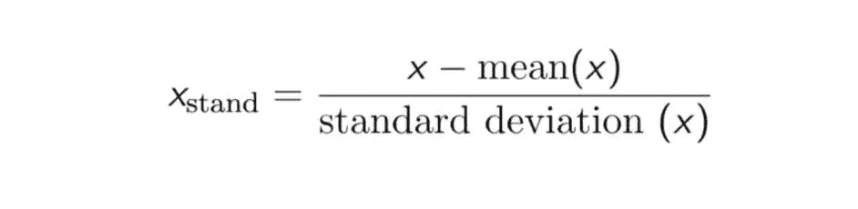

# Memahami Numerical Feature Scaling Untuk Meningkatkan Performace Machine Learning

> 原文：<https://medium.easyread.co/memahami-semua-tentang-numerical-feature-scaling-dalam-8-menit-d79c65e0ccb6?source=collection_archive---------0----------------------->

*Artikel ini menjelaskan tentang feature scaling untuk meningkatkan performa model.*

Photo by [Siora Photography](https://unsplash.com/@siora18?utm_source=medium&utm_medium=referral) on [Unsplash](https://unsplash.com?utm_source=medium&utm_medium=referral)

Salah satu tahapan penting dalam pipeline machine learning adalah feature scaling. Tahapan ini termasuk dalam tahap pipeline data preparation atau jika di dapur termasuk dalam proses persiapan bahan memasak. Untuk menghasilkan masakan yang enak, maka siapkan bumbu dan bahan masakan sesuai proposinya. Yap, sama dengan machine learning, agar model yang dihasilkan bagus, maka fitur yang dimasukkan juga harus sesuai dengan proporsinya. Artikel ini akan mengcover beberapa pertanyaan terkait feature scaling agar dapat meningkatkan kinerja model yaitu :

1.  Apa itu feature scaling?
2.  Mengapa sangat penting?
3.  Kapan menggunakan feature scaling?
4.  Apa saja tekniknya? dan bagaimana implementasinya?

# Apa itu feature scaling?

Feature scaling merupakan teknik statistik yang berfungsi untuk menormalisasikan range pada fitur — fitur data sehingga seluruh fitur berada pada range yang sama. Bayangkan sebuah perusahaan memiliki data karyawan dengan rincian fitur umur (range : 20–55 tahun) dan gaji (range : 1.000.000–100.000.000). Kedua fitur karyawan tersebut berada pada range yang berbeda yaitu puluhan dan jutaan. Kenapa? Yap, karena satuan ukurnya berbeda, umur dengan satuan tahun, sementara gaji dengan satuan rupiah. Tapi, mesin hanya mengerti angka sehingga gaji akan selalu lebih besar daripada umur tanpa memperhatikan skala pengukurannya dan ini akan mempengaruhi hasil prediksi. Oleh karena itu, dengan feature scaling tiap fitur akan diubah dalam range yang sama seperti ke dalam range [-1, 1], [0,1] atau unitness . Tapi, kenapa fitur data karyawan tersebut harus di ubah kedalam range yang sama? Apa yang menjadi masalah?

# Kenapa penting?

Jika model machine learning tidak melakukan proses feature scaling, maka hasil prediksi akan lebih condong atau lebih didominasi oleh nilai fitur terbesar, sementara fitur dengan nilai kecil akan sangat kecil mempengaruhi hasil prediksi. Sama seperti memasak, jika proposi garam lebih banyak maka masakan akan keasinan atau jika didominasi oleh gula maka akan kemanisan. Bumbu yang dimasukkan terbanyak akan mendominasi rasa masakan, oleh karena itu gunakan satuan sendok teh untuk mengukur gula dan garam. Berikut contoh visualisasi segmentasi karyawan berdasarkan weight dan height menggunakan KNN clustering.

Berdasarkan [gambar tersebut](https://howtolearnmachinelearning.com/articles/feature_scaling_machine_learning/) dapat disimpulkan bahwa :

*   Gambar atas yaitu model tanpa fitur scaling, menghasilkan bahwa fitur height tidak mempengaruhi hasil segmentation karena hasil didominasi oleh weight .
*   Gambar bawah yaitu model dengan fitur scaling, menghasilkan bahwa semua fitur sama sama berpengaruh terhadap hasil prediksi yaitu segmentasi dilakukan berdasarkan fitur weight dan height.

Oleh karena itu, menyamakan range fitur sangat penting agar hasil prediksi lebih akurat sehingga seluruh fitur dapat berkontribusi mempengaruhi hasil prediksi. Namun, kepentingan feature scaling dapat diartikan berbeda — beda tergantung algortimanya. Kasus diatas merupakan salah satu contoh algoritma berdasarkan distance. Lalu, bagaimana dengan algoritma lainnya? Apakah semua algoritma harus melalui proses feature scaling? Jawabannya tidak. Kenapa? Tergantung model algoritma dan tujuannya.

# Kapan menggunakan feature scaling?

Feature scaling digunakan untuk model machine learning dengan kriteria berikut :

## Distance based algorithm

Algoritma KNN, K-Means dan SVM merupakan contoh distance based algoritma. Seperti contoh kasus segmentasi karyawan diatas, dengan feature scaling maka seluruh fitur dapat berkontribusi mempengaruhi hasil prediksi model, namun apabila tidak, maka akan didominasi oleh fitur dengan nilai terbesar. Hal ini dikarenakan, cara kerja algoritmanya menggunakan metriks distance salah satunya seperti euclidean distance. Matriks ini mengukur jarak antar 2 point yang dapat dilihat pada rumus sebagai berikut.

Jika kita membuat salah satu [contoh implementasi](https://howtolearnmachinelearning.com/articles/feature_scaling_machine_learning/) euclidean distance menggunakan kasus weight [45, 53] and height [1.5, 1.7]. Apabila dimasukin kedalam rumus, maka weight (x) menghasilkan 121, sementara height (y) menghasilkan 0.04, maka disimpulkan bahwa weight berkontribusi lebih besar dibandingkan height (121 > 0.04) dan ini bukan karena fitur weight lebih penting, tetapi karena adanya perbedaan range value yang sangat besar.

## Gradient descent algoritma

Implementasi feature scaling dapat membantu menemukan titik cost minimal dengan cepat. Hal ini dikarenakan cara kerja gradien descent adalah dengan terus mencoba nilai koefisien yang berbeda, mengevaluasi cost dan memilih koefisien baru dengan nilai cost paling minimal. Apabila range data sangat besar atau tidak normal, maka sulit menemukan cost minimal dan akan terus beriterasi sehingga memakan waktu lebih lama, namun apabila data di rescale atau melakukan feature scaling kita dapat menghindari proses iterasi berlebihan karena titik minimal dapat lebih cepat ditemukan.

Dari gambar diatas, dapat dilihat bahwa gradient descent tanpa feature scaling memiliki jalur yang lebih panjang ditandai dengan jalur zigzag dan bentuk gradient yang lebih besar untuk menemukan titik minimum, sementara gradient descent dengan feature scaling, jalurnya lebih pendek sehingga lebih cepat menemukan titik minimum costnya.

## Principles Component Analysis (PCA)

Teknik PCA berguna untuk menangani curse dimensionality dengan mereduksi dimensi sehingga membentuk dimensi baru yang bervariance maksimum. Apabila komponen pertama (ex : tinggi badan) bervariansi lebih rendah daripada komponen kedua (ex : berat badan) dikarenakan perbedaan skala pengukuran yaitu meter dan kilogram, maka PCA akan menentukan bahwa arah variansi maksimum akan mengikuti fitur weight, jika data tidak di rescale. Hal ini dikarenakan range data mempengaruhi variansi, semakin besar rangenya maka semakin tinggi variansi nya, oleh karena itu perlu melakukan feature scaling sebelum melakukan PCA agar fitur fitur memiliki skala dan variansi yang sama sehingga arah variansi maksimumnya mengikuti semua fitur. Selanjutnya, kita akan melihat contoh pemodelan naive bayes terhadap data wine yang direduksi dimensinya menggunakan PCA dengan proses feature scaling dan tanpa feature scaling.

[Gambar diatas](https://scikit-learn.org/stable/auto_examples/preprocessing/plot_scaling_importance.html) dapat disimpulkan bahwa pada gambar pertama yaitu model PCA + naive bayes tanpa melakukan feature scaling terlebih dahulu menghasilkan prediksi acak yang tidak dapat secara akurat mengkasifikasi objek, sementara gambar kedua yang mengimplementasikan feature scaling + PCA +Naive bayes dapat melakukan klasifikasi dengan sangat baik. Oleh karena itu, melakukan feature scaling sebelum PCA sangat penting karena berdampak pada hasil prediksi.

Bagaimana algoritma lainnya? Yups. Penggunaan feature scaling harus disesuaikan dengan tujuan dan model algoritmanya.

> “Models that are smooth functions of the input, such as linear regression, logistic regression, or anything that involves a matrix, are affected by the scale of the input. If your model is sensitive to the scale of input features, feature scaling could help. As the name suggests, feature scaling changes the scale of the feature.”
> 
> By : Alice Zheng dan Amanda Casari (Feature Engineering on Machine Learning book)

Namun, ada juga model yang tidak berefek apabila menggunakan feature scaling. Apa?

> “Naive Bayes, Linear Discriminant Analysis, and Tree-Based models are not affected by feature scaling. In Short, any Algorithm which is Not Distance-based is Not affected by Feature Scaling.”
> 
> By : Alice Zheng dan Amanda Casari (Feature Engineering on Machine Learning book)

Lau, bagaimana melakukan feature sceling pada data dengan benar? Apa saja tekniknya?

# Teknik dan implementasi feature scaling

Terdapat 2 teknik feature scaling yang paling sering digunakan yaitu Min Max Scaling dan Standardization. Tapi apakah kamu tau disaat apa menggunakan teknik tersebut?

## Min Max Scaling

Min Max Scaling merupakan teknik untuk mengecilkan range fitur menjadi range [0, 1] atau [-1, 1] apabila terdapat negative value.

> “The motivation to use this scaling include robustness to very small standard deviations of features and preserving zero entries in sparse data.”
> 
> [作者:scikit learn](https://scikit-learn.org/stable/modules/preprocessing.html#preprocessing-scaler)

如果数据分布不正常或存在标准偏差，则最小最大规模可能会导致零条目或数据稀疏。

> “在我们不关心沿方差轴的标准化的情况下，这是完全可以接受的，例如，图像处理或神经网络期望值在 0 和 1 之间。”
> 
> [作者:卡格尔](https://www.kaggle.com/getting-started/217186)

稀疏数据可以是一个数据类别的热编码，也可以是另一个数据类别的热编码。

数据分类编码的稀疏数据是一个很好的例子。最大规模最小化的准则是:

Python 通过库 scikit learn 实现了这些功能。例如，实现最小最大缩放器可以让 python 适应多库门塔什[科学学习](https://scikit-learn.org/stable/modules/preprocessing.html#preprocessing-scaler)。

## 标准化

标准化技术将重标度分布数据定义为正态分布/高斯分布(零均值和单位标准差)。Kenapa perlu dilakukan？这一模型可能会导致短期或长期的正态分布。一个模型算法，它可以计算出所有的不确定性，并且可以计算出所有的变量。如果你能从其他地方获得更多的变量，那么这种方法将会成为一种主流模型，从而使评估者无法从其他地方获得更多的变量。

> 例如，学习算法的目标函数中使用的许多元素(如支持向量机的 RBF 核或线性模型的 l1 和 l2 正则化子)假设所有特征都以零为中心，并且具有相同顺序的方差。
> 
> [作者:scikit learn](https://scikit-learn.org/stable/modules/preprocessing.html#preprocessing-scaler)

因此，标准化可以更好地实现多样化的模型。

> “在处理方差(PCA、聚类、逻辑回归、支持向量机、感知器、神经网络)时，事实上标准定标器非常重要。另一方面，如果您使用基于树的分类器或回归器，这不会产生太大的差异。”
> 
> 作者:[卡格尔](https://www.kaggle.com/getting-started/217186)

实施 nya？Rumus 标准化是一个很好的例子:

Python 库 scikit learn 提供了统计标准化模块，因此我们可以轻松实现。实现标准化可以让 python 更好地适应科学研究。

呸。事实上，有几个关键点是通过扩展特性来提高 kinerja 模型的性能。

> “好的特性使
> 随后的建模步骤变得容易，得到的模型更有能力完成预期的任务。不良特征可能需要复杂得多的模型来实现相同水平的性能。”
> 
> 作者:爱丽丝·郑丹·阿曼达·卡萨瑞(机器学习书籍的特征工程)

# 参考 I

https://howtolearnmachinehlearning . com/articles/feature _ scaling _ machine _ learning/

https://www.atoti.io/when-to-perform-a-feature-scaling/

https://www . Amazon . com/Feature-Engineering-Machine-Learning-Principles/DP/1491953241

https://sci kit-learn . org/stable/modules/preprocessing . html #预处理-缩放器