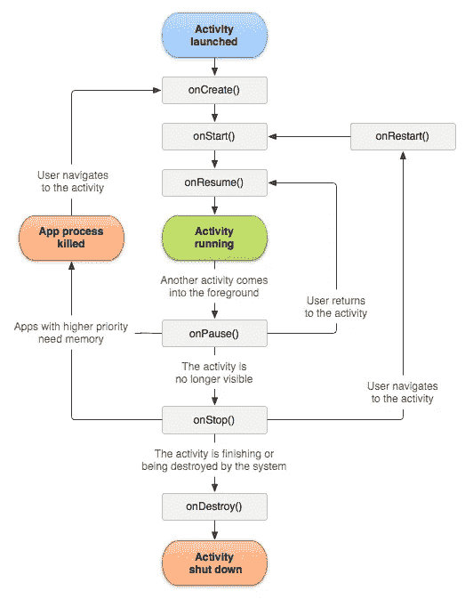
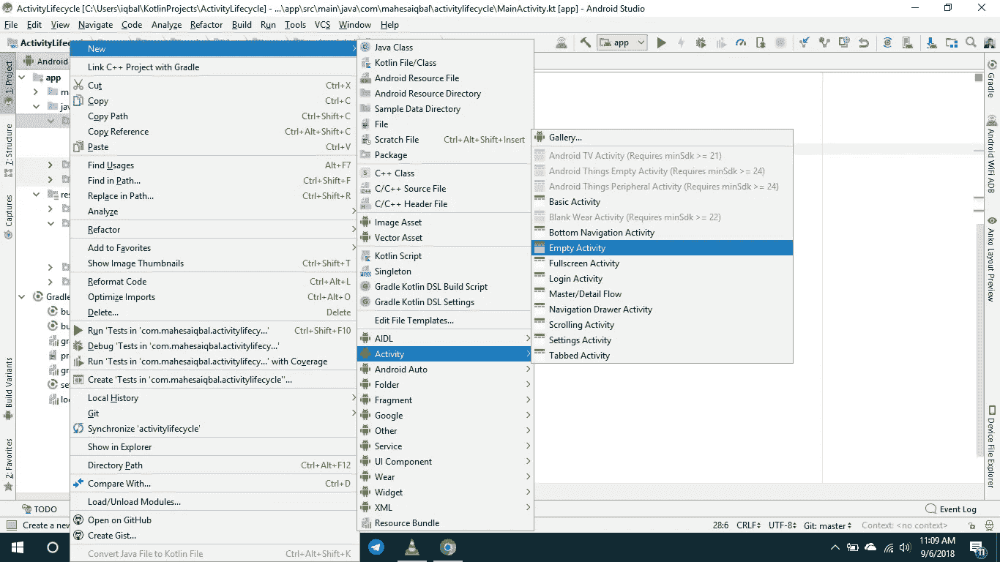
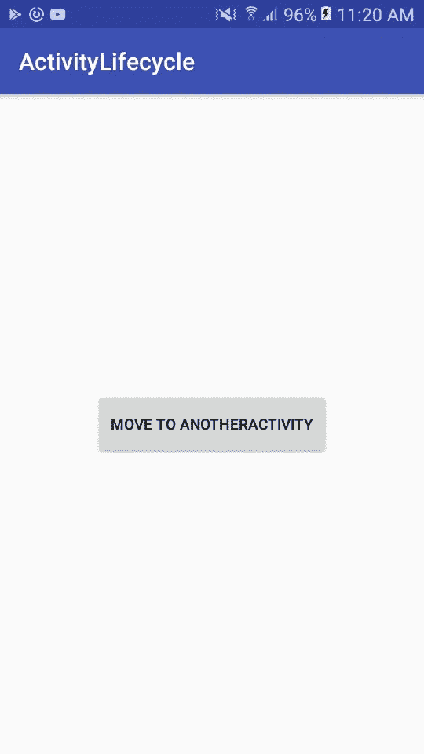
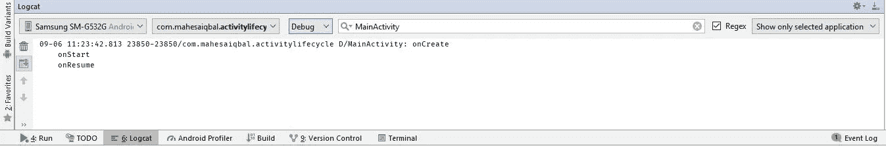
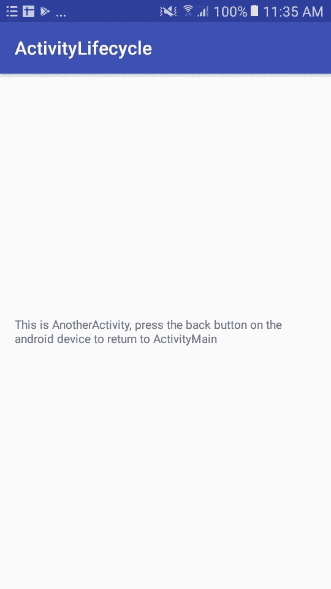
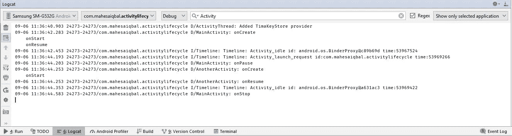
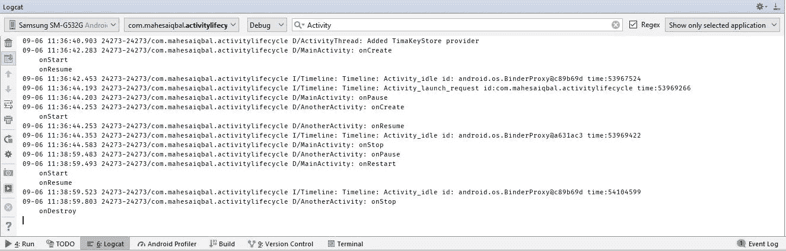
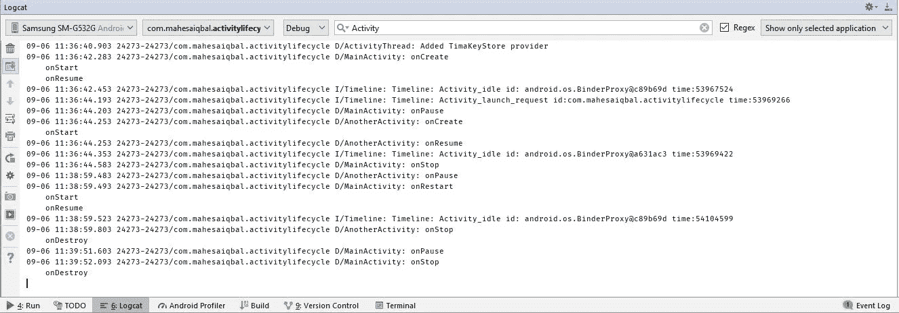

# Memahami Siklus Hidup Aplikasi Android dengan Kotlin

> 原文：<https://medium.easyread.co/memahami-siklus-hidup-aplikasi-android-dengan-kotlin-45253cff7b01?source=collection_archive---------0----------------------->

## Android Lifecycle in Kotlin

Siklus hidup pada manusia itu kejadiannya berulang setiap harinya. Pada malam hari kita melakukan aktivitas yaitu tidur. Selanjutnya pada pagi hari kita melakukan aktivitas setelah bangun tidur misalnya mandi pagi, sarapan, lalu berangkat kerja, sampai dikantor kita bekerja sampai sore, pulang kerumah kembali, mandi sore, lalu di malam harinya kita melakukan aktivitas makan malam, dan tidur kembali.

Seperti itulah gambaran umum siklus hidup manusia. Sama halnya pula dengan aplikasi Android yang juga memiliki siklus hidup di dalamnya. Sebagai pengembang aplikasi Android yang baik, kita perlu mengetahui garis besar dari pengembangan aplikasi Android yaitu *Android Lifecycle* atau Siklus Hidup Android.

Di dalam aplikasi Android, ia memiliki siklus hidup seperti gambaran di bawah ini:

Activity Lifecycle

Langsung saja kita buat proyek aplikasinya supaya lebih mudah memahaminya. Langkah-langkahnya ialah seperti dibawah ini :

1.  Pilih *Start a new Android Studio project* .
2.  Beri nama aplikasinya *ActivityLifecycle* , jangan lupa untuk centang *Include Kotlin Support* , aplikasi yang ingin kita buat yaitu menggunakan [Kotlin](https://kotlinlang.org/) . Tekan Next.
3.  Pilih *API 16: Android 4.1 (Jelly Bean)* pada pilihan *Phone and Tablet* sebagai target minimum SDK. Tekan Next.
4.  Pilih *Empty Activity* pada Activity aplikasi kita. Tekan Next.
5.  Langsung tekan Finish pada *Configure Activity* (Activity Name : MainActivity dan Layout Name : activity_main). Tunggu proses Gradle membangun proyek yang kita buat tadi sampai selesai.

Sekarang yang harus kalian lakukan adalah menambahkan *button* pada file activity_main.xml lalu kita edit menjadi seperti dibawah ini :

Jika sudah, sekarang buka file MainActivity.kt, edit kodenya menjadi seperti ini:

Lalu, sekarang kita buat *activity* baru, klik kanan pada file *package* (com.mahesaiqbal.activitylifecycle, tentu akan berbeda dengan punya kalian) pilih *New* - > *Activity* - > *Empty Activity* . Seperti contoh dibawah ini :

Kita namakan AnotherActivity.kt dan activity_another.xml untuk layoutnya. Tekan Finish. Tunggu proses Gradle membangun *Activity* tersebut.

Langkah selanjutnya, buka file activity_another.xml, edit kodenya menjadi seperti berikut :

Terakhir, buka file ActivityAnother.kt, edit kodenya menjadi seperti di bawah ini :

Nah, sekarang coba jalankan aplikasinya, akan muncul seperti ini :

Ketika aplikasi dijalankan, pertama kali proses siklus hidup yang akan berjalan adalah *onCreate* , *onStart* , dan *onResume* . Maka kita akan masuk ke dalam *homepage* / *main* pada aplikasi tersebut *.* Untuk membuktikannya, buka menu *Logcat* pada bar di bawah. Maka akan tampil seperti ini :

Penjelasannya :

*   *D/MainActivity : onCreate* , adalah kondisi awal saat *MainActivity* baru diciptakan, biasanya dilakukan inisialisasi pada tahapan ini.
*   *D/MainActivity : onStart* , adalah kondisi dimana aplikasi memulai *MainActivity* pada tahapan ini.
*   *D/MainActivity : onResume* , adalah saat *MainActivity* dibuka kembali, biasanya dieksekusi setelah *onPause()* .

Jika kita menekan *button* “ *Move to AnotherActivity* ”, maka tampilannya akan seperti di bawah ini :

Berikut *Log* aplikasinya :

Penjelasannya :

*   *D/MainActivity : onPause* , terpanggil pada saat *button* “ *Move to AnotherActivity* ” di klik, dan ada *Activity* yang terbuka, yaitu *AnotherActivity* .
*   *D/AnotherActivity: onCreate* , adalah kondisi awal saat *AnotherActivity* baru diciptakan, biasanya dilakukan inisialisasi pada tahapan ini.
*   *D/AnotherActivity : onStart* , adalah kondisi dimana aplikasi memulai *AnotherActivity* pada tahapan ini.
*   *D/AnotherActivity : onResume* , adalah saat *AnotherActivity* dibuka kembali, biasanya dieksekusi setelah *onPause()* .
*   *D/MainActivity : onStop* , adalah kondisi disaat *MainActivity* tidak ditampilkan dilayar (yang sedang ditampilkan saat ini adalah *AnotherActivity* ).

Ketika kondisi aplikasi sedang berada pada *AnotherActivity* , tekan tombol “ *Back* ” pada Smartphone kalian dan aplikasi tersebut akan kembali ke *MainActivity* , berikut *Log* aplikasinya :

Penjelasannya :

*   *D/AnotherActivity : onPause* , terpanggil pada saat tombol “ *Back* ” pada Smartphone kalian di klik, dan ada *Activity* yang kembali terbuka dan me-restart *Activity* kembali yang tidak muncul di layar, yaitu kembali ke *MainActivity* .
*   *D/MainActivity : onRestart* , kondisi saat *MainActivity* kembali dibuka.
*   *D/MainActivity : onStart* , adalah kondisi dimana aplikasi memulai *MainActivity* pada tahapan ini.
*   *D/MainActivity : onResume* , adalah saat *MainActivity* dibuka kembali, biasanya dieksekusi setelah *onPause()* .
*   *D/AnotherActivity : onStop* , adalah kondisi disaat *AnotherActivity* tidak ditampilkan dilayar (yang sedang ditampilkan saat ini adalah *MainActivity* ).
*   *D/AnotherActivity : onDestroy* , adalah kondisi dimana saat *AnotherActivity* dihancurkan pada memori.

Sekarang kalian sudah berada di *MainActivity* lagi. Jika kalian ingin menutup aplikasi *ActivityLifecycle* dan menghancurkannya pada memori (kembali ke menu aplikasi Smartphone kalian), tekan tombol “ *Back* ” pada Smartphone kalian dan aplikasi tersebut menghilang, berikut *Log* pada aplikasinya yang sudah menghilang :

*   *D/MainActivity : onPause* , terpanggil pada saat tekan tombol “ *Back* ” pada Smartphone kalian di klik.
*   *D/MainActivity : onDestroy* , adalah kondisi dimana saat *MainActivity* dihancurkan pada memori dan tidak lagi ditampilkan di layar.

Sekian postingan materi pada kali ini mengenai Android Lifecycle menggunakan Kotlin (Sama saja dengan menggunakan Java, hanya saja beda sintaksis saja). Semoga dapat bermanfaat buat anda sebagai pembaca di postingan saya ini 😃. Keep Learning, Keep Coding!

Sumber kode lengkapnya di [sini](https://github.com/mahesaiqbal/ActivityLifecycle) .

Salam Coders!