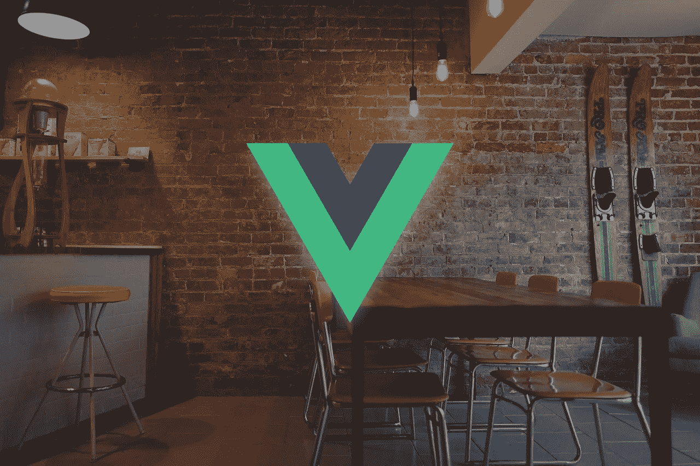

# Membangun Aplikasi Reservasi Meja dengan MEVN — Bagian Kedua

> 原文：<https://medium.easyread.co/membangun-aplikasi-reservasi-meja-dengan-mevn-bagian-kedua-feabd7bd7b00?source=collection_archive---------9----------------------->

## Bagaimana saya membangun aplikasi reservasi meja dengan MEVN?



> **Jika anda belum membaca bagian pertama, silakan cek di** [**sini**](https://medium.com/easyread/bagaimana-saya-membangun-aplikasi-reservasi-meja-dengan-mevn-bagian-pertama-eac108f266a3) **terlebih dahulu**

Selamat datang di bagian kedua dari seri cerita saya, **Membangun Aplikasi Reservasi Meja dengan MEVN.** Jika anda belum mengikuti seri sebelumnya, silakan cek pada daftar seri di bawah ini.

# Membangun Aplikasi Reservasi Meja dengan MEVN — Daftar Seri

[**1\. Membangun Aplikasi Reservasi Meja dengan MEVN — Bagian Pertama**](https://medium.com/easyread/bagaimana-saya-membangun-aplikasi-reservasi-meja-dengan-mevn-bagian-pertama-eac108f266a3) **2\. Membangun Aplikasi Reservasi Meja dengan MEVN — Bagian Kedua (You’re here)** [**3\. Membangun Aplikasi Reservasi Meja dengan MEVN — Bagian Ketiga**](https://medium.com/easyread/membangun-aplikasi-reservasi-meja-dengan-mevn-bagian-ketiga-12dfbd8709f5)

Melalui bagian kedua ini, saya ingin menceritakan bagaimana saya mengimplementasikan VueJS pada sisi *front-end* ketika membangun aplikasi reservasi meja yang saya buat. Pada bagian ini saya akan coba menjelaskan secara umum dan cenderung *back and forth* . Jika anda mempunyai pertanyaan ataupun masukan, *feel free* untuk memberikan respon di bagian akhir artikel 😉

**Selamat membaca!**

# Persiapan Front-End

Berikut ini adalah hal yang saya persiapkan untuk membangun front-end aplikasi ini

*   **VueJS**
*   **Vuex**
*   **Vue-js-modal**
*   **VueRouter**
*   **axios**

Selanjutnya saya membuat projek vue baru yang saya beri nama `**client**` di dalam root folder `**table-reservation-app**` dengan command berikut

```
**vue create client**
```

Di dalam folder `**client**` inilah semua kode VueJS saya akan disimpan. Saya lalu menambahkan file `**vue.config.js**` yang di dalamnya berisi [**devServer.proxy**](https://cli.vuejs.org/config/#devserver-proxy) . Singkatnya, konfigurasi ini saya tambahkan agar *front-end* bisa mengakses API yang berjalan di server localhost saya sendiri.

Setelah itu saya mengunduh beberapa *dependencies* yang saya butuhkan melalui npm, mulai dari [**Vuex**](https://vuex.vuejs.org/guide/) untuk melakukan manajemen state ( *state management* ) di aplikasi Vue, [**VueRouter**](https://router.vuejs.org/installation.html#direct-download-cdn) untuk mengatur *routing* atau perpindahan antar komponen dalam Vue, [**axios**](https://github.com/axios/axios) sebagai package untuk untuk melakukan HTTP request ke API (yang telah dibuat sebelumnya pada bagian pertama), dan juga [**Vue-js-modal**](https://github.com/euvl/vue-js-modal) yang nanti akan saya gunakan untuk membuat form modal. Jika anda belum familiar dengan konsep state, saya menyediakan referensi tambahan di bagian akhir.

# Implementasi Code

Setelah selesai melakukan persiapan awal, saya melakukan import berbagai dependencies tadi di dalam file `**main.js**`

Folder `**store**` adalah tempat saya menyimpan folder Vuex nantinya, file `**routes**` adalah tempat untuk konfigurasi *route* antar kompone, dan file `**App**` adalah komponen utama pada aplikasi Vue. Dilanjutkan dengan melakukan installasi vue-js-modal dan VueRouter ke dalam aplikasi Vue, serta melakukan konfigurasi pada VueRouter. Pada bagian akhir, saya membuat instance Vue baru agar bisa dijalankan pada server. Untuk menjalankan aplikasi Vue cukup dengan *command* berikut

```
**npm run serve**
```

Dalam `**App.vue**` yang merupakan component utama yang sudah saya definisikan pada `**main.js**` , saya menambahkan `**router-view**` untuk melakukan render component yang didefinisikan pada file `**routes.js**`

File `**routes.js**` ini berisi routes menuju component yang bernama `**OrderComponent**` **.** Routes yang ingin dibuat kemudian di export agar bisa digunakan pada `**main.js**`

# Vue Component

Vue component bisa dikatakan sebagai sebuah template yang bisa digunakan berulang kali ( *reusable* ) di dalam aplikasi Vue. Dalam struktur direktori Vue, semua component yang ingin dibuat diletakkan di dalam folder `**components**` .

## OrderComponent

Component pertama yang saya buat adalah `**OrderComponent**` **,** yang saya proyeksikan sebagai halaman utama aplikasi. Dalam component ini saya ingin melakukan render list dari kumpulan data reservasi.

OrderComponent sebagai home page dari aplikasi

Pada bagian template, `**v-for**` digunakan untuk me-render list dari data reservasi (atau yang dalam aplikasi saya referensikan sebagai **order** ) dari getters `**allOrders**` , dan harus dilengkapi dengan `:**key**` (singkatan dari `**v-bind:key**` ) sebagai atribut penanda tiap data. Untuk mencetak data reservasi meja dari Vue ke html, saya menggunakan double curly braces `**{{ }}**` yang di dalamnya adalah data **table_name** dari data order. Terakhir adalah pada button terdapat fungsi `@**click**` (singkatan dari `**v-on:click**` ) yaitu saat melakukan klik pada button tersebut maka saya akan menjalankan fungsi `**showModal**`

OrderComponent sebagai home page dari aplikasi

Pada bagian awal script, saya melakukan import getters dan actions dari Vuex dan juga import component `**ModalOrder**` **.** Di bagian methods, saya membuat dua fungsi untuk,

1.  Memanggil helper method `**mapActions**` untuk menyediakan actions yang bernama `**getReservations**` dari Vuex untuk diakses dalam component
2.  Memanggil component ModalOrder yang bernama `**modal-order**` sekaligus melakukan passing data reservasi menuju ke sana dengan fungsi `**showModal**` **.** Fungsi ini merupakan fungsi yang disediakan oleh vue-js-modal.

**Created** adalah salah satu bagian dari lifecycle instance di Vue, dimana saat instance dibuat saya memanggil actions `**getReservations**` . Lalu pada **computed** property, saya memanggil getters bernama `**allOrders**` dari Vuex untuk mendapatkan semua data reservasi yang nantinya akan di-looping dengan `**v-for**` pada bagian template.

## ModalOrder

Component ini akan menampilkan modal atau pop up berisi form yang di dalamnya berisi berbagai atribut yang sudah didefinisikan di bagian pertama seperti table_name, code, dan lainnya. Saya menggunakan vue-js-modal yang ditandai dengan tag html `**modal**` dan disertai nama modal-nya yaitu `**modal-order**` **.** `**before-open**` dan `**opened**` juga merupakan fungsi bawaan dari vue-js-modal yang digunakan untuk menjalankan serangkaian kode tertentu saat **sebelum** modal ditampilkan dan saat **sudah** ditampilkan.

Component ModalOrder sebagai form dari data reservasi

Pada modal tersebut, saya mulai dengan judul form yang ditentukan melalui computed property bernama `**showTableName**` , dan dilanjutkan dengan menambahkan banyak input field untuk tiap atribut data reservasi. Untuk menampilkan value dari data reservasi di dalam tag input, saya menggunakan data binding `**v-model**` **.**

Pada input table_name, saya menambahkan `**ref**` dengan nama `**table_name**` yang mana nantinya akan saya gunakan untuk mereferensi focus saat modal tersebut terbuka.

Pada bagian akhir form ada dua tombol untuk **menyimpan** dan **menghapus** data reservasi. Untuk menyimpan data, saya memanggil fungsi `**onSubmit**` pada saat menekan tombol submit yang ditandai dengan `**@submit**` dan untuk menghapus data saya memanggil fungsi `**deleteReservation**` dengan `**v-if**` (conditional rendering dari Vue) saat data reservasi adalah data yang sudah tersimpan di database.

Component ModalOrder sebagai form dari data reservasi

Lanjut di bagian script, saya awali dengan melakukan import actions dari Vuex. Lalu saya melakukan inisialisasi objek data reservasi ( **order** ) dan menyiapkan berbagai methods. Berikut ini fungsi yang saya buat dalam bagian methods,

1.  `**beforeOpen**` yaitu fungsi yang dijalankan sebelum modal terbuka, di dalamnya saya melakukan binding data yang dikirimkan dari OrderComponent ke objek **order** dan mengatur nilai default dari atribut quantity_ordered dengan `**this.$set**` jika membuat data reservasi baru
2.  `**opened**` yaitu fungsi yang dijalankan saat modal sudah terbuka agar langsung melakukan focus ke ref yang bernama table_name
3.  `**hideModal**` sesuai namanya yaitu untuk menyembunyikan modal
4.  `**mapActions**` helper method untuk memanggil berbagai actions dari Vuex
5.  `**updateReservation**` untuk melakukan perubahan data reservasi
6.  `**addReservation**` untuk menambah data reservasi baru
7.  `**deleteReservation**` untuk menghapus data reservasi yang dipilih
8.  `**onSubmit**` untuk menentukan aksi yang dilakukan jika melakukan submit data. Jika data reservasinya tidak punya id a.k.a data reservasi baru, maka akan menjalankan fungsi `**addReservation**` . Sedangkan jika datanya sudah ada di database akan menjalankan `**updateReservation**` lalu akan langsung menyembunyikan modal dengan `**hideModal**` .

Terakhir yaitu di bagian computed, saya membuat fungsi `**showTableName**` untuk menentukan judul form modal nanti. Jika membuat data reservasi baru maka judul form akan tampil sebagai “New Reservation” dan sebaliknya jika data reservasi sudah ada dalam database maka judul form akan menampilkan nama meja yang direservasi.

# Vuex

Vuex adalah package yang saya gunakan untuk melakukan state management dalam aplikasi ini. Menurut saya, ini bisa dikatakan sebagai tempat pengolahan data secara terpusat untuk digunakan pada aplikasi Vue.

Semua hal yang berhubungan dengan Vuex saya letakkan di dalam folder baru yang bernama **store** . Store adalah sebuah tempat yang menampung berbagai **state** atau yang bisa disebut sebagai data di dalam aplikasi. Di dalam store, Vuex memungkinkan kita untuk membuat berbagai **modules** jika nantinya ada berbagai macam state yang ingin disimpan dalam store.

Sebelum lanjut lagi, saya ingin menceritakan sedikit tentang core concept dari Vuex ini. Jadi, dalam Vuex ada lima poin sebagai core concept yaitu

*   **State** , yaitu objek yang digunakan Vuex untuk menampung data
*   **Getters** , untuk melakukan kalkulasi berdasarkan data di dalam **state**
*   **Mutations,** untuk mengubah **state** yang sudah ada dan hanya untuk fungsi yang **synchronous** saja
*   **Actions,** handler untuk melakukan commit **mutations** dan bisa digunakan untuk fungsi yang berjalan secara **synchronous** maupun **asynchronous**
*   **Modules,** konsep yang disediakan Vuex untuk memecah objek store menjadi bagian-bagian yang modular

## Inisialisasi Vuex

File utama untuk inisialisasi Vuex pada aplikasi ini

Dalam folder **store** saya membuat file baru lagi yaitu `**index.js**` sebagai file utama untuk inisialisasi Vuex. Pada bagian awal saya melakukan import package **Vuex, Vue,** dan juga modules yang saya beri nama **orders** . Dilanjutkan dengan melakukan install plugin Vuex ke dalam aplikasi Vue. Pada bagian akhir, saya melakukan inisialisasi Store untuk Vuex dengan menyertakan modules **orders** .

Mengapa saya menerapkan modules untuk aplikasi ini? Karena saya berpikir apabila nantinya aplikasi ini terus berkembang, maka akan lebih fleksibel dan mudah untuk diorganisir jika state management nya sudah berbentuk modular.

## Modules Orders

Module orders sebagai wadah untuk melakukan management state Vuex

Di bagian awal, saya melakukan import axios dan Vue agar bisa melakukan HTTP request dari front-end (Vue) menuju back-end API. Dilanjutkan dengan inisialisasi base url menuju API yang sudah saya buat di bagian pertama. Setelah itu saya melakukan inisialisasi **state** yang di dalamnya berisi objek array bernama `**orders**` .

Masuk ke bagian **actions** , saya membuat beberapa fungsi async untuk melakukan request ke API. Struktur masing-masing fungsi ini hampir mirip, yaitu melakukan HTTP request melalui axios lalu menjalankan **commit** ke mutations tertentu bersama dengan data dari HTTP response. Ada empat fungsi yang saya buat,

*   `**getReservations**` untuk melakukan commit `**GET_RESERVATION**`
*   `**updateReservationData**` untuk melakukan commit `**UPDATE_RESERVATION**`
*   `**addReservationData**` untuk melakukan commit `**ADD_RESERVATION**`
*   `**deleteReservationData**` untuk melakukan commit `**DELETE_RESERVATION**`

Untuk actions yang membutuhkan input dari user seperti `**addReservationData**` dan `**updateReservationData**` , saya menambahkan parameter `**orderData**` sebagai data order yang ingin dibuat atau diubah melalui POST atau PATCH request nantinya.

Lanjut ke bagian **mutations** , saya membuat empat mutations dengan arrow function di dalamnya yaitu

*   `**GET_RESERVATIONS**` , menginisialisasi data di state orders dengan semua data order yang dikirimkan dari API
*   `**UPDATE_RESERVATION**` , mencari index state yang ingin diubah lalu menggantinya dengan menggunakan fungsi `**Vue.set**`
*   `**ADD_RESERVATION**` , memasukkan data baru ke dalam state orders dengan fungsi `**push**`
*   `**DELETE_RESERVATION**` , melakukan `**filter**` di state orders dengan memisahkan data order dengan id tertentu dari state orders yang kemudian hasil filter tersebut diinisialisasi sebagai state orders yang baru.

Pada **getters** , saya hanya membuat satu arrow function bernama `**allOrders**` untuk mengambil data dari state dengan argument berupa objek state orders. Di bagian akhir, saya melakukan export semua yang sudah saya buat sebelumnya, mulai dari state, actions, mutations, dan getters agar bisa diimpor dan digunakan di Vue component.

Hasil akhir dari implementasi front-end dengan Vue

# Selanjutnya?

Jadi, ini adalah akhir dari bagian kedua dari seri **Membangun Aplikasi Reservasi Meja dengan MEVN** . Jika kita lihat tampilan dari front-end aplikasi ini masih sangat membosankan karena tidak ada styling sama sekali di dalamnya. Oleh karena itu, bagian berikutnya adalah bagian yang sangat menarik karena saya ingin mengajak anda untuk melihat bagaimana cara saya untuk styling aplikasi ini dengan menggunakan **TailwindCSS** .

Silakan kunjungi repository untuk projek ini pada link di bawah ini

[**Table Reservation App**](https://github.com/azmi6298/table-reservation-app)

# Referensi

*   [Learn Vuex In 10 Minutes (Vue.js State Management)](https://www.youtube.com/watch?v=LW9yIR4GoVU)
*   [Vue lifecycle](https://vuejs.org/v2/guide/instance.html#Instance-Lifecycle-Hooks)
*   [Arrow functions](https://developer.mozilla.org/en-US/docs/Web/JavaScript/Reference/Functions/Arrow_functions)