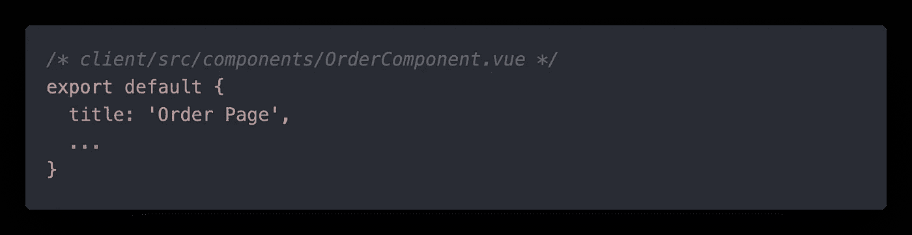

# Membangun Aplikasi Reservasi Meja dengan MEVN — Bagian Ketiga

> 原文：<https://medium.easyread.co/membangun-aplikasi-reservasi-meja-dengan-mevn-bagian-ketiga-12dfbd8709f5?source=collection_archive---------6----------------------->

## Bagaimana saya membangun aplikasi reservasi meja dengan MEVN dan menerapkan TailwindCSS?


Selamat datang di bagian ketiga dari seri cerita saya, **Membangun Aplikasi Reservasi Meja dengan MEVN.** Jika anda belum mengikuti seri sebelumnya, silakan cek pada daftar seri di bawah ini.

# Membangun Aplikasi Reservasi Meja dengan MEVN — Daftar Seri

[**1\. Membangun Aplikasi Reservasi Meja dengan MEVN — Bagian Pertama**](https://medium.com/easyread/bagaimana-saya-membangun-aplikasi-reservasi-meja-dengan-mevn-bagian-pertama-eac108f266a3)[**2\. Membangun Aplikasi Reservasi Meja dengan MEVN — Bagian Kedua**](https://medium.com/easyread/membangun-aplikasi-reservasi-meja-dengan-mevn-bagian-kedua-feabd7bd7b00) **3\. Membangun Aplikasi Reservasi Meja dengan MEVN — Bagian Ketiga (You’re here)**

Pada seri ketiga ini, saya ingin menceritakan pengalaman saya untuk melakukan *styling* pada aplikasi reservasi meja yang telah saya buat. Tujuannya adalah agar aplikasi ini menjadi lebih menarik secara tampilan, lebih intuitif, dan lebih mudah dipahami oleh pengguna. Untuk melakukan styling, saya menggunakan CSS framework yaitu [***TailwindCSS***](https://tailwindcss.com/) .

Saya menggunakan **TailwindCSS** karena menyediakan **kemudahan untuk melakukan CSS styling** tanpa harus membuat file *custom* CSS yang terpisah. Semua bisa dilakukan dengan sangat mudah secara inline. Selain itu saya juga menggunakan [***Vue-Tailwind***](https://www.vue-tailwind.com/) agar bisa menggunakan pre-made component seperti input text, button, dan lainnya dengan basis styling dari TailwindCSS dan tentunya kompatibel di aplikasi berbasis VueJS.

Jika anda ingin melihat kode sumber dari aplikasi ini, silakan mengunjungi repository Github saya melalui tautan berikut [**Table Reservation App**](https://github.com/azmi6298/table-reservation-app) .

# Persiapan Styling

Untuk melakukan styling pada aplikasi ini, saya mencoba untuk membuatnya dengan sesimpel mungkin menggunakan dua *package* berikut ini

*   **TailwindCSS**
*   **Vue-Tailwind**

Untuk memasang kedua package tersebut ke dalam projek ini, saya menjalankan command berikut

```
**npm install tailwindcss vue-tailwind**
```

Langkah selanjutnya adalah saya melakukan instalasi TailwindCSS ke dalam projek ini. Untuk langkah secara detilnya, saya menyertakan tautan menuju dokumentasi resmi dari TailwindCSS pada bagian referensi. Dalam folder **src/assets** , saya membuat folder baru bernama **css** lalu menambahkan file **tailwind.css** untuk import komponen dari TailwindCSS sebagai berikut,


Setelah itu, saya menjalankan command di bawah ini untuk membuat file konfigurasi untuk tailwind yang nantinya akan generate file `**tailwind.config.js**` . Langkah ini bisa berguna jika saya ingin memodifikasi styling yang disediakan dari TailwindCSS atau menambah third-party plugin.

```
**npx tailwindcss init**
```

Setelah selesai melakukan setup untuk TailwindCSS, langkah selanjutnya adalah melakukan import file `**tailwind.css**` dan juga package **Vue-Tailwind** di dalam file `**main.js**` .


Langkah terakhir yaitu menambahkan library icon dari material icons yang saya ambil dari CDN dan diletakkan di bagian header dari `**index.html**` **.**


# Component

## Navbar


Tampilan Navbar

Pada bagian navigation bar ini saya mencoba untuk membuat sesederhana mungkin dengan menggunakan div dan router-link. Tujuannya sebagai tampilan dasar untuk melakukan routing apabila nantinya terdapat fitur-fitur tambahan. Untuk styling, saya melakukan beberapa hal berikut

*   `**bg-blue-600**` untuk mengganti warna background navbar menjadi biru
*   `**px-48**` dan `**py-6**` untuk mengatur padding horizontal (X-axis) dengan nilai 48 rem dan vertikal (Y-axis) dengan nilai 6 rem
*   `**mb-16**` untuk mengatur margin bottom sebesar 4 rem
*   `**w-full**` untuk mengatur lebar navbar agar ukuran lebarnya penuh satu halaman
*   `**flex**` dan `**justify-between**` untuk mengatur display flex dan mengatur agar item di dalam navbar letaknya saling berjauhan
*   `**text-xl**` dan `**font-bold**` untuk mengatur ukuran teks dengan ukuran 1.25 rem dan teks yang dimunculkan terlihat tebal

## OrderComponent


Tampilan OrderComponent

Pada OrderComponent saya memiliki ide untuk menampilkan nama tiap meja dalam sebuah grid dengan empat kolom pada masing-masing barisnya. Lalu pada bagian bawahnya saya ingin menambahkan sebuah button CTA berwarna hijau untuk menambahkan data reservasi baru. Styling yang saya gunakan untuk merealisasikan ide saya tersebut adalah sebagai berikut,

*   `**flex**` dan `**flex-col**` untuk mengatur display flex dan mengatur arah susunan item di dalamnya secara vertikal
*   `**items-center**` untuk mengatur letak item di dalamnya agar tetap di tengah
*   `**grid**` , `**grid-cols-4**` , dan `**gap-40**` untuk mengatur layout item secara grid horizontal yang terbagi dalam empat bagian dan memiliki gap (jarak) antar item di dalam grid sebesar 10 rem.
*   `**bg-blue-500**` untuk mengganti warna background menjadi biru
*   `**p-16**` untuk mengatur padding secara keseluruhan dengan nilai 4rem
*   `**w-48**` untuk mengatur lebar component ini agar ukuran lebarnya sebesar 12 rem
*   `**flex**` dan `**justify-center**` untuk mengatur display flex dan mengatur agar item di dalamnya rata tengah
*   `**rounded**` agar item yang ditampilkan memiliki edge yang rounded
*   `**text-4xl**` dan `**font-bold**` untuk menampilkan teks dengan ukuran 2.25 rem dan teks tercetak tebal

Lalu di bawahnya saya menambahkan komponen button yang disediakan oleh Vue-Tailwind dengan menambahkan tag `**t-button**` . Pada button tersebut saya juga menerapkan beberapa styling yaitu,

*   `**variant=”success”**` untuk menampilkan button yang berwarna hijau
*   `**mt-10**` untuk memberikan margin top sebesar 2.5 rem
*   `**font-semibold**` untuk memberikan tampilan teks yang agak tebal

## ModalOrder


Tampilan ModelOrder

Pada form ini saya memiliki ide untuk memberikan sentuhan aksen warna biru pada elemen-elemen di dalamnya seperti di bagian outline dari input dan di button save. Selain itu saya mengubah input quantity yang awalnya hanya berupa manual text input menjadi menggunakan button untuk menambah dan mengurangi quantity.

## General Styling

Untuk styling form secara general, saya hanya membuat teks menjadi warna hitam pekat agar kontras dengan warna putih background form dan mengatur ukuran modal form agar mampu menampung semua input dan button di dalamnya secara proporsional. Styling yang saya terapkan adalah sebagai berikut,

*   `**text-gray-900**` untuk membuat teks di dalam form berwarna hitam
*   `**:width=”600" :height=”750"**` yaitu property yang disediakan vue-js-modal untuk mengatur lebar dan tinggi komponen modal sebesar 600 x 750 px

## Header


Bagian header yang sudah di styling

Pada bagian header, saya mengisinya dengan dua item yaitu judul form dan tombol close. Untuk membuat tombol close tersebut saya menggunakan icon yang disediakan oleh material-icon. Secara keseluruhan, styling untuk header form ini adalah sebagai berikut,

*   `**p-2**` untuk memberikan padding di semua sisi sebesar 0.5 rem
*   `**m-2**` untuk memberikan margin di semua sisi sebesar 0.5 rem
*   `**border-b**` dan `**border-gray-300**` untuk memberikan border berwarna abu-abu yang letaknya di bawah judul form
*   `**flex**` dan `**flex-row**` untuk mengatur display flex dan mengatur arah susunan item di dalamnya secara horizontal
*   `**items-center**` dan `**justify-between**` untuk mengatur item yang ada di dalamnya secara vertical align dan letak item di dalamnya saling berjauhan

## Form Input


Bagian form input yang sudah di styling

Untuk input teks, saya menggunakan tag `**t-input**` yang disediakan oleh Vue-Tailwind. Selain itu saya juga menerapkan beberapa styling lainnya untuk spacing (memberi jarak) antar teks input. Berikut ini adalah styling yang saya gunakan,

*   `**p-4**` untuk memberikan padding di semua sisi sebesar 1 rem
*   `**space-y-5**` untuk memberikan jarak vertikal antar teks input sebesar 1.25 rem
*   `**flex**` dan `**flex-col**` untuk mengatur display flex dan mengatur arah susunan antara teks input dan labelnya secara vertikal
*   `**border-2**` , `**border-blue-500**` , dan `**border-opacity-25**` untuk memberikan border berwarna biru pada teks input dengan opacity 25%.

## Select


Bagian select menu yang sudah di styling

Untuk bagian select menu menggunakan styling yang sama dengan teks input sebelumnya, yang membedakan adalah penggunaan tag `**t-select**` . Kemudian untuk mengisi daftar menunya, saya menambahkan objek data baru bernama menus di bagian `**script**` . Sehingga hasil akhirnya menjadi seperti berikut ini,


Inisialisasi nama-nama menu untuk ditampilkan dalam select


Select yang sudah berisi nama menu

## Input Quantity


Bagian input quantity yang sudah di styling

Input quantity mengalami perubahan yang cukup signifikan dibandingkan dengan desain form awal yang hanya menggunakan teks input saja. Pada bagian ini, sekarang saya menggunakan `**t-input**` dan menambah dua tomboluntuk menambah dan mengurangi quantity. Untuk stylingnya, saya menggunakan `**flex-grow**` pada teks input agar lebarnya bisa fleksibel menyesuaikan dengan dua tombol di bagian kanan dan untuk tombolnya sendiri saya menggunakan icon dari material icons yang dipadukan dengan styling `**text-red-500**` untuk tombol mengurangi quantity dan `**text-blue-500**` untuk tombol menambah quantity.


Tambahan di bagian methods untuk logic menambah dan mengurangi quantity

Langkah selanjutnya adalah menambah fungsi baru di bagian methods yang saya beri nama `**increment()**` dan `**decrement()**` untuk menambah dan mengurangi nilai dari quantity yang nantinya diakses melalui tombol plus dan minus di samping input quantity.

## Save & Delete


Tombol save dan delete yang sudah diberi styling

Akhirnya, kita masuk ke bagian akhir dari form yaitu tombol save dan delete. Pada bagian ini saya menerapkan styling sebagai berikut,

*   `**flex**` dan `**flex-row**` untuk mengatur display flex dan mengatur arah susunan tombol di dalamnya secara horizontal
*   `**justify-center**` dan `**space-x-10**` untuk mengatur tombol yang ada di dalamnya secara horizontal align dan antar tombol memiliki spacing horizontal sebesar 2.5 rem
*   `**variant=”primary”**` untuk memberikan warna biru pada tombol save
*   `**variant=”danger”**` untuk memberikan warna merah pada tombol delete
*   `**font-semibold**` untuk menampilkan teks yang semi tebal pada teks save dan delete

# Extra


Menambahkan page title

Bagian ini merupakan hal yang opsional yaitu mengatur page title melalui VueMixin. Untuk membuat file konfigurasinya, saya membuat folder baru bernama **mixins** dan menambahkan file baru bernama `**titleMixin.js**` dengan konfigurasi sebagai berikut,


Konfigurasi file Mixin

Lalu saya melakukan import titleMixin yang sudah dibuat sebelumnya dan di register ke dalam aplikasi Vue.


Import Mixin di main.js

Langkah terakhir yaitu menambahkan property title pada bagian script di OrderComponent, dan selesai!



Hasil akhir dari styling dengan TailwindCSS

# **Selanjutnya?**

Jadi, ini adalah akhir dari bagian ketiga dari seri **Membangun Aplikasi Reservasi Meja dengan MEVN.** Sejauh ini saya merasa cukup puas dengan fungsionalitas dasar dan tampilan yang ada di dalam aplikasi ini. Jika anda memiliki pertanyaan ataupun masukan, silakan menempatkan di bagian response.

Saya tentunya memiliki keinginan untuk terus mengembangkan aplikasi ini dan tetap membuat cerita baru mengenai perjalanan pengembangan aplikasi ini di Medium saya. Namun untuk dalam waktu dekat ini, saya ingin mencoba berpindah haluan untuk mencoba hal baru di luar aplikasi reservasi meja ini. Saya berharap bisa terus berbagi hal-hal baru yang saya dapatkan kedepannya.

**Sampai jumpa!**

# Referensi

*   [TailwindCSS Installation](https://tailwindcss.com/docs/installation)
*   [TailwindCSS Documentation](https://tailwindcss.com/docs)
*   [Vue-Tailwind](https://vue-tailwind.com/)
*   [The Easy Way to Change Page Title in Vue](https://medium.com/@Taha_Shashtari/the-easy-way-to-change-page-title-in-vue-6caf05006863)