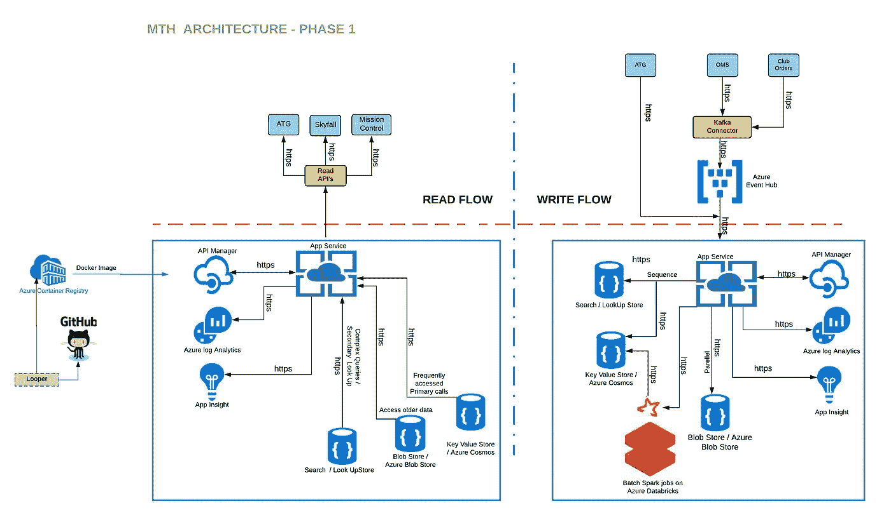
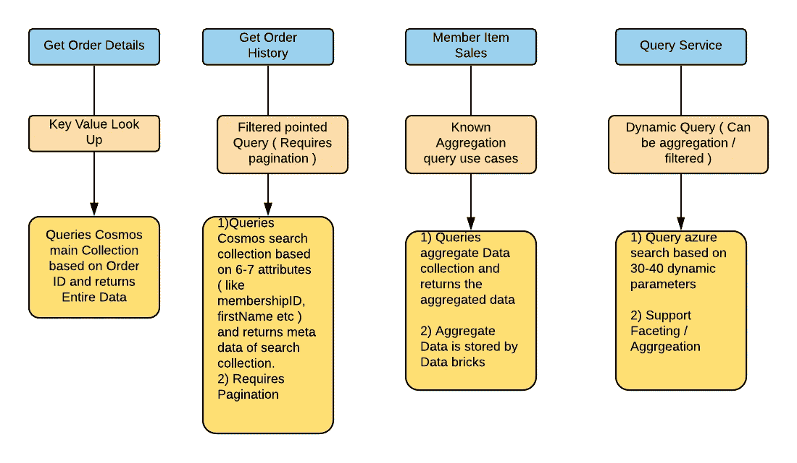

# MTH 数据存储选择之旅

> 原文：<https://medium.com/walmartglobaltech/member-transaction-history-architecture-8b6e34b87c21?source=collection_archive---------4----------------------->

**简介**

会员交易历史(MTH)是俱乐部/在线订单的全渠道阅读层。它是在线/俱乐部订单的唯一真实来源。以下是 MTH 支持的几个用例

*   使用规范的订单模型提供对订单数据的可靠和快速的访问。
*   所有订单查找和修改的单一来源，同时提供一致的界面。

**用例** **:-**

1.  根据订单 ID 获取订单详细信息
2.  根据电话号码或电子邮件 ID 获取订单详细信息
3.  根据会员资格和数据范围/项目编号获取订单详细信息
4.  根据电话号码或电子邮件 ID 以及订单状态和日期范围获取订单详细信息
5.  根据用户详细信息/日期范围获取订单计数(聚合)

**数据存储选择之旅**

顶层的成员交易历史用例分为 4 大类:-关键值用例、过滤点查询用例、预定义的复杂聚合用例、字段值分面/搜索/动态查询用例。

1.  键值用例:- MTH 支持各种键值查找用例，如基于 OrderId 检索订单细节/基于 ReturnOrderId 检索退货细节。键/值存储本质上是一个大型哈希表。您将每个数据值与一个唯一的键相关联，键/值存储通过使用适当的散列函数使用这个键来存储数据。选择散列函数以在数据存储中提供散列关键字的均匀分布。大多数键/值用例只支持简单的查询、插入和删除操作。要修改一个值(部分或全部)，应用程序必须覆盖整个值的现有数据。在大多数实现中，读取或写入单个值是一个原子操作，延迟很低。我们评估了各种 Azure 数据存储，如 Azure Redis/Cosmos/SQL/Cassandra。基于我们的性能测试，我们排除了 Azure SQL，因为它不可伸缩。Azure Redis 是内存中的数据存储，更适合缓存用例。我们决定继续使用 Azure Cosmos DB。Azure Cosmos DB 是全球分布式、可水平扩展的多模型数据库服务，为键值查找提供低延迟。
2.  动态查询(分面/分组/过滤用例):- MTH 支持各种动态查询模式，如检索按发货节点/承运人方法分组的订单计数(参数可由调用者定义)。搜索引擎数据库的关键特征是能够非常快速地存储和索引信息，并为搜索请求提供快速响应。我们针对这个用例评估了 Azure Cosmos/Azure Search/Azure SQL。根据我们的性能测试，Azure SQL 不能扩展，因为它是关系数据存储。Azure Cosmos 目前不支持按组/面旋转。我们决定继续使用 Azure search，因为它支持动态查询所需的所有功能。然而，基于性能测试，我们观察到 Azure search 的高延迟，并正在与微软团队进行谈判以增强它。
3.  分析/复杂聚合用例:- MTH 支持需要流的各种分析和复杂聚合用例。它处理实时捕获的数据流，并以最小的延迟进行处理，以生成实时(或接近实时)的分析报告。我们针对上述用例评估了 Azure data bricks/Azure stream analytics。我们决定使用 Azure Databricks，因为它是一种基于 Apache Spark 的快速、简单和协作的分析服务。它支持 Python，Scala，R 和 SQL，以及深度学习框架和库，如 TensorFlow，Pytorch 和 Scikit-learn。
4.  过滤指定查询用例:- MTH 支持各种过滤查询用例，如以分页方式基于会员/名字/姓氏/日期范围检索订单细节。我们正在查询这些用例的元数据。我们针对上述用例评估了 Azure Cosmos/Azure Search/Azure SQL。根据我们的性能测试，Azure SQL 不能扩展，因为它是关系数据存储。Azure cosmos 确实可以扩展，并且针对特定查询的延迟很低，但是分页功能还没有推出。Azure search 确实提供了我们需要的功能(分页/分面等)，但是与 Azure Cosmos 相比，延迟很高。现在，我们已经决定使用 Azure Cosmos 作为指定的过滤器查询用例，因为我们需要低延迟。

根据我们的观察，我们可以得出结论，没有一个数据存储可以满足所有解决方案。每个数据存储都有其优缺点。在选择正确的数据存储时，我们需要考虑各种因素:-数据格式、数据大小、规模和结构、数据关系(一对多/多对多)、一致性模型、模式灵活性、并发性、数据生命周期(热/冷数据收集)、区域可用性、审计、吞吐量、成本效益、安全性。当我们决定采用键值数据存储、文档数据存储、基于列的数据存储、基于图形的数据存储或基于搜索的数据存储时，这些因素起着至关重要的作用。