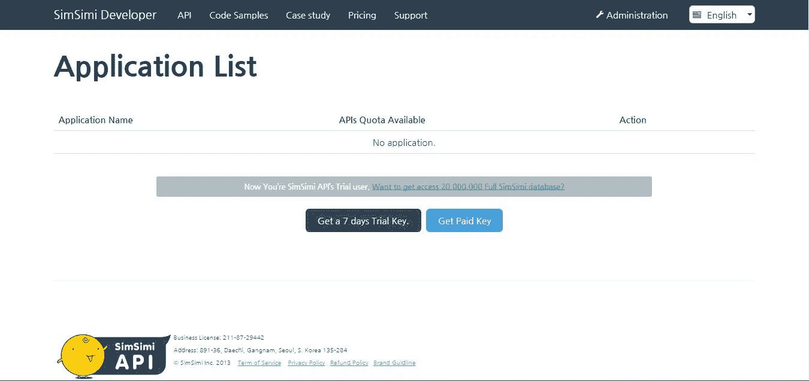
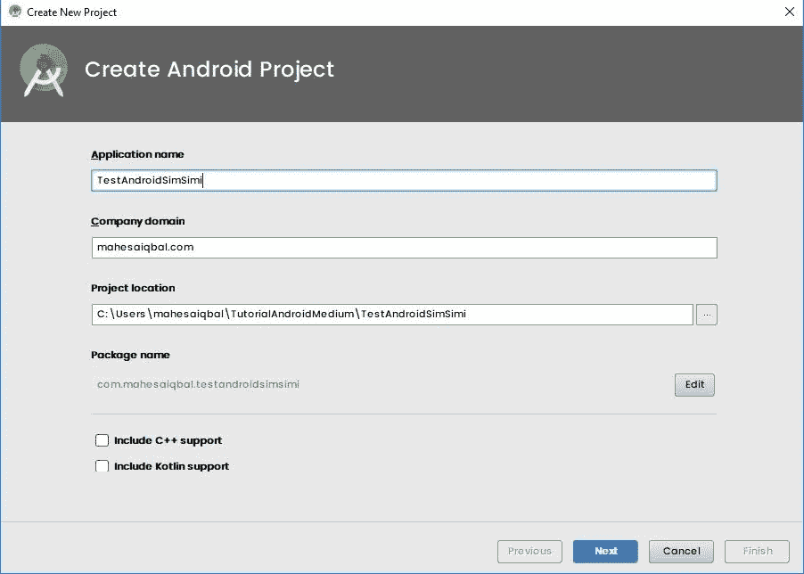
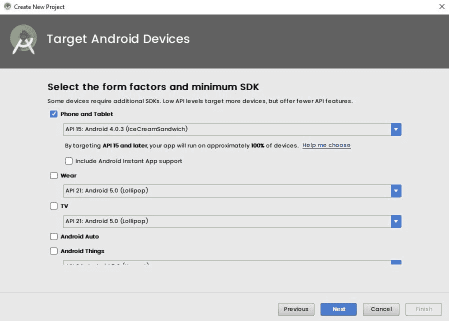
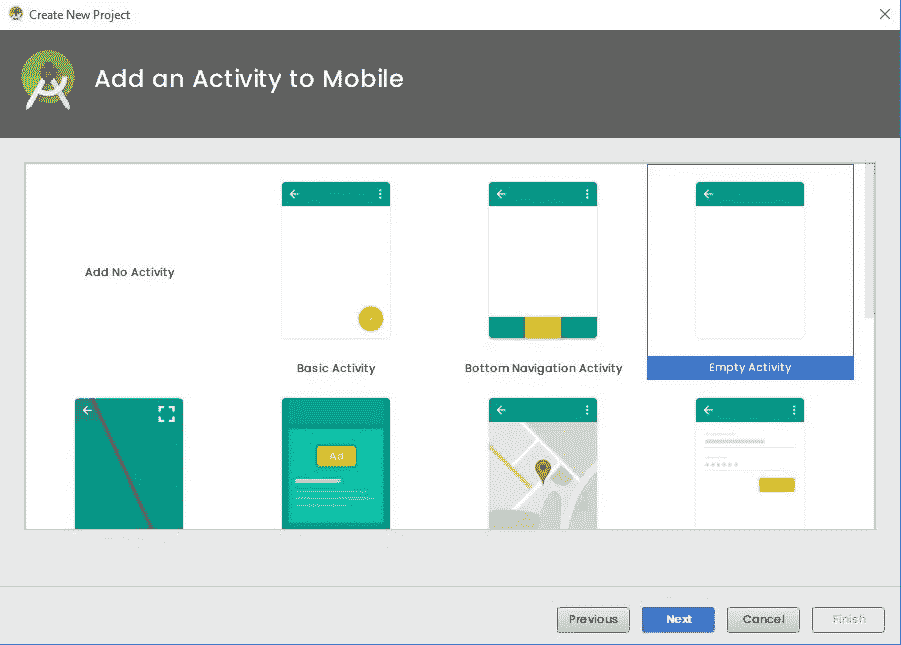
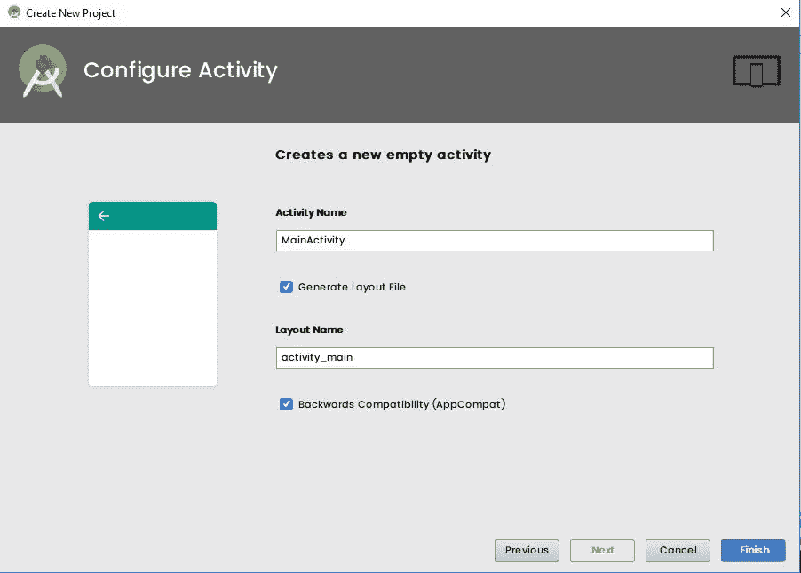
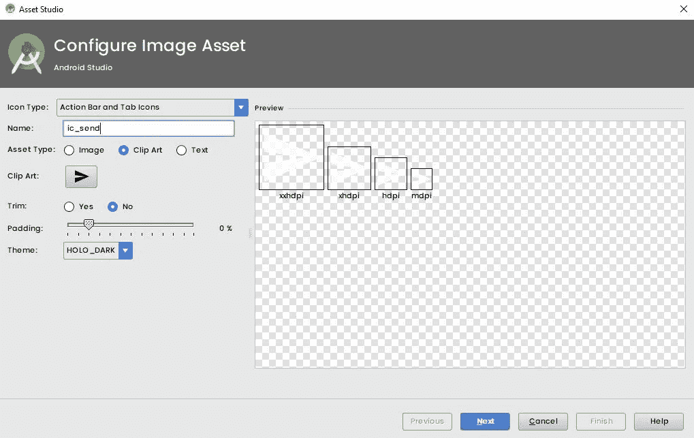
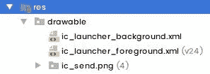
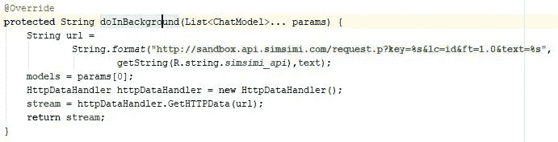
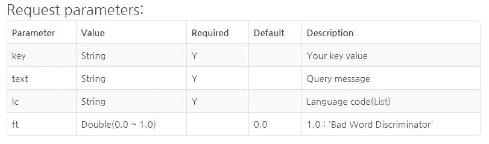
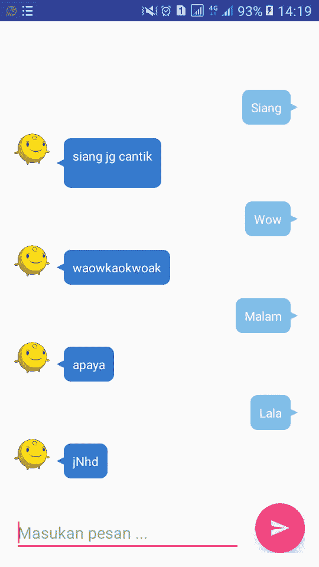

# Membuat Aplikasi ChatBot SimSimi Sederhana Berbasis Android

> 原文：<https://medium.easyread.co/membuat-aplikasi-chatbot-simsimi-sederhana-berbasis-android-76c3a593630f?source=collection_archive---------3----------------------->


SimSimi Wallpaper

*Hello Coders!* pada kesempatan yang amat bagus ini, saya ingin *share* tutorial bagaimana cara membuat Aplikasi ChatBot SimSimi sederhana dengan menggunakan API Key dari situs web **developer SimSimi** .

Okey, pada dasarnya SimSimi itu aplikasi pintar ChatBot yang bisa kita gunakan untuk komunikasi dengan robot otomatis yang sudah tertanam dengan dukungan beberapa bahasa (termasuk bahasa Indonesia).

Untuk para jomblo, ini kabar baik untuk kalian mendapatkan perhatian secara *Realtime* yang bisa kalian buat sendiri di tutorial ini hehe (Just Kidding, bro:D).

Okey langsung kita loncat ke inti dari tutorial ini, pertama-tama kalian harus daftarkan diri ke situs [http://developer.simsimi.com/signUp](http://developer.simsimi.com/signUp) untuk mendapatkan API Key nya. Isi form sesuai kebutuhan untuk mendaftar. Kalau sudah daftar, kalian sudah bisa login dan akan tampil halaman dashboard seperti ini :



Klik “Get a 7 days Trial Key” (Kita gunakan yang gratis saja untuk latihannya hehe). Jika sudah, pilih “View Details/Extra Function Edit”, maka akan muncul API Key siap pakai.


Okey sudah kita buat akun developer SimSimi dan sudah mendapatkan API Keynya, langsung buat proyek baru di Android Studio masing-masing.

Langkah-langkahnya seperti ini :



Klik “Finish” untuk menyelesaikannya.

Tambahkan maven library di build.gradle(Project:TestAndroidSimSimi)

```
allprojects {
    repositories {
        google()
        jcenter()
        **maven {
            url 'https://jitpack.io'
        }**
    }
}
```

Tambahkan beberapa library di build.gradle(Module:app)

```
dependencies {
    ...*//Add library* implementation **'com.android.support:design:26.1.0'** implementation **'com.github.lguipeng:BubbleView:1.0.1'** implementation **'com.google.code.gson:gson:2.8.2'** }
```

Download gambar SimSimi dibawah ini dengan nama simsimi.png


SimSimi

Copy gambar simsimi.png ke folder res/drawable


Klik kanan pada folder res -> New -> Image Asset untuk membuat icon kirim yang dinamakan ic_send.png, maka akan tampil tampilan seperti ini dan ikuti langkahnya :



Klik Next lalu Finish.

Maka akan tampil di struktur proyek kalian seperti ini :



Tambahkan SimSimi API yang kalian dapat di web developer SimSimi ke strings.xml (API Key bernilai unik tiap akun usernya). Letak file di res/values/strings.xml

```
<**resources**>
    <**string name="app_name"**>TestAndroidSimSimi</**string**>
    <**string name="simsimi_api"**>26312360-ce71-45a6-9127-XXXXXXXXXXXX</**string**>
</**resources**>
```

Buka file res/values/styles.xml, ubah style AppTheme parentnya menjadi Theme.AppCompat.Light.NoActionBar seperti dibawah ini :

```
<**resources**>

    *<!-- Base application theme. -->* <**style name="AppTheme" parent="Theme.AppCompat.Light.NoActionBar"**>
        *<!-- Customize your theme here. -->* <**item name="colorPrimary"**>@color/colorPrimary</**item**>
        <**item name="colorPrimaryDark"**>@color/colorPrimaryDark</**item**>
        <**item name="colorAccent"**>@color/colorAccent</**item**>
    </**style**>

</**resources**>
```

Edit acitivity_main.xml menjadi seperti ini

```
*<?***xml version="1.0" encoding="utf-8"***?>* <**RelativeLayout xmlns:android="http://schemas.android.com/apk/res/android"
    xmlns:tools="http://schemas.android.com/tools"
    android:layout_width="match_parent"
    android:layout_height="match_parent"
    android:padding="16dp"
    tools:context="com.mahesaiqbal.testandroidsimsimi.MainActivity"**>

    <**android.support.design.widget.FloatingActionButton
        android:id="@+id/fab_send"
        android:layout_width="wrap_content"
        android:layout_height="wrap_content"
        android:clickable="true"
        android:src="@drawable/ic_send"
        android:tint="@android:color/white"
        android:layout_alignParentBottom="true"
        android:layout_alignParentEnd="true"
        android:layout_alignParentRight="true"** />

    <**ListView
        android:id="@+id/list_of_message"
        android:layout_width="match_parent"
        android:layout_height="match_parent"
        android:layout_alignParentTop="true"
        android:layout_alignParentStart="true"
        android:layout_marginBottom="20dp"
        android:stackFromBottom="true"
        android:transcriptMode="alwaysScroll"
        android:dividerHeight="0dp"
        android:divider="@android:color/transparent"
        android:layout_alignParentLeft="true"
        android:layout_above="@id/fab_send"**/>

    <**EditText
        android:layout_toLeftOf="@id/fab_send"
        android:id="@+id/user_message"
        android:layout_width="match_parent"
        android:layout_height="wrap_content"
        android:layout_alignParentBottom="true"
        android:layout_alignParentStart="true"
        android:layout_alignParentLeft="true"
        android:hint="Masukan pesan ..."
        android:layout_marginRight="16dp"**/>

</**RelativeLayout**>
```

Buat Layout Resource File di folder drawable dengan cara klik kanan folder layout -> new -> layout resource file buat nama filenya menjadi list_item_message_send, selanjutnya klik OK. Jika sudah, beri kodenya seperti ini

```
*<?***xml version="1.0" encoding="utf-8"***?>* <**RelativeLayout xmlns:android="http://schemas.android.com/apk/res/android"
    xmlns:app="http://schemas.android.com/apk/res-auto"
    android:layout_width="match_parent"
    android:layout_height="match_parent"**>

    <**com.github.library.bubbleview.BubbleTextView
        android:id="@+id/text_message"
        android:layout_width="wrap_content"
        android:layout_height="wrap_content"
        android:padding="10dp"
        android:textColor="#ffffff"
        android:layout_alignParentRight="true"
        android:layout_margin="8dp"
        app:arrowWidth="8dp"
        app:arrowHeight="8dp"
        app:angle="8dp"
        app:arrowPosition="14dp"
        app:arrowLocation="right"
        app:arrowCenter="true"
        app:bubbleColor="#7EC0EE"**/>

</**RelativeLayout**>
```

Lakukan hal yang sama pada langkah di atas untuk membuat 1 file lagi dinamakan dengan list_item_message_recv.xml. Beri kodenya seperti ini

```
*<?***xml version="1.0" encoding="utf-8"***?>* <**RelativeLayout xmlns:android="http://schemas.android.com/apk/res/android"
    android:layout_width="match_parent"
    android:layout_height="match_parent"
    xmlns:app="http://schemas.android.com/apk/res-auto"**>

    <**ImageView
        android:id="@+id/simsimi_image"
        android:layout_width="40dp"
        android:layout_height="40dp"
        android:src="@drawable/simsimi"**/>

    <**com.github.library.bubbleview.BubbleTextView
        android:id="@+id/text_message"
        android:layout_width="wrap_content"
        android:layout_height="wrap_content"
        android:padding="10dp"
        android:textColor="#ffffff"
        android:layout_margin="8dp"
        android:layout_toRightOf="@id/simsimi_image"
        app:arrowWidth="8dp"
        app:arrowHeight="8dp"
        app:angle="8dp"
        app:arrowPosition="14dp"
        app:arrowLocation="left"
        app:arrowCenter="true"
        app:bubbleColor="#347ad4"**/>

</**RelativeLayout**>
```

Sekarang buat package model, klik kanan pada package com.yourdomain.testandroidsimsimi -> New -> Package beri nama dengan model. Jika sudah, klik kanan package model -> new -> Java Class beri nama dengan SimSimiModel, klik OK. Beri kode seperti ini

```
**package** com.mahesaiqbal.testandroidsimsimi.model;

*/**
 * Created by mahesaiqbal on 12/27/2017.
 */* **public class** SimSimiModel {

    **public** String **response**;
    **public** String **id**;
    **public int result**;
    **public** String **msg**;

    **public** SimSimiModel(String response, String id, **int** result, String msg) {
        **this**.**response** = response;
        **this**.**id** = id;
        **this**.**result** = result;
        **this**.**msg** = msg;
    }

    **public** SimSimiModel() {
    }

    **public** String getResponse() {
        **return response**;
    }

    **public void** setResponse(String response) {
        **this**.**response** = response;
    }

    **public** String getId() {
        **return id**;
    }

    **public void** setId(String id) {
        **this**.**id** = id;
    }

    **public int** getResult() {
        **return result**;
    }

    **public void** setResult(**int** result) {
        **this**.**result** = result;
    }

    **public** String getMsg() {
        **return msg**;
    }

    **public void** setMsg(String msg) {
        **this**.**msg** = msg;
    }
}
```

Buat file ChatModel pada package model. Ulangi langkah pembuatan Java Class seperti langkah diatas. Beri kodenya seperti ini

```
**package** com.mahesaiqbal.testandroidsimsimi.model;

*/**
 * Created by mahesaiqbal on 12/27/2017.
 */* **public class** ChatModel {
    **public** String **message**;
    **public boolean isSend**;

    **public** ChatModel(String message, **boolean** isSend) {
        **this**.**message** = message;
        **this**.**isSend** = isSend;
    }

    **public** ChatModel() {
    }

    **public** String getMessage() {
        **return message**;
    }

    **public void** setMessage(String message) {
        **this**.**message** = message;
    }

    **public boolean** isSend() {
        **return isSend**;
    }

    **public void** setSend(**boolean** send) {
        **isSend** = send;
    }
}
```

Okey, tadi kita sudah buat package model beserta 2 file Java Class nya (SimSimiModel.java dan ChatModel.java). Sekarang buat package helper yaitu dengan cara yang sudah saya jelaskan disaat membuat package model diatas. Selanjutnya klik kanan package helper dan buat Java Class nya seperti sebelumnya membuat 2 file Java Classnya di package model dengan nama file HttpDataHandler.java. Beri kodenya seperti ini

```
**package** com.mahesaiqbal.testandroidsimsimi.helper;

**import** java.io.BufferedInputStream;
**import** java.io.BufferedReader;
**import** java.io.IOException;
**import** java.io.InputStream;
**import** java.io.InputStreamReader;
**import** java.net.HttpURLConnection;
**import** java.net.MalformedURLException;
**import** java.net.URL;

*/**
 * Created by mahesaiqbal on 12/27/2017.
 */* **public class** HttpDataHandler {
    **static** String *stream*= **null**;

    **public** HttpDataHandler() {
    }

    **public** String GetHTTPData(String urlString)
    {
        **try**{
            URL url = **new** URL(urlString);
            HttpURLConnection urlConnection = (HttpURLConnection)url.openConnection();

            **if**(urlConnection.getResponseCode() == HttpURLConnection.***HTTP_OK***)
            {
                InputStream in = **new** BufferedInputStream(urlConnection.getInputStream());

                BufferedReader r = **new** BufferedReader(**new** InputStreamReader(in));
                StringBuilder sb = **new** StringBuilder();
                String line;
                **while**((line = r.readLine())!=**null**)
                    sb.append(line);
                *stream* = sb.toString();
                urlConnection.disconnect();
            }
        }
        **catch** (MalformedURLException e)
        {
            e.printStackTrace();
        }
        **catch** (IOException e)
        {
            e.printStackTrace();
        }
        **finally** {

        }
        **return** *stream*;
    }
}
```

Tadi kita sudah buat package helper dengan 1 Java Class nya (HttpDataHandler.java). Sekarang buat package lagi untuk adapternya, dengan diberi nama package adapter. Langkahnya sama seperti pembuatan package model dan helper. Dan buat Java Class nya dengan nama CustomAdapter.java, langkahnya sama seperti sebelumnya. Beri kode seperti ini

```
**package** com.mahesaiqbal.testandroidsimsimi.adapter;

**import** android.content.Context;
**import** android.view.LayoutInflater;
**import** android.view.View;
**import** android.view.ViewGroup;
**import** android.widget.BaseAdapter;

**import** com.github.library.bubbleview.BubbleTextView;
**import** com.mahesaiqbal.testandroidsimsimi.R;
**import** com.mahesaiqbal.testandroidsimsimi.model.ChatModel;

**import** java.util.List;

*/**
 * Created by mahesaiqbal on 12/27/2017.
 */* **public class** CustomAdapter **extends** BaseAdapter {

    **private** List<ChatModel> **list_chat_models**;
    **private** Context **context**;
    **private** LayoutInflater **layoutInflater**;

    **public** CustomAdapter(List<ChatModel> list_chat_models, Context context) {
        **this**.**list_chat_models** = list_chat_models;
        **this**.**context** = context;
        **layoutInflater** = (LayoutInflater)context.getSystemService(Context.***LAYOUT_INFLATER_SERVICE***);
    }

    @Override
    **public int** getCount() {
        **return list_chat_models**.size();
    }

    @Override
    **public** Object getItem(**int** position) {
        **return list_chat_models**.get(position);
    }

    @Override
    **public long** getItemId(**int** position) {
        **return** position;
    }

    @Override
    **public** View getView(**int** position, View convertView, ViewGroup parent) {
        View view = convertView;
        **if**(view == **null**)
        {
            **if**(**list_chat_models**.get(position).**isSend**)
                view = **layoutInflater**.inflate(R.layout.***list_item_message_send***,**null**);
            **else** view = **layoutInflater**.inflate(R.layout.***list_item_message_recv***,**null**);

            BubbleTextView text_message = (BubbleTextView)view.findViewById(R.id.***text_message***);
            text_message.setText(**list_chat_models**.get(position).**message**);

        }
        **return** view;
    }
}
```

Okey sudah kita buat package model, helper dan adapter beserta file Java Classnya. Sekarang kita balik lagi ke file MainActivity.java. Beri kodenya seperti ini

```
**package** com.mahesaiqbal.testandroidsimsimi;

**import** android.os.AsyncTask;
**import** android.support.design.widget.FloatingActionButton;
**import** android.support.v7.app.AppCompatActivity;
**import** android.os.Bundle;
**import** android.view.View;
**import** android.widget.EditText;
**import** android.widget.ListView;

**import** com.google.gson.Gson;
**import** com.mahesaiqbal.testandroidsimsimi.adapter.CustomAdapter;
**import** com.mahesaiqbal.testandroidsimsimi.helper.HttpDataHandler;
**import** com.mahesaiqbal.testandroidsimsimi.model.ChatModel;
**import** com.mahesaiqbal.testandroidsimsimi.model.SimSimiModel;

**import** java.util.ArrayList;
**import** java.util.List;

**public class** MainActivity **extends** AppCompatActivity {

    ListView **listView**;
    EditText editText;
    List<ChatModel> **list_chat** = **new** ArrayList<>();
    FloatingActionButton **btn_send_message**;

    @Override
    **protected void** onCreate(Bundle savedInstanceState) {
        **super**.onCreate(savedInstanceState);
        setContentView(R.layout.***activity_main***);

        **listView** = (ListView)findViewById(R.id.***list_of_message***);
        editText = (EditText)findViewById(R.id.***user_message***);
        **btn_send_message** = (FloatingActionButton)findViewById(R.id.***fab_send***);

        **btn_send_message**.setOnClickListener(**new** View.OnClickListener() {
            @Override
            **public void** onClick(View v) {
                String text = editText.getText().toString();
                ChatModel model = **new** ChatModel(text,**true**); *// user send message* **list_chat**.add(model);
                **new** SimSimiAPI().execute(**list_chat**);

                *//remove user message* editText.setText(**""**);
            }
        });
    }

    **private class** SimSimiAPI **extends** AsyncTask<List<ChatModel>,Void,String> {
        String **stream** = **null**;
        List<ChatModel> **models**;
        String **text** = editText.getText().toString();

        @Override
        **protected** String doInBackground(List<ChatModel>... params) {
            String url =
                    String.*format*(**"http://sandbox.api.simsimi.com/request.p?key=%s&lc=id&ft=1.0&text=%s"**,
                            getString(R.string.***simsimi_api***),**text**);
            **models** = params[0];
            HttpDataHandler httpDataHandler = **new** HttpDataHandler();
            **stream** = httpDataHandler.GetHTTPData(url);
            **return stream**;
        }

        @Override
        **protected void** onPostExecute(String s) {
            Gson gson = **new** Gson();
            SimSimiModel response = gson.fromJson(s,SimSimiModel.**class**);

            ChatModel chatModel = **new** ChatModel(response.getResponse(),**false**); *// get response from simsimi* **models**.add(chatModel);
            CustomAdapter adapter = **new** CustomAdapter(**models**,getApplicationContext());
            **listView**.setAdapter(adapter);
        }
    }
}
```

Okey sudah kita buat kode untuk MainActivity.java. Sekarang saya minta untuk memperhatikan beberapa kode dari file MainActivity.java.



Lihat potongan kode diatas, kalian lihat “… lc=id …” ? Artiannya adalah Language Code di set dengan bahasa id yaitu Indonesia. Jadi ini adalah alasan kenapa saya buat aplikasi Android SimSimi chat sederhana support bahasa Indonesia. Lalu untuk R.String.simsimi_api adalah dimana saya menyimpan API Key di file strings.xml dengan string name simsimi_api maka secara otomatis API Key yang kita set di file strings.xml akan kepanggil sebagai parameter dari method getString().



[http://developer.simsimi.com/api](http://developer.simsimi.com/api)

Jangan lupa untuk menambahkan akses internet pada manifest kalian. Dengan cara buka folder manifest -> AndroidManifest.xml. Seperti ini

```
*<?***xml version="1.0" encoding="utf-8"***?>* <**manifest xmlns:android="http://schemas.android.com/apk/res/android"
    package="com.mahesaiqbal.testandroidsimsimi"**>

    **<uses-permission android:name="android.permission.INTERNET" />**

    <**application
        android:allowBackup="true"
        android:icon="@mipmap/ic_launcher"
        android:label="@string/app_name"
        android:roundIcon="@mipmap/ic_launcher_round"
        android:supportsRtl="true"
        android:theme="@style/AppTheme"**>
        <**activity android:name=".MainActivity"**>
            <**intent-filter**>
                <**action android:name="android.intent.action.MAIN"** />

                <**category android:name="android.intent.category.LAUNCHER"** />
            </**intent-filter**>
        </**activity**>
    </**application**>

</**manifest**>
```

Sekarang jalankan “Run” kodenya dan tunggu gradle memproses pembangunan aplikasinya. Maka hasilnya akan seperti di bawah ini



Github : [https://github.com/mahesaiqbal/TestAndroidSimSimi](https://github.com/mahesaiqbal/TestAndroidSimSimi)

Sekian dari saya, apabila dalam penulisan ada kesalahan mohon dimaafkan. Terima kasih :D

*Salam Coders!*