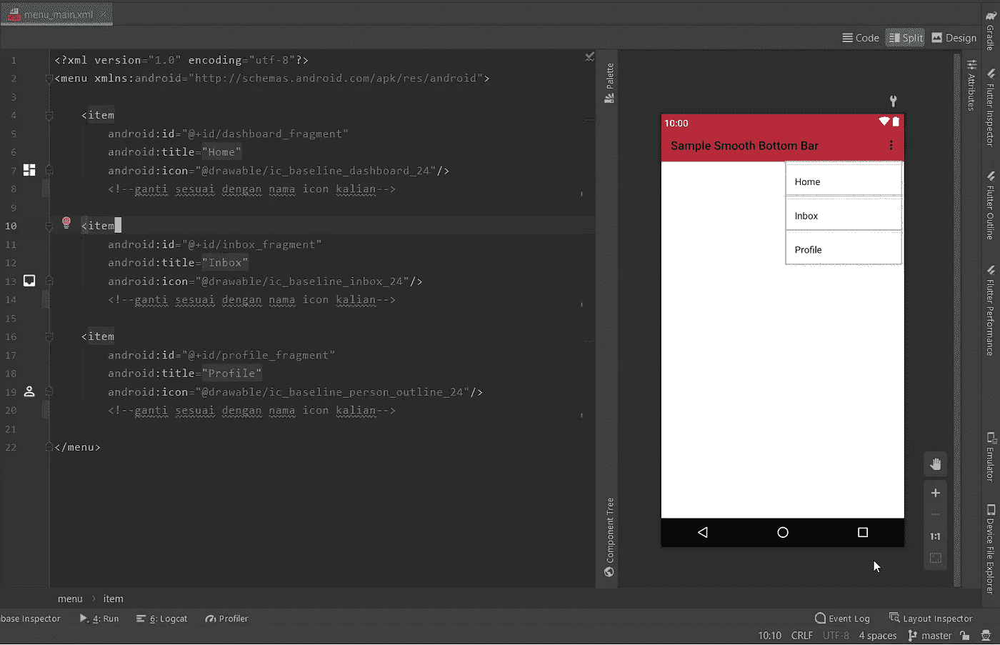

# Membuat Bottom Bar Keren di Android dengan Smooth Bottom Bar

> 原文：<https://medium.easyread.co/membuat-bottom-bar-keren-di-android-dengan-smooth-bottom-bar-e0f360bf61d0?source=collection_archive---------0----------------------->

## Bagaimana implementasi Smooth Bottom Bar untuk membuat Bottom Bar yang keren di Android?


Halo semuanya.. Yuk lanjut lagi ya, kali ini kita akan mencoba membuat Bottom Bar yang keren menggunakan library [**Smooth Bottom Bar**](https://github.com/ibrahimsn98/SmoothBottomBar) , tentunya dengan menggunakan kotlin. Bisa banget *loh* , jika kalian ingin mencoba mengimplementasikan ni ke aplikasi kalian yang sudah jadi. *Udah ga sabar kan, yukk!*

# Smooth Bottom Bar


Preview Smooth Bottom Bar from [https://github.com/ibrahimsn98/SmoothBottomBar](https://github.com/ibrahimsn98/SmoothBottomBar)

## Step by Step

1.  Buatlah sebuah *project* baru di Android Studio.
2.  Tambahkan beberapa dependensi tambahan dan lakukan *sync.*
3.  Buatlah 3 fragment baru ( *boleh 3–5 sesuai kebutuhan* )
4.  Membuat direktori *resource* menu dan navigation di folder res.
5.  Membuat menu *resource* file.
6.  Membuat navigation *resource* file.
7.  ***Lets Code!***

Untuk lebih jelasnya mari kita praktekkan.

## Practice

Langkah pertama adalah membuat dulu *project* baru di Android Studio kalian lalu tambahkan dependensi tambahan dan lakukan **Synchronize** .

```
//Navigation Architecture Component
**implementation "androidx.navigation:navigation-fragment-ktx:2.3.3"
implementation "androidx.navigation:navigation-ui-ktx:2.3.3"**//Smooth Bottom Bar
**implementation 'com.github.ibrahimsn98:SmoothBottomBar:1.7.6'**
```

Sehingga depenencies di **build.gradle** menjadi seperti berikut.


Lanjut, sekarang buatlah 3 *fragment* baru yaitu *DashboardFragment* , *InboxFragment* , dan *ProfileFragment* dengan cara klik kanan pada **package name project** ➡ **New** ➡ **Fragment** ➡ **Fragment (Blank).**


Langkah selanjutnya adalah membuat **Android Resource Directory** baru yaitu ***navigation*** dan ***menu*** , caranya klik kanan **res** ➡ **New** ➡ **Android Resource Directory.**


*Resource type* kalian pilih **navigation** , ulangi cara tadi dan buat juga untuk **menu** nya.

Setelah selesai, buatlah *resource* file pada Android Resource Directory yang sudah kalian buat tadi. Untuk menu buat file dengan nama `**menu_main**` , lalu untuk navigation buat juga file dengan nama `**nav_graph**` .


Contoh folder res

Jika sudah maka didalam folder res kurang lebih akan sepeti contoh.

Persiapan sudah selesai, saatnya kita mulai coding. 🔥


gfycat.com

**1\. Mulai dari** `**menu_main.xml**`

*Error ya?* hehe maaf ada yang kelupaan, yaitu icon untuk bottom navigation barnya. Oke kita siapkan dulu. Caranya masuk **res** ➡ klik kanan pada **drawable** ➡ **New** ➡ **Vector Asset** ➡ pada **Clip Art** , klik **icon** nya dan cari dan buat icon “ `**dashboard**` , `**inbox**` , dan `**person_outline**` ” dan bisa dilihat sudah tidak error lagi.



**2** . **Lanjut ke file** `**nav_graph.xml**`


**3\. Kita masuk ke tampilan layoutnya dulu** `**activity_main.xml**`

Untuk layout Fragment hampir sama cuma beda di `**android:text=”Text Here"**`

**4\. Masuk ke Activity dan Fragment** `**MainActiviy.kt**`

Untuk Fragment *Dashboard* , *Inbox* , dan *Profile* baru yang sudah dibuat, hapus beberapa variable dan fungsi sehingga menyisahkan baris kode sepeti berikut.

dari yang awalnya

Sampai di sini aplikasi sudah bisa dijalankan.

## Output


## Last Words

Sampai disini seharunya aplikasi sudah berjalan dengan baik, dan tentunya keren bukan. Untuk dokumentasi lengkap dari library yang digunakan pada project kali ini bisa kalian cek di: [**Smooth Bottom Bar**](https://github.com/ibrahimsn98/SmoothBottomBar) dan [**Navigation component**](https://developer.android.com/guide/navigation/navigation-getting-started)

Untuk full project sample ini ada di GitHub saya

[](https://github.com/FiqSky/sample-smooth-bottom-bar) [## FiqSky/sample-smooth-bottom-bar

### Contribute to FiqSky/sample-smooth-bottom-bar development by creating an account on GitHub.

github.com](https://github.com/FiqSky/sample-smooth-bottom-bar) 

Oke deh, mungkin sampai disini dulu, Terima Kasih. 😊
Semoga bermanfaat dan sampai ketemu di tulisan berikutnya. 👋