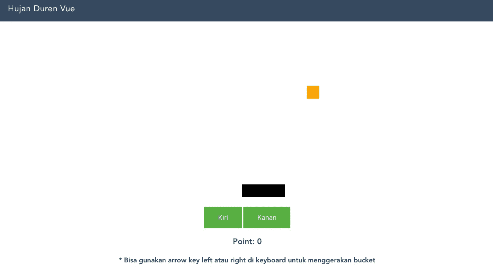

# Membuat Game Dengan Vuejs

> 原文：<https://medium.easyread.co/membuat-game-dengan-vuejs-hujan-duren-the-game-c7d5ea886132?source=collection_archive---------6----------------------->

## Hujan Duren The Game


Hujan Duren The Game

Kalau lagi belajar ngoding, kita pasti pernah kepikiran pengen banget bisa bikin game, *kan* ? Pasti. Saya juga merasakan hal tersebut, pengen banget bisa bikin game, paling tidak sebuah game yang sederhana. *Nah* , entah karena alasan kita gak mampu (sebenarnya) atau gak ada waktu, gak jadi-jadi *deh* bikin gamenya.

Kalau ngomongin game *sih* , pastinya yang pertama kali kepikir adalah game PS, xbox, PC, macam PES, GTA dan sebagainya. Kebayang mau buat game kayak gituan udah bikin kita nyerah duluan karena gak sudah terlebih dahulu memikirkan bagaimana dan berapa lama waktu yang dibutuhkan untuk membuat game seperti itu. Tetapi pernah tidak kepikiran untuk membuat game di yang jalan di sebuah *website* ?

*Nah* di tulisan ini saya akan membagikan bagaimana cara membuat game di *website* dengan menggunakan vuejs. Gamenya gak usah yang berat-berat, yang sederhana saja. Nama gamenya **Hujan Duren.**

**Gameplay** nya seperti ini:
- Akan ada duren yang berwarna *orange* ( *harusnya jeruk ya* ? 😅).
- Akan ada *bucket* atau keranjang yang digunakan untuk menangkap duren yang jatuh.
- Ketika duren jatuh di atas *bucket* maka point akan bertambah satu, jika tidak maka tidak mendapatkan point.
- Untuk menggerakan *bucket* bisa menggunakan *arrow* key kiri dan kanan, atau bisa juga dengan mengklik tombol kiri dan kanan yang berwarna hijau.
- Permainan langsung di mulai ketika *website* diakses.
- Untuk gameover nya tidak ada. Jadi bisa main terus sampai point nya infinity.



Hujan Duren The Game

Untuk demonya bisa di lihat [disini](https://hujan-duren.firebaseapp.com/#/) . Dan untuk *full source code* bisa di [download disini](http://eepurl.com/dqG9p9) .

 [## hujan-duren

### Edit description

hujan-duren.firebaseapp.com](https://hujan-duren.firebaseapp.com/#/) 

Oke, kita mulai aja bagaimana cara membuat game nya.

**Hal-hal diperlukan** sebelum masuk ke kodingannya ialah:
- Nodejs + npm / yarn.
- Vue cli `**npm install -g vue-cli**`

Kita mulai dengan create project vue dengan vue cli. Commandnya :

```
$ vue init webpack hujan-duren
```

Nanti akan muncul pertanyaan soal *config* awal *project* dan pilih ***yes*** aja terus. Ada satu *package* tambahan yang diperlukan agar bisa menggunakan key yaitu `**vue-shortkey**` . Silahkan install:

```
$ npm install vue-shortkey
```

Buka *project* nya di text editor. Pastikan sudah memiliki struktur direktori seperti ini.


> **Note** : Saya tidak akan menjelaskan secara mendetail tentang kode dasar vue js. Jadi kalau ada yang bingung, sebaiknya anda belajar dulu dasar vue js di situs resminya yang dokumentasi nya sudah luar biasa keren.

Ketika ngoding dengan vue cli, fokus kita hanya di direktori `/src` .


**Assets** adalah direktory tempat kita menyimpan *file-file static* seperti gambar dan css.

**Components** adalah tempat kita menyimpan semua *file component* yang berekstensi `.vue` .

**Router** adalah folder tempat kita mengkonfigurasi *client side routing* di vue. tapi sebenernya kita gak butuh ini. tapi karena sudah di *install* saat *create project* pertama maka foldernya ada.

**App.vue** adalah *component* utama Vue app nya.

**main.js** adalah file dimana Vuejs di *instance* , bisa juga jadi tempat ngumpulin semua config awal. karena di file inilah vuejs di jalankan.

Buka file **main.js,** `vue-shortkey` nya di use, ubah file **main.js** jadi seperti di bawah ini.

buat component baru dengan nama **Home.vue,** di direktori `/components` dan isi dengan kode di bawah ini.

Gameplay component in Hujan Duren The Game

Ada empat hal utama yang ada di kode ini, yaitu **duren , bucket dan button kiri dan kanan.** Empat hal itu yang memainkan peran penting dalam game ini. Kalau kamu perhatikan kodenya dengan seksama pasti ngerti bagaimana jalan kode nya.

Ketika *website* pertama kali di akses maka `mounted ()` akan tereksekusi karena ini adalah salah satu *lifecycle* nya vue js yang di ekseksui ketika component pertama kali di load.

Apa yang di lakukan ketika di `mounted()` , kita **tentukan posisi durennya** nanti akan muncul dimana. dan muncul nya **dengan random** menggunakan method `durianPosition()` .

Setelah posisi durian sudah dapat, lalu langsung jalankan method `durianFall()` . untuk **membuat durian nya jatuh** .

Ketika durian jatuh bagaimana cara kerjanya ? di dalam method `durianFall()` bisa kita lihat ada `setInterval()` yaitu module function punya javacsript yang fungsi adalah untuk menjalankan kode dalam interval yang di tentukan.

Callback atau isi dari `setInterval` nya adalah **memindahkan posisi durennya semakin jauh dari atas** dengan menambahkan nilai top pada attribute style nya duren.

Sambil melakukan pengecekan jika posisi durennya **sudah sampai di bawah maka interval nya di berhentiin dan mengulang dari atas lagi** .

Serta lakukan **pengecekan apakah posisi duren sudah berada di atas atau mengenai bucket nya** dengan method `getDuren()` . Jika memenuhi kondisinya maka **point nya di tambah 1** .

Untuk **bergeser ke kiri dan kanan-nya** dengan method `moveLeft()` dan `moveRight()` yang mana isinya adalah mengurangi dan menambah attribute style `margin-left` untuk memindahkan posisi bucket nya.

Mungkin itu aja penjelasan singkat nya? Ingin tahu lebih jauh? Silahkan berikan repson nya di kolom response di bawah!

*Jika anda merasa artikel ini menarik dan bermanfaat, silahkan* ***berikan claps*** *👏 👏 sebanyak-sebanyaknya dan* ***bagikan*** *ke lingkaran pertemanan anda, agar mereka dapat membaca artikel ini. Dan jangan lupa* [***follow saya di medium***](https://medium.com/@haidarafifmaulana) *untuk terus dapatkan tulisan seperti ini setiap minggunya.*