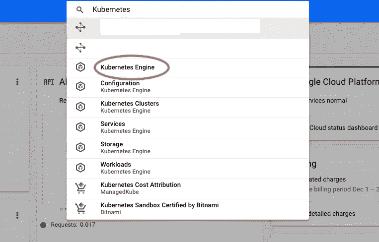

# Membuat Kubernetes Cluster di Google Cloud

> 原文：<https://medium.easyread.co/membuat-kubernetes-cluster-di-google-cloud-ae14bee317ba?source=collection_archive---------4----------------------->

## Part 2 dari Project [Kube-Xmas Series](https://medium.com/easyread/christmas-tale-of-sofware-engineer-project-kube-xmas-9167ebca70d2)


Photo by [Eric Perez](https://unsplash.com/@neverinfocus?utm_source=medium&utm_medium=referral) on [Unsplash](https://unsplash.com?utm_source=medium&utm_medium=referral)

Haloo... Pada part 2 di Project Kube-Xmas Series ini, saya akan menjelaskan bagaimana cara membuat *Kubernetes Cluster* di *Google Cloud* serta melakukan *setup* beberapa hal penting yang perlu dilakukan sebelum bekerja lebih lanjut.

Karena proses ini cukup lama dan banyak *buzzword* aneh, maka saya akan menjelaskan sedikit teori singkat *Kubernetes* , sembari kita menunggu prosessnya selesai.

*Kubernetes* adalah *project open source* yang memudahkan kita untuk automasi *deployment* , *scaling* , dan *management* (mengatur) *containerized application* (aplikasi yang terkontainerisasi). *Well* , saya tidak akan terlalu deskriptif, karena saya berharap ini akan menjadi *practical-articles* bukan artikel membosankan yang membahas tentang teori :D

Jadi dalam serial artikel ini, akan ada buzzword seperti:

*   ***Node***
    *Node* adalah server fisik kita yang aktif. Jika menggunakan VPS maka *Node* adalah vps tersebut. Jika menggunakan bare-metal, maka *Node* adalah server bare-metal kita tersebut.
*   ***Cluster***
    Jadi menurut pemahaman saya :D. **pemahaman saya yaa guys, jika salah tolong di ralat :D* *Cluster* itu seperti kotak, atau bungkus sebuah *environment* yang didalamnya banyak terdapat aplikasi atau sistem atau *service* yang berjalan dan semua bisa berinteraksi satu sama lain.
    *Cluster* kita bisa berjalan di multiple nodes, tergantung seberapa banyak nodes yang kita gunakan ketika membuat *cluster* kita.
*   ***Pod***
    *Pod* adalah salah satu *object* yang ada di dalam *cluster* . Dan didalam *pod* , akan terdapat aplikasi kita yang telah *running* didalam *docker-container* .
*   Mungkin akan banyak lagi *buzzword* , arti spesifiknya bisa dicari tahu di dokumentasi resmi *Kubernetes* :D

## Create Project and Enable Billing

Pertama kalinya, tentunya adalah kita harus memiliki email, dan membuat *project* di *google cloud*

Untungnya Google memberikan kredit gratis $300 untuk user baru. Sehingga untuk *project* ini, saya akan menggunakan kredit $300 tersebut. Jika nantinya kreditnya habis mungkin aplikasinya tidak akan dapat diakses, tapi saya berharap, semua yang saya tulis cukup jelas tanpa harus melihat hasil akhirnya :D

Untuk mendapatkan kredit $300nya, yang perlu kita lakukan hanya mengaktifkannya, mungkin sedikit ribet diawal, tetapi ikuti saja haha :D

Jika sudah aktif, anda akan melihat kredit anda di billing anda.

## Install `gcloud` di Local PC

*Nah,* selanjutnya kita *install gcloud SDK* di laptop(PC) kita. Agar mempermudah semua proses yang akan kita lakukan. Tutorial lengkapnya sudah ada di documentasi *Google Cloud* [disini](https://cloud.google.com/sdk/docs/initializing)

Selanjutnya, jangan lupa juga agar *install component* yang dibutuhkan seperti `kubectl`

```
$ gcloud components install kubectl
```

## Create Configuration gcloud

Selanjutnya hanya masalah konfigurasi, dan jangan lupa menambahkan *compute zone* . Di *project* ini saya memilih `**asia-southeast1-a**`

```
$ gcloud config configurations create kube-xmas
$ gcloud config configurations activate kube-xmas
$ gcloud config set compute/zone asia-southeast1-a
$ gcloud init
# follow all the process pilih re-initialize
$ gcloud config configurations describe kube-xmasis_active: true
name: kube-xmas
properties:
  compute:
    zone: asia-southeast1-a
  core:
    account: [xxxxx@gmail.com](mailto:bxcodec@gmail.com)
    project: kube-xmas
```

## Enable Kubernetes API

Selanjutnya adalah meng- *enable Kubernetes* API sehingga bisa kita gunakan. Untuk mengaktifkannya cukup pergi ke Google *cloud* *console* dan cari *Kubernetes Engine* . Seharusnya dengan anda mengklik *Kubernetes Engine* di *Google Console* , maka API *Kubernetes* seharusnya sudah aktif dan dapat digunakan lewat gcloud SDK



## Create Cluster

Selanjutnya kita dapat membuat *cluster Kubernetes* kita. Untuk artikel ini, saya hanya akan menggunakan *command* terminal dari gcloud. Namun sebaiknya anda *explore* sendiri juga :D

```
$ gcloud container clusters create kube-xmas-staging --num-nodes=1
```

Saya hanya menggunakan 1 node untuk cluster saya.


Succeed

Seharusnya, setelah selesai, ketika anda mengetik *command* ini, akan muncul list pods yang sedang aktif di cluster kita

```
$ kubectl get pods --all-namespaces
```


Yayyy!! *Kubernetes cluster* kita telah selesai.

Sampai disini, next stepnya adalah mengatur Ingress controller pada cluster yang telah saya buat.

## Next

*   [**Setting NGINX Ingress Controller di Kubernetes Google Cloud**](https://medium.com/easyread/setting-nginx-ingress-controller-di-kubernetes-google-cloud-10f2c9c0be16)

## Prev

*   [**Sample Project and Plan**](https://medium.com/easyread/christmas-tale-of-sofware-engineer-project-kube-xmas-9167ebca70d2)