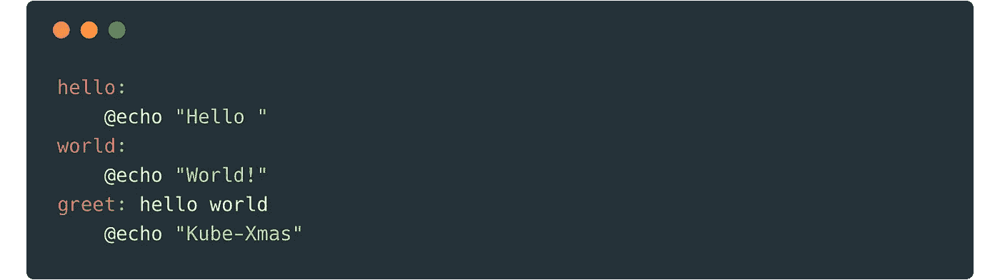
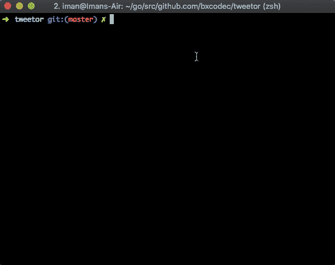
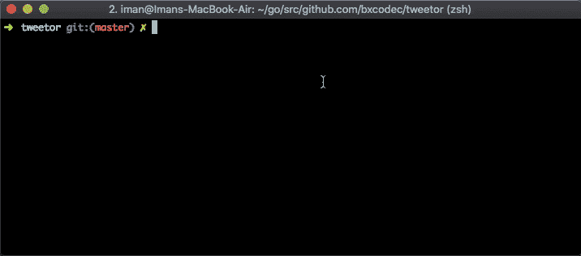

# Membuat Makefile untuk Aplikasi Golang

> 原文：<https://medium.easyread.co/membuat-makefile-untuk-aplikasi-golang-5c2d19122b13?source=collection_archive---------1----------------------->

## Part 7 dari Project [Kube-Xmas Series](https://medium.com/easyread/christmas-tale-of-sofware-engineer-project-kube-xmas-9167ebca70d2)


Photo by [SwapnIl Dwivedi](https://unsplash.com/@momentance?utm_source=medium&utm_medium=referral) on [Unsplash](https://unsplash.com?utm_source=medium&utm_medium=referral)

Helloo kembali lagi dengan saya hehehehehe :D. Di artikel ini adalah sedikit bonus chapter hehe dari series [Kube-Xmas](https://medium.com/easyread/christmas-tale-of-sofware-engineer-project-kube-xmas-9167ebca70d2) . Jika ada teman-teman yang mengikuti tahapan project [Kube-Xmas](https://medium.com/easyread/christmas-tale-of-sofware-engineer-project-kube-xmas-9167ebca70d2) ini dari awal. Maka teman-teman sudah meliha betapa banyaknya command yang perlu diingat dan dijalankan, dimulai dari `go build` , `dep ensure` , `go test` , `dokcer build` , `docker push` , `docker-compose up` , `kubectl apply` , dsb.

So, inti dari artikel berikut ini adalah, mem-percantik semua prosess yang kita lakukan diatas dalam satu script yang bisa digunakan, dan kalau perlu kita seragamkan saja hehe.

Tujuan pembuatan makefile ini awalnya adalah untuk script automation development. Mungkin untuk otomasi, teman-teman biasanya menggunakan Bash Script atau Shell Script, namun, apalah daya, saya tidak terlalu paham betul syntax script shell/bash.

Saya hanya mengerti Makefile, sehingga saya menggunakan Makefile untuk project Golang saya. Nah sebelum bergerak jauh, saya akan sedikit menjelaskan apa itu Makefile, dan cara penggunaannya, dan implementasinya pada project [Kube-Xmas](https://medium.com/easyread/christmas-tale-of-sofware-engineer-project-kube-xmas-9167ebca70d2)

## What is Makefile?



Makefile adalah kumpulan script yang akan di-eksekusi oleh command `make` . `make` merupakan automation-tools yang diciptakan di Unix-type OS. Jadi jika OS anda merupakan satu clan dengan Unix (Linux, MacOS) maka command ini seharusnya ada.

Konsepnya sederhana, kita hanya perlu define beberapa command dan prosess yang akan dilakukan didalam Makefile. Selanjutnya kita tinggal memanggil script tersebut dengan command `make`

Contohnya adalah semisal kita memiliki `Makefile` dengan isi seperti gambar diatas, jika saya jalankan akan tampak seperti gif dibawah.



Nah, saya tidak akan banyak penjelasan di penggunaan makefile ini. Karena ini sesuatu hal yang hanya dapat dipelajari dengan belajar sendiri, *Alah bisa Karena Biasa* :D

Buat yang penasaran lebih dalam soal command `make` dan `Makefile` dapat bereferensi ke sini: [https://www.gnu.org/software/make/manual/make.html](https://www.gnu.org/software/make/manual/make.html) (mamam tuh dokumentasi 😈)

## Makefile for Go

**Semua hasil project explorasi ini dapat di-akses direpo github saya:* [*https://github.com/bxcodec/tweetor*](https://github.com/bxcodec/tweetor)

Untuk aplikasi Tweetor saya di Project [Kube-Xmas](https://medium.com/easyread/christmas-tale-of-sofware-engineer-project-kube-xmas-9167ebca70d2) , saya menggunakan Makefile yang tidak terlalu rumit. Saya buat yang simple sesimple-simplenya :D

Nah simple saja. Jika dilihat diatas, tidak ada command aneh. Karena semua perintahnya cukup descriptif.

```
$ make test # menjalankan test pada aplikasi golang saya
$ make vendor-prepare # meng-install golang dep di local saya
$ make vendor # menjalankan command dep ensure -v untuk install deps
$ make engine # mem-build aplikasi golang saya menjadi binary engine
$ make run # menjalankan aplikasi saya di local
$ make stop # menghentikan aplikasi saya yang telah jalan
$ make docker # men-dockerized aplikasi yang saya buat
$ dan selanjutnya
```

Kecuali untuk `.PHONY` , ini adalah seperti sebuah indikator yang menyatakan bahwa yang terdaftar di `.PHONY` adalah hanya sebuah command. Perlu diketahui juga, command `make` juga akan membaca file.

Contoh nyatanya adalah pada Makefile di aplikasi Tweetor yang saya buat, jika teman-teman melihat perintah `vendor` , maka perintah tersebut adalah untuk meng-install dependencies pada aplikasi kita. Namun jika kita tidak menambahkan `vendor` pada `.PHONY` , perintah tersebut tidak akan dapat di-eksekusi oleh make. Ini terjadi karena, di root project folder kita telah terdapat folder vendor.

Idealnya, command `make` akan membuat file di folder dia dijalankan, namun karena kita tidak membuat file vendor, maka kita harus menambahkan dia menjadi . `PHONY` . **Sedikit susah menjelaskan dengan kata-kata. Coba praktikan saja langsung, di project Tweetor saya, pertama kali setelah clone project jalankan* `*make vendor*` *, lalu hapus* `*vendor*` *dari* `*.PHONY*` *di* `*Makefile*` *, dan jalankan command* `*make vendor*` *sekali lagi dan ambil kesimpulannya sendiri :D*

## Running the Application

Nah, ketika saya ingin menjalankan aplikasi saya dilocal, sekarang saya tinggal menjalankan command berikut. Dan sudah itu saja :D.

```
$ make run
```

Saat `make run` dieksekusi, proses yang terjadi adalah:

*   `make` akan menjalankan perintah `docker` terlebih dahulu.

```
run: docker 
     @docker-compose up -d
```

Jadi ketika meng-eksekusi perintah `run` diatas, oleh command `make` dia akan pertama kali melihat ke-perintah `docker` terlebih dahulu.

Simplenya, sebelum menjalankan `run` command `make` harus menjalankan perintah `docker` yang berisi script untuk membuat docker image dari aplikasi kita.

```
docker: 
  @docker build . -t bxcodec/tweetor
```

Sehingga ketika dijalankan, pertama, kita akan otomatis membuat imagenya oleh `make` kemudian dijalankan menggunakan command `docker-compose` .



## Mengapa ini penting?

Berlandas pada 12 Faktor app (dapat kamu baca [disini](https://12factor.net/) atau [disini](https://medium.com/easyread/today-i-learned-series-twelve-factor-app-af28b0d3fd45) terdapat satu faktor dari suatu aplikasi yang harus dimiliki agar menjadikan aplikasi tersebut baik yaitu: *“Admin processes: Run admin/management tasks as one-off processes”*

Segala hal tahapan diatas, bisa diotomasi jadi satu proses, yaitu dengan menggunakan Makefile (atau shell script, bash script). Kita tidak perlu mengigat semua command setiap tools yang kita pakai, karena kita sudah define sendiri.

Selain itu, dengan menggunakan Makefile seperti ini, lebih intuitive kepada engineer, khususnya engineer pemula yang belum tahu segala jenis command seperti `docker build` , `docker-compose` , dsb. Sehingga dengan menggunakan `Makefile` ini, kita hanya bilang kepadanya dengan menjalankan command `make run` dilaptopnya, dan aplikasi akan jalan dilocalnya.

Demikian untuk part ini, selanjutnya saya akan mendeploy aplikasi tweetor saya ke Kubernetes lansung. Sehingga APInya sudah real dan dapat di-akses frontend-engineer, tidak lagi melalui mock-server

## Next

*   [**Final Chapter: Men- *deploy* Aplikasi Golang ke *Kubernetes***](https://medium.com/easyread/men-deploy-aplikasi-golang-ke-kubernetes-6c91c67f35b5)

## Prev

*   [**Membuat Development Environtment Aplikasi Golang dengan Docker Compose**](https://medium.com/easyread/membuat-development-environtment-aplikasi-golang-dengan-docker-compose-4e96542c19ea)