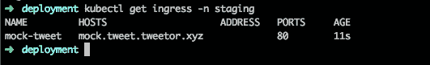

# Membuat Mock Server dengan OpenAPI 3 di Kubernetes

> 原文：<https://medium.easyread.co/membuat-mock-server-dengan-openapi-3-di-kubernetes-b9963ed2ac40?source=collection_archive---------7----------------------->

## Part 4 dari Project [Kube-Xmas Series](https://medium.com/easyread/christmas-tale-of-sofware-engineer-project-kube-xmas-9167ebca70d2)


Photo by [Zhen Hu](https://unsplash.com/@zhenhu2424?utm_source=medium&utm_medium=referral) on [Unsplash](https://unsplash.com?utm_source=medium&utm_medium=referral)

Halooo... Kembali lagi dengan [saya](https://medium.com/@imantumorang) , semoga tidak bosan dengan series ini 😃 *Nah,* di seri kali ini, saya akan membahas tentang pembuatan Mock API server menggunakan OpenAPI 3 :D

Terimakasih kepada [danielgtaylor](https://github.com/danielgtaylor) / [apisprout](https://github.com/danielgtaylor/apisprout) 😃. Saya menggunakan *docker image* yang dia buat untuk membantu saya membuat *mock server* . Hanya dengan menyediakan `openapi.yaml` mock saya langsung dirender olehnya menjadi container. Sesimple itu 😎

*Nah* , untuk melakukannya, saya membuat satu `Dockerfile` yang akan membuat image *docker container* baru dengan base dari image `apisprout`

```
FROM danielgtaylor/apisproutADD docs/openapi.yaml /data/openapi.yaml
```

Dan selanjutnya mem-build *docker image* dari situ dan *push* ke docker container registry.

```
$ docker build . -t bxcodec/mock-tweet -f DockerfileMockTweet$ docker push bxcodec/mock-tweet:latest
```

**Saya menggunakan docker-hub public repository sebagai container-registry saya, namun untuk kebutuhan pribadi, saya biasanya menggunakan google GCR sebagai container registry private saya :D*

Selanjutnya tambahkan *deployment* ke dalam *kubernetes* kita, agar *mock server* kita aktif dan dapat diakses oleh *frontend engineer* :D

## **Apply Deployment**

Untuk men- *deploy container mock* API kita, pertama kita akan *setup* konfigurasi dari *kubernetes deployment* kita.

Saya sudah membuatnya disini, untuk jelasnya tentang syntax ini, akan saya jelaskan nanti kalau sempat :D, atau mungkin di lain artikel yang bukan bagian dari part seri Project Kube-Xmas ini.

Simplenya, jika ingin membuat mock-server jika belum tahu apa-apa, tinggal rename kata-kata yang ada di konfig dibawah sesuai kebutuhan :D.

Selanjutnya, kita hanya tinggal meng- *apply deployment script* tersebut ke *Kubernetes cluster* kita dengan *command* :

```
$ kubectl apply -f mock-tweet-deployment.yaml
```

Dengan begini, aplikasi mock yang saya buat akan berhasil di deploy ke kubernetes cluster yang telah saya buat dari awal, Kube-Xmas.

```
$ kubectl get pods -n staging
```

Akan menampilkan hasil berikut:


Akan muncul pod dengan nama: `mock-tweet-random-key` dan statusnya.
**Ready 1/1:** Artinya terdapat 1 pod yang aktif dari 1 pod yang tersedia. Enaknya di *kubernetes* , kita bisa *running* banyak pods dengan satu aplikasi yang sejenis dengan *service horizontal autoscaling.*

Jika pada pods terjadi masalah, maka pods akan te- *restart* terus menerus sampai kita menyelesaikan masalah tersebut.

Dan untuk mengecek *deployment* dapat dilakukan dengan:

```
$ kubectl get deployments -n staging
```


*Nah, deployment* ini bertugas akan memastikan pod yang ditanggung jawabi agar selalu *available* . Sehingga jika suatu pods mati, *deployment* ini akan membuat pods baru di cluster tersebut.

## **Apply Ingress**

Selanjutnya kita tambahkan *Ingress Configuration* kita agar *mock server* kita dapat diakses dari luar.

Konfigurasinya bisa dilihat seperti dibawah. Karena sebelumnya saya menggunakan NGINX sebagai *Ingress Controller* saya, maka dapat dilihat saya menggunakan ingress NGINX di konfigurasi di bawah ini.

Sekaligus saya membuat host-name yang nantinya jadi host mock-server ini, yakni: `mock.tweet.tweetor.xyz`

Dan selanjutnya *apply* ingress tersebut:

```
$ kubectl apply -f mock-tweet-ingress.yaml
```

Setelah di *apply* lakukan *command* ini,

```
$ kubectl get ingress -n staging
```



Lakukan secara berulang sampai IP *address* -nya terdaftar. Setelah IP *address* terdaftar di *Ingress Controller* , maka saatnya kita mendaftarkannya ke domain *management* kita.


Selanjutnya tambahkan bind IP *address* tersebut ke domain kita di domain *manager* kita dengan menambahkannya ke DNS management kita.

Tambahkan DNS *address record* resource (A) pada DNS kita dengan value IP *address* yang tersebut diatas: `35.247.134.168`


Tunggu sampai beberapa menit sampai domainnya terdaftar, untuk memastikan domainnya terdaftar kamu dapat menggunakan command `dig` pada unix, atau dapat juga menggunakan google dig disini: [https://toolbox.googleapps.com/apps/dig](https://toolbox.googleapps.com/apps/dig)


Setelah domain tersebut terdaftar, kita sekarang sudah bisa mengakses mock-api server kita tersebut lewat postman, atau curl

```
$ curl mock.tweet.tweetor.xyz/tweets
[
  {
    "createdTime": "2018-12-24T09:21:41.827Z",
    "id": "abc-f45def-5sdaf-5636f",
    "text": "Merry Christmast Everyone!!!"
  },
  {
    "createdTime": "2018-12-23T09:21:41.827Z",
    "id": "abc-f45def-5sdaf-5636f",
    "text": "I believe santa will give me a great present"
  },
  {
    "createdTime": "2018-12-22T09:21:41.827Z",
    "id": "abc-f45def-5sdaf-5636f",
    "text": "Hello my secret santa. Thank you!!!"
  }
]
```

Yaaayy!!! Another post selesai :D. Sampai disini saya sudah menulis bagaimana membuat mock-server pada kubernetes cluster yang telah saya buat untuk project Kube-Xmas ini.

Nah selanjutnya akan membahas tentang implementasi dari aplikasi yang saya buat. Saya sudah membuat aplikasinya sampai begadang cuy 😢. Demi mengejar publish on Christmas .

Thanks to:

*   [https://github.com/danielgtaylor/apisprout](https://github.com/danielgtaylor/apisprout)

## 下一个

*   [**Men-dockerize Voli Golang**](https://medium.com/easyread/men-dockerize-aplikasi-golang-9c32959c657e)

## 普雷夫

*   [**Setting NGINX Ingress Controller di Kubernetes Google Cloud**](https://medium.com/easyread/setting-nginx-ingress-controller-di-kubernetes-google-cloud-10f2c9c0be16)