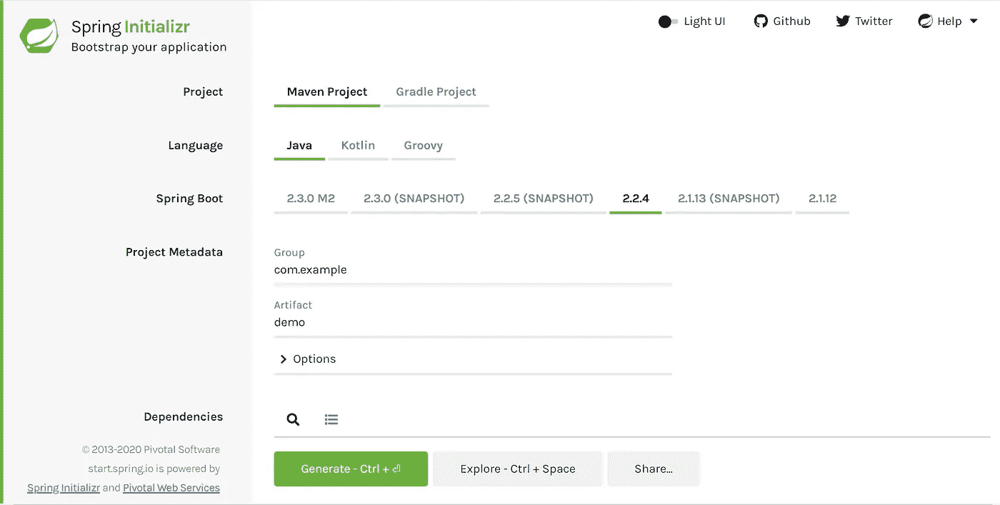
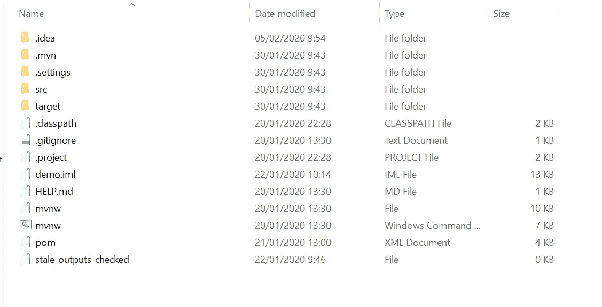

# Membuat Project Spring Boot Baru

> 原文：<https://medium.easyread.co/membuat-project-spring-boot-baru-62d3b8e52b49?source=collection_archive---------3----------------------->

## Berkenalan dengan Spring Boot


Salam sejahtera untuk kita semua, perkenalkan nama saya **Sogumontar Hendra Simangunsong** . Kali ini saya ingin memberitahukan cara untuk membuat project baru Spring Boot dengan Spring initializr.

1\. Buka link [***start.spring.io***](https://start.spring.io/)Web tersebut akan terlihat seperti gambar berikut.



2\. Pilih Project -> jenis project yang akan di buat.
Biasanya Maven untuk project spring boot, sedangkan gradle untuk project android.
Pilih Language - > bahasa yang akan digunakan. Untuk project Spring Boot kali ini, disarankan menggunakan bahasa Java.

3\. Spring Boot -> versi dari Spring Boot yang akan di buat, untuk project kali ini disarankan menggunakan versi 2.2.4.

4\. Project Metadata -> penamaan project, atau hierarki project yang akan di buat sedangkan artifact adalah nama project yang akan di buat.

*PS : untuk memilih bagian project yang lebih detail, dapat menekan tombol option, anda dapat menyesuaikan penamaan package, sampai versi java yang akan di gunakan.*

5.Dependencies -> sejenis java build tools (Maven), yang kegunaannya adalah untuk menyesuaikan setiap kebutuhan IDE. Sebagai contoh ketika kita membuat sebuah kodingan di IDE tertentu, dan kita ingin membagi kodingan kita kepada teman, maka teman tersebut harus menyesuaikan jenis2 library/java build tools yang diperlukan. Dengan adanya Maven ini, mempermudah kita dalam me-refactor atau pun sekedar ingin menjalankan project orang lain di IDE kita, sehingga kita tidak perlu menyesuaikan versi secara manual, Maven tersebut, akan menyesuaikan secara otomatis.

Contoh Maven:

```
<! — [https://mvnrepository.com/artifact/org.projectlombok/lombok](https://mvnrepository.com/artifact/org.projectlombok/lombok) →
<dependency>
 <groupId>org.projectlombok</groupId>
 <artifactId>lombok</artifactId>
 <version>1.18.12</version>
 <scope>provided</scope>
</dependency>
```

Anda dapat menambahkan setiap maven anda di file pom.xml

Untuk menjalankan project dengan maven, anda harus memiliki maven terlebih dahulu.

Jika belum memiliki maven, anda bisa mendownloadnya dari halaman berikut, [Apache Maven Project](https://maven.apache.org/) . Setelah berhasil di download, kemudian di ekstrak, setelah itu anda harus mendaftarkan direktori bin folder maven tersebut ke dalam environment variables.

Untuk project baru, anda tidak perlu menambahkan banyak maven. Anda di sarankan untuk menambahkan maven Spring Web, karena untuk maven yang lain, anda dapat menambahkannya setelah project berhasil di buat.

6\. Setelah semua selesai di isi sesuai dengan keperluan project, maka saatnya untuk membuat project baru. Anda dapat membuat project baru dengan menekan tombol Generate.

7\. Setelah menekan tombol tersebut, anda tinggal menunggu project anda selesai dibuat. Setelah download selesai, anda akan diberikan file dengan nama file yang anda set sebelumnya dengan extensi **.zip**

8\. Setelah berhasil di download, anda bisa meng-ekstrak file .zip tersebut.

Setelah di extrack, maka akan ada file-file berikut di dalam folder dengan nama yang telah anda set sebelumnya.



Sekarang anda dapat mengerjakan project yang anda inginkan dengan membuka project ini menggunakan IDE pilihan anda. IDE yang saya sarankan saat ini adalah menggunakan **IntelliJ.** Anda dapat mendownloadnya dari link ini [**Download Intellij Idea**](https://www.jetbrains.com/idea/download/#section=mac) .

Sekian tutorial membuat project baru Spring Boot dari saya, saya harap anda dapat terbantu dengan artikel ini.

Untuk artikel selanjutnya, akan membahas tentang cara membuat project simple Spring Boot dengan database PostgreSQL.