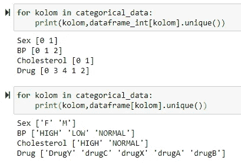

# Membuat Proyek Machine Learning dengan Python — Part 1

> 原文：<https://medium.easyread.co/membuat-proyek-machine-learning-dengan-python-part-1-8e8a03095636?source=collection_archive---------1----------------------->

## Part 1: Analisis, Visualisasi dan Preprocessing Data

Photo by [Emile Perron](https://unsplash.com/@emilep?utm_source=medium&utm_medium=referral) on [Unsplash](https://unsplash.com?utm_source=medium&utm_medium=referral)

Artikel ini merupakan panduan untuk membuat *machine learning project* yang dan dirancang sedemikian rupa agar mudah dimengerti. Jika ini pertama kali anda mempelajari *machine learning* , saya sarankan anda untuk membaca artikel berikut terlebih dahulu, [Belajar Fundamental Machine Learning Untuk Pemula](https://medium.com/easyread/mari-berkenalan-dengan-machine-learning-b4778ff2914a) .

# Prasyarat Mempelajari Machine Learning

Untuk mempelajari *Machine Learning* dengan baik, terdapat berbagai prasarat, yaitu:

1.  Menguasai bahasa pemrograman dengan Python ( *direkomendasi* ). Menguasai *syntax* dasar, struktur data, algoritma, serta *error handling* dan menggunakan module dasar seperti *datetime* , *os* dan *random* .
2.  Mampu melakukan manipulasi data dengan *library* pandas dan numpy. Menguasai teknik manipulasi data file tabel (csv, excel, dsb).
3.  Mampu melakukan visualisasi dan analisis data dengan *matplotlib* dan *seaborn* . Untuk melakukan analisis data, akan lebih mudah jika kita memvisualisasikan data tersebut.
4.  Mampu mengoperasikan *jupyter notebook* ( *optional* ). Kemampuan ini optional namun disarankan. Dalam proses analisis dan visualisasi data, penggunaan Jupyter Notebook akan sangat membantu. Dengan Jupyter Notebook Anda dapat memisahkan kode menjadi blok blok. Anda dapat menjalankan kode blok satu per satu dan langsung melihat outputnya.

# Gambaran Awal

Artikel ini akan memandu kalian untuk menyelesaikan c *lassification problem* dengan m *achine learning* . Dalam artikel ini, kita akan coding menggunakan bahasa pemrograman Python. Saya menyarankan untuk menggunakan Jupyter Notebook untuk mempermudah *preprocessing* dan analisis data.

*Library* yang akan digunakan adalah *Numpy, Pandas, Matplotib, Seaborn, Pickle* dan *Sklearn* . Jika anda memasang *Anaconda* , biasanya *libraries* tersebut sudah terpasang dari awal ( *default* ).

Dalam menulis sebuah artikel, Saya memiliki target kompetensi dan pencapaian. Setelah mengikuti panduan ini, Anda dapat :

1.  Mencari dataset secara online
2.  Melakukan analisis data
3.  Membuat m *achine learning* model
4.  Melakukan evaluasi model
5.  Membuat *submission* di kaggle

# Mendapatkan Data

Mulailah project dengan mencari data. Anda dapat mencari data Gratis di internet. Data tersebut dapat berbentuk s *tructured data* maupun u *nstructured data* . Berikut saya berikan tautan menuju beberapa situs untuk mendapatkan data gratis termasuk website dari Indonesia.

1.  [Kaggle](https://kaggle.com) (Internasional)
2.  [Garuda](http://garuda.ristekbrin.go.id/) — Garba Rujukan Digital
3.  [Data.go.id](https://data.go.id/) — Portal Satu Data Indonesia
4.  [Sinta](http://sinta.ristekbrin.go.id/) — Science And Technology

Data yang akan kita pakai pada latihan ini adalah data pasien pecandu narkoba. Anda cukup menuju halaman kaggle berikut dan mengunduh data gratis. Data tersebut hanya berukuran beberapa KB saja, jadi jangan hawatir karena kita tidak akan langsung bekerja dengan data yang besar.

 [## Drug Classification

### This database contains information about certain drug types.

www.kaggle.com](https://www.kaggle.com/prathamtripathi/drug-classification) 

Data yang Anda unduh akan berbentuk Zip, dan Anda dapat mengekstraknya sehingga didapatkan file dengan nama drug200.csv. Data tersebut berbentuk tabel, Anda pun dapat melihat lihat data tersebut di halaman kaggle tersebut.

# Langkah Langkah Membuat Machine Learning Project

Langkah langkah membuat Machine Learning Project

1.  **Memahami permasalahan.** Jenis *Machine Learning* apa yang akan saya gunakan menurut data yang saya miliki?
2.  **Menganalisis dan memproses data.** Data mana yang dapat digunakan? Data mana yang seharusnya dibuang? Pada tahap ini dilakukan pengolahan dan analisis data
3.  Berdasarkan permasalahan dan data yang ada. Pada tahap ini *Machine Learning Model* dibuat.
4.  **Melatih program ( *Machine Learning Model* )** . Model dilatih dengan memberikan data yang sudah diproses sebelumnya.
5.  **Melakukan evaluasi terhadap model.** Apa yang salah dengan Model? Kenapa akurasinya rendah?
6.  **Meningkatkan model.** Berdasarkan evaluasi, bagian model mana yang harus diubah? Pada tahap ini *Machine Learning* Model diperbarui.
7.  **Mengulangi semua proses**

Artikel ini dibagi menjadi dua bagian yang terpisah. Dalam artikel part 1 ini, kita akan berfokus dalam *preprocessing* dan analisis data. Saya memisahkan arikel menjadi dua bagian supaya artikel ini tidak terlalu panjang dan Anda dapat mempelajari *preprocessing* data dan pembuatan m *achine learning* model dalam waktu yang terpisah.

# Langkah 1 : Memahami Permasalahan

Preview dataframe dari situs kaggle

Jenis m *achine learning* pada project ini merupakan s *upervised learning* , karena data memiliki label. Label dalam dataframe ini adalah data yang dimuat pada kolom drug. Selain itu, data yang kita miliki merupakan s *tructured data* karena data tersebut berwujud tabel.

Sedangkan permasalahan yang kita miliki merupakan c *lassification* , dimana kita akan membuat m *achine learning model* untuk memprediksi jenis narkoba yang digunakan pasien menurut data yang diberikan. Data yang diberikan tersebut adalah Age, Sex, BP, Cholesterol, dan Na_to_K. Sesuai dengan dataframe yang kita miliki, kolom drug adalah label dan kolom lainnya adalah data. Baik data maupun label akan diberikan kepada *machine learning* model untuk dipelajari.

# Langkah 2 : Menganalisis dan Memproses Data

## 2.1 Overview Data

Buatlah *notebook* baru, *import* beberapa *library* yang diperlukan. Muatlah data ke dalam *notebook* dengan Pandas.

Menampilkan 5 baris pertama pada dataframe

## 2.2 Mengubah Data Menjadi Numerik

Setelah kita berhasil memuat data ke dalam program, proses selanjutnya ialah memproses data dan mengubahnya menjadi numerik atau angka. Namun, sebelumnya Anda harus mengetahui tipe data dalam dataframe.

Menampilkan banyak informasi dengan fungsi dataframe.info()

Pada kolom Dtype terdapat banyak jenis data yang berbeda beda, yaitu *int64* , *float64* dan *object* . Data dengan tipe objek ini merupakan *categorical data* , sehingga setelah ini harus dilakukan *preprocessing* untuk mengubah data menjadi numerik atau angka. Karena komputer hanya dapat membaca data yang berupa angka.

Caranya, kita dapat menggunakan e *ncoder* dari module Sklearn. *Encoder* digunakan untuk mengubah data kategori menjadi angka.

Mengubah data menjadi numerik dengan LabelEncoder() dari module sklearn

## 2.3 Analisis Data Kategori

Proses dilanjutkan dengan menganalisis data kategori. Dimulai dengan mencari tahu jumlah kelas yang dimiliki oleh setiap *categorical data*

Menampilkan semua kelas pada setiap data kategori

Terdapat lima kelas, yaitu narkoba jenis Y, C, X, A dan B. Sehingga bisa kita menyimpulkan bahwa permasalahan ini merupakan m *ulti-class classification* dimana kita melakukan klasifikasi data yang memiliki jumlah kelas lebih dari dua. Sedangkan jenis lain dari m *ulti-class* adalah b *inary classification* yang merupakan klasifikasi jika *categorical data* hanya memiliki dua kelas, misalnya pada kolom sex dan cholesterol.

Sekarang, kita dapat menganalisa bahwa nama kelas yang semula kata kata digantikan oleh angka. Angka tersebut mewakili kelas masing masing. Terdapat 5 kelas yaitu 0,3,4,1 dan 2\. Dimana 0 mewakili Y, 3 mewakili C, 4 mewakili X, 1 mewakili A, dan 2 mewakili B. Begitu juga dengan kolom yang lain. Ini adalah apa yang terjadi saat kita menggunakan *LabelEncoder().*

## 2.4 Analisis Matrix Korelasi

Proses masih berada pada analisis data, sekarang kita melakukan analisis pada matrix korelasi. Dimana matrix korelasi memberikan kita informasi mengenai korelasi atau hubungan kolom satu dengan kolom yang lain.

Matrix korelasi dalam bentuk tabel

Data yang memiliki hubungan satu sama lain adalah data yang penting, karena akan mempengaruhi proses latihan dan akurasi model. Adapun cara untuk mengetahui data mana yang penting adalah dengan menganalisa nilai korelasinya. Untuk mempermudah proses analisa, maka dapat dilakukan dengan visualisasi data.

Visualisasi matrix korelasi

Nilai korelasi berkisar pada jarak -1 sampai 1\. Jika bernilai negatif maka data memiliki korelasi negatif, dan sebaliknya. Namun, jika nilai korelasi mendekati nol, artinya data tersebut hampir tidak memiliki korelasi atau korelasinya rendah, sehingga data tersebut bukan merupakan data yang penting. Artinya, data tersebut akan mengganggu akurasi model.

## Tambahan : Perumpamaan Matrix Korelasi

Untuk lebih memahami arti dari matrix korelasi, silakan analisa perumpamaan berikut.

Data terdiri dari dua kolom yaitu belajar dan ilmu. Data tersebut memiliki korelasi sempurna karena nilai korelasinya 1 dan -1\. Pada kotak pojok kiri atas, nilai korelasi adalah 1\. Artinya nilai korelasinya positif. Artinya jika belajar semakin besar, maka ilmu akan semakin besar. Pada kotak yang lain, berlaku hal yang sama. Begitulah cara membaca matrix korelasi.

Kembali ke data pasien yang kita miliki. Selanjutnya, kita baca nilai korelasi kolom drug vs kolom lain. Terbaca bahwa kolom Na_to_K memiliki korelasi negatif yang besar terhadap kolom drug, sedangkan kolom dengan korelasi positif yang cukup besar hanya pada kolom BP yaitu *Blood Pressure* atau Tekanan Darah. Sedangkan kolom lain memiliki nilai korelasi yang dekat dengan nol.

Untuk saat ini kita tidak perlu melakukan apapun terhadap data tersebut terlebih dahulu. Karena hal itu akan menjadi bagian dari f *eature selection* . Mengenai f *eature selection* tidak akan dikupas tuntas dalam artikel ini.

## 2.5 Distribusi Data

Distribusi data adalah sebuah data yang dapat memberitahu kita semua nilai data dan setiap frekuensi yang dimiliki dalam dataframe. Untuk mengetahui distribusi dalam data, dapat dilakukan dengan membuat visualisasi sebuah histogram.

Visualisasi distribusi data

Sebenarnya Anda dapat menggali informasi lebih jauh lagi dengan visualisasi data histogram, seperti menampilkan histogram kolom drug vs cholesetrol atau drug vs sex, dll. Namun dalam artikel ini kita buat projectnya simpel saja.

Kita dapat menganalisa pada histogram drug dimana frekuensi setiap kelas tidak sama dan memiliki selisih yang jauh. Dimana kelas 0 dan 4 memiliki frekuensi diatas 60 semetara untuk kelas 1,2 dan 3 hanya memiliki frekuensi sekitar 20.

Ketidakseimbangan jumlah data akan menyebabkan m *achine learning model* yang akan kita buat dapat memprediksi data yang frekuensinya besar (kelas 0 dan 4) dengan akurasi tinggi, namun akan meprediksi data yang frekuensinya rendah (kelas 1,2 dan 3) dengan akurasi rendah. Karena model cukup berlatih pada kelas dengan frekuensi besar, sementara program kurang berlatih pada frekuensi sedikit. Sehingga, pada project ini kita tidak boleh menilai kualitas model hanya dari tingkat akurasinya saja.

Dalam m *achine learning* terdapat istilah e *rror metrics* . *Error metrics* untuk setiap jenis permasalahan *machine learning* berbeda beda. Dimana dalam kasus c *lassification* , terdapat beberapa matrix eror yaitu *accuracy_score* , *recall* , *f1_score* , dan *r2_score* . Untuk *accuracy_score* mesti sudah tidak asing lagi, namun untuk matrix lainnya akan dibahas pada kelanjutan artikel pada part 2 saat melakukan evaluasi pada *Machine Learning Model.*

## 2.6 Memisahkan Data

Dataframe harus dibagi menjadi dua, yaitu data dan label. Label merupakan kolom drug yang ingin diprediksi, sedangkan data merupakan kolom lainnya. Setelah kita memiliki data dan label, maka kita pisahkan menjadi dua sekali lagi menjadi latihan dan tes.

Data latihan digunakan sebagai bahan latihan model, sementara data tes digunakan untuk menguji performa model sebelum digunakan untuk bekerja. Sehingga sekarang kita memiliki empat data yaitu data latihan (x_train), data test (x_test), label latihan (y_train) dan label tes (y_test).

Kita import *train_test_split* dari *sklearn.model_selection* dimana kita memberikan parameter yaitu data, label, dan *test size* . *Test size* merupakan ukuran data tes. Karena data kita berjumlah 200 maka 0.2 x 200 = 40 sehingga data tes kita berjumlah 40 dan data latihan berjumlaah 160\. Fungsi t *rain_test_split* ini me- *return* empat numpy array , maka kita deklarasi empat variabel saat menjalankan fungsi *train_test_split* .

# Let’s Take A Break

Sekarang mari kita lihat apa saja yang telah kita lakukan.

1.  Anda telah melakukan analisis data, dimana dalam proses analisis juga diperlukan kemampuan statistika. Karena dalam membuat *machine learning* project, kita tidak hanya coding saja. Namun kita ingin menyelesaikan permasalahan ( *problem solver* ) sehingga kita harus melakukan analisa.
2.  Dalam artikel ini, Anda telah melakukan *preprocessing* data, sehingga data telah bertipe numerik atau angka. Serta data telah dipisahkan menjadi empat bagian. Sekarang kita memiliki data yang siap digunakan untuk melatih *machine learning model* .

Jika pemahaman anda masih mengambang tentang *preprocessing* dan analisis data, silakan anda ulangi lagi untuk membaca artikel ini dan mencari informasi dari sumber lain. Proses pengerjaan project baru ditempuh setengah jalan, jadi anda tidak perlu terburu buru untuk melanjutkannya sekarang juga. Silakan anda istirahat dahulu.

Sedangkan pada artikel part 2, kita akan mempelajari untuk membuat *machine learning* model dengan sklearn. Aritkel part 2 akan dibuat pada lain kesempatan. Tidak lupa bagi Saya ucapkan selamat bagi Anda yang telah belajar sejauh ini, Anda hanya perlu menjaga *mood* agar Anda tetap memiliki semangat dan rasa penasaran dalam mempelajari *machine learning* .

 [## Link Notebook: SVM-Multiclass-Classification

### Explore and run machine learning code with Kaggle Notebooks | Using data from Drug Classification

www.kaggle.com](https://www.kaggle.com/code/philippurwokoap/svm-multiclass-classification)  [## Belajar Fundamental Machine Learning Untuk Pemula

### Pengenalan machine learning dengan materi komprehensif untuk pemula

medium.com](https://medium.com/easyread/mari-berkenalan-dengan-machine-learning-b4778ff2914a) 

> Enjoy Learning !